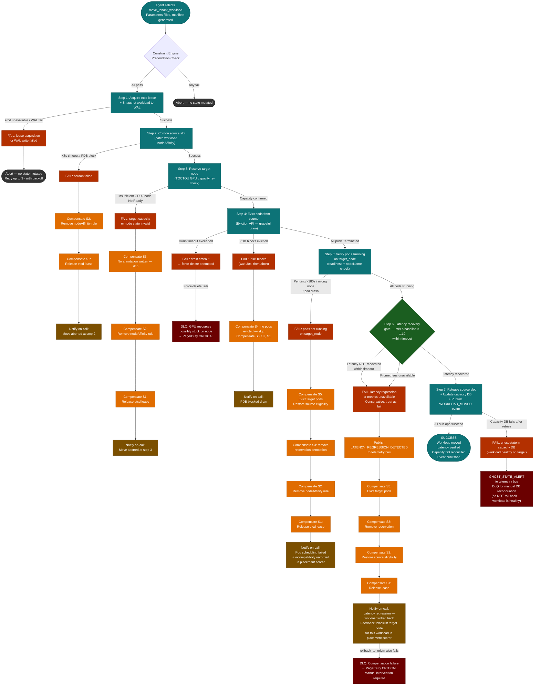

# The Autonomous Capacity Governor
## A Comprehensive Engineering Design Walkthrough

**Teserac AI — Design Challenge Response**
Prepared for: Alan Kuo, Principal Engineer, Teserac AI
Date: May 29, 2026

---

## Navigation Index

- [Part 0 — Alan Kuo's Original Challenge](#part-0--alan-kuos-original-challenge)
- [Executive Summary](#executive-summary)
  - [Capacity Management Problem Space — Assumptions](#capacity-management-problem-space--assumptions)
  - [Known Shortcomings and Roadmap](#known-shortcomings-and-roadmap)
  - [Design Summary — Intuitions and Key Decisions](#design-summary--intuitions-and-key-decisions)
- [Part 1 — GPU Data Center Capacity Management](#part-1--gpu-data-center-capacity-management)
  - [1.1 Is This a Realistic Scenario Today?](#11-is-this-a-realistic-scenario-today)
  - [1.2 ITIL Capacity Management Applied to a GPU Data Center](#12-itil-capacity-management-applied-to-a-gpu-data-center)
  - [1.3 Common Use Cases](#13-common-use-cases)
  - [1.4 ITIL Framework Summary View](#14-itil-framework-summary-view)
- [Part 2 — The Autonomous Capacity Governor: Closed-Loop Control Design](#part-2--the-autonomous-capacity-governor-closed-loop-control-design)
  - [2.1 Is the Industry Building This?](#21-is-the-industry-building-this)
  - [2.2 The Three-Loop Architecture](#22-the-three-loop-architecture)
  - [2.3 The Correct Hybrid Design: Programmatic vs. Agentic](#23-the-correct-hybrid-design-programmatic-vs-agentic)
  - [2.4 Suppression and Hysteresis](#24-suppression-and-hysteresis)
  - [2.5 Observe → Reason → Act: Architecture at a Glance](#25-observe--reason--act-architecture-at-a-glance)
- [Part 3 — From Raw Telemetry to Agent Context: The Compression Pipeline](#part-3--from-raw-telemetry-to-agent-context-the-compression-pipeline)
  - [3.1 The Core Framing](#31-the-core-framing)
  - [3.2 Stage 1 — Ingestion and Pre-Aggregation](#32-stage-1--ingestion-and-pre-aggregation)
  - [3.2a Physical Deployment Topology](#32a--physical-deployment-topology)
  - [3.3 Stage 2 — Anomaly Scoring](#33-stage-2--anomaly-scoring)
  - [3.4 Stage 3 — Correlation and Causal Attribution](#34-stage-3--correlation-and-causal-attribution)
  - [3.5 Stage 4 — Digest Assembly](#35-stage-4--digest-assembly)
- [Part 4 — Capability Discovery: Action Catalog + Capability Manifest](#part-4--capability-discovery-action-catalog--capability-manifest)
  - [4.1 The Two Inputs](#41-the-two-inputs)
  - [4.2 Step 1 — Load the Full Action Catalog](#42-step-1--load-the-full-action-catalog)
  - [4.3 Step 2 — Collect Live Cluster State](#43-step-2--collect-live-cluster-state)
  - [4.4 Step 3 — Evaluate Preconditions (Structural Pruning)](#44-step-3--evaluate-preconditions-structural-pruning)
  - [4.5 Step 4 — Populate Constrained Enums](#45-step-4--populate-constrained-enums)
  - [4.6 Step 5 — Assemble and Sign the Manifest](#46-step-5--assemble-and-sign-the-manifest)
  - [4.7 Step 6 — TOCTOU Guard at Execution Time](#47-step-6--toctou-guard-at-execution-time)
  - [4.8 The Complete Flow in One Picture](#48-the-complete-flow-in-one-picture)
  - [4.9 Concurrent Plan Safety](#49-concurrent-plan-safety)
- [Part 5 — The AI Planning Agent: Prompts and Triggering](#part-5--the-ai-planning-agent-prompts-and-triggering)
  - [5.1 Prompt Design Principles](#51-prompt-design-principles)
  - [5.2 System Prompt (shared — full text)](#52-system-prompt-shared--full-text)
  - [5.3 Trigger 1 — Loop 1 Escalation](#53-trigger-1--loop-1-escalation)
  - [5.4 Trigger 2 — Digest State Change](#54-trigger-2--digest-state-change)
  - [5.5 Trigger 3 — Scheduled Heartbeat](#55-trigger-3--scheduled-heartbeat)
  - [5.6 Structural Comparison of the Three Trigger Paths](#56-structural-comparison-of-the-three-trigger-paths)
- [Part 6 — Plan Execution: Saga Orchestration with Temporal](#part-6--plan-execution-saga-orchestration-with-temporal)
  - [6.0 The Write-Ahead Log](#60-the-write-ahead-log)
  - [6.1 The Implementation Model](#61-the-implementation-model)
  - [6.2 Layer 1 — Temporal Activities](#62-layer-1--temporal-activities)
  - [6.3 Layer 2 — Temporal Workflows / Sagas](#63-layer-2--temporal-workflows--sagas)
  - [6.4 Layer 3 — Action Catalog JSON](#64-layer-3--action-catalog-json)
  - [6.5 Detailed Saga Definitions](#65-detailed-saga-definitions)
  - [6.6 Multi-Action Plans: ExecutePlanWorkflow](#66-multi-action-plans-executeplanworkflow)
  - [6.7 Layer 4 — The Plan Executor](#67-layer-4--the-plan-executor)
  - [6.8 The Complete Picture — Who Owns What](#68-the-complete-picture--who-owns-what)
- [Part 7 — Fleet-Wide Operations: Cross-Cluster Capacity Transfer](#part-7--fleet-wide-operations-cross-cluster-capacity-transfer)
  - [7.1 How Cross-Cluster State Is Maintained](#71-how-cross-cluster-state-is-maintained)
  - [7.2 Cross-Cluster Job Transfer — Concrete Path](#72-cross-cluster-job-transfer--concrete-path)
  - [7.3 The Full Cross-Cluster Saga Steps](#73-the-full-cross-cluster-saga-steps)
  - [7.4 How the Agent Reasons Across Clusters](#74-how-the-agent-reasons-across-clusters)
- [Part 8 — Six Design Principles](#part-8--six-design-principles)
  - [8.1 Principle 1: Separate Detection from Reasoning](#81-principle-1-separate-detection-from-reasoning)
  - [8.2 Principle 2: Compress Before Reasoning](#82-principle-2-compress-before-reasoning)
  - [8.3 Principle 3: Constrain the Action Space](#83-principle-3-constrain-the-action-space)
  - [8.4 Principle 4: Every Action is a Saga](#84-principle-4-every-action-is-a-saga)
  - [8.5 Principle 5: Defense in Depth](#85-principle-5-defense-in-depth)
  - [8.6 Principle 6: Escalation is First-Class](#86-principle-6-escalation-is-first-class)
- [Challenge Response Map](#challenge-response-map)
  - [The Three Execution-Layer Responsibilities](#the-three-execution-layer-responsibilities)
  - [The Three Architectural Questions](#the-three-architectural-questions)
  - [Two Design Decisions Beyond the Challenge](#two-design-decisions-beyond-the-challenge)
- [Part 9 — Production Hardening: Five Design Refinements](#part-9--production-hardening-five-design-refinements)
  - [9.1 Scheduler Fencing: Resolving the Imperative–Declarative Split-Brain](#91-scheduler-fencing-resolving-the-imperativedeclarative-split-brain)
  - [9.2 Escalation Coalescing: Eliminating the Thundering Herd](#92-escalation-coalescing-eliminating-the-thundering-herd)
  - [9.3 Blast Radius Limiter: Constraining the Valid but Catastrophic Plan](#93-blast-radius-limiter-constraining-the-valid-but-catastrophic-plan)
  - [9.4 Decoupling the Checkpoint Wait: Eliminating the Long-Held Lock](#94-decoupling-the-checkpoint-wait-eliminating-the-long-held-lock)
  - [9.5 Incident-Scoped Manifest Generation: Scaling Precondition Evaluation](#95-incident-scoped-manifest-generation-scaling-precondition-evaluation)


## Part 0 — Alan Kuo's Original Challenge

The challenge was posed by Alan Kuo at Teserac AI:

> **The Problem: "The Autonomous Capacity Governor"**
>
> **The Scenario:** You have a multi-tenant Kubernetes-style cluster. Resource requirements change every second. You are introducing an Internal AI Agent that acts as a "Virtual SRE." This agent monitors the fleet and issues commands to rebalance workloads.
>
> **The Software Challenge:** How do you build the execution engine that sits between an unpredictable AI and the physical hardware? The AI might say "Move Tenant A to Rack 4," but the software must handle locking, state migration, and safety checks.
>
> Focus on the North-South communication between the AI and the Hardware:
>
> **Capability Discovery:** How does the software tell the AI what actions are currently "legal"? (e.g., "The AI can't reboot Rack 5 because it's under maintenance").
>
> **Transactionality:** If the AI agent issues 5 related commands (a "Plan"), how does your software ensure they are executed atomically?
>
> **The Feedback Loop:** How does the system ingest high-cardinality telemetry (logs, metrics, traces) and "compress" it into a concise summary that an AI can actually reason about?

This document is a full engineering design response to that challenge. It covers the realistic industry context, the closed-loop control architecture that governs autonomous operation, the telemetry compression pipeline that produces AI-consumable state summaries, the capability manifest that constrains legal agent actions in real time, and the transactional execution engine — built on Temporal workflows and saga semantics — that safely mediates between an unpredictable AI and physical infrastructure. Each design decision is grounded in production engineering trade-offs, not theory.

---


## Executive Summary

### Capacity Management Problem Space — Assumptions

> **TL;DR:** The design targets a multi-tenant GPU data center running AI/ML workloads across a fleet of Kubernetes clusters, where the Capacity Governor is the autonomous control plane responsible for maintaining capacity and SLA guarantees across the fleet.

Multi-tenant data centers must deliver guaranteed capacity and performance SLAs to their tenants — a training job that books 128 GPUs for 72 hours must receive those GPUs, and a gold-tier inference endpoint must maintain its p99 latency SLA regardless of what neighboring tenants are doing. This is not a soft best-effort objective; it is a contractual commitment enforced at the infrastructure level.

The physical stack the Governor operates over is GPU-dense and interconnect-sensitive: each node carries 8 GPUs connected by NVLink and NVSwitch for high-bandwidth intra-node communication; nodes within a rack share a top-of-rack switch; and the NVIDIA HBM memory hierarchy means that GPU memory pressure is a first-class resource constraint alongside CPU and DRAM. The software must reason about this full stack — not just pod scheduling.

AI/ML workloads span three phases of the model lifecycle, each with a distinct resource profile. Training jobs are long-running, GPU-memory-saturating, and checkpoint-tolerant — a 128-GPU job may run for days and can be migrated with a checkpoint. Fine-tuning and parameter-tuning jobs are bursty and demand-driven, frequently submitted in parallel by tenants, and are the most common cause of sudden quota overruns. Inference serving endpoints are latency-SLA-bound, stateless, and fast to migrate — but cannot be disrupted mid-request. The Governor must handle all three without treating them as interchangeable.

Workloads are managed by a fleet of Kubernetes clusters — one cluster per availability zone or rack group, each with its own control plane and its own fast-loop rule engine. The Capacity Governor rebalances workloads across clusters using per-cluster telemetry digests, the Global Capacity DB as the fleet-wide ledger, and AI-driven planning in Loop 2. The Governor is a **logical singleton** for the data center — a single AI reasoning layer sees the full fleet — but a **physical distributed system**: the per-cluster rule engines, the OTel collectors, the Temporal workers, and the Plan Executor are all replicated and have no single point of failure.

---

### Known Shortcomings and Roadmap

> **TL;DR:** Three known gaps are acknowledged upfront. Each is a deliberate scope boundary, not an oversight, and each has a defined path to resolution in a subsequent iteration.

Initial workload submission and placement is out of scope for this design. At admission time, a submitter should use the Global Capacity DB and workload heuristics to select the target cluster; if no cluster has sufficient capacity, the job enters a pending queue and is fulfilled by the Capacity Governor as capacity becomes available through rebalancing. This admission-time placement logic is a prerequisite for the Governor but is treated as a separate subsystem.

Workloads are currently assumed to be contained within a single cluster. Cross-cluster distribution of a single training or fine-tuning job is out of scope in this iteration — distributed training across clusters requires intra-cluster high-bandwidth NVLink and InfiniBand interconnects; WAN latency between clusters is prohibitive for gradient synchronization. Inference endpoints are the explicit exception: they are stateless and may run on multiple clusters simultaneously for geographic distribution or redundancy. Extending training and fine-tuning jobs to span clusters is a future iteration requiring dedicated inter-cluster networking infrastructure.

Quota enforcement is currently per-cluster rather than fleet-wide. The Global Capacity DB maintains one allocation record per `(cluster_id, tenant_id)` pair and has the data needed to aggregate fleet-wide totals, but the `adjust_tenant_quota` precondition does not yet check the fleet-wide ceiling. A tenant could theoretically accumulate unlimited capacity by spreading across clusters without triggering a quota violation on any individual cluster. Enforcing a fleet-wide tenant ceiling is the next priority enhancement to the precondition evaluation logic.

---

### Design Summary — Intuitions and Key Decisions

> **TL;DR:** The Governor's core insight is that an AI agent should never see raw telemetry, never query live cluster state, and never choose from an unbounded action space. Everything it receives has been pre-processed, pre-filtered, and pre-validated by deterministic systems built by human experts.

The AI Agent is triggered on three paths: a Loop 1 escalation from any cluster's fast rule engine (an anomaly or SLA breach that the rule engine cannot resolve autonomously within the cluster), a scheduled heartbeat every 15 minutes (to catch slow-moving capacity trends), or a meaningful change in the fleet-wide digest hash (a new incident, a new SLA breach, or a significant headroom shift). On all three paths, the agent receives identical structured inputs — it is never invoked without full context.

The agent receives three pre-built inputs rather than raw access to infrastructure. The first is a **Cluster State Digest** — a token-budgeted JSON document assembled by a four-stage compression pipeline that transforms hundreds of thousands of raw OTEL telemetry data points per second into a bounded, semantically dense summary. Telemetry is aggregated over 60-second windows, scored by Z-score anomaly detection, clustered and causally attributed using deterministic rules written by subject matter experts, and assembled into a priority-ordered digest. The agent reasons over a digest, not raw metrics. The second input is a **cluster state context** covering capacity headroom, tenant allocations, SLA contract thresholds, and recent actions taken — all pre-queried from the Global Capacity DB and policy store, not live-queried by the agent. The third input is the **Capability Manifest** — a dynamically generated list of only the actions that are currently legal, with parameter enums pre-populated from live state. The agent cannot hallucinate an action. It cannot select an illegal parameter value. The manifest is HMAC-signed and expires after 15 minutes. Action preconditions and the action catalog itself are designed by subject matter experts; the agent makes only the dynamic planning decisions — which legal action to take given the current state.

Actions selected by the agent are executed as saga orchestrations via Temporal. Each action in the Action Catalog maps one-to-one to a Temporal Workflow — action equals workflow equals saga. Multi-action plans are wrapped in a parent `ExecutePlanWorkflow` that executes child sagas in dependency order with cross-workflow compensation if any child fails. Every action is durable, retryable, and compensatable. No single component is the last line of defense: the Capability Manifest prunes illegal actions before the agent sees them; the Plan Executor re-checks preconditions at execution time; each saga enforces its own quality gates; the Escalation Gate prevents thundering-herd storms from multiplying LLM invocations; and the Blast Radius Limiter caps autonomous churn at 5% of fleet GPU capacity per rolling hour — everything beyond that threshold requires human approval via Loop 3.

---

## Part 1 — GPU Data Center Capacity Management

> **TL;DR:** GPU data centers are the fastest-growing segment of cloud infrastructure, and multi-tenant capacity management at the AI workload level is largely unsolved by automated systems today. Human SREs cannot keep pace with the rate of change. ITIL capacity management provides the conceptual framework, but its assumptions about gradual, predictable demand curves break down entirely under GPU workload patterns.

### 1.1 Is This a Realistic Scenario Today?

GPU data centers are not a future projection — they are the dominant capital expenditure story for every major cloud provider and an entire class of AI-native infrastructure companies. CoreWeave, Lambda Labs, and Voltage Park have built their businesses on bare-metal GPU rental. AWS, GCP, and Azure each operate GPU clusters of a scale that would have been implausible five years ago. NVIDIA's data center revenue has outpaced its gaming segment for years, and that shift reflects a fundamental change in what production compute looks like. The scenario in this challenge is not hypothetical; it describes the daily operational reality of these providers.

Multi-tenancy is the standard deployment model. No tenant fills a full GPU cluster, and no provider can afford to dedicate one. Enterprises share GPU capacity across teams and projects under SLA-governed reservation windows, spot pricing, and priority tiers. The result is a resource contention landscape that is orders of magnitude more dynamic than traditional CPU-based multi-tenant clouds. A training job can consume hundreds of GPUs for hours and then terminate instantly, leaving the scheduler to reallocate resources within seconds.

The capacity management problem at the AI workload level is largely unsolved. Rule-based autoscalers handle well-defined scaling signals — CPU utilization above 80%, queue depth above a threshold — but they cannot reason about cross-tenant interference, NVLink saturation, or the interplay between a preemptible spot job and a guaranteed SLA reservation. Human SREs are the last line of defense, and they are overwhelmed. The alert volume, the number of interdependent decisions, and the speed at which the cluster state changes have outpaced human reaction time. This is precisely the gap an autonomous capacity governor is designed to fill.

### 1.2 ITIL Capacity Management Applied to a GPU Data Center

ITIL defines capacity management as the process of ensuring that IT capacity meets agreed business demand at the right time and at the right cost. The framework breaks this into four sub-processes: Business Capacity Management (aligning IT capacity to business strategy), Service Capacity Management (ensuring service-level commitments are met), Component Capacity Management (managing individual hardware resources), and Capacity Planning (forecasting future requirements). Each maps cleanly onto the GPU data center problem, though the translation requires precision.

In the GPU data center context, "business demand" is tenant SLA commitments — guaranteed throughput windows, maximum queue latency, and reserved compute allocations. The "resources" are not simply CPU cores and RAM; they are GPU compute expressed in MIG (Multi-Instance GPU) partitions, HBM memory bandwidth, NVLink interconnect utilization, and PCIe bus saturation. These resources interact non-linearly. A tenant who has purchased 40% of a node's GPU compute can easily consume 80% of its NVLink bandwidth if the communication pattern is all-to-all. ITIL's abstraction of "capacity" as a single metric obscures this complexity; the governor must reason across multiple resource dimensions simultaneously.

The deepest incompatibility between classic ITIL capacity planning and GPU workloads is the demand curve assumption. ITIL was designed for enterprise IT environments where demand grows gradually, forecasts are quarterly, and sudden spikes are anomalies. GPU workload demand is the opposite: a batch training job does not ramp linearly — it starts, it runs at full utilization, and it stops. An inference service does not grow smoothly with user traffic — it spikes when a new model is deployed or when a marketing event triggers query volume. Every ITIL capacity planning heuristic that assumes a smooth, predictable demand curve is violated by real AI workload patterns. The governor must treat spike and burst as the normal case, not the exception.

### 1.3 Common Use Cases

The operational scenarios this system must handle define the design requirements better than any abstract specification. Noisy neighbor detection is the most frequent case: one tenant's job saturates a shared resource — NVLink bandwidth, HBM, or PCIe — and degrades the performance of every other tenant on that node or rack. The governor must detect this from telemetry, identify the offending workload, and either throttle it, migrate it, or preempt it, all without violating the offender's own SLA commitments.

Burst capacity allocation for inference spikes is equally common. A tenant's inference endpoint receives a sudden traffic surge — a product launch, a media event, a downstream integration coming online. The governor must identify available capacity across the cluster, verify that no higher-priority reservations would be displaced, and allocate additional GPU partitions before the SLA latency threshold is breached. This requires not just detecting the spike but predicting that it will persist long enough to justify the reallocation overhead.

Training job migration before scheduled rack maintenance is a coordination problem: the governor must identify all jobs running on hardware that will enter a maintenance window, determine which can be checkpointed and restarted on alternative nodes, verify that alternative nodes have sufficient capacity and compatible interconnect topology, and issue migration commands with enough lead time for checkpoint I/O to complete. Proactive scale-out before reservation windows — pre-warming capacity before a tenant's scheduled training run begins — prevents the cold-start latency that would otherwise eat into the reservation. SLA tier enforcement across tenants requires the governor to continuously verify that guaranteed-tier tenants receive their committed resources even when best-effort tenants are competing for the same hardware. Hardware fault isolation — responding to ECC error rates climbing toward the correctable-to-uncorrectable threshold, or NVLink degradation on a specific link — requires the governor to drain workloads off suspect hardware before a fault becomes a failure.

### 1.4 ITIL Framework Summary View

```
┌─────────────────────────────────────────────────────────────────────────────┐
│                  ITIL Capacity Management — GPU Data Center Mapping          │
├──────────────────────────────┬──────────────────────────────────────────────┤
│  ITIL Sub-Process            │  GPU Data Center Instantiation                │
├──────────────────────────────┼──────────────────────────────────────────────┤
│  Business Capacity           │  Tenant SLA contract terms, reservation       │
│  Management                  │  windows, priority tiers, billing commitments │
│                              │  → Inputs to strategic planning (Loop 3)      │
├──────────────────────────────┼──────────────────────────────────────────────┤
│  Service Capacity            │  Per-tenant SLA health: throughput, queue     │
│  Management                  │  latency, GPU utilization vs. committed       │
│                              │  allocation → Monitored by Loop 2 (AI Agent)  │
├──────────────────────────────┼──────────────────────────────────────────────┤
│  Component Capacity          │  MIG partition occupancy, HBM bandwidth,      │
│  Management                  │  NVLink saturation, ECC error rates, PCIe     │
│                              │  utilization → Monitored by Loop 1 (reactive) │
├──────────────────────────────┼──────────────────────────────────────────────┤
│  Capacity Planning           │  Demand forecasting from historical traces,   │
│                              │  procurement signals, reservation growth       │
│                              │  trends → Loop 3 + human review               │
└──────────────────────────────┴──────────────────────────────────────────────┘
```

---

## Part 2 — The Autonomous Capacity Governor: Closed-Loop Control Design

> **TL;DR:** The governor is a three-loop closed control system. A sub-second rule engine handles fast reactive events without any LLM in the path. An AI planning loop (5–15 minutes) reasons over compressed cluster state to produce multi-step remediation plans. A strategic loop (hours to days) brings humans into decisions that cross organizational or financial boundaries. The correct decomposition — not everything through the LLM — is what makes the system tractable and safe.

### 2.1 Is the Industry Building This?

The honest answer is: yes, but not openly, and not completely. Hyperscalers are building internal versions of exactly this architecture. Google's Borg and Omega schedulers represent decades of investment in autonomous cluster management, and their internal successors incorporate ML-based prediction for preemption and bin-packing decisions. Meta's Twine scheduler handles fleet-wide workload placement at a scale that requires machine-driven decision-making. NVIDIA's Run:ai platform offers a commercially available layer of AI-driven GPU workload scheduling, positioned explicitly as a replacement for human SRE toil in multi-tenant GPU environments.

None of these systems have publicly described a full AI-agent-in-the-loop closed control architecture with the design described here: a capability manifest that constrains legal agent actions dynamically, a telemetry compression pipeline that produces structured AI-consumable digests, and a saga-based transactional execution layer that enforces atomicity across multi-step agent plans. The industry is, for most deployments, still at the "rule-based autoscaler plus human SRE" stage. The autonomous AI governor — where an LLM agent formulates and submits multi-step remediation plans that execute under transactional guarantees — is the next step, and it is the step this design delivers.

### 2.2 The Three-Loop Architecture

The central architectural commitment is that a single control loop cannot serve all timescales. Fast reactive response requires determinism and sub-second latency; LLM inference at 200ms to 2 seconds is categorically unacceptable in that path. Strategic reasoning requires long-horizon context that no real-time monitoring signal can provide. The three-loop architecture partitions the problem cleanly by timescale, confidence, and the cost of being wrong.

Loop 1 operates at the seconds timescale using a pure rule engine — no LLM, no probabilistic inference, no network call that can introduce variable latency. It triggers on hard signals: a Z-score above 3.0 on a resource utilization metric, an SLA breach event, a hardware alert from the node agent. Its action set is intentionally limited to the highest-confidence, lowest-risk interventions: throttle a noisy neighbor, preempt a low-priority job, emit a structured escalation event to Loop 2. The design principle is that detection latency must be sub-second, because the blast radius of a noisy neighbor grows every second it goes unaddressed.

Loop 2 operates at the 5-to-15-minute timescale. It is the AI planning loop. An LLM agent receives two inputs — the Cluster State Digest (a compressed, structured summary of current cluster health) and the Capability Manifest (the dynamic enumeration of actions that are currently legal given cluster state) — and produces a multi-step remediation plan. Loop 2 is triggered by escalation events from Loop 1, by a scheduled heartbeat, or by a meaningful change in the digest state. The critical skip condition: if the digest is unchanged from the previous invocation, Loop 2 does not invoke the LLM. This is not an optimization; it is a correctness property. An unchanged digest means the cluster state has not changed in a way that warrants new reasoning, and redundant agent invocations burn LLM budget without producing actionable output.

Loop 3 operates at the hours-to-days timescale, triggered by scheduled cron. It is the strategic loop, and it explicitly includes a human reviewer in the decision path. Loop 3 handles capacity forecasting from historical demand traces, procurement signals (when does the cluster need more nodes?), and SLA renegotiation inputs. The design principle here is equally explicit: any decision that crosses an organizational boundary (allocating budget to a different tenant tier) or a financial boundary (committing to hardware procurement) must have a human in the loop. Autonomous systems should not make irreversible resource commitments without human review.

```
┌─────────────────────────────────────────────────────────────────────────────────┐
│                         THREE-LOOP CONTROL ARCHITECTURE                          │
└─────────────────────────────────────────────────────────────────────────────────┘

  ┌─────────────────────────────────────────────────────────────────────────────┐
  │  LOOP 3 — STRATEGIC  (hours / days)                                         │
  │  Trigger: cron schedule                                                      │
  │  Actions: capacity forecast · procurement signal · SLA renegotiation         │
  │  Principle: human-in-the-loop for org/financial boundary decisions            │
  │                                                                               │
  │  ┌─────────────────────────────────────────────────────────────────────┐    │
  │  │  LOOP 2 — AI PLANNING  (5 – 15 minutes)                             │    │
  │  │  Trigger: Loop 1 escalation · heartbeat · digest state change        │    │
  │  │  Inputs:  Cluster State Digest + Capability Manifest                 │    │
  │  │  Actions: formulate Plan · submit to Plan Executor                   │    │
  │  │  Principle: skip invocation if digest unchanged (LLM budget guard)   │    │
  │  │                                                                       │    │
  │  │  ┌─────────────────────────────────────────────────────────────┐    │    │
  │  │  │  LOOP 1 — FAST REACTIVE  (seconds)                          │    │    │
  │  │  │  Trigger: Z-score > 3.0 · SLA breach · hardware alert       │    │    │
  │  │  │  Engine:  Rule engine only — NO LLM in path                  │    │    │
  │  │  │  Actions: throttle noisy neighbor · preempt low-priority     │    │    │
  │  │  │           job · escalate to Loop 2                           │    │    │
  │  │  │  Principle: detection latency < 1s; LLM latency (200ms–2s)  │    │    │
  │  │  │             is unacceptable here                             │    │    │
  │  │  └─────────────────────────────────────────────────────────────┘    │    │
  │  └─────────────────────────────────────────────────────────────────────┘    │
  └─────────────────────────────────────────────────────────────────────────────┘

  Escalation path:   Loop 1 ──▶ Loop 2 ──▶ Loop 3 (where human review required)
  Feedback path:     All loops consume telemetry from the OBSERVE layer
```

### 2.3 The Correct Hybrid Design: Programmatic vs. Agentic

The most common failure mode in AI-augmented infrastructure systems is routing too much through the AI. The LLM is a powerful reasoning engine, but it is probabilistic, it has non-trivial latency, it consumes cost per invocation, and it can be confidently wrong. Using it for decisions that are deterministic — where the correct action is unambiguously derivable from the input signal — is not just wasteful, it is a reliability regression. Loop 1 exists precisely to preserve the deterministic path for deterministic decisions.

The LLM earns its place in Loop 2 because the cases that reach it have already been screened. A Loop 1 escalation means the rule engine saw a condition it could not resolve with a single high-confidence action — the situation requires multi-variable reasoning, cross-cluster context, or a sequence of dependent actions whose correct ordering is non-obvious. That is exactly the class of problem where an LLM adds value over a rule engine. The agent receives a structured digest and a constrained action space, and its job is to formulate a coherent, ordered remediation plan. The plan is not executed directly by the agent; it is submitted to a Plan Executor that applies its own safety checks before any action touches infrastructure.

Loop 3 recognizes the limit of both rule engines and LLMs: neither should make decisions that commit the organization to irreversible resource or financial positions. A capacity forecast that suggests hardware procurement is a high-confidence analytical output, but acting on it requires human judgment about business priorities, procurement lead times, and budget allocation. The three-loop decomposition is not a concession to the limits of AI; it is the correct engineering decomposition for a system that must be both fast and safe, both autonomous and accountable.

### 2.4 Suppression and Hysteresis

Without suppression logic, a monitoring system that checks every 10 seconds will re-alert on the same condition 6 times per minute, every minute, until the condition resolves. In a multi-tenant GPU cluster with dozens of telemetry signals, this produces an alert storm that overwhelms every downstream consumer — the rule engine, the escalation queue, and any human on call. Hysteresis is the primary defense: a condition must be continuously true for N consecutive monitoring cycles before it triggers an action. A single Z-score spike that lasts one cycle does not constitute a noisy neighbor event; a Z-score that remains elevated for 3 consecutive cycles does.

Silence suppression is the symmetric control: a condition must be continuously false for M consecutive cycles before it is considered resolved and the alert is cleared. Without this, a condition that oscillates at the monitoring boundary — true on even cycles, false on odd cycles — generates an alert-and-clear event on every cycle. Hysteresis and silence suppression together define the effective temporal filter on the monitoring signal. Their parameters (N and M, measured in cycles) are tunable per signal type. Hardware fault signals warrant small N — you want to react fast. Utilization-based signals warrant larger N — transient spikes should not trigger migrations. Getting these parameters wrong in either direction is costly: too aggressive and the system is noisy and wasteful; too conservative and it misses real events.

### 2.5 Observe → Reason → Act: Architecture at a Glance

```
┌─────────────────────────────────────────────────────────────────────────────────────────┐
│                    CLOSED-LOOP CONTROL — OBSERVE → REASON → ACT                          │
└─────────────────────────────────────────────────────────────────────────────────────────┘

 OBSERVE
 ───────
  OTEL Collector          Aggregation           Compression          Digest Assembly
  ┌─────────────┐        ┌────────────┐        ┌────────────┐       ┌──────────────────┐
  │ metrics     │        │ per-node   │        │ anomaly    │       │ Cluster State    │
  │ traces  ────┼──────▶ │ rollup     │──────▶ │ detection  │─────▶ │ Digest           │
  │ logs        │        │ windowed   │        │ statistical│       │ (structured JSON)│
  └─────────────┘        │ aggregates │        │ summarizer │       └────────┬─────────┘
                         └────────────┘        └────────────┘                │
                                                                              │
 REASON                                                                       │
 ───────                                                                      ▼
  ┌──────────────────────┐   ┌─────────────────────┐       ┌────────────────────────────┐
  │  Capability Manifest  │   │  Cluster State       │       │                            │
  │  (regenerated fresh   │──▶│  Digest              │──────▶│   AI Agent (LLM)           │
  │   each cycle —        │   │                      │       │   Loop 2 — 5–15 min cadence│
  │   never cached)       │   └─────────────────────┘       │                            │
  └──────────────────────┘                                   └────────────┬───────────────┘
                                                                          │
                                                                    Plan output
                                                                          │
 ACT                                                                      ▼
 ────
  ┌─────────────────────┐   ┌──────────────────────────┐   ┌────────────────────────────┐
  │  Plan Executor       │   │  Saga Orchestrator        │   │                            │
  │  · TOCTOU guard      │──▶│  (Temporal Workflow)      │──▶│  Infrastructure            │
  │  · pre-flight checks │   │  · atomic multi-step exec │   │  (GPU nodes, scheduler,    │
  │  · action ordering   │   │  · compensating txns      │   │   network fabric)          │
  └─────────────────────┘   │  · durable state          │   └────────────┬───────────────┘
                             └──────────────────────────┘                │
                                                                          │ telemetry
                                                                          └──────────────▶ OBSERVE (feeds back)


 ┌────────────────────────────┐  ┌──────────────────────────────────┐  ┌──────────────────────────────────┐
 │  [1] MULTI-RATE LOOPS      │  │  [2] CAPABILITY MANIFEST         │  │  [3] TEMPORAL WORKFLOWS          │
 │                            │  │                                  │  │                                  │
 │  Loop 1: seconds           │  │  Regenerated from live cluster   │  │  Every action issued by the      │
 │  (rule engine, no LLM)     │  │  state on every Loop 2 cycle.    │  │  Plan Executor is a Temporal     │
 │                            │  │  Never cached. Stale manifests   │  │  Workflow. Uniform saga contract:│
 │  Loop 2: 5–15 minutes      │  │  would permit illegal actions    │  │  durable, retryable, with        │
 │  (LLM agent + plan exec)   │  │  against hardware currently in   │  │  compensating transactions on    │
 │                            │  │  maintenance or fault state.     │  │  failure. No action is fire-     │
 │  Loop 3: hours / days      │  │                                  │  │  and-forget.                     │
 │  (LLM + human review)      │  │                                  │  │                                  │
 └────────────────────────────┘  └──────────────────────────────────┘  └──────────────────────────────────┘
```

## Part 3 — From Raw Telemetry to Agent Context: The Compression Pipeline

### 3.1 The Core Framing

> **TL;DR:** A GPU fleet emits telemetry at a rate that is orders of magnitude too large for a language model to consume directly. The compression pipeline's job is to distill that continuous, high-cardinality stream into a token-budgeted, semantically dense JSON document — the Cluster State Digest — that the agent can reason over within a single inference pass.

The fundamental tension in building an AI-driven cluster operations system is one of dimensionality. At the telemetry layer, a modest fleet of 512 GPUs running on Kubernetes produces a staggering volume of observable signal. The DCGM exporter alone emits roughly 200 distinct metrics per GPU — covering utilization, memory bandwidth, PCIe throughput, NVLink lane errors, ECC single-bit and double-bit counts, thermal state, power draw, and decoder/encoder engine activity. Multiplied across 512 GPUs, that is over 100,000 individual metric series before a single Kubernetes-layer metric is added. Layered on top of that come kube-state-metrics (pod lifecycle, deployment replica counts, node conditions), cAdvisor (container-level CPU, memory, and filesystem I/O), application-level distributed traces from the OTLP pipeline, and log streams from kubelet and containerd. The combined ingestion rate easily exceeds hundreds of thousands of time-series data points per second.

At the other end of the pipeline sits a large language model performing a reasoning pass. The context window for a capable reasoning model is typically 8,000 to 32,000 tokens during the kind of structured decision-making required here. A single minute of raw DCGM telemetry for one GPU, serialized as JSON, consumes thousands of tokens on its own. Feeding raw telemetry directly to the model is not merely impractical — it is architecturally incoherent. The model would spend most of its context budget on numeric noise and never reach a coherent representation of the cluster's operational state.

The compression pipeline resolves this tension by transforming the raw telemetry stream through four successive stages, each of which reduces cardinality or verbal complexity in a principled way. Stage 1, Ingestion and Pre-Aggregation, receives the raw metric, trace, and log streams and collapses them into 60-second statistical summaries per (cluster, node, tenant) tuple — reducing raw cardinality by roughly 60x before any scoring occurs. Stage 2, Anomaly Scoring, evaluates each metric summary against a rolling baseline and produces a compact anomaly event list, discarding the vast majority of normal readings and retaining only the statistically significant deviations. Stage 3, Correlation and Causal Attribution, groups co-occurring anomaly events into unified incident records and assigns deterministic root-cause hypotheses, eliminating the repetition that would occur if the same underlying condition generated dozens of independent events. Stage 4, Digest Assembly, reads the correlated incident list alongside current capacity data, SLA contract information, and the recent action log, and produces the final token-budgeted Cluster State Digest.

Each stage is necessary because the output of the preceding stage, while reduced, is still too large or too noisy for the subsequent one. Raw cardinality is too high for Z-score scoring to be meaningful — you cannot maintain per-metric baselines across millions of unaggregated series in real time. Raw anomaly scores are too noisy for correlation — without hysteresis and consecutive-count gating, a single transient memory spike on one node generates hundreds of individual events in a burst. And raw correlations, prior to clustering and causal attribution, are too verbose for reasoning — the agent would need to synthesize the same inference from eight structurally identical incident records when a single clustered record would suffice. The pipeline's design is driven by what each consumer downstream actually needs, not by what is easiest to emit.

---

### 3.2 Stage 1 — Ingestion and Pre-Aggregation

> **TL;DR:** The OpenTelemetry Collector is the single ingestion point for all telemetry signals. It applies 60-second tumbling windows and attribute reduction before passing normalized metric snapshots to the scoring stage, cutting raw cardinality by 60x while preserving burst detectability.

### The OpenTelemetry Collector as the Ingestion Boundary

The OpenTelemetry Collector is deployed as a DaemonSet on every node and as a standalone gateway deployment at the cluster level. It serves as the single ingestion point for all telemetry signals — metrics, traces, and logs — regardless of their source format. This unified boundary matters architecturally: it means downstream stages consume a single normalized data model (OTLP) rather than needing to handle the idiosyncratic wire formats of DCGM, the Prometheus exposition format, the Kubernetes events API, and raw syslog simultaneously. Normalization at the boundary prevents format-specific logic from bleeding into scoring or correlation code.

### The Receiver Pipeline

The Collector's receiver pipeline is composed of four receiver types. The Prometheus receiver scrapes three targets: the DCGM exporter (GPU hardware metrics, exposed as a standard Prometheus endpoint by the NVIDIA Data Center GPU Manager), kube-state-metrics (cluster-level Kubernetes object state), and cAdvisor (container-level resource consumption). These three sources share the same scrape interval — 15 seconds — and are the dominant source of metric volume. The OTLP receiver accepts application-level distributed traces over gRPC from any workload instrumented with the OpenTelemetry SDK; inference services and training orchestrators are expected to emit span data here, which the Collector processes to extract per-tenant request latency distributions. The filelog receiver tails kubelet and containerd log files on each node, parsing structured JSON log entries and forwarding them as OTLP log records; at this stage the log stream is used only for hardware-level event detection (OOM kills, cgroup throttle events, device plugin errors) and is not forwarded to scoring in its raw form.

### Pre-Aggregation: 60-Second Tumbling Windows

Before any metric leaves the Collector for the scoring stage, it passes through a custom processor that implements 60-second tumbling windows. For latency metrics derived from OTLP trace spans (primarily p50, p95, and p99 request latency per tenant endpoint), the processor computes the relevant percentiles across all spans that arrived within the window. For utilization metrics such as GPU utilization percentage, GPU memory used bytes, and network I/O throughput, the processor computes both the mean and the maximum observed value within the window. For memory pressure metrics — specifically the rate at which the GPU's high-bandwidth memory approaches its capacity ceiling — the processor computes the rate of change (delta over the window divided by window duration) rather than the absolute level, because rate of change is a more actionable leading indicator of OOM events than the raw utilization percentage.

Tumbling windows are used rather than sliding windows for a specific reason. A sliding window, advancing every second over a 60-second lookback, would produce one output per second per metric series — barely reducing cardinality at all. A tumbling window, by contrast, produces exactly one output per 60 seconds per metric series, yielding a 60x reduction in downstream event volume without any loss of information about peak behavior within the window (because the max statistic captures bursts). The key insight is that the scoring stage — which operates on these windows — is looking for sustained anomalies, not instantaneous spikes. A single 15-second spike that does not appear in the 60-second max is almost certainly a transient and is correctly discarded at this stage. A spike that does appear in the 60-second max is preserved and will be scored.

### Attribute Reduction

Raw Prometheus metrics from DCGM and cAdvisor carry high-cardinality labels that are essential for debugging individual containers but are a liability for the scoring pipeline. Pod UIDs are unique per pod restart; container image digest hashes are unique per build; Kubernetes-generated random suffixes on pod names create an ever-expanding label space that makes it impossible to maintain stable per-series baselines. The Collector's attribute reduction step, applied as part of the same processor that implements windowing, strips all labels except a fixed allow-list: `cluster_id`, `node_id`, `tenant_id`, and `workload_id`. These four dimensions are stable across restarts and sufficient to route anomalies to the right SLA contract and quota record in subsequent stages. All other labels are dropped before the metric snapshot is emitted.

### Output Format

The output of Stage 1 is a normalized metric snapshot — one record per (cluster, node, tenant) tuple, emitted every 60 seconds. Each snapshot contains the windowed statistics for every monitored metric dimension associated with that tuple. This snapshot is published to an internal message bus (Kafka in the reference deployment) on the `telemetry.normalized` topic, where Stage 2 consumers subscribe to it.

```
DCGM Exporter ──────────────┐
                             │
kube-state-metrics ──────────┤   OTel Collector    ┌─ 60s tumbling window ──► normalized snapshot
                             │  (receiver pipeline) ─┤
cAdvisor ───────────────────┤                      └─ attribute reduction (drop pod UID, hash)
                             │
App OTLP spans ──────────────┤
                             │
filelog (kubelet) ───────────┘
```

---

### 3.2a — Physical Deployment Topology

> **TL;DR:** The telemetry pipeline is a hybrid topology — OTel DaemonSet agents run on every node, a standalone OTel Gateway runs per cluster, and a Kafka bus carries normalized snapshots to per-cluster scoring services before the fleet-level Digest Assembler sees any data. Each layer only processes what its physical scope gives it access to.

The four-stage pipeline described in §3.1 maps to a three-layer physical hierarchy. Understanding which component runs where — and why — is essential to explaining how the system scales to 10,000-node fleets without creating single points of contention.

#### Layer 1 — Node Level (DaemonSet)

Every bare-metal GPU server runs an OTel Collector deployed as a Kubernetes DaemonSet — one collector process per node. This is the only component with direct access to the node's hardware telemetry. It scrapes the local DCGM Exporter for raw GPU metrics (utilization, HBM pressure, NVLink bandwidth, ECC error counts, thermal state) and cAdvisor for local container resource utilization. The filelog receiver captures kubelet and containerd log streams from the local filesystem. The node-problem-detector runs as a separate DaemonSet and publishes hardware fault events directly to the node-level OTel collector via its event exporter.

Attribute reduction happens at this layer before data leaves the node — pod UIDs and container hash labels are stripped here, not at the gateway. This is the correct placement: cardinality reduction must happen as close to the source as possible to prevent the explosion from propagating upstream. The collector applies a 60-second tumbling window, computing p50/p95/p99 for latency metrics and mean/max for utilization, then forwards the windowed snapshots to the cluster gateway.

kube-state-metrics does **not** run at this layer. It watches the Kubernetes API server for cluster-scoped objects (Deployments, ResourceQuotas, ReplicaSets, node status) — data that has no node-local representation. Placing it at the node level would require every node to independently poll the API server, creating N×M load on the control plane. It belongs at the cluster gateway.

#### Layer 2 — Cluster Level (Standalone Gateway + Scoring Services)

Each cluster runs a single standalone OTel Collector Gateway that receives the windowed node streams from all node-level DaemonSet collectors. The gateway's job is to add cluster-scoped context that node agents cannot see — it scrapes kube-state-metrics to join Kubernetes object state (tenant namespace quotas, replica counts, workload labels) with the incoming node metrics, producing fully attributed, normalized snapshots keyed to `(cluster_id, node_id, tenant_id, workload_id)`. It also receives application OTLP spans from workloads via the OTLP receiver — these carry per-tenant inference latency traces that feed the SLA breach detection path.

The gateway publishes normalized snapshots to the data center Kafka bus on the `telemetry.normalized` topic. Stages 2 and 3 — Anomaly Scoring and Causal Attribution — run as separate per-cluster consumer services that read from this topic. They are deliberately separated from the OTel Gateway: the gateway is a stateless forwarding component; the Anomaly Scorer is stateful (it maintains rolling 30-minute baselines per (node, tenant, metric) pair) and the Causal Attribution Engine applies the SRE runbook rule table. Running these per-cluster — not at the fleet level — keeps the baseline computation scoped to each cluster's own workload patterns and prevents a single fleet-level scoring service from becoming a bottleneck. Stage 3 output (named incidents with root_cause_hypothesis) is published to a second Kafka topic: `telemetry.incidents`.

#### Layer 3 — Data Center / Fleet Level (Digest Assembler + AI Agent)

The Digest Assembler runs at the fleet level and is the only component that aggregates across all clusters. Critically, it does not read from `telemetry.normalized` — it reads exclusively from `telemetry.incidents` (Stage 3 output, already distilled to named incidents), the Global Capacity DB (fleet-wide allocation state), the SLA contract store (per-tenant SLA thresholds), and the action log (recent saga outcomes). By the time data reaches the Assembler, each cluster's telemetry has been reduced from hundreds of thousands of raw data points to a handful of named incidents. The Assembler's job is purely compositional: assemble, token-budget, prioritize, and sign the digest.

The AI Planning Agent (Loop 2) lives at this same fleet level. It receives the token-budgeted digest and the Capability Manifest and produces a plan. It never reads from any Kafka topic directly.

```
NODE LEVEL (per bare-metal server — DaemonSet)
┌──────────────────────────────────────────────────────────────┐
│  OTel Collector (DaemonSet)                                  │
│    ├── scrapes: DCGM Exporter (GPU metrics)                  │
│    ├── scrapes: cAdvisor (container utilization)             │
│    ├── receives: node-problem-detector events (hardware faults│
│    ├── receives: filelog (kubelet, containerd logs)          │
│    ├── applies: 60s tumbling window (p50/p95/p99, mean/max)  │
│    └── applies: attribute reduction (drop pod UID, hash)     │
└──────────────────────────┬───────────────────────────────────┘
                           │ windowed, attribute-reduced snapshots
                           ▼
CLUSTER LEVEL (per K8s cluster — one gateway + scoring services)
┌──────────────────────────────────────────────────────────────┐
│  OTel Standalone Gateway                                     │
│    ├── receives: node DaemonSet streams (all nodes)          │
│    ├── scrapes: kube-state-metrics (quota objects, replicas) │
│    ├── receives: App OTLP spans (inference latency traces)   │
│    └── produces: normalized snapshots                        │
│         keyed to (cluster_id, node_id, tenant_id, workload_id│
│                           │                                  │
│                           ▼ telemetry.normalized (Kafka)     │
│  Anomaly Scorer (per-cluster consumer)                       │
│    └── Z-score per (node, tenant, metric) vs 30-min baseline │
│                           │                                  │
│                           ▼                                  │
│  Causal Attribution Engine (per-cluster consumer)            │
│    └── deterministic rule table → named incidents            │
│                           │                                  │
│                           ▼ telemetry.incidents (Kafka)      │
└──────────────────────────┬───────────────────────────────────┘
                           │ named incidents (one per cluster)
                           ▼
FLEET LEVEL (data center — one instance)
┌──────────────────────────────────────────────────────────────┐
│  Digest Assembler                                            │
│    ├── reads: telemetry.incidents (from all clusters)        │
│    ├── reads: Global Capacity DB (fleet-wide allocation)     │
│    ├── reads: SLA Contract Store (per-tenant thresholds)     │
│    └── reads: Action Log (recent saga outcomes)              │
│    → produces: token-budgeted Cluster State Digest JSON      │
│                           │                                  │
│  AI Planning Agent (Loop 2)                                  │
│    ├── reads: Cluster State Digest                           │
│    └── reads: Capability Manifest                            │
│    → produces: Plan (action selections)                      │
└──────────────────────────────────────────────────────────────┘
```

The table below summarizes the division of labor:

```
Layer          Component(s)                    Data In                          Data Out / Destination
──────────────────────────────────────────────────────────────────────────────────────────────────────────────────
Node           OTel DaemonSet, DCGM,           Raw GPU metrics, container       60s windowed snapshots,
               cAdvisor, node-problem-detector  util, kernel logs, hw faults     attribute-reduced →
               filelog receiver                                                  Cluster Gateway

Cluster        OTel Standalone Gateway,         Node streams + kube-state-       Normalized (cluster,node,
               kube-state-metrics,              metrics (quota, replicas),        tenant,workload) snapshots
               App OTLP spans                   app latency traces               → telemetry.normalized (Kafka)

Cluster        Anomaly Scorer,                  telemetry.normalized             Named incidents with
               Causal Attribution Engine         (per-cluster consumer)          root_cause_hypothesis
                                                                                 → telemetry.incidents (Kafka)

Fleet          Digest Assembler,                telemetry.incidents,             Token-budgeted
               Global Capacity DB,              Global Capacity DB,              Cluster State Digest JSON
               SLA Store, Action Log            SLA thresholds, action log       → AI Planning Agent

Fleet          AI Planning Agent (Loop 2),      Digest + Capability Manifest     Plan → Plan Executor
               Capability Manifest Generator
```

### 3.3 Stage 2 — Anomaly Scoring

> **TL;DR:** Each normalized metric snapshot is scored against a rolling 30-minute baseline using Z-scores, with hysteresis gating and silence suppression to eliminate transient noise. Hardware alerts bypass scoring entirely and are injected as synthetic CRITICAL events. The output is a compact anomaly event list.

### Z-Score Computation

For each metric in each (node, tenant) pair, the anomaly scorer maintains a rolling baseline computed over the last 30 minutes of normalized snapshots — 30 data points, one per 60-second window. From these 30 points, it computes the mean μ and standard deviation σ, and evaluates the current snapshot value x using the standard Z-score formula:

    z = (x - μ) / σ

This per-series baseline is the central design decision of the scoring stage. An alternative approach — hard threshold alerting, where any GPU utilization reading above, say, 90% is flagged — is operationally untenable in a heterogeneous multi-tenant cluster. A training job running a large model pretraining workload legitimately sustains 95% to 98% GPU utilization for days; flagging it as anomalous would produce constant false alarms and train on-call engineers to ignore alerts. The Z-score approach adapts to the workload-specific operating point: if a given (node, tenant) pair typically runs at 95% GPU utilization with a standard deviation of 2%, then a reading of 97% produces a Z-score of 1.0 — not anomalous — while a sudden drop to 80% produces a Z-score of -7.5, which is correctly flagged as a severe anomaly indicative of job stall or preemption.

### Thresholds and Severity Assignment

Events with |z| greater than 3.0 are flagged as WARNING severity. Events with |z| greater than 5.0 are flagged as CRITICAL. The 3.0 threshold corresponds to the 99.73rd percentile under a normal distribution — fewer than 0.27% of readings from a stable workload will exceed it — which is a reasonable balance between sensitivity and false-alarm rate. The 5.0 threshold is reserved for conditions that are statistically extreme and almost always operationally significant.

### Hysteresis: Consecutive-Count Gating

A single anomalous Z-score reading, even one exceeding 5.0, is not sufficient to promote an event to the anomaly event list. The scorer requires N=3 consecutive anomalous readings (spanning 180 seconds of real time) before an anomaly is recorded as active. This consecutive-count gate serves a specific purpose: GPU workloads exhibit short, sharp utilization spikes during model checkpoint saves, gradient accumulation steps, and data loader prefetch operations. These spikes are real, but they are not incidents — they resolve in seconds and require no action. Requiring three consecutive anomalous windows ensures that only sustained deviations, those that persist for at least three full 60-second windows, are elevated to the event list.

### Silence Suppression: Clearing Active Incidents

The inverse of the consecutive-count gate applies when an active anomaly begins to resolve. A single normal reading (|z| less than 3.0) is not sufficient to clear an active incident. Instead, the scorer requires M=5 consecutive normal readings (spanning 300 seconds) before the anomaly is marked as cleared. This asymmetry — 3 readings to open, 5 readings to close — prevents flapping behavior, where an anomaly that oscillates around the threshold boundary would repeatedly appear and disappear in the digest, confusing the agent about whether the condition is truly resolved. The wider silence window biases the system toward caution: it is safer to hold an anomaly open one extra cycle than to close it prematurely and miss a re-emergence.

### SLA Breach Detection: Rule-Based Path

SLA breach detection operates on a parallel path that does not use Z-scores at all. SLA thresholds are contractual commitments, not statistical baselines — a p99 inference latency breach at 51ms when the SLA states 50ms is a breach regardless of what the historical baseline says. The scorer reads per-tenant SLA contracts from the Policy Store (a configuration database updated by the control plane) and compares the current p99 latency from the normalized snapshot directly against the contract threshold. Any exceedance produces an SLA breach event, which is emitted separately from the Z-score anomaly event list and is given priority placement in Digest Assembly regardless of its Z-score.

### Hardware Alert Ingestion

Node-level hardware events — GPU ECC double-bit errors, NVLink lane degradation, PCIe bus errors, and thermal throttle events — are detected by the node-problem-detector DaemonSet and emitted as Kubernetes node condition events. The anomaly scorer subscribes to these events through the Kubernetes API server watch stream. When a hardware alert arrives, it is injected directly into the anomaly event list as a synthetic anomaly event with severity=CRITICAL and a confidence of 1.0. Crucially, hardware alerts bypass Z-score computation entirely: a GPU ECC double-bit error is a CRITICAL event regardless of what the utilization baseline looks like, and there is no meaningful statistical baseline for hardware faults.

### Output: The Anomaly Event List

The output of Stage 2 is an ordered list of anomaly event records, sorted by severity descending and first_seen_ts ascending. Each record contains the fields necessary to identify the affected resource, quantify the deviation, and provide context for the clustering and attribution stages that follow.

```json
{
  "anomaly_id": "ano-20260529-gpu-util-node04-t7",
  "metric_name": "gpu_utilization",
  "node_id": "node-04",
  "tenant_id": "tenant-7",
  "z_score": 4.2,
  "severity": "CRITICAL",
  "first_seen_ts": "2026-05-29T14:22:00Z",
  "consecutive_count": 4,
  "baseline_mean": 72.1,
  "baseline_stddev": 5.3,
  "current_value": 94.3
}
```

The `consecutive_count` field carries important information for the agent: an event with consecutive_count=4 has been anomalous for four consecutive 60-second windows, meaning it has persisted for at least four minutes. The `baseline_mean` and `baseline_stddev` fields allow the agent — if it needs to reason about the magnitude of deviation — to reconstruct the Z-score and understand the workload's normal operating point without access to the raw time series.

---

### 3.4 Stage 3 — Correlation and Causal Attribution

> **TL;DR:** The raw anomaly event list is too redundant and too unstructured for direct digest inclusion. Stage 3 clusters co-occurring events into unified incidents, applies a deterministic rule engine to assign root-cause hypotheses, and suppresses resolved incidents — producing a compact, attributed incident list ready for digest assembly.

### Incident Clustering (Step 1)

The anomaly event list emitted by Stage 2 can, in degraded cluster conditions, contain dozens or even hundreds of simultaneous events. Consider a straightforward scenario: a single tenant submits a training job that far exceeds its GPU quota, causing GPU utilization anomalies on eight nodes simultaneously. Stage 2, operating independently per (node, tenant) pair, produces eight separate anomaly events — one for each affected node. If these eight events were written directly into the Cluster State Digest as independent records, the digest would repeat the same underlying situation eight times, consuming hundreds of tokens to convey information that is fully expressed in a single sentence. Incident clustering exists to prevent this token waste.

Clustering groups co-occurring anomaly events into a single incident record based on three criteria applied simultaneously. Temporal proximity requires that all events in a candidate cluster fall within the same 60-second scoring window — events from different windows are not grouped, because the causal relationship between events separated by more than 60 seconds is weaker and warrants independent treatment. Shared dimension requires that all events in a candidate cluster share at least one common attribute value among tenant_id, node_id, or rack_id; events that share no common dimension are unlikely to share a common root cause and are kept separate. Metric affinity requires that all events belong to the same metric category — GPU utilization metrics, memory pressure metrics, and network I/O metrics are treated as distinct categories, because a simultaneous spike across all three is more likely to indicate a workload type change or a hardware event than a single noisy-neighbor condition.

The result of clustering is a set of incident records. Each incident record carries an `affected_nodes` array, an `affected_tenants` array, a `contributing_metrics` array, and a preliminary human-readable label generated by concatenating the dominant metric category, the dominant tenant identifier, and the affected node range (for example, "GPU_UTIL_SPIKE / tenant-7 / nodes 03–10"). This label is provisional — the causal attribution step may replace or refine it — but it provides a readable handle for the incident throughout its lifecycle.

### Causal Attribution Rule Engine (Step 2)

After clustering, the system applies a deterministic, priority-ordered rule table to assign a `root_cause_hypothesis` to each incident record. This is not a machine learning model, a similarity-based classifier, or a neural anomaly detector. It is a compiled if-then rule table derived directly from SRE operational runbooks — the same playbooks that a human on-call engineer would consult when investigating a cluster incident. The rules are evaluated in priority order and the first matching rule wins; lower-priority rules are not evaluated once a match is found.

```
RULE 1 (priority 10 — highest):
  IF hardware_alert EXISTS for any node in incident.affected_nodes
  THEN root_cause = "HARDWARE_FAULT"
       recommended_action = "quarantine_node"
       confidence = 1.0

RULE 2 (priority 20):
  IF single tenant_id accounts for > 60% of GPU_UTIL delta
     AND that tenant's quota_used / quota_limit > 0.95
  THEN root_cause = "QUOTA_OVERRUN"
       recommended_action = "adjust_tenant_quota OR freeze_tenant_submissions"
       confidence = 0.9

RULE 3 (priority 30):
  IF GPU_UTIL spike correlates with NET_IO spike (Pearson r > 0.85, same 60s window)
     AND affected tenant is marked as "inference" workload_type
  THEN root_cause = "TRAFFIC_BURST"
       recommended_action = "grant_burst_allocation OR move_tenant_workload"
       confidence = 0.8

RULE 4 (priority 40 — fallback):
  IF no above rule matches
  THEN root_cause = "UNKNOWN"
       recommended_action = null
       confidence = 0.5
```

Rule 1 handles hardware faults with the highest priority because the consequences of misclassifying a hardware fault as any other root cause are severe. If a GPU exhibiting ECC double-bit errors — which can produce silently corrupted model weights — is instead treated as a quota overrun, the remediation (raising the tenant's quota) would leave a faulty GPU in active service. The hardware fault rule fires on the presence of any node-problem-detector alert for any node in the incident's affected_nodes set, and it yields a confidence of 1.0 because hardware alerts carry no statistical uncertainty.

Rule 2 addresses the most common class of GPU cluster incidents in a multi-tenant environment: quota overruns. A single tenant whose submitted job count has grown beyond its quota allocation can saturate eight or more nodes' GPU resources simultaneously, starving neighboring tenants. The rule's two conditions — that one tenant accounts for more than 60% of the observed GPU utilization delta, and that the same tenant's quota utilization exceeds 95% — together form a high-specificity signal. Either condition alone could arise from a legitimate burst; together they are strongly indicative of a quota enforcement failure.

Rule 3 targets inference serving workloads experiencing traffic bursts. The distinguishing signal is the joint spike in GPU utilization and network I/O throughput: an inference service that suddenly receives a surge in request volume will simultaneously increase GPU compute (model forward passes) and network receive bandwidth (incoming request payloads). This joint spike pattern is not typical of training jobs, which have relatively stable network I/O (checkpoint uploads aside), and the `workload_type=inference` condition guards against false matches. The 0.85 Pearson correlation threshold is evaluated between the per-node GPU utilization time series and the per-node network receive throughput time series across all data points in the current 60-second window.

Rule 4 is the explicit fallback: when none of the operational patterns are matched, the incident is labeled UNKNOWN with a confidence of 0.5. An UNKNOWN incident still appears in the digest, but without a `recommended_action_hint`. The agent receives it as a signal to escalate to human review rather than to take autonomous remediation.

The ASCII decision chain below shows the priority ordering as a sequential evaluation:

```
Incident Record
      │
      ▼
┌─────────────────────────────────────────┐
│ RULE 1: hardware_alert in affected_nodes?│
└──────────┬──────────────────────────────┘
     YES ──┤                         NO
           ▼                          │
   root_cause = HARDWARE_FAULT        ▼
   confidence = 1.0        ┌──────────────────────────────────────────┐
                            │ RULE 2: single tenant >60% GPU delta     │
                            │         AND quota_used/limit > 0.95?     │
                            └──────────┬───────────────────────────────┘
                                 YES ──┤                           NO
                                       ▼                            │
                              root_cause = QUOTA_OVERRUN            ▼
                              confidence = 0.9        ┌─────────────────────────────────────┐
                                                       │ RULE 3: GPU_UTIL + NET_IO corr>0.85 │
                                                       │         AND workload_type=inference? │
                                                       └──────────┬──────────────────────────┘
                                                            YES ──┤                      NO
                                                                   ▼                      ▼
                                                          root_cause =           root_cause = UNKNOWN
                                                          TRAFFIC_BURST          confidence = 0.5
                                                          confidence = 0.8
```

### Silence Suppression (Step 3)

An incident that was active during a previous digest cycle and has since resolved must not reappear in the current digest. Without suppression, the following failure mode occurs: an incident resolves, its contributing anomaly events satisfy the M=5 consecutive normal readings window, and the incident is cleared — but if the rule engine happens to re-evaluate an edge case in the metric data for the same (node, tenant) pair, a new incident record with slightly different parameters could be created and injected into the digest as if it were a fresh event. The agent would then re-issue remediation actions for a condition that had already been handled, potentially causing double-quota adjustments or unnecessary node quarantine operations.

The suppression registry is a small in-memory store (backed by Redis for durability across Collector restarts) that maps `incident_id` to a record containing `last_active_ts`, `status` (one of ACTIVE, RESOLVING, RESOLVED), and `consecutive_normal_count`. When an incident's contributing anomaly events all satisfy their individual silence thresholds (M=5 consecutive normal readings), the suppression registry marks the incident as RESOLVED and records the resolution timestamp. RESOLVED incidents are excluded from Digest Assembly entirely for a configurable grace period (default: 10 minutes) to absorb any transient re-emergence of the same condition. After the grace period, the suppression registry entry expires and the incident_id is freed for reuse; if the same condition recurs after the grace period, it is treated as a new incident and enters the pipeline from Stage 2 again.

### Why Deterministic Rules, Not ML

The choice to implement causal attribution as a deterministic rule table rather than a trained classifier reflects two fundamental constraints of the operational domain. First, the training data problem: rare, high-severity incidents — hardware faults, large-scale quota enforcement failures, cluster-wide networking events — occur infrequently enough that a supervised classifier trained on historical incident logs would have extremely thin coverage for the events that matter most. A model trained on data where 70% of incidents are mundane quota overruns and only 2% are hardware faults will, under distribution shift, tend to predict QUOTA_OVERRUN even when the true cause is HARDWARE_FAULT. In a system where the remediation for HARDWARE_FAULT (quarantine the node and stop workloads on it) and the remediation for QUOTA_OVERRUN (raise the quota limit) are polar opposites in their effect on cluster state, a misclassification is not a minor degradation in precision — it is a catastrophically wrong action taken autonomously on production infrastructure.

Second, the rule table is sufficient for the bounded operational space. The Teserac system supports a fixed action manifest of approximately 40 actions, and the causal patterns that map to those actions are well-understood by the SRE team and encoded in runbooks that have been validated in production over years of operation. The rules are fully transparent and auditable: any SRE can read the rule table, understand exactly why the system assigned a given root_cause_hypothesis, and modify the table to add a new pattern. This auditability is not a luxury — it is a regulatory and operational requirement for a system that takes autonomous actions on shared infrastructure. ML models, even with SHAP or LIME explanations, do not offer the same level of deterministic traceability. The AI agent's role in the overall architecture is emphatically not to perform root cause analysis — that work is done before the agent sees the digest. The agent's job is to receive a structured hypothesis from the rule engine, consider that hypothesis in the context of the full cluster state (capacity headroom, recent action history, SLA obligations), and select the most appropriate action from the manifest. The intelligence required for that selection is exactly what the language model is well-suited to provide.

---

### 3.5 Stage 4 — Digest Assembly

> **TL;DR:** The Digest Assembler combines the correlated incident list, live capacity data, SLA breach events, and the recent action log into a single token-budgeted JSON document. Content is priority-ordered and truncated from lowest-priority sections first; the output is the Cluster State Digest, the sole input to the AI Planning Agent.

### What Digest Assembly Produces

The Digest Assembler is the final stage of the compression pipeline. It reads four inputs: the correlated incident list produced by Stage 3, the current cluster capacity snapshot fetched from the capacity database (updated every 60 seconds by a separate capacity tracking service), the per-tenant SLA contract store from the Policy Store, and the recent action log covering all agent-issued actions in the last 30 minutes. From these four inputs it produces a single JSON document — the Cluster State Digest — that is the only context the AI Planning Agent receives when it begins a reasoning cycle.

The assembler enforces a strict token budget, defaulting to 4,096 tokens per digest. This budget is not advisory — the assembler will truncate or omit content to stay within it, using a simple but effective heuristic of 4 characters per token to estimate the serialized size of each section before it is added. Content is added to the digest in strict priority order, and lower-priority sections are truncated first when the budget is under pressure:

Priority 1, the first content added and the last to be truncated, is the active incident list filtered to CRITICAL severity. If even a single CRITICAL incident cannot fit within the token budget, the system raises an assembly error and triggers a budget overflow alert — this condition should never occur in a correctly configured deployment but must be detectable.

Priority 2 is the SLA breach event list. SLA breaches represent contractual violations with direct customer and financial consequences and must appear in the digest whenever they exist, regardless of how much capacity data is present.

Priority 3 is the capacity horizon warning list — clusters where available headroom has fallen below 20% of total capacity. These warnings do not necessarily indicate an active incident but are essential forward-looking context for the agent's resource allocation decisions.

Priority 4 is the fleet summary — aggregate utilization statistics across all clusters. This section is compact and provides the agent with a macro-level view of whether resource contention is localized or systemic.

Priority 5, the lowest-priority section and the first to be truncated, is the recent action log. This section prevents the agent from repeating remediation actions that were issued in the immediately preceding 30 minutes; if it is truncated due to token pressure, the agent loses some of this idempotency protection, which is acceptable in high-severity conditions where the priority content justifies the full budget.

### Cluster State Digest — Full Annotated JSON Example

```json
{
  // ── HEADER ────────────────────────────────────────────────────────────────
  "digest_id": "dgst-20260529-142300-cluster-a",
  // Unique ID for this digest cycle — used as correlation key in agent logs
  "generated_at": "2026-05-29T14:23:00Z",
  // ISO-8601 UTC timestamp of when this digest was assembled
  "digest_version": "1.4",
  // Schema version — agent validates this before parsing
  "cluster_ids": ["cluster-a", "cluster-b", "cluster-c"],
  // All clusters in scope for this reasoning cycle
  "token_budget_used": 3847,
  "token_budget_limit": 4096,
  // Assembler tracks token usage; agent can inspect headroom

  // ── ACTIVE INCIDENTS ──────────────────────────────────────────────────────
  "active_incidents": [
    {
      "incident_id": "inc-20260529-001",
      "label": "GPU_UTIL_SPIKE",
      "root_cause_hypothesis": "QUOTA_OVERRUN",
      // Assigned by causal attribution rule engine (Rule 2)
      "confidence": 0.9,
      "severity": "CRITICAL",
      "affected_clusters": ["cluster-a"],
      "affected_nodes": ["node-03", "node-04", "node-05", "node-06", "node-07", "node-08", "node-09", "node-10"],
      "affected_tenants": ["tenant-7"],
      "contributing_metrics": ["gpu_utilization", "gpu_memory_used"],
      "first_seen_ts": "2026-05-29T14:18:00Z",
      "duration_seconds": 300,
      // Incident has been active for 5 minutes
      "recommended_action_hint": "adjust_tenant_quota OR freeze_tenant_submissions",
      // Non-binding hint from rule engine — agent may choose differently
      "supporting_anomalies": [
        {
          "anomaly_id": "ano-20260529-gpu-util-node03-t7",
          "metric_name": "gpu_utilization",
          "node_id": "node-03",
          "z_score": 4.1,
          "current_value": 93.8,
          "baseline_mean": 72.1
        }
        // ... (7 more anomaly summaries elided for token budget)
      ]
    }
  ],

  // ── SLA BREACHES ──────────────────────────────────────────────────────────
  "sla_breaches": [
    {
      "tenant_id": "tenant-3",
      "sla_metric": "p99_inference_latency_ms",
      "sla_threshold_ms": 50,
      "current_p99_ms": 87,
      // 74% over SLA threshold
      "breach_duration_seconds": 420,
      "affected_endpoint": "llm-inference-prod",
      "cluster_id": "cluster-a"
    }
  ],

  // ── CAPACITY SNAPSHOT ─────────────────────────────────────────────────────
  "capacity_snapshot": {
    "as_of": "2026-05-29T14:22:00Z",
    "clusters": [
      {
        "cluster_id": "cluster-a",
        "total_gpus": 512,
        "allocated_gpus": 498,
        "available_gpus": 14,
        // 2.7% headroom — below 20% warning threshold
        "gpu_utilization_p95": 91.2,
        "memory_utilization_p95": 88.4,
        "capacity_horizon_hours": 0.4,
        // Projected time until cluster-a is fully exhausted at current growth rate
        "tenant_breakdown": [
          {
            "tenant_id": "tenant-7",
            "allocated_gpus": 128,
            "quota_limit_gpus": 96,
            // Over quota by 33 GPUs — the overrun driving the incident
            "quota_used_pct": 133.3,
            "workload_type": "training"
          },
          {
            "tenant_id": "tenant-3",
            "allocated_gpus": 64,
            "quota_limit_gpus": 64,
            "quota_used_pct": 100.0,
            "workload_type": "inference",
            "sla_tier": "gold"
          }
        ]
      },
      {
        "cluster_id": "cluster-b",
        "total_gpus": 512,
        "allocated_gpus": 341,
        "available_gpus": 171,
        // 33.4% headroom — viable migration target
        "gpu_utilization_p95": 66.6,
        "capacity_horizon_hours": 18.2
      },
      {
        "cluster_id": "cluster-c",
        "total_gpus": 256,
        "allocated_gpus": 201,
        "available_gpus": 55,
        "gpu_utilization_p95": 78.5,
        "capacity_horizon_hours": 6.1
      }
    ],
    "fleet_summary": {
      "total_gpus": 1280,
      "allocated_gpus": 1040,
      "available_gpus": 240,
      "fleet_utilization_pct": 81.3
    }
  },

  // ── RECENT ACTIONS ────────────────────────────────────────────────────────
  "recent_actions": [
    {
      "action_id": "adjust_tenant_quota",
      "plan_id": "plan-20260529-001",
      "tenant_id": "tenant-7",
      "executed_at": "2026-05-29T13:55:00Z",
      "outcome": "COMPLETED",
      "params_summary": "quota raised from 64 to 96 GPUs",
      "saga_run_id": "wrk-adjust-quota-abc123"
      // This action was already taken 28 minutes ago — agent should not repeat it
    }
  ],

  // ── METADATA ──────────────────────────────────────────────────────────────
  "trigger_reason": "LOOP1_ESCALATION",
  // Why the agent was invoked: LOOP1_ESCALATION | DIGEST_STATE_CHANGE | HEARTBEAT
  "previous_digest_id": "dgst-20260529-142200-cluster-a",
  "delta_from_previous": {
    "new_incidents": ["inc-20260529-001"],
    "resolved_incidents": [],
    "capacity_change_pct": -3.2
    // Headroom dropped 3.2% since last cycle
  }
}
```

The `recent_actions` section is worth examining closely in the context of this particular digest. The record shows that `adjust_tenant_quota` was already executed 28 minutes ago for tenant-7, raising their quota from 64 to 96 GPUs. Yet the `capacity_snapshot` shows tenant-7 currently allocated at 128 GPUs with a quota limit of 96 — still 33 GPUs over quota. The digest simultaneously shows a QUOTA_OVERRUN incident active for tenant-7. This combination of facts gives the agent everything it needs to reason correctly: the previous quota raise did not fully resolve the overrun, the earlier action was a completed COMPLETED action (not a failed or pending one), and the current situation calls for a more aggressive response — either freezing tenant-7's new submissions or migrating some of its workload to cluster-b, which has 171 GPUs of available headroom and an 18.2-hour capacity horizon. Without the `recent_actions` field, the agent might simply re-issue the same `adjust_tenant_quota` action that was already tried; with it, the agent has the context to escalate to a stronger intervention.

The `delta_from_previous` section serves a different purpose. Because the agent is called on a recurring cycle, it needs to know whether the current digest represents a meaningfully different cluster state from the last cycle it processed, or whether it is substantially the same situation with updated timestamps. The `new_incidents` and `resolved_incidents` arrays indicate the differential at the incident level; the `capacity_change_pct` field provides a scalar summary of the direction of pressure. An agent that sees zero new incidents, zero resolved incidents, and a small positive capacity_change_pct (headroom growing) can reasonably assess that its previous actions are taking effect and reduce the urgency of its current planning pass.

### Provenance Map

The following ASCII flow maps the complete data lineage from raw telemetry sources to the fields of the Cluster State Digest, showing how each stage narrows and transforms the data before it reaches the agent.

```
DCGM / kube-state-metrics ──► OTel Collector ──► 60s window ──► normalized snapshot
                                                                        │
                                                                        ▼
                                                               Z-score scoring
                                                               (per node/tenant)
                                                                        │
                                                                        ▼
                                                             anomaly event list
                                                                        │
                                                                        ▼
                                                    incident clustering + causal attribution
                                                                        │
                         Policy Store (SLA thresholds) ─────────────────┤
                         Capacity DB (quota / allocation) ───────────────┤
                         Action Log (last 30 min) ───────────────────────┤
                                                                        ▼
                                                            Digest Assembler
                                                        (token-budgeted, priority-ordered)
                                                                        │
                                                                        ▼
                                                          Cluster State Digest (JSON)
                                                                        │
                                                                        ▼
                                                             AI Planning Agent
```

Every field in the Cluster State Digest has a deterministic provenance. The `active_incidents` section originates entirely from Stage 2 (anomaly scoring) and Stage 3 (clustering and causal attribution). The `sla_breaches` section originates from the SLA breach detection path in Stage 2, combined with threshold data from the Policy Store. The `capacity_snapshot` originates from the Capacity DB and is not derived from telemetry scoring at all — it is a direct read of the cluster's allocation state, which is maintained independently by the Kubernetes scheduler and the Teserac quota enforcement controller. The `recent_actions` section is read directly from the Action Log, which is written by the saga execution layer each time the agent successfully issues an action. This clean separation of provenance — telemetry-derived signals on one path, resource-state signals on another, action history on a third — ensures that a failure or lag in any single upstream source degrades only the corresponding section of the digest rather than corrupting the entire document.

## Part 4 — Capability Discovery: Action Catalog + Capability Manifest

### 4.1 The Two Inputs

> **TL;DR:** The Capability Manifest is generated fresh every cycle from two inputs — a static Action Catalog describing every possible action and a live snapshot of cluster state. The manifest the agent receives is already pruned: illegal actions are absent, not flagged.

The single most dangerous failure mode for an agentic system operating over real infrastructure is an action mismatch: the agent selects an action that either does not exist in the system's execution layer, or is currently illegal given the actual state of the cluster. The first failure mode — inventing actions — is a hallucination problem. The second — selecting structurally valid but situationally illegal actions — is a state-blindness problem. Both are catastrophic in a production capacity-governance system where a misrouted workload migration or an unauthorized quota modification can cascade into SLA breaches, billing anomalies, and hardware damage.

The Teserac system's solution to both problems is the same mechanism: the Capability Manifest. The Capability Manifest is a dynamically generated JSON document that enumerates, in precise and complete detail, only those actions that are simultaneously defined in the system's action vocabulary and currently executable given live cluster state. The AI planning agent is given this manifest at the start of every reasoning cycle and is constrained to select actions exclusively from it. There is no fallback, no "suggest an action not on the list" mode, and no cached manifest — a fresh manifest is generated at the start of every cycle, period.

The manifest is produced by the Manifest Generator, a service that reads from exactly two primary inputs. The first is the Action Catalog: a static, version-controlled JSON registry that is the authoritative source of truth for every action the system knows how to perform. The second is the Live Cluster State: a consistent point-in-time snapshot of node health, tenant quotas, workload placement, and hardware configuration, drawn from the same Capacity DB and kube-state-metrics store that feeds the telemetry pipeline described in earlier parts. Neither input alone is sufficient — the catalog tells you what actions exist and what their preconditions are; the live state tells you which preconditions are actually satisfied right now. Only the intersection of the two is safe to offer the agent.

---

### 4.2 Step 1 — Load the Full Action Catalog

> **TL;DR:** The Action Catalog is a static JSON registry of ~40 actions across 7 operational domains. Each entry defines what the action does, what preconditions must hold for it to be legal, what parameters it accepts, and how dangerous it is.

The Action Catalog is the system's complete action vocabulary. It is a flat JSON registry, maintained in version control, reviewed and approved by SREs before any new action is added, and loaded once at manifest generation time. It is never loaded at query time — the manifest generator reads it from a local cache warmed at service startup, so catalog loading adds zero latency to the manifest generation critical path. The catalog currently contains approximately 40 actions distributed across 7 operational domains. Every action in the system, without exception, must have a catalog entry before it can be included in any manifest. The catalog is therefore a formal schema for the system's action space, not a convenience document.

Each catalog entry carries six categories of information. The `action_id` uniquely identifies the action and is the key used throughout the system — in plans, in audit logs, in Temporal workflow registrations, and in compensating action references. The `domain` field places the action in one of the seven operational domains and is used for rate limiting, role-based approval gating, and dashboard grouping. The `description` field is a human-readable explanation written for the agent's context window — it must be precise enough that the agent can correctly match the action to an observed scenario. The `safety_tier` is an integer from 1 (lowest risk, fully autonomous) to 3 (highest risk, requires human-in-the-loop approval before execution). The `reversible` boolean and `compensating_action_id` together define the rollback posture: a reversible action has a known compensating action that can undo its effects, while an irreversible action does not. Finally, `preconditions` is an array of DSL expressions evaluated against live state at manifest generation time — only when all preconditions pass does the action appear in the manifest.

The seven domains and their representative catalog entries follow.

### Domain 1: Workload Placement

The Workload Placement domain encompasses all actions that move running workloads between nodes, racks, or clusters. These are the highest-frequency actions in a capacity-governance system — the most common response to a GPU shortage on one cluster is to migrate a workload to one with headroom. Because workload migrations can take 15 minutes or more and involve interrupting live training runs, every action in this domain carries a `checkpoint_strategy` parameter that controls whether model state is preserved before the move begins. The domain also includes `evacuate_rack`, used when an entire rack must be taken offline for maintenance, and `consolidate_idle_pods`, used to defragment a cluster by bin-packing underutilized workloads before a scale-down.

```json
{
  "action_id": "move_tenant_workload",
  "domain": "workload_placement",
  "description": "Migrate all pods belonging to a tenant's training workload from a source cluster to a target cluster.",
  "safety_tier": 2,
  "reversible": true,
  "compensating_action_id": "move_tenant_workload",
  "preconditions": [
    "source_cluster.available_gpus < THRESHOLD_LOW",
    "target_cluster.available_gpus >= workload.gpu_request",
    "target_cluster.status == HEALTHY",
    "workload.migration_policy != PINNED"
  ],
  "parameters": {
    "tenant_id": {"type": "string", "required": true},
    "source_cluster_id": {"type": "string", "required": true, "enum": "<populated_at_manifest_time>"},
    "target_cluster_id": {"type": "string", "required": true, "enum": "<populated_at_manifest_time>"},
    "checkpoint_strategy": {"type": "string", "enum": ["none", "filesystem", "object_store"], "default": "filesystem"}
  },
  "temporal_workflow": "MoveTenantWorkloadWorkflow",
  "estimated_duration_seconds": 900
}
```

The `compensating_action_id` pointing back to `move_tenant_workload` itself reflects that the inverse of a migration is another migration — moving the workload back to the source cluster. The plan executor records both the original action and the compensating action reference in the saga execution log so that rollback is unambiguous.

### Domain 2: Quota Management

The Quota Management domain controls the per-tenant GPU allocation ceilings enforced by the admission controller. These actions are among the most consequential in the system because they directly affect what tenants can submit, and a misconfigured quota increase can allow a single tenant to starve all others. The `MAX_SINGLE_TENANT_PCT` constant (currently 0.5, meaning no tenant may hold more than 50% of a cluster's total GPUs) is enforced as a precondition rather than a Temporal workflow guard, so the action is pruned from the manifest before the agent can even propose it. The `grant_burst_allocation` action allows a temporary quota increase with an automatic expiry, and `freeze_tenant_submissions` is a safety action that blocks new job submissions from a tenant that is over-consuming at the expense of others.

```json
{
  "action_id": "adjust_tenant_quota",
  "domain": "quota_management",
  "description": "Modify the GPU quota ceiling for a specific tenant. May increase or decrease allocation.",
  "safety_tier": 2,
  "reversible": true,
  "compensating_action_id": "adjust_tenant_quota",
  "preconditions": [
    "tenant.exists == true",
    "new_quota_gpus <= cluster.total_gpus * MAX_SINGLE_TENANT_PCT",
    "cluster.status == HEALTHY"
  ],
  "parameters": {
    "tenant_id": {"type": "string", "required": true, "enum": "<populated_at_manifest_time>"},
    "cluster_id": {"type": "string", "required": true, "enum": "<populated_at_manifest_time>"},
    "new_quota_gpus": {"type": "integer", "required": true, "minimum": 1, "maximum": "<cluster.total_gpus * 0.5>"}
  },
  "temporal_workflow": "AdjustTenantQuotaWorkflow",
  "estimated_duration_seconds": 30
}
```

### Domain 3: GPU Hardware Config

The GPU Hardware Config domain covers actions that alter the physical configuration of GPU hardware — operations that interact directly with the GPU driver stack and firmware rather than the Kubernetes control plane. These actions are categorically higher risk than workload or quota management because they require the affected node to have no active workloads and often require a hardware reset cycle to take effect.

The most significant action in this domain is `reconfigure_mig_profile`. Multi-Instance GPU (MIG) partitioning on NVIDIA A100 and H100 devices allows a single physical GPU to be divided into isolated slices with guaranteed memory and compute isolation. Reconfiguring a MIG profile — changing, for example, from a 3g.40gb layout to a 4g.20gb layout — requires destroying all existing MIG instances on the GPU, which immediately terminates any workloads using those instances. The precondition `node.active_workload_count == 0` is therefore not a soft preference but a hard physical requirement: if any workload holds a MIG device file descriptor when the profile is changed, the GPU driver will return an error and the reconfiguration will fail partway through, leaving the device in an undefined state that requires manual recovery. For this reason, `reconfigure_mig_profile` carries `safety_tier: 2` despite being a hardware operation — the precondition check ensures the action is only offered when the node is already quiesced, typically during a maintenance window scheduled by the drain workflow in Domain 4.

```json
{
  "action_id": "reconfigure_mig_profile",
  "domain": "gpu_hardware_config",
  "description": "Change the MIG partition layout on a GPU node. Requires node to be free of active workloads. Takes effect after GPU driver reset.",
  "safety_tier": 2,
  "reversible": true,
  "compensating_action_id": "reconfigure_mig_profile",
  "preconditions": [
    "node.active_workload_count == 0",
    "node.status == CORDONED",
    "hardware.mig_capable == true",
    "node.driver_version >= MIG_MIN_DRIVER_VERSION"
  ],
  "parameters": {
    "node_id": {"type": "string", "required": true, "enum": "<populated_at_manifest_time>"},
    "target_mig_profile": {"type": "string", "required": true, "enum": ["1g.10gb", "2g.20gb", "3g.40gb", "4g.20gb", "7g.80gb"]},
    "reset_driver": {"type": "boolean", "default": true}
  },
  "temporal_workflow": "ReconfigureMIGProfileWorkflow",
  "estimated_duration_seconds": 300
}
```

The requirement that the node be in `CORDONED` state before MIG reconfiguration is eligible enforces an explicit ordering dependency: the operator (or agent) must first issue `cordon_node` from Domain 4 and then `drain_node` to zero out the workload count, and only after both of those workflows complete successfully will `reconfigure_mig_profile` appear in a subsequent manifest. This sequencing is not enforced by the Temporal saga alone — it is enforced structurally by the precondition evaluation at manifest generation time.

### Domain 4: Node Lifecycle

The Node Lifecycle domain manages the operational state of individual compute nodes — moving them between active service, cordoned (no new scheduling), drained (no running workloads), quarantined (physically isolated from the network for hardware fault investigation), and healthy. These actions have a direct relationship with Domain 3: drain is a prerequisite for hardware reconfiguration, and cordon is a prerequisite for drain. Quarantine is the terminal state and is treated with particular care.

The `quarantine_node` action carries `safety_tier: 3` and is the only action in the system modeled as explicitly irreversible. The `reversible: false` flag and `compensating_action_id: null` are not accidents — they are a deliberate policy statement. A node that has been quarantined has been isolated because its hardware is suspected of faults: uncorrectable ECC memory errors, GPU page retirement above the threshold, NVLink failure, or thermal events that triggered emergency shutdown. Returning such a node to production service is a decision that requires a human engineer to physically inspect the node, run diagnostic suites, verify the hardware is sound, and explicitly re-admit it to the pool. Allowing the agent to autonomously de-quarantine a node would eliminate precisely the human review step that quarantine is designed to mandate. The system therefore makes de-quarantine structurally impossible for the agent: there is no `de_quarantine_node` action in the catalog, and `quarantine_node` itself has no compensating action.

```json
{
  "action_id": "quarantine_node",
  "domain": "node_lifecycle",
  "description": "Physically isolate a node from the cluster network due to suspected hardware fault. Requires human review to restore.",
  "safety_tier": 3,
  "reversible": false,
  "compensating_action_id": null,
  "preconditions": [
    "node.active_workload_count == 0",
    "node.hardware_fault_flags != EMPTY",
    "node.status == DRAINED"
  ],
  "parameters": {
    "node_id": {"type": "string", "required": true, "enum": "<populated_at_manifest_time>"},
    "fault_evidence_bundle_id": {"type": "string", "required": true},
    "notify_oncall": {"type": "boolean", "default": true}
  },
  "temporal_workflow": "QuarantineNodeWorkflow",
  "estimated_duration_seconds": 120
}
```

The requirement that the node already be `DRAINED` before quarantine is eligible ensures that workloads are gracefully migrated away before the network isolation is applied. The `fault_evidence_bundle_id` parameter requires the caller to reference a pre-existing diagnostic bundle — the agent cannot quarantine a node without first having generated (via Domain 6's `export_diagnostic_bundle`) the evidence that will be reviewed by the on-call engineer. This creates a mandatory paper trail for every quarantine event.

### Domain 5: Cluster Operations

The Cluster Operations domain covers actions that affect the cluster as a whole rather than individual nodes or tenants. These are the highest blast-radius actions in the system: scaling a cluster out adds physical infrastructure, isolating a cluster cuts off an entire failure domain, and rolling back a cluster configuration can affect every workload simultaneously. The `scale_cluster_out` action is notable because it crosses the boundary between software-defined operations and physical procurement — adding a new node to a cluster requires that hardware to actually exist and be cabled, powered, and provisioned.

This boundary is enforced through a precondition that checks for a completed procurement approval: `procurement.approval_status[cluster_id] == APPROVED`. This precondition is not evaluated against the Capacity DB or kube-state-metrics — it is evaluated against the Procurement API, which tracks hardware purchase orders, delivery schedules, and rack provisioning status. When the precondition is not met, `scale_cluster_out` is pruned from the manifest and the agent cannot propose it. When it is met, the action is present, but its `safety_tier: 3` designation means the plan executor will gate execution on a human approval signal before submitting the Temporal workflow. This illustrates a key architectural principle: the Action Catalog enforces what the agent can propose, while the safety tier governs what the executor will autonomously carry out versus what it will hold for human sign-off.

```json
{
  "action_id": "scale_cluster_out",
  "domain": "cluster_operations",
  "description": "Add a pre-provisioned node to a cluster's active pool. Requires completed procurement approval.",
  "safety_tier": 3,
  "reversible": false,
  "compensating_action_id": "cordon_node",
  "preconditions": [
    "procurement.approval_status[cluster_id] == APPROVED",
    "cluster.status == HEALTHY",
    "cluster.available_rack_slots > 0",
    "node_pool.provisioned_count > cluster.active_node_count"
  ],
  "parameters": {
    "cluster_id": {"type": "string", "required": true, "enum": "<populated_at_manifest_time>"},
    "node_count": {"type": "integer", "required": true, "minimum": 1, "maximum": 10},
    "node_pool_id": {"type": "string", "required": true, "enum": "<populated_at_manifest_time>"}
  },
  "temporal_workflow": "ScaleClusterOutWorkflow",
  "estimated_duration_seconds": 1800
}
```

### Domain 6: Observability

The Observability domain contains actions that modify how the system collects and surfaces operational data — increasing telemetry resolution for a specific component, suppressing a known-spurious alert during a planned maintenance window, or bundling diagnostic data for offline analysis. These actions carry `safety_tier: 1`, the lowest risk designation in the system, and are almost always present in the manifest. The only condition that would cause them to be pruned is if the observability subsystem itself is degraded: if the metrics pipeline is down, `increase_telemetry_resolution` cannot take effect and would mislead the agent into believing it has increased diagnostic visibility when it has not.

Suppressing an alert is a particularly sensitive action despite its low safety tier because suppression can mask real problems. The catalog entry for `suppress_alert` requires a `justification` string and an `expires_at` timestamp to be provided as parameters, and the Temporal workflow enforces that the suppression is automatically lifted when the expiry passes. This design prevents alert suppression from becoming a permanent configuration artifact that outlives the maintenance window that motivated it.

```json
{
  "action_id": "increase_telemetry_resolution",
  "domain": "observability",
  "description": "Increase the scrape interval for a specific metrics target to improve diagnostic granularity. Automatically reverts after TTL.",
  "safety_tier": 1,
  "reversible": true,
  "compensating_action_id": "increase_telemetry_resolution",
  "preconditions": [
    "observability.pipeline_status == HEALTHY"
  ],
  "parameters": {
    "target_component": {"type": "string", "required": true, "enum": ["node-exporter", "dcgm-exporter", "kube-state-metrics", "capacity-db"]},
    "new_interval_seconds": {"type": "integer", "required": true, "minimum": 1, "maximum": 60},
    "ttl_minutes": {"type": "integer", "required": true, "minimum": 5, "maximum": 120}
  },
  "temporal_workflow": "IncreaseTelemetryResolutionWorkflow",
  "estimated_duration_seconds": 10
}
```

### Domain 7: Human Escalation

The Human Escalation domain is categorically different from every other domain. It contains actions that create human-facing notifications, approval requests, and analytical artifacts: `request_human_approval`, `escalate_to_oncall`, `file_capacity_alert`, and `generate_rca_draft`. These actions have no preconditions. This is not an oversight — it is a hard constraint enforced at the manifest generator level that cannot be overridden by catalog configuration. The manifest generator unconditionally includes all Domain 7 actions in every manifest it produces, regardless of cluster state.

The reasoning is straightforward: if every other path to resolving a situation is blocked — because the cluster is in a state where no workload placement, quota, or hardware action is currently legal — the agent must still have a way to surface the problem to a human. A manifest with no Human Escalation actions would be a manifest that could trap the agent in a situation where it has no legal action available at all, which is an unacceptable failure mode. The hard constraint guarantees that the agent always has at least one path to human oversight, independent of how pathological the cluster state becomes. This is the system's ultimate safety valve.

```json
{
  "action_id": "escalate_to_oncall",
  "domain": "human_escalation",
  "description": "Page the current on-call engineer with a structured incident summary. Always available — no preconditions.",
  "safety_tier": 1,
  "reversible": false,
  "compensating_action_id": null,
  "preconditions": [],
  "parameters": {
    "oncall_engineer": {"type": "string", "required": true, "enum": "<populated_at_manifest_time>"},
    "severity": {"type": "string", "required": true, "enum": ["P1", "P2", "P3"]},
    "summary": {"type": "string", "required": true, "maxLength": 500},
    "incident_context_bundle_id": {"type": "string", "required": false}
  },
  "temporal_workflow": "EscalateToOncallWorkflow",
  "estimated_duration_seconds": 5
}
```

The `oncall_engineer` parameter enum is one of the few that is populated at manifest generation time from an external API — the PagerDuty rotation — rather than from the Capacity DB or kube-state-metrics. The manifest generator calls the PagerDuty API at generation time to determine who is currently on-call and fills the enum with that engineer's identifier, ensuring the agent cannot page a stale or incorrect rotation.

---

### 4.3 Step 2 — Collect Live Cluster State

> **TL;DR:** The manifest generator reads live cluster state from the same Capacity DB and kube-state-metrics store used by the telemetry pipeline, pulling a consistent snapshot at manifest generation time.

Before preconditions can be evaluated, the manifest generator must assemble a complete picture of current cluster state. This snapshot is not assembled lazily (pulling individual signals as each precondition is evaluated) but eagerly — all required signals are read in a single parallel fan-out at the start of the manifest generation cycle, and all precondition evaluations run against this consistent snapshot. This design is intentional: a lazy read model would mean that two preconditions evaluated milliseconds apart could be reading state from two different points in time, creating a snapshot consistency problem that would undermine the correctness guarantees of the pruning step.

The signals and their sources span multiple systems. Node health comes from node-problem-detector, the Kubernetes add-on that aggregates kernel taints, NVLink errors, ECC counts, and thermal events into a structured per-node health report. GPU-level capacity figures — available GPUs per cluster, per-tenant quota consumption — come from the Capacity DB, the same authoritative store described in the telemetry pipeline section. Workload-level details such as GPU request counts and active pod counts come from kube-state-metrics, which exposes the Kubernetes API server's view of workload state as Prometheus-formatted metrics. Tenant migration policies — which tenants have their workloads pinned and cannot be moved — come from a dedicated Policy Store that is maintained separately from the Capacity DB because policy data changes on a human-timescale workflow rather than a real-time metrics timescale. Hardware capability flags, such as whether a given node's GPU supports MIG, come from DCGM (Data Center GPU Manager) feature flag exports. Finally, the current on-call rotation is read from the PagerDuty API.

```
Signal                        Source                        Used For
─────────────────────────────────────────────────────────────────────────────
node_health[]                 node-problem-detector          RULE 1, quarantine precondition
cluster.available_gpus        Capacity DB                    move/scale preconditions
tenant.quota_used             Capacity DB                    adjust_quota precondition
tenant.migration_policy       Policy Store                   move preconditions
workload.gpu_request          kube-state-metrics             target cluster sizing
cluster.status                control plane health check     all cluster-scoped actions
hardware.mig_capable          DCGM GPU feature flags        reconfigure_mig_profile precondition
oncall_rotation.current       PagerDuty API                  escalate_to_oncall parameter enum
```

The manifest generator materializes all of these signals into a single `ClusterState` object before any precondition evaluation begins. The timestamp of this snapshot is recorded in the manifest header as `generated_at` and is the reference point for the manifest's `valid_until` TTL.

---

### 4.4 Step 3 — Evaluate Preconditions (Structural Pruning)

> **TL;DR:** Each action's preconditions are evaluated against live state. Actions whose preconditions are not met are removed from the manifest entirely — the agent never sees them.

With the full catalog loaded and the live state snapshot assembled, the manifest generator evaluates the preconditions of every catalog entry against the snapshot. The design decision that defines this step is the choice of removal over annotation. An alternative design would keep all ~40 actions in the manifest but mark ineligible ones with an `available: false` flag or similar annotation, leaving it to the agent to respect that flag. This alternative is categorically rejected for a principled reason: large language models are not reliable at respecting structured availability constraints in long context windows, particularly under adversarial or unusual input conditions. An agent that receives a manifest containing `quarantine_node` marked `available: false` may, under certain prompting conditions or edge-case inputs, still select that action, interpret the flag as advisory rather than prohibitive, or construct a plan that works around the flag. By removing the action from the manifest entirely, the system eliminates this failure mode at the data layer rather than relying on model behavior. The agent cannot select an action that is not present in its context — this is the constrained action space design.

The precondition evaluation uses a simple DSL interpreter. Each precondition is a boolean expression over the `ClusterState` object, evaluated by a deterministic interpreter with no side effects. The interpreter supports field access, comparisons, arithmetic, and constant references (such as `THRESHOLD_LOW` and `MAX_SINGLE_TENANT_PCT`). It does not support loops, external calls, or any operation that could take non-deterministic time.

```python
def evaluate_preconditions(action: CatalogEntry, state: ClusterState) -> bool:
    """
    Returns True if all preconditions are satisfied.
    Each precondition is a DSL expression evaluated against the live state snapshot.
    """
    for precondition in action.preconditions:
        if not eval_precondition(precondition, state):
            # Log the specific precondition that failed for audit trail
            log_pruned_action(action.action_id, precondition, state)
            return False
    return True

eligible_actions = [
    action for action in catalog.actions
    if evaluate_preconditions(action, live_state)
]
```

Actions that fail precondition evaluation are not simply dropped silently. The `log_pruned_action` call writes a structured record to an append-only audit log that captures the action ID, the specific precondition expression that failed, and the relevant field values from the state snapshot that caused the failure. This audit log is referenced by ID in the manifest header (as `pruned_actions_log`) and is retained for 30 days. When an SRE investigates an incident and asks "why didn't the agent propose a migration during the 14:23 cycle?", the pruned actions log provides a precise, queryable answer: the action was absent from the manifest because `target_cluster.available_gpus >= workload.gpu_request` evaluated to false, and here are the exact values that were compared.

---

### 4.5 Step 4 — Populate Constrained Enums

> **TL;DR:** After pruning, parameter fields marked `enum: "<populated_at_manifest_time>"` are filled with the actual legal values from live state — e.g., `target_cluster_id` is replaced with the IDs of clusters that are healthy and have sufficient headroom.

Structural pruning removes actions whose preconditions are not met. But even for actions that survive pruning, their parameters cannot be arbitrary free-form inputs — allowing the agent to specify any string as a `target_cluster_id` would be equivalent to allowing it to attempt a migration to a cluster that doesn't exist or is currently offline. The manifest generator therefore replaces every parameter field marked `enum: "<populated_at_manifest_time>"` with the actual set of legal values for that parameter, computed from the live state snapshot.

This enum population step is what transforms the manifest from a generic capability description into a cluster-state-aware action space. The `target_cluster_id` enum is not populated with every cluster in the fleet — it is populated with only those clusters that are `HEALTHY` and have available GPU headroom greater than or equal to the workload's GPU request. The `tenant_id` enum for `move_tenant_workload` is not every tenant in the system — it is only the tenants with active workloads on the clusters that are currently below the capacity threshold and therefore candidates for migration. The `oncall_engineer` enum for `escalate_to_oncall` is not a static list of engineers — it is the single identifier of whoever is currently on-call according to the PagerDuty API at manifest generation time.

The practical effect is that the agent cannot make a structurally valid but semantically wrong parameter choice. If the agent selects `move_tenant_workload` and must choose a `target_cluster_id`, every value in the enum is a cluster that the manifest generator has already verified is healthy and has capacity. The agent's latitude to make a harmful choice is bounded by the enum.

```json
{
  "action_id": "move_tenant_workload",
  "parameters": {
    "tenant_id": {
      "type": "string",
      "required": true,
      "enum": ["tenant-7", "tenant-12"]
      // Only tenants with active workloads on constrained clusters
    },
    "source_cluster_id": {
      "type": "string",
      "required": true,
      "enum": ["cluster-a"]
      // Only clusters below capacity threshold
    },
    "target_cluster_id": {
      "type": "string",
      "required": true,
      "enum": ["cluster-b"]
      // Only clusters that are healthy AND have headroom >= workload.gpu_request
    },
    "checkpoint_strategy": {
      "type": "string",
      "enum": ["none", "filesystem", "object_store"],
      "default": "filesystem"
    }
  }
}
```

Parameters that do not require live-state population — such as `checkpoint_strategy`, which is a fixed set of strategic options defined in the catalog — are left as-is. The `<populated_at_manifest_time>` placeholder convention makes it visually explicit in the catalog source which parameters require runtime population versus which are static. During manifest generation, the system validates that no `<populated_at_manifest_time>` placeholder survives into the final manifest — the presence of such a placeholder in the output would indicate a population failure and would cause the manifest generator to abort with an error rather than emit a malformed manifest.

---

### 4.6 Step 5 — Assemble and Sign the Manifest

> **TL;DR:** The pruned, enum-populated actions are assembled into the Capability Manifest JSON, which is then HMAC-signed to prevent tampering between generation and execution.

Once precondition pruning and enum population are complete, the manifest generator assembles the final Capability Manifest. The manifest is a single JSON document with three top-level sections: a header, the eligible actions list, and a cryptographic signature.

The header records the provenance and lifetime of the manifest. The `manifest_id` is a deterministic identifier derived from the cycle timestamp and the set of cluster IDs covered, ensuring that manifests from different cycles are unambiguous. The `generated_at` field records the timestamp of the state snapshot — not the time the manifest was written to disk, which could differ by milliseconds, but the time the `ClusterState` snapshot was taken, which is the true reference point for all precondition evaluations. The `valid_until` field is set to `generated_at + 15 minutes`. The `action_count` and `pruned_action_count` fields give an immediate summary of how many actions were eligible versus pruned in this cycle — a significantly lower-than-typical `action_count` is itself an operational signal that the cluster is in an unusual state.

After the header and eligible actions list, the manifest generator computes an HMAC-SHA256 signature over the concatenation of `manifest_id`, `generated_at`, and the serialized `eligible_actions` array. The signing key is a service key held only by the manifest generator and the plan executor — it is not accessible to the AI planning agent or any other component in the pipeline. This signature serves two purposes: it guarantees that the manifest the plan executor receives is the same manifest the generator produced (tamper detection), and it guarantees that the manifest was produced by the manifest generator and not by any other component (authentication).

```json
{
  "manifest_id": "mfst-20260529-142300-cluster-a",
  "generated_at": "2026-05-29T14:23:00Z",
  "valid_until": "2026-05-29T14:38:00Z",
  // Manifest expires after 15 minutes — regenerated each cycle
  "cluster_ids": ["cluster-a", "cluster-b", "cluster-c"],
  "action_count": 23,
  // 23 of ~40 actions passed precondition evaluation in this cycle
  "eligible_actions": [
    // ... (full pruned, enum-populated action entries)
  ],
  "pruned_action_count": 17,
  "pruned_actions_log": "mfst-20260529-142300-pruned.log",
  // Reference to the audit log of why each action was pruned
  "hmac_sha256": "a3f1c92e847d..."
  // HMAC over (manifest_id + generated_at + eligible_actions) using service key
}
```

The `valid_until` field imposes a hard deadline on the agent's reasoning cycle. If the agent takes more than 15 minutes to produce a plan — due to a long context window, a complex multi-step reasoning trace, or an unexpectedly slow inference backend — the manifest it is working from is considered stale and the plan executor will reject it with a `ManifestExpiredError`. The plan coordinator then generates a fresh manifest and either retries the reasoning cycle or, if multiple consecutive cycles have expired, escalates to on-call. The 15-minute TTL was chosen to comfortably exceed the expected p99 reasoning latency (under 90 seconds in normal operation) while being short enough that the cluster state the manifest reflects is still meaningfully representative of current conditions. A manifest more than 15 minutes old in a dynamic GPU cluster could be describing a state that has changed substantially enough to make the eligible actions list misleading.

---

### 4.7 Step 6 — TOCTOU Guard at Execution Time

> **TL;DR:** A Time-of-Check to Time-of-Use (TOCTOU) race is possible — cluster state can change between manifest generation and plan execution. The plan executor re-evaluates preconditions at execution time before submitting each action to Temporal.

Even a freshly generated manifest with a 15-minute TTL cannot guarantee that the cluster state it reflects is still accurate at the moment the agent's plan is submitted for execution. In a live GPU cluster serving multiple concurrent tenants, relevant state can change in seconds. Consider a concrete scenario: the manifest is generated at 14:23:00 and includes `move_tenant_workload` with `target_cluster_id` enum `["cluster-b"]` because cluster-b has 171 free GPUs. The agent generates its plan by 14:23:45. But between 14:23:00 and 14:23:45, a tenant on cluster-b submitted a large training job that was queued at manifest generation time but has now been scheduled, consuming 200 GPUs and leaving cluster-b with negative headroom. If the plan executor blindly submits `MoveTenantWorkloadWorkflow` to Temporal without re-checking, the Temporal workflow will start, begin migrating pods, attempt to schedule them on cluster-b, fail at the Kubernetes admission controller because the node pool is full, and leave the workload in a partially migrated state — some pods on the source cluster, some failing to schedule on the target. This is a worse outcome than not attempting the migration at all.

The TOCTOU guard in the plan executor prevents this. Before submitting any action to Temporal, the plan executor re-reads the relevant signals from the Capacity DB and re-evaluates the full precondition set for that action against a fresh state snapshot. This re-evaluation is lightweight — it reads only the signals required by the specific action's preconditions, not the full state fan-out that the manifest generator performs — but it is real-time and authoritative. If any precondition fails, the action is not submitted and a `PRECONDITION_FAILED` result is recorded for that action.

```python
def execute_plan(plan: AgentPlan, manifest: CapabilityManifest) -> PlanResult:
    # Guard 1: manifest freshness
    if datetime.utcnow() > manifest.valid_until:
        raise ManifestExpiredError(manifest.manifest_id)
    
    # Guard 2: manifest integrity
    if not verify_hmac(manifest):
        raise ManifestTamperedError(manifest.manifest_id)
    
    results = []
    for action in plan.actions:
        # Guard 3: TOCTOU — re-read live state and re-evaluate preconditions
        live_state = capacity_db.read_snapshot()
        catalog_entry = catalog.get(action.action_id)
        
        if not evaluate_preconditions(catalog_entry, live_state):
            results.append(ActionResult(
                action_id=action.action_id,
                status="PRECONDITION_FAILED",
                reason="state changed since manifest generation"
            ))
            continue
        
        # Submit to Temporal — all guard checks passed
        workflow_handle = temporal_client.start_workflow(
            catalog_entry.temporal_workflow,
            action.params,
            id=f"{plan.plan_id}-{action.action_id}",
            task_queue="capacity-governor"
        )
        results.append(ActionResult(action_id=action.action_id, status="SUBMITTED", handle=workflow_handle))
    
    return PlanResult(plan_id=plan.plan_id, action_results=results)
```

The three guards are intentionally ordered: manifest expiry is checked first because it is the cheapest check (a timestamp comparison) and the most fundamental validity constraint. HMAC verification is checked second because it prevents any downstream logic from processing a tampered manifest. The TOCTOU re-evaluation is checked last, per action, because it is the most expensive (a live database read) and is only needed for actions that have survived the first two guards.

A `PRECONDITION_FAILED` result from the plan executor is returned to the agent coordinator, which treats it as a signal to regenerate the manifest and retry the reasoning cycle. If the same action fails preconditions across multiple consecutive cycles — indicating that the cluster state is in a persistent condition that makes the action unavailable — the agent coordinator escalates to on-call rather than looping indefinitely. This prevents the system from burning reasoning budget on a situation that requires human intervention to resolve.

---

### 4.8 The Complete Flow in One Picture

The entire capability discovery pipeline — from the static Action Catalog and live cluster state inputs through manifest generation, agent planning, plan execution, and Temporal submission — is captured in the following ASCII diagram. It shows the data flows, the processing steps, the guard checkpoints, and the audit artifacts produced at each stage.

```
  ACTION CATALOG (static, version-controlled)
        │
        │  load at manifest generation time
        ▼
┌───────────────────────────────────────────────────────────────────────┐
│                     MANIFEST GENERATOR                                │
│                                                                       │
│  Step 1: Load full catalog (~40 actions, 7 domains)                  │
│                          │                                            │
│  Step 2: Read live state ◄── Capacity DB + kube-state-metrics        │
│                          │                                            │
│  Step 3: Evaluate preconditions  ──► prune failing actions            │
│          (structural removal — not flagging)        │                 │
│                          │                          ▼                 │
│                          │                 audit log (pruned)         │
│  Step 4: Populate constrained enums                                   │
│          (fill target_cluster_id, tenant_id, etc.                    │
│           from live state)                                            │
│                          │                                            │
│  Step 5: Assemble manifest + sign (HMAC-SHA256)                      │
│                          │                                            │
└──────────────────────────┼────────────────────────────────────────────┘
                           │
                           ▼
              CAPABILITY MANIFEST (JSON, signed, TTL=15min)
                           │
                           ▼
                    AI PLANNING AGENT
                    (receives digest + manifest,
                     selects actions from manifest only,
                     returns plan)
                           │
                           ▼
                     PLAN EXECUTOR
                     │
                     ├── Guard 1: manifest not expired?
                     ├── Guard 2: HMAC valid?
                     ├── Guard 3: TOCTOU re-check preconditions
                     │
                     ▼
              TEMPORAL (saga execution)
```

The diagram makes legible what each prior section has described in prose and code: the pipeline is a sequence of narrowing gates. The Action Catalog starts with the full action vocabulary. Precondition evaluation narrows it to what is currently legal. Enum population bounds the parameter space for each surviving action. The HMAC and TTL guard the manifest in transit and enforce its freshness at execution time. The TOCTOU re-check is the final gate before an action crosses the line from plan into live infrastructure change. At every stage, the design principle is the same: fail closed, fail early, and make the failure auditable.

### 4.9 Concurrent Plan Safety

> **TL;DR:** Two concurrent agent invocations targeting the same workload or node could produce conflicting plans. The system addresses this at three layers: Temporal workflow ID deduplication at the plan level, etcd lease exclusion at the saga level, and TOCTOU precondition rejection at the execution layer.

The race condition is concrete and reproducible. Loop 1 fires an escalation at 14:23:00 because GPU utilization on cluster-a has crossed the 90% threshold. The Loop 1 pipeline assembles a fresh Cluster State Digest and invokes the agent. The agent begins reasoning — LLM inference is not instantaneous. Five seconds later, at 14:23:05, the scheduled heartbeat fires (Loop 2 has a 60-second cadence, but the digest-state-change trigger in Loop 2 is event-driven). Both triggers produce nearly identical digest snapshots — the cluster state has not changed materially in five seconds — and both invoke the agent independently. Both agents, reasoning over the same effective state, produce plans that include `move_tenant_workload` for tenant-7 from cluster-a to cluster-b. The Plan Executor receives two plans, each containing this action, within seconds of each other. Both plans carry different `plan_id` values because they were generated by separate invocations. Without a concurrency guard, both plans would be submitted to Temporal, and two concurrent `MoveTenantWorkloadWorkflow` instances would race to checkpoint and evict the same workload simultaneously. The checkpoint written by the first workflow would be overwritten or corrupted by the second before the first has verified its integrity, and the eviction sequence would proceed against a workload that is mid-checkpoint — leaving training-job-t7-001 in an undefined state with no clean rollback target.

The Plan Executor sets the Temporal workflow ID for every single-action plan to `{plan_id}-{action_id}`, and for multi-action plans to `plan_id`. Temporal enforces uniqueness on workflow IDs within a namespace: if a workflow with a given ID is already running or has recently completed, a second `StartWorkflow` call with the same ID is rejected with a `WorkflowExecutionAlreadyStarted` error. This deduplication is effective when two invocations produce the exact same plan — for example, if a retry loop accidentally submits the same plan twice. It is not effective when two *different* agent invocations produce two *different* plans that both target the same resource, because those plans carry different `plan_id` values and therefore produce different workflow IDs. The plan-ID deduplication handles the retry-duplicate case; the resource-level mutex is handled at the next layer.

Every saga that touches a specific `(tenant_id, workload_id)` or `(node_id)` acquires an etcd lease scoped to that resource as its unconditional first step, before any other external system is contacted. The lease key format is `saga-lock/{resource_type}/{resource_id}/{operation}` — for `move_tenant_workload` targeting training-job-t7-001, this is `saga-lock/workload/training-job-t7-001/move`. The acquisition uses an atomic compare-and-swap: `put_if_absent` writes the saga's own `run_id` as the lease value only if the key does not already exist in etcd. When Plan B's saga attempts to acquire this lease at t=5s, the key already exists — set by Plan A's saga at t=0s — and the CAS operation returns the existing value (Plan A's `run_id`) rather than succeeding. The saga records a `PRECONDITION_RACE` event in the WAL, aborts cleanly without writing any external state, and returns a `LOCK_CONTENTION` status to the Plan Executor. The Plan Executor logs the contention event with both `plan_id` values and does not retry: the fact that another saga is already executing the correct remediation for this resource means that retrying would produce exactly the same contention, and that the first saga's successful completion will resolve the underlying condition.

Even if both plans somehow reach the TOCTOU re-check window simultaneously — before either saga has had the opportunity to acquire the etcd lease — the TOCTOU guard provides a third layer of defense. The TOCTOU check reads a consistent snapshot of the workload's `saga_lock` field from the Capacity DB, which is set to the acquiring saga's `run_id` atomically with the etcd lease acquisition via a two-phase write. If Plan A's saga has set the `saga_lock` field, Plan B's TOCTOU check detects the active lock and rejects the plan at the executor level before any Temporal workflow is started, eliminating the case where both sagas enter Temporal's execution engine before the etcd lease is reached.

```python
# Lease key format — scoped to resource + operation
LEASE_KEY_FORMAT = "saga-lock/{resource_type}/{resource_id}/{operation}"

# Examples:
# saga-lock/workload/training-job-t7-001/move
# saga-lock/node/node-04/quarantine
# saga-lock/tenant/tenant-7/quota-adjustment

@activity.defn(name="acquire_coordination_lease")
async def acquire_coordination_lease(
    resource_type: str,
    resource_id: str,
    operation: str,
    ttl_seconds: int,
    saga_run_id: str,
) -> LeaseResult:
    lease_key = LEASE_KEY_FORMAT.format(
        resource_type=resource_type,
        resource_id=resource_id,
        operation=operation
    )
    try:
        # CAS: only succeeds if key does not exist (or is expired)
        result = await etcd_client.put_if_absent(
            key=lease_key,
            value=saga_run_id,
            ttl=ttl_seconds
        )
        if result.succeeded:
            return LeaseResult(status="ACQUIRED", lease_key=lease_key)
        else:
            # Another saga holds this lease
            existing_holder = result.prev_value.decode()
            return LeaseResult(
                status="LOCK_CONTENTION",
                lease_key=lease_key,
                held_by_saga_run_id=existing_holder
            )
    except EtcdUnavailableError:
        # etcd is down — abort saga, do not proceed without the lock
        raise ApplicationError("etcd unavailable — cannot acquire saga lock", non_retryable=True)
```

```
t=0s   Plan A submitted -> TOCTOU pass -> Temporal submit -> MoveTenantWorkloadWorkflow A starts
                                                                  |
                                                          Step 1: acquire etcd lease
                                                          saga-lock/workload/t7-001/move
                                                          ACQUIRED (saga_run_id = A)

t=5s   Plan B submitted -> TOCTOU pass -> Temporal submit -> MoveTenantWorkloadWorkflow B starts
                                                                  |
                                                          Step 1: acquire etcd lease
                                                          saga-lock/workload/t7-001/move
                                                          LOCK_CONTENTION (held by A)
                                                                  |
                                                          Saga B aborts cleanly
                                                          Status: LOCK_CONTENTION
                                                          Plan Executor logs: no retry
```

## Part 5 — The AI Planning Agent: Prompts and Triggering

---

### 5.1 Prompt Design Principles

> **TL;DR:** The agent is prompted with a static system prompt that defines its role and hard constraints, plus a dynamic user prompt that injects the current Cluster State Digest and Capability Manifest. Three distinct trigger paths invoke the agent with slightly different framing.

The system prompt establishes the agent as a "Virtual SRE" with a carefully bounded decision-making scope. Its role is not to understand the cluster in a general sense — it is to consume a pre-structured digest, select from a pre-enumerated action catalog, and emit a machine-executable JSON plan. This scoping is deliberate: by constraining the agent to only the actions present in the Capability Manifest, the system eliminates an entire class of failure where an LLM planner invents plausible-sounding but unimplemented operations. The system prompt makes this constraint explicit in unambiguous language, instructs the agent to reason step-by-step before producing output, and defines the exact JSON schema of the plan it must return. Because the system prompt is static — it does not change between invocation cycles, between trigger paths, or in response to cluster conditions — it can be version-controlled, audited, and tested in isolation from the dynamic context that surrounds it.

Rather than relying on the dynamic user prompt to carry safety constraints, the system prompt encodes the most critical behavioral rules directly and permanently. This is an intentional architectural decision: dynamic context is inherently variable and token-budgeted, meaning a constraint that lives only in the user prompt could theoretically be dropped or crowded out. By instead baking constraints into the system prompt — where they are applied universally and unconditionally — the design ensures that the agent "knows" its rules before it sees any cluster data at all. These constraints include the confidence threshold below which an action must not be included in the plan, the prohibition on re-executing actions already recorded as successful in `recent_actions[]`, and the requirement that quarantine actions must include an explicit `human_approval` saga step rather than being executably autonomous. This last constraint reflects the irreversibility of hardware quarantine — the system prompt names it as a hard rule rather than leaving it to the agent to infer from context.

Because both the digest and the manifest are themselves token-budgeted artifacts — the digest capped at a configured token ceiling and the manifest bounded by the set of currently legal actions — the agent receives a predictable, well-structured context with a known maximum size. This predictability is a first-class engineering property: it means the system can provide meaningful latency guarantees on agent invocation, since the input size does not grow unboundedly with fleet scale. The system prompt instructs the agent to reason over the full context before producing its plan and to explicitly articulate, in the `reasoning` field, why each selected action addresses the specific incident or capacity condition it targets. This chain-of-thought reasoning is not discarded after plan generation — it is captured in the `reasoning` field of the plan object and persisted in the Write-Ahead Log alongside the plan itself, providing a durable audit trail of the agent's decision rationale for every cycle.

---

### 5.2 System Prompt (shared — full text)

> **TL;DR:** The system prompt is a ~400-word role definition and constraint set that is identical across all three trigger paths. It never contains cluster-specific data.

```
You are the Autonomous Capacity Governor — a Virtual SRE agent responsible for maintaining 
optimal GPU utilization, SLA compliance, and workload stability across a multi-tenant 
Kubernetes-based GPU fleet.

YOUR ROLE:
You receive a Cluster State Digest summarizing active incidents, SLA breaches, capacity 
headroom, and recent actions taken. You also receive a Capability Manifest listing every 
action that is currently legal to execute, along with its parameters and constraints.

YOUR JOB:
Analyze the digest. Identify the highest-priority issue. Select one or more actions from 
the Capability Manifest that address the issue. Return a structured JSON plan.

HARD CONSTRAINTS — you must follow these without exception:

1. You may only select actions that appear in the Capability Manifest. Do not invent, 
   infer, or approximate action names. If an action you want is not in the manifest, 
   escalate via "escalate_to_oncall" or "request_human_approval".

2. Do not re-execute an action listed in recent_actions[] unless that action's outcome 
   was "FAILED". Re-executing a successful action is wasteful and potentially harmful.

3. If the incident root_cause_hypothesis is "HARDWARE_FAULT" and "quarantine_node" is 
   in the manifest, you MUST include it in your plan. Hardware faults are not optional 
   to remediate.

4. If your confidence in any action is below 0.7, do not include that action in the plan.
   Instead, add "escalate_to_oncall" as the final action in the plan.

5. Actions with safety_tier == 3 (e.g., quarantine_node) are irreversible. You must 
   explicitly acknowledge this in your reasoning field before including them.

6. The "reasoning" field in your plan is mandatory. It must explain: (a) which incident 
   or capacity condition each action addresses, (b) why you selected this action over 
   alternatives in the manifest, and (c) what outcome you expect.

7. If the digest contains no active incidents and no SLA breaches and capacity headroom 
   is above 30% fleet-wide, output an empty plan with reasoning = "No action required."

OUTPUT FORMAT:
Return a single JSON object matching this schema exactly:
{
  "plan_id": "<uuid>",
  "digest_id": "<from input>",
  "manifest_id": "<from input>",
  "reasoning": "<your chain-of-thought reasoning — 100-300 words>",
  "actions": [
    {
      "action_id": "<exact action_id from manifest>",
      "params": { /* exact params matching manifest parameter schema */ },
      "depends_on": ["<action_id of prerequisite action, or null>"],
      "confidence": <0.0-1.0>
    }
  ],
  "escalate": <true|false>,
  "escalation_reason": "<if escalate=true, explain why>"
}
```

---

### 5.3 Trigger 1 — Loop 1 Escalation

> **TL;DR:** When Loop 1's rule engine detects a Z-score > 3.0 anomaly that exceeds its own remediation authority, it escalates to Loop 2 by publishing an escalation event. The agent is invoked immediately with the current digest and manifest.

Loop 1's rule engine executes within seconds using only deterministic, pre-authored rules. It can throttle a noisy neighbor, preempt a low-priority job, or suppress a transient alert — all of these are low-blast-radius, reversible operations that require no cross-cluster reasoning. However, the rule engine operates within a strictly bounded action authority: it cannot migrate workloads between clusters, cannot adjust quota allocations for gold-tier tenants whose SLA contracts require human-in-the-loop approval for changes, and cannot make decisions that depend on reasoning across more than a single cluster's state at a time. When the rule engine identifies an anomaly that exceeds these boundaries — or when a known incident has persisted for more than a configured number of consecutive Loop 1 cycles despite remediation attempts — it publishes a structured escalation event to the agent coordination bus. This Loop 1 escalation path is the most common trigger in production, because it represents the system's designed handoff point: deterministic logic handling what it can, probabilistic reasoning taking over precisely where determinism reaches its limits.

The escalation event itself is a lightweight message carrying an `incident_id` and a `reason_code` drawn from a controlled vocabulary: `RULE_LIMIT_EXCEEDED` when the required action is not within Loop 1's authority, `PERSISTENCE_THRESHOLD` when the incident has survived more than N remediation cycles, and `SLA_BREACH_DETECTED` when a tenant SLA violation has been confirmed and requires a response that Loop 1 cannot provide. Upon receiving this event, the Agent Coordinator immediately generates a fresh Capability Manifest reflecting the current state of every action gate, assembles the current Cluster State Digest from the latest time-series snapshots and incident records, and invokes the agent with the full combined context. The digest's `trigger_reason` field is set to `"LOOP1_ESCALATION"` so that the agent's reasoning, when persisted to the WAL, is unambiguously traceable to its originating event.

The Loop 1 escalation path is explicitly time-sensitive in a way that the other trigger paths are not. A Loop 1 escalation means something is actively and measurably wrong in the cluster right now — a breach is live, a workload is degraded, or a hardware fault is propagating. The Agent Coordinator must complete manifest generation and digest assembly within the same 60-second operational window that Loop 1 itself operates in, so that the agent reasons over cluster state that is at most one cycle stale. The manifest's nominal TTL of 15 minutes is generous relative to this requirement — the real binding constraint on this path is end-to-end invocation latency from escalation event to agent response, not manifest freshness. For this reason, the escalation path bypasses any digest change-detection gate and invokes the agent unconditionally on every escalation event received.

**User prompt — Trigger 1 (Loop 1 Escalation):**

```
TRIGGER: LOOP_1_ESCALATION
ESCALATION REASON: {{ escalation_reason }}
INCIDENT ID: {{ incident_id }}

=== CLUSTER STATE DIGEST ===
{{ cluster_state_digest_json }}

=== CAPABILITY MANIFEST ===
{{ capability_manifest_json }}

The above incident has exceeded Loop 1 remediation authority. Analyze the digest, 
identify the root cause, and produce a plan to resolve the incident using only the 
actions in the Capability Manifest.

Remember: recent_actions[] shows what Loop 1 already attempted. Do not repeat 
successful Loop 1 actions unless the incident has worsened.
```

**Context injection table — Trigger 1:**

```
Field                  Source                        Notes
────────────────────────────────────────────────────────────────────────
escalation_reason      Loop 1 escalation event       "RULE_LIMIT_EXCEEDED" etc.
incident_id            Loop 1 escalation event       Links to active_incidents[] in digest
cluster_state_digest   Digest Assembler              Fresh assembly at escalation time
capability_manifest    Manifest Generator            Fresh generation at escalation time
```

---

### 5.4 Trigger 2 — Digest State Change

> **TL;DR:** On each 60-second tick, the Digest Assembler computes a hash of the new digest and compares it to the previous cycle's hash. If the digest is meaningfully different, the agent is invoked. If unchanged, the agent is skipped entirely.

The Digest Assembler computes a normalized hash over the semantically significant fields of each newly assembled digest — specifically `active_incidents[]`, `sla_breaches[]`, and the per-cluster fields within `capacity_snapshot`. Fields that change trivially on every cycle, such as `generated_at` and `digest_id`, are explicitly excluded from the hash input so that they cannot spuriously trigger agent invocation. The significance threshold is defined concretely rather than as a fuzzy similarity score: the digest is considered "meaningfully changed" if the hash differs from the previous cycle's hash AND at least one of the following conditions is true — a new incident has appeared in `active_incidents[]`, a new entry has appeared in `sla_breaches[]`, or the `available_gpus` count for any cluster has shifted by more than 5% relative to the previous cycle. This concrete threshold definition prevents the system from treating minor metric fluctuations as decision-relevant state changes while still catching the conditions that genuinely require a planning response.

The motivation for this change detection gate is rooted in the economics and stability properties of LLM-based planning. A frontier model invocation is not free — it carries latency measured in seconds and monetary cost measured per token — and invoking the agent on every 60-second cycle unconditionally would consume compute budget at a rate disproportionate to the actual rate of actionable cluster state change. More subtly, unconditional per-cycle invocation introduces a plan churn risk: even when cluster state is stable, an LLM planner may select marginally different actions across consecutive calls due to sampling temperature or subtle variations in the assembled context, producing a feedback oscillation where the Plan Executor applies competing plans in rapid succession. The change detection gate is the engineering mechanism that keeps agent invocation rate proportional to actual informational entropy in the cluster state, not to wall-clock cadence.

**User prompt — Trigger 2 (Digest State Change):**

```
TRIGGER: DIGEST_STATE_CHANGE
CHANGE SUMMARY: {{ delta_from_previous }}

=== CLUSTER STATE DIGEST ===
{{ cluster_state_digest_json }}

=== CAPABILITY MANIFEST ===
{{ capability_manifest_json }}

The cluster state has changed meaningfully since the last reasoning cycle. 
Analyze the current digest. If action is warranted, produce a plan. 
If the change is informational only (e.g., an incident resolved, headroom improved), 
output an empty plan with reasoning explaining why no action is needed.
```

**Context injection table — Trigger 2:**

```
Field                  Source                        Notes
────────────────────────────────────────────────────────────────────────
delta_from_previous    Digest Assembler              new_incidents[], resolved, cap change %
cluster_state_digest   Digest Assembler              Current cycle
capability_manifest    Manifest Generator            Current cycle
```

---

### 5.5 Trigger 3 — Scheduled Heartbeat

> **TL;DR:** Every 15 minutes, the agent is invoked unconditionally as a safety net — even if no Loop 1 escalation fired and the digest hash was unchanged. This catches slow-moving capacity degradation that falls below the change detection threshold.

Some capacity problems do not manifest as sudden anomalies with Z-scores exceeding 3.0 — they are gradual, monotonic trends that remain invisible to event-driven detection precisely because no single cycle produces a change large enough to exceed the significance threshold. A cluster that loses 2% available GPU headroom every 15 minutes due to steady workload growth will never trigger a Loop 1 escalation, will never produce a digest hash delta large enough to cross the 5% threshold, and will silently approach zero headroom until the first new workload submission fails with a hard scheduling error. The scheduled heartbeat trigger exists specifically to intercept this failure mode. On each 15-minute heartbeat, the Agent Coordinator assembles a fresh digest and manifest exactly as it would on the other trigger paths and invokes the agent with `trigger_reason = "HEARTBEAT"`. The agent receives the full current state of the cluster and is instructed to look for slow-moving trends, approaching thresholds, and resource imbalances that warrant proactive action rather than reactive remediation.

On most heartbeat cycles, the cluster will be healthy, capacity will be adequate, and the agent will correctly conclude under Hard Constraint 7 that no action is warranted. These empty plans are computationally inexpensive — the agent reaches its conclusion quickly, the Plan Executor records a `NO_ACTION` outcome in the WAL, and the cycle completes without any cluster-side side effects. The engineering value of the heartbeat is not in these frequent quiet cycles but in the statistically rare occasions where the trend that no other trigger detected has crossed a threshold that the agent — reasoning over the full digest with a broader temporal awareness than Loop 1's rule engine — identifies as requiring intervention. The heartbeat is a deliberately conservative safety net: it accepts the cost of frequent low-yield invocations in exchange for the guarantee that no slow-moving capacity crisis goes undetected for more than 15 minutes.

**User prompt — Trigger 3 (Scheduled Heartbeat):**

```
TRIGGER: SCHEDULED_HEARTBEAT
HEARTBEAT INTERVAL: 15 minutes

=== CLUSTER STATE DIGEST ===
{{ cluster_state_digest_json }}

=== CAPABILITY MANIFEST ===
{{ capability_manifest_json }}

This is a scheduled heartbeat check. No specific escalation has been raised. 
Review the digest for slow-moving capacity trends, resource imbalances, or 
approaching thresholds that may require proactive action. 

If no action is warranted, output an empty plan with reasoning explaining 
the current cluster health assessment.
```

**Context injection table — Trigger 3:**

```
Field                  Source                        Notes
────────────────────────────────────────────────────────────────────────
cluster_state_digest   Digest Assembler              Assembled at heartbeat tick
capability_manifest    Manifest Generator            Generated at heartbeat tick
(no additional fields — heartbeat carries no incident context)
```

---

### 5.6 Structural Comparison of the Three Trigger Paths

> **TL;DR:** The three triggers differ in urgency and framing, but the agent receives identical structural inputs (digest + manifest) on all paths. Only the preamble and emphasis differ.

Despite their different origins and urgency profiles, all three trigger paths deliver the same structural inputs to the agent: a Cluster State Digest, a Capability Manifest, and the shared system prompt. The differentiation lies entirely in the user prompt preamble and the contextual framing it provides. Loop 1 escalation is the most urgent path — it carries a specific `incident_id`, an escalation reason code, and an implicit expectation that the agent will produce a concrete remediation plan within a 30-second response window. Because it is event-driven, it fires infrequently in a healthy fleet but at a higher rate during incident storms. The Digest State Change path has a softer latency requirement — up to 60 seconds — and does not inject an incident ID, since its trigger condition may be a newly emerging condition rather than an already-confirmed incident; its typical output is a single targeted action or an empty plan when the state change is informational. The Heartbeat path carries the most relaxed latency budget of up to 5 minutes for end-to-end completion, fires unconditionally at a fixed 4-per-hour rate regardless of cluster events, and most commonly produces empty plans — its value is not throughput but coverage of the slow-degradation failure mode that the other two event-driven paths cannot detect by design.

```
Attribute               Loop 1 Escalation        Digest State Change      Heartbeat
──────────────────────────────────────────────────────────────────────────────────────────────
Trigger source          Loop 1 rule engine        Digest hash delta        Wall clock (15 min)
Expected latency        < 30 seconds              < 60 seconds             < 5 minutes
Incident ID injected    Yes                       No                       No
Typical plan outcome    1–3 remediation actions   1 action or empty        Empty or 1 action
Firing frequency        Event-driven (rare)       Every meaningful change  Every 15 min
Agent invocations/hr    ~2–5 (incident rate)      ~4–8 (state change rate) 4 (fixed)
Primary risk addressed  Active incident           Emerging condition        Slow trend
```

## Part 6 — Plan Execution: Saga Orchestration with Temporal

### 6.0 The Write-Ahead Log

> **TL;DR:** Every saga writes a structured WAL entry before touching any external system and after each step completes. The WAL is the crash-recovery journal: if a Temporal worker dies mid-saga, the WAL tells the resumed workflow exactly which steps completed, what state was written, and what the rollback target is.

Temporal's event history provides durable workflow state by design — if the Temporal worker process crashes, the workflow resumes from the last durable activity completion recorded in Temporal's own event log, and no activity is re-executed past its recorded completion boundary. However, Temporal's event history answers the question "which activities ran and did they succeed?" It does not answer the question "what was the exact ResourceQuota value written to the Kubernetes API at step 2?" or "what was the previous memory limit before the patch, so that compensation can restore it precisely?" These values are required for two distinct purposes: compensation (to revert to the exact previous state rather than an approximated reconstruction) and SRE incident investigation (to answer "what did the system write to this cluster between 14:23 and 14:38, and in what order?"). The WAL is the saga's own structured journal, written to a dedicated append-only store (Postgres with a write-optimized schema, or a Redis stream for lower-latency workloads), that records the exact parameter values, external system responses, and state transitions at each step.

The WAL write discipline is strictly ordered: write an INTENT record before contacting any external system, and write a COMPLETE record after the external system confirms success. The INTENT record captures the full parameter set — the target resource, the desired state, and all values that will be passed to the external API call — so that if the saga crashes in the window between the INTENT write and the external system confirmation, a compensating process can reconstruct what was attempted and verify whether the external system completed the operation independently (for example, by querying the Kubernetes API to check whether the ResourceQuota patch landed, even if the Temporal activity's acknowledgment was lost). The COMPLETE record captures the outcome including any response fields returned by the external system — such as the Kubernetes `resourceVersion` after a patch, or the object storage URI after a checkpoint upload — that are required to construct a correct compensating action or to verify idempotent re-execution if the Temporal worker restarts after the external write but before the activity result is durably recorded in Temporal's history.

For the `move_tenant_workload` saga specifically, the WAL entry written at Step 2 (workload state snapshot) is the migration's rollback target. It records the full workload spec — pod template, resource requests, node selectors, affinity rules, the current pod list with their node assignments, and a content-addressed URI to the spec object in object storage. This snapshot is authoritative: if the saga fails at Step 5 (rescheduling on the target cluster), the compensation path reads the workload spec from the Step 2 WAL entry and reapplies it to the source cluster, restoring exactly the configuration that existed before the migration began. This design answers a failure mode that is otherwise unanswerable: if the Temporal worker crashes at Step 4 (after pods have been evicted from the source cluster but before they are scheduled on the target), the WAL's COMPLETE entries for steps 2 and 3 enumerate exactly what was snapshotted and checkpointed, and the INTENT entry for step 4 confirms that eviction was initiated. The resumed workflow does not need to guess the pre-migration state; it reads it from the WAL.

WAL entries are retained for 30 days in the same append-only store and are indexed by `saga_run_id`, `plan_id`, `tenant_id`, and `action_id`, making them queryable by SREs during incident investigations without requiring access to Temporal's internal event history API. The Temporal event history and the WAL serve complementary roles and are designed to be read together: Temporal answers "did the activity complete, and how many times did it retry?" while the WAL answers "what exactly did it write to which system, at what timestamp, with what outcome?" Together they provide complete, independently queryable audit coverage of every infrastructure modification the autonomous system has ever made.

```json
{
  "wal_record_id": "wal-20260529-142300-move-t7",
  "saga_run_id": "wrk-move-t7-001-abc123",
  "plan_id": "plan-20260529-002",
  "action_id": "move_tenant_workload",
  "tenant_id": "tenant-7",
  "workload_id": "training-job-t7-001",

  "steps": [
    {
      "step": 1,
      "name": "acquire_coordination_lease",
      "intent_written_at": "2026-05-29T14:23:01Z",
      "complete_written_at": "2026-05-29T14:23:01Z",
      "outcome": "ACQUIRED",
      "lease_key": "saga-lock/workload/training-job-t7-001/move",
      "lease_ttl_seconds": 1200
    },
    {
      "step": 2,
      "name": "snapshot_workload_state",
      "note": "This is the rollback target — the exact spec before migration begins",
      "intent_written_at": "2026-05-29T14:23:02Z",
      "complete_written_at": "2026-05-29T14:23:03Z",
      "outcome": "SNAPSHOTTED",
      "snapshot": {
        "source_cluster_id": "cluster-a",
        "source_nodes": ["node-03", "node-04"],
        "pod_list": [
          {"pod_name": "training-job-t7-001-worker-0", "node": "node-03", "gpu_request": 8},
          {"pod_name": "training-job-t7-001-worker-1", "node": "node-04", "gpu_request": 8}
        ],
        "workload_spec_hash": "sha256:a3f1c92e...",
        "workload_spec_uri": "s3://teserac-wal/specs/training-job-t7-001-20260529142302.json",
        "latency_baseline_p99_ms": 45
      }
    },
    {
      "step": 3,
      "name": "checkpoint_workload",
      "intent_written_at": "2026-05-29T14:23:04Z",
      "complete_written_at": "2026-05-29T14:35:12Z",
      "note": "Checkpoint took 11 minutes — large model",
      "outcome": "CHECKPOINTED",
      "checkpoint_uri": "s3://teserac-checkpoints/tenant-7/training-job-t7-001/ckpt-20260529143512/",
      "checkpoint_size_gb": 94.3,
      "checkpoint_strategy": "object_store"
    },
    {
      "step": 4,
      "name": "evict_source_pods",
      "intent_written_at": "2026-05-29T14:35:13Z",
      "complete_written_at": "2026-05-29T14:35:41Z",
      "outcome": "EVICTED",
      "evicted_pods": [
        "training-job-t7-001-worker-0",
        "training-job-t7-001-worker-1"
      ],
      "gpus_released": 16,
      "note": "If saga fails AFTER this step, compensation must re-deploy these pods on cluster-a using workload_spec_uri from step 2",
      "compensation_target": "redeploy_from_wal_step_2_snapshot"
    },
    {
      "step": 5,
      "name": "reschedule_on_target",
      "intent_written_at": "2026-05-29T14:35:42Z",
      "complete_written_at": "2026-05-29T14:36:18Z",
      "outcome": "SCHEDULED",
      "target_cluster_id": "cluster-b",
      "target_nodes": ["node-21", "node-22"],
      "new_pod_names": [
        "training-job-t7-001-worker-0",
        "training-job-t7-001-worker-1"
      ],
      "k8s_resource_version": "1048392",
      "note": "Stored for idempotent re-verification if worker crashes after this write"
    },
    {
      "step": 6,
      "name": "verify_latency_recovery",
      "intent_written_at": "2026-05-29T14:36:19Z",
      "complete_written_at": "2026-05-29T14:38:19Z",
      "outcome": "PASS",
      "observed_p99_ms": 43,
      "sla_threshold_ms": 50,
      "observation_window_seconds": 120
    },
    {
      "step": 7,
      "name": "release_coordination_lease",
      "intent_written_at": "2026-05-29T14:38:20Z",
      "complete_written_at": "2026-05-29T14:38:20Z",
      "outcome": "RELEASED"
    }
  ],

  "final_status": "COMPLETED",
  "total_duration_seconds": 919,
  "compensation_required": false
}
```

### 6.1 The Implementation Model

> **TL;DR:** Every action in the Action Catalog maps one-to-one to a Temporal Workflow (a Saga). The agent selects actions; the Plan Executor submits corresponding Temporal Workflows; Temporal provides durable execution, compensation, and observability.

The execution engine faces a hard requirement: a "Plan" issued by the AI agent may contain 2–5 related actions that must either all succeed or be compensated. This is a distributed saga problem, and it is not a problem that can be solved with naive queue-based fan-out. If the agent issues a plan containing `adjust_tenant_quota` followed by `move_tenant_workload`, both actions touch multiple independent state stores — Kubernetes API, the Global Capacity DB, and the OTEL telemetry bus — none of which participate in a shared transaction boundary. A failure halfway through the second action leaves the system in a partially-mutated state that neither action individually could detect. Temporal solves this by providing durable workflows with automatic retry, activity-level compensation hooks, and a persistent event history that survives process crashes. Unlike a queue-based approach such as Kafka with worker consumers, Temporal gives the system exactly-once activity execution semantics through its deterministic replay model, and a queryable workflow state that the Plan Executor, the Observe layer, and the human on-call dashboard can all inspect in real time.

The implementation has three layers, each with a distinct responsibility. Layer 1 is Temporal Activities — primitive, idempotent operations that touch exactly one external system each. A `patch_resource_quota` activity reaches the Kubernetes API; a `upsert_capacity_db` activity reaches the Global Capacity DB; a `publish_telemetry_event` activity reaches the OTEL bus. No activity crosses more than one external system boundary, which keeps compensation reasoning tractable. Layer 2 is Temporal Workflows (Sagas) — one per `action_id`, composed of 3–10 Activities in sequence with a compensation stack that executes in strict reverse order on any failure. Layer 3 is the `ExecutePlanWorkflow` — a parent saga that orchestrates a multi-action plan by invoking child workflows in dependency order and coordinating cross-action compensation if any child fails after its siblings have already committed.

The key identity in this system is: action == Temporal Workflow == Saga. This is not an implementation detail — it is a design principle. When the agent selects `adjust_tenant_quota`, it is requesting the execution of `AdjustTenantQuotaWorkflow`. The action catalog JSON entry names the Temporal workflow explicitly in a `temporal_workflow` field. The Plan Executor translates the agent's plan into Temporal workflow submissions with no intermediate layer, no additional orchestration service, and no interpretation. This directness matters: every hop between "intent" and "execution" is a place where the mapping can drift. By collapsing the action catalog entry and the Temporal workflow into the same conceptual object, the system guarantees that what the agent asked for is exactly what Temporal executes.

---

### 6.2 Layer 1 — Temporal Activities

> **TL;DR:** Activities are the atomic, idempotent primitives. There are ~20 activities in total. Each one touches exactly one external system and implements idempotency via an idempotency key.

Every activity in the catalog is designed around three invariants. First, it touches exactly one external system — single-system atomicity is the only native atomicity available without a distributed transaction coordinator. Second, it implements idempotency via an idempotency key derived from the saga run context, so that Temporal's automatic retry on transient failures does not produce duplicate side effects. Third, it is narrow by design: a `drain_node` activity does not also update the Capacity DB — that is a separate activity, keeping compensation logic fully decomposable. The complete set of activity signatures is as follows:

```python
# ── KUBERNETES ACTIVITIES ─────────────────────────────────────────────────────

@activity.defn(name="patch_resource_quota")
async def patch_resource_quota(
    cluster_id: str,
    namespace: str,
    tenant_id: str,
    new_quota_gpus: int,
    idempotency_key: str
) -> PatchResult:
    """
    Apply a Kubernetes ResourceQuota patch for the given tenant namespace.
    Idempotent: re-applying the same quota is a no-op (K8s patch semantics).
    """

@activity.defn(name="cordon_node")
async def cordon_node(
    cluster_id: str,
    node_id: str,
    idempotency_key: str
) -> NodeResult:
    """Mark node unschedulable. Idempotent — cordoning an already-cordoned node is safe."""

@activity.defn(name="drain_node")
async def drain_node(
    cluster_id: str,
    node_id: str,
    grace_period_seconds: int,
    idempotency_key: str
) -> DrainResult:
    """
    Evict all pods from node with grace period. NOT idempotent by default —
    protected by idempotency_key check against action log before execution.
    """

@activity.defn(name="evict_pods")
async def evict_pods(
    cluster_id: str,
    namespace: str,
    label_selector: str,
    idempotency_key: str
) -> EvictionResult:
    """Evict pods matching label selector. Uses K8s Eviction API (respects PodDisruptionBudgets)."""

@activity.defn(name="reschedule_workload")
async def reschedule_workload(
    source_cluster_id: str,
    target_cluster_id: str,
    tenant_id: str,
    workload_manifest: dict,
    idempotency_key: str
) -> RescheduleResult:
    """Apply workload manifest to target cluster. Records target cluster in Capacity DB."""

# ── CAPACITY DB ACTIVITIES ────────────────────────────────────────────────────

@activity.defn(name="upsert_capacity_db")
async def upsert_capacity_db(
    cluster_id: str,
    tenant_id: str,
    delta_gpus: int,
    operation: str,  # "allocate" | "release" | "reserve"
    idempotency_key: str
) -> CapacityResult:
    """
    Atomic upsert to the Global Capacity DB.
    Uses optimistic locking (CAS) to detect concurrent modification.
    GHOST_STATE_ALERT if K8s write succeeded but this write fails.
    """

@activity.defn(name="acquire_etcd_lease")
async def acquire_etcd_lease(
    lease_key: str,
    ttl_seconds: int,
    idempotency_key: str
) -> LeaseResult:
    """
    Acquire a distributed lock in etcd before node-level operations.
    Prevents concurrent sagas from operating on the same node.
    """

@activity.defn(name="release_etcd_lease")
async def release_etcd_lease(
    lease_key: str,
    idempotency_key: str
) -> LeaseResult:
    """Release the etcd lease acquired by acquire_etcd_lease."""

# ── CHECKPOINT / MIGRATION ACTIVITIES ────────────────────────────────────────

@activity.defn(name="checkpoint_workload")
async def checkpoint_workload(
    cluster_id: str,
    tenant_id: str,
    workload_id: str,
    checkpoint_strategy: str,  # "none" | "filesystem" | "object_store"
    checkpoint_destination: str,
    idempotency_key: str
) -> CheckpointResult:
    """
    Trigger CRIU or custom checkpoint for the workload.
    Returns checkpoint artifact URI for use in reschedule_workload.
    """

# ── TELEMETRY ACTIVITIES ──────────────────────────────────────────────────────

@activity.defn(name="publish_telemetry_event")
async def publish_telemetry_event(
    event_type: str,  # "SAGA_STARTED" | "SAGA_COMPLETED" | "SAGA_COMPENSATING" | etc.
    saga_run_id: str,
    action_id: str,
    payload: dict,
    idempotency_key: str
) -> None:
    """Publish a structured event to the OTEL telemetry bus for observability."""

# ── HUMAN ESCALATION ACTIVITIES ───────────────────────────────────────────────

@activity.defn(name="await_human_approval")
async def await_human_approval(
    action_id: str,
    saga_run_id: str,
    approver_group: str,
    timeout_seconds: int,
    reasoning: str,
    idempotency_key: str
) -> ApprovalResult:
    """
    Block workflow execution until a human approves or denies via the approval API.
    Temporal heartbeats keep the activity alive during the wait.
    On timeout: returns DENIED to trigger compensation.
    """

# ── VERIFICATION ACTIVITIES ───────────────────────────────────────────────────

@activity.defn(name="verify_latency_recovery")
async def verify_latency_recovery(
    tenant_id: str,
    cluster_id: str,
    sla_threshold_ms: int,
    observation_window_seconds: int,
    idempotency_key: str
) -> VerificationResult:
    """
    Poll p99 latency for tenant over observation_window_seconds.
    Returns PASS if p99 < sla_threshold_ms at end of window, FAIL otherwise.
    This is a quality gate — FAIL triggers compensation in the parent saga.
    """

@activity.defn(name="verify_quota_effective")
async def verify_quota_effective(
    cluster_id: str,
    tenant_id: str,
    expected_quota_gpus: int,
    idempotency_key: str
) -> VerificationResult:
    """
    Read the actual ResourceQuota from K8s and compare against expected_quota_gpus.
    Detects ghost state: K8s write succeeded but Capacity DB diverged.
    """
```

---

### 6.3 Layer 2 — Temporal Workflows / Sagas

> **TL;DR:** Each `action_id` maps to one Temporal Workflow. The workflow orchestrates activities in sequence and defines compensation steps for each activity in case of failure.

Each Temporal Workflow in the catalog is a self-contained saga: it owns its activity sequence, its compensation stack, and its failure semantics. The compensation stack is built incrementally as the saga progresses — each time a mutating activity completes successfully, its inverse is pushed onto the stack. If any subsequent step throws, the stack is consumed in reverse order. This incremental construction is critical: a step that never executed should never be compensated. Below is the canonical example, `AdjustTenantQuotaWorkflow`, which implements a 4-step saga with a quality-gate verification step and a fully enumerated compensation path:

```python
@workflow.defn(name="AdjustTenantQuotaWorkflow")
class AdjustTenantQuotaWorkflow:
    """
    Saga: adjust_tenant_quota
    Steps:
      1. Publish SAGA_STARTED telemetry event
      2. Patch Kubernetes ResourceQuota
      3. Upsert Global Capacity DB
      4. Verify quota is effective (quality gate)
      5. Publish SAGA_COMPLETED telemetry event
    Compensation (reverse order on failure):
      - Revert Capacity DB entry
      - Revert Kubernetes ResourceQuota patch
      - Publish SAGA_COMPENSATED telemetry event
    """

    @workflow.run
    async def run(self, params: AdjustTenantQuotaParams) -> SagaResult:
        saga_run_id = workflow.info().workflow_id
        idempotency_key = compute_idempotency_key(
            params.action_id, params.tenant_id, params.cluster_id, saga_run_id
        )

        # Compensation stack — built incrementally, executed in reverse on failure
        compensation_stack = []

        try:
            # Step 1: Telemetry — SAGA_STARTED
            await workflow.execute_activity(
                publish_telemetry_event,
                args=["SAGA_STARTED", saga_run_id, "adjust_tenant_quota", params.dict(), idempotency_key],
                start_to_close_timeout=timedelta(seconds=10)
            )

            # Step 2: Patch K8s ResourceQuota
            patch_result = await workflow.execute_activity(
                patch_resource_quota,
                args=[params.cluster_id, params.namespace, params.tenant_id,
                      params.new_quota_gpus, idempotency_key],
                start_to_close_timeout=timedelta(seconds=30),
                retry_policy=RetryPolicy(maximum_attempts=3, backoff_coefficient=2.0)
            )
            # Register compensation: revert to old quota
            compensation_stack.append(
                (patch_resource_quota, [params.cluster_id, params.namespace,
                                        params.tenant_id, params.old_quota_gpus,
                                        idempotency_key + "-revert"])
            )

            # Step 3: Upsert Global Capacity DB
            cap_result = await workflow.execute_activity(
                upsert_capacity_db,
                args=[params.cluster_id, params.tenant_id,
                      params.new_quota_gpus - params.old_quota_gpus,
                      "allocate", idempotency_key],
                start_to_close_timeout=timedelta(seconds=15),
                retry_policy=RetryPolicy(maximum_attempts=5, backoff_coefficient=2.0)
            )
            # Register compensation: reverse the delta
            compensation_stack.append(
                (upsert_capacity_db, [params.cluster_id, params.tenant_id,
                                      params.old_quota_gpus - params.new_quota_gpus,
                                      "release", idempotency_key + "-revert"])
            )

            # Step 4: Verify quota is effective (quality gate)
            verify_result = await workflow.execute_activity(
                verify_quota_effective,
                args=[params.cluster_id, params.tenant_id, params.new_quota_gpus, idempotency_key],
                start_to_close_timeout=timedelta(seconds=60)
            )
            if verify_result.status == "FAIL":
                raise SagaQualityGateError(
                    f"Quota not effective after patch: expected {params.new_quota_gpus}, "
                    f"got {verify_result.actual_quota}"
                )

            # Step 5: Telemetry — SAGA_COMPLETED
            await workflow.execute_activity(
                publish_telemetry_event,
                args=["SAGA_COMPLETED", saga_run_id, "adjust_tenant_quota",
                      {"new_quota_gpus": params.new_quota_gpus}, idempotency_key + "-done"],
                start_to_close_timeout=timedelta(seconds=10)
            )

            return SagaResult(status="COMPLETED", saga_run_id=saga_run_id)

        except Exception as e:
            # Execute compensation in reverse order
            await workflow.execute_activity(
                publish_telemetry_event,
                args=["SAGA_COMPENSATING", saga_run_id, "adjust_tenant_quota",
                      {"error": str(e)}, idempotency_key + "-comp"],
                start_to_close_timeout=timedelta(seconds=10)
            )
            for comp_activity, comp_args in reversed(compensation_stack):
                try:
                    await workflow.execute_activity(
                        comp_activity, args=comp_args,
                        start_to_close_timeout=timedelta(seconds=30),
                        retry_policy=RetryPolicy(maximum_attempts=3)
                    )
                except Exception as comp_error:
                    # Compensation failure — this is a GHOST_STATE condition
                    # Log and alert but do not retry indefinitely
                    await workflow.execute_activity(
                        publish_telemetry_event,
                        args=["GHOST_STATE_ALERT", saga_run_id, "adjust_tenant_quota",
                              {"comp_error": str(comp_error)}, idempotency_key + "-ghost"],
                        start_to_close_timeout=timedelta(seconds=10)
                    )
            return SagaResult(status="COMPENSATED", saga_run_id=saga_run_id, error=str(e))
```

The most dangerous failure scenario in `AdjustTenantQuotaWorkflow` is the one that makes the ghost state condition real rather than hypothetical. Consider this chain: the K8s ResourceQuota patch succeeds in Step 2 — Kubernetes now believes tenant-7 has 128 GPUs of quota. Step 3 then attempts to upsert the Global Capacity DB, but the DB primary is briefly unavailable due to a leader election, and all five retry attempts exhaust their budget. The saga enters its exception handler and attempts to run the compensation stack, which means reverting the K8s patch. But at exactly this moment the K8s API server is also under load and returns 503 on the compensation PATCH. The `patch_resource_quota` compensation activity fails. The system is now in ghost state: Kubernetes believes tenant-7 has 128 GPUs of quota, but the Capacity DB still records 96. The Manifest Generator reads the ResourceQuota from K8s (128) and the allocation ceiling from the Capacity DB (96) and finds a divergence. The `GHOST_STATE_ALERT` event fires a PagerDuty alert to the on-call capacity engineer with the full `saga_run_id`, the exact parameter values that were in flight, and the WAL entries showing exactly which steps succeeded and which did not. This is the correct engineering response — surfacing the anomaly loudly, with full context, at the moment of divergence rather than silently accepting an inconsistency that will cause incorrect scheduling decisions for every subsequent reasoning cycle until it is manually discovered.

---

### 6.4 Layer 3 — Action Catalog JSON

> **TL;DR:** The Action Catalog is a JSON registry that maps `action_id` to its Temporal workflow name, parameter schema, safety metadata, and preconditions. It is the single source of truth for both manifest generation and plan execution.

The Action Catalog serves two masters simultaneously. At manifest generation time, the Manifest Generator reads the catalog to determine which actions are available, evaluates their preconditions against live cluster state, and populates enum fields with the legal values the agent may choose from. At execution time, the Plan Executor reads the same catalog to retrieve the `temporal_workflow` name, validate the submitted parameters against the declared schema, and enforce the `safety_tier` routing logic. Because both paths read from the same catalog definition, there is no drift possible between "what the agent was shown" and "what gets executed." The full schema for a catalog entry is:

```json
{
  "$schema": "http://json-schema.org/draft-07/schema#",
  "title": "ActionCatalogEntry",
  "type": "object",
  "required": ["action_id", "domain", "description", "safety_tier", "reversible",
               "preconditions", "parameters", "temporal_workflow"],
  "properties": {
    "action_id": {
      "type": "string",
      "description": "Unique identifier — matches the name the AI agent uses in plans"
    },
    "domain": {
      "type": "string",
      "enum": ["workload_placement", "quota_management", "gpu_hardware_config",
               "node_lifecycle", "cluster_operations", "observability", "human_escalation"]
    },
    "description": {
      "type": "string",
      "description": "Human-readable description of what this action does — included in manifest for agent context"
    },
    "safety_tier": {
      "type": "integer",
      "minimum": 1,
      "maximum": 3,
      "description": "1=safe/reversible, 2=impactful/reversible, 3=irreversible/human-required"
    },
    "reversible": {"type": "boolean"},
    "compensating_action_id": {
      "type": ["string", "null"],
      "description": "null for irreversible actions — honest modeling of irreversibility"
    },
    "preconditions": {
      "type": "array",
      "items": {"type": "string"},
      "description": "DSL expressions evaluated against live cluster state at manifest generation time"
    },
    "parameters": {
      "type": "object",
      "description": "JSON Schema for action parameters — enums populated at manifest time"
    },
    "temporal_workflow": {
      "type": "string",
      "description": "Exact Temporal workflow class name to invoke"
    },
    "estimated_duration_seconds": {"type": "integer"}
  }
}
```

The `compensating_action_id` field deserves particular attention. For reversible actions, it names the catalog entry for the compensating workflow — a first-class catalog action that can itself be invoked by the `ExecutePlanWorkflow`'s compensation logic. For irreversible actions such as `quarantine_node`, it is explicitly `null`. This is an honest modeling decision: rather than filling the field with a placeholder or a note, the null value is a machine-readable signal that the `ExecutePlanWorkflow` reads when deciding whether to attempt cross-workflow compensation. A plan that contains an irreversible action and a subsequent failure is handled differently from one composed entirely of reversible actions — the executor must surface this to the operator rather than attempting automated compensation that the catalog has explicitly flagged as unavailable.

---

### 6.5 Detailed Saga Definitions

> **TL;DR:** Three representative sagas cover the full range of complexity: `adjust_tenant_quota` (simple, fully reversible), `move_tenant_workload` (complex, 7-step, latency quality gate), and `quarantine_node` (irreversible, requires human approval as a saga step).

The three sagas below span the entire design space of the Action Catalog. `adjust_tenant_quota` is the simplest case: four steps, three state stores, fully automated compensation, and a clean idempotency story — yet even this "simple" action illustrates that any mutation touching independent state stores requires explicit saga discipline. `move_tenant_workload` is the flagship action: seven steps, five state stores, a latency-gated quality check that can trigger full compensation after the workload has already moved, and a feedback loop into the placement scorer's negative example store. `quarantine_node` is the limit case: an irreversible action where the human approval is not a pre-check that gates saga submission but a step embedded inside the saga itself — with its own failure modes (timeout, denial, approval system unavailability) and its own compensation path that preserves in-flight jobs by uncordoning the node if approval is denied before the drain executes. Together, the three definitions constitute a complete worked example of the catalog's design principles in practice.

---

#### Action 1: `adjust_tenant_quota`

> *"Even simple actions touch three state stores with no native transaction boundary."*

```json
{
  "action_id": "adjust_tenant_quota",
  "domain": "quota-management",
  "safety_tier": 2,
  // tier 2: autonomous with mandatory logging + post-action review.
  // Quota changes are reversible but can starve a tenant's live jobs mid-flight,
  // so every application is written to the audit trail and surfaced in the
  // post-action review dashboard within 5 minutes.

  "reversible": true,
  "compensating_action_id": "restore_tenant_quota",
  // restore_tenant_quota reads the pre-action snapshot captured in step 1's
  // WAL entry and re-applies the previous values to all three state stores.

  "idempotency_key": "SHA-256( action_id || tenant_id || cluster_id || new_gpu_limit || new_cpu_limit || new_memory_limit || saga_run_id )",
  // saga_run_id is a UUID assigned at manifest generation time. Including it
  // means retries of the SAME saga run reuse the same key and are
  // deduplicated, while a logically identical action triggered in a new run
  // gets a fresh key and executes independently.

  "preconditions": [
    "tenant_id exists in capacity DB and is in state ACTIVE",
    "new_gpu_limit >= tenant.min_guaranteed_gpu_quota (SLA floor)",
    "new_gpu_limit <= cluster.total_allocatable_gpus * tenant.max_burst_fraction",
    "cluster.controller_manager is reachable (liveness probe)",
    "no in-progress quota adjustment saga for this tenant_id (etcd lease check)",
    "capacity_db.write_replica_lag < 500ms (stale replica guard)"
    // All preconditions are evaluated by the Constraint Engine at manifest
    // generation AND re-evaluated atomically under an etcd lease immediately
    // before step 1 executes (TOCTOU guard).
  ],

  "parameters": {
    "tenant_id": {
      "type": "string",
      "source": "static",
      "description": "Opaque tenant identifier. Maps to a K8s namespace via the tenant registry."
    },
    "cluster_id": {
      "type": "string",
      "source": "static",
      "description": "Target cluster. Quota objects are cluster-scoped; a single tenant may have quotas on N clusters."
    },
    "new_gpu_limit": {
      "type": "integer",
      "source": "static",
      "description": "Desired GPU unit ceiling. Units match the cluster's device-plugin resource name (e.g. nvidia.com/gpu). MIG slices counted as fractional integers per MIG profile mapping table."
    },
    "new_cpu_limit": {
      "type": "string",
      "source": "static",
      "description": "Desired CPU ceiling in Kubernetes quantity notation (e.g. '64'). Must be consistent with gpu:cpu ratio policy in capacity DB."
    },
    "new_memory_limit": {
      "type": "string",
      "source": "static",
      "description": "Desired memory ceiling in Kubernetes quantity notation (e.g. '512Gi')."
    },
    "previous_gpu_limit": {
      "type": "integer",
      "source": "live:k8s_resource_quota.spec.hard[nvidia.com/gpu]",
      "description": "Populated at manifest generation from the live ResourceQuota object. Used as the rollback target value and stored in WAL step 1 for compensation fidelity."
    },
    "previous_cpu_limit": {
      "type": "string",
      "source": "live:k8s_resource_quota.spec.hard[cpu]",
      "description": "Same as previous_gpu_limit but for CPU."
    },
    "previous_memory_limit": {
      "type": "string",
      "source": "live:k8s_resource_quota.spec.hard[memory]",
      "description": "Same as previous_gpu_limit but for memory."
    }
  },

  "saga_steps": [
    {
      "step": 1,
      "name": "acquire_coordination_lease",
      "description": "Acquire an etcd lease scoped to (tenant_id, cluster_id, 'quota-adjustment'). The lease TTL is set to 90s — longer than the expected end-to-end saga runtime (typically 10–30s) but short enough to self-expire if the executor crashes. Write intent WAL entry containing all previous_* and new_* values, idempotency_key, and saga_run_id.",
      "state_stores_touched": ["etcd"],
      "compensating_step": "Release the etcd lease. If the lease has already expired naturally, this is a no-op — the self-expiry is the compensation.",
      "failure_modes": [
        "etcd unavailable: saga aborts before touching K8s or capacity DB — no partial state. Return to DLQ if etcd remains unavailable after 3 retries with exponential backoff.",
        "lease already held by another saga run: precondition race. Abort; the active saga run will complete or expire the lease. Do not retry immediately — backoff 15s then re-evaluate preconditions.",
        "WAL write fails: abort. No state has been mutated. Safe to retry."
      ],
      "idempotent": true,
      "idempotency_notes": "etcd CAS (Compare-And-Swap) on lease key guarantees exactly-once acquisition. Duplicate calls with the same saga_run_id observe the already-held lease and short-circuit."
    },
    {
      "step": 2,
      "name": "update_k8s_resource_quota",
      "description": "Issue a server-side apply PATCH to the tenant's ResourceQuota object in the mapped K8s namespace. The patch sets spec.hard[nvidia.com/gpu], spec.hard[cpu], and spec.hard[memory] atomically within the K8s API (single etcd write for the object). Write step-2-complete WAL entry with the resourceVersion returned by the API server.",
      "state_stores_touched": ["K8s API (which persists to K8s-internal etcd)"],
      "compensating_step": "PATCH the ResourceQuota back to previous_gpu_limit, previous_cpu_limit, previous_memory_limit using the resourceVersion captured in WAL step 1. If the object has been modified by another actor since (resourceVersion conflict), fetch current state and emit a MANUAL_REVIEW alert — do not blindly overwrite.",
      "failure_modes": [
        "K8s API timeout (default 30s): The PATCH may have applied server-side before the TCP timeout. On retry, fetch the ResourceQuota and compare spec.hard values to new_* targets. If they match, treat as success and advance to step 3. If they do not match, retry the PATCH. Idempotency key on the PATCH annotation prevents duplicate application.",
        "ResourceQuota object version conflict (409 Conflict): Another controller modified the object concurrently. Fetch current state, re-validate preconditions, retry PATCH with updated resourceVersion. If 3 retries fail, abort and release lease.",
        "Namespace not found (404): Tenant mapping is stale. Abort, send alert to tenant registry reconciler.",
        "Admission webhook rejection: A policy controller (e.g. OPA/Gatekeeper) rejected the quota. The rejection reason is deterministic — no retry. Abort, surface the policy violation to the AI agent's reasoning layer."
      ],
      "idempotent": true,
      "idempotency_notes": "Server-side apply with field manager 'capacity-governor' is idempotent: applying the same spec.hard values twice produces the same outcome. The resourceVersion check on retry handles the 'did it apply?' ambiguity."
    },
    {
      "step": 3,
      "name": "update_capacity_db",
      "description": "Write the new GPU allocation record to the global capacity database for (tenant_id, cluster_id). This is the cross-cluster ledger: other clusters and the global scheduler read from it to make burst decisions. Write includes a before/after snapshot and references the saga_run_id for audit linkage. Write step-3-complete WAL entry.",
      "state_stores_touched": ["capacity DB"],
      "compensating_step": "Write the previous GPU allocation record back to capacity DB using the before-snapshot stored in WAL step 1. This is a logical undo — the DB row is updated, not deleted, preserving the audit trail of both the forward and compensating writes.",
      "failure_modes": [
        "Capacity DB write timeout: At this point K8s ResourceQuota is already updated (step 2 succeeded). A timeout here creates ghost-state — K8s thinks the tenant has the new quota but the global ledger disagrees. Retry the capacity DB write up to 5 times (exponential backoff, total budget 60s). If all retries fail: (a) publish a GHOST_STATE_ALERT to the telemetry bus, (b) trigger the compensation sequence to roll back K8s quota, (c) send to DLQ with ghost-state context.",
        "Capacity DB write succeeds but read-your-writes check fails (stale replica): Treat as write failure. Retry against the primary replica endpoint.",
        "Capacity DB primary failover mid-write: Reconnect to new primary (via service discovery) and retry with idempotency key check — the new primary may have replicated the write before the old primary failed."
      ],
      "idempotent": true,
      "idempotency_notes": "Capacity DB write uses an UPSERT keyed on (tenant_id, cluster_id, saga_run_id). A duplicate write for the same saga_run_id is a no-op, distinguishing retries from new logical updates."
    },
    {
      "step": 4,
      "name": "publish_quota_changed_event",
      "description": "Publish a QUOTA_CHANGED event to the telemetry bus. Payload includes tenant_id, cluster_id, previous_*, new_*, effective_timestamp, and saga_run_id. This event is consumed by: (a) the Observe layer for metric dashboards, (b) the tenant notification service, (c) the post-action review pipeline. Write step-4-complete WAL entry.",
      "state_stores_touched": ["telemetry bus"],
      "compensating_step": "Publish a QUOTA_CHANGE_REVERTED event with the same saga_run_id. Consumers that acted on QUOTA_CHANGED (e.g. the notification service) can identify and suppress or retract their downstream actions. The event bus itself is append-only — the original QUOTA_CHANGED event is not deleted.",
      "failure_modes": [
        "Telemetry bus unavailable: This is a non-fatal failure. Steps 1–3 represent the authoritative state mutation; the telemetry event is an observation side-effect. Log the failure, mark the step as BEST_EFFORT_FAILED in the WAL, and advance the saga to COMPLETE. The missing event will be backfilled by the WAL-to-bus reconciler job (runs every 60s, scans for BEST_EFFORT_FAILED WAL entries).",
        "Event published but bus acknowledgment lost: On retry, the idempotency_key embedded in the event payload allows consumers to deduplicate. Safe to re-publish."
      ],
      "idempotent": true,
      "idempotency_notes": "Event payload carries the idempotency_key. All telemetry bus consumers are required to implement idempotent event processing as a platform contract."
    }
  ],

  "compensation_sequence": "Step 4 first: publish QUOTA_CHANGE_REVERTED event. Step 3: write previous GPU allocation record back to capacity DB. Step 2: PATCH K8s ResourceQuota back to previous_* values. Step 1: release etcd lease. Compensation stops at the last successfully completed forward step — no compensating action is issued for steps that did not execute.",

  "dead_letter_condition": "Action goes to DLQ when: (a) etcd lease acquisition fails after 3 retries and the lease cannot be reclaimed — likely indicative of executor split-brain; (b) capacity DB write fails after 5 retries AND ghost-state between K8s and capacity DB is confirmed (K8s quota updated, DB not updated); (c) K8s API returns a deterministic non-retryable error (403 Forbidden, admission webhook rejection). DLQ entries include the full WAL snapshot and ghost-state flag for human triage."
}
```

---

#### Action 2: `move_tenant_workload`

> *"The flagship action: clearest saga shape, explicit compensation, latency-gated release."*

```json
{
  "action_id": "move_tenant_workload",
  "domain": "workload-placement",
  "safety_tier": 2,
  // tier 2: autonomous with mandatory logging + post-action review.
  // Workload moves affect live tenant jobs; latency regression is detectable
  // and the compensation path (rollback_to_origin) is fully automated.
  // No human gate is required — but every move is reviewed within 10 minutes.

  "reversible": true,
  "compensating_action_id": "rollback_to_origin",
  // rollback_to_origin is a catalog action in its own right. It reads the
  // origin_node, origin_namespace, and workload snapshot from the WAL and
  // schedules the workload back to its original placement.

  "idempotency_key": "SHA-256( action_id || tenant_id || workload_id || source_node || target_node || saga_run_id )",

  "preconditions": [
    "workload_id exists and is in state RUNNING on source_node",
    "target_node is in state READY and not cordoned",
    "target_node has allocatable GPU capacity >= workload.gpu_request (accounting for pending pods already scheduled to target_node)",
    "target_node GPU type matches workload.gpu_affinity requirement (e.g. A100 80GB, or MIG 3g.40gb profile)",
    "source_node and target_node are in the same cluster (cross-cluster moves use a different action: cross_cluster_migrate)",
    "no in-progress move saga for this workload_id (etcd lease check)",
    "p99 inference latency for workload_id is measurable (Prometheus scrape age < 30s) — required for post-move latency comparison",
    "PodDisruptionBudget for tenant namespace allows at least 1 voluntary disruption"
    // TOCTOU re-evaluation: target_node allocatable capacity is re-fetched
    // under an etcd lease immediately before the scheduling annotation is
    // written in step 3 — GPU capacity is the most volatile precondition.
  ],

  "parameters": {
    "tenant_id": {
      "type": "string",
      "source": "static",
      "description": "Tenant identifier."
    },
    "workload_id": {
      "type": "string",
      "source": "static",
      "description": "Kubernetes Deployment or StatefulSet name within the tenant namespace."
    },
    "source_node": {
      "type": "string",
      "source": "live:pod.spec.nodeName",
      "description": "Node where the workload's current pod(s) are running. Populated at manifest generation from live pod state. Stored in WAL for compensation."
    },
    "target_node": {
      "type": "string",
      "source": "static",
      "description": "Destination node selected by the AI agent's placement scorer."
    },
    "drain_timeout_seconds": {
      "type": "integer",
      "source": "static",
      "description": "Maximum seconds to wait for graceful pod termination during drain. Must be >= pod's terminationGracePeriodSeconds. Default 300s for GPU workloads (CUDA context teardown is slow)."
    },
    "latency_recovery_timeout_seconds": {
      "type": "integer",
      "source": "static",
      "description": "How long to wait post-reschedule for p99 latency to return to within 10% of pre-move baseline before triggering compensation. Default 120s."
    },
    "latency_baseline_p99_ms": {
      "type": "integer",
      "source": "live:prometheus.query(p99_inference_latency_ms{workload_id}[5m])",
      "description": "p99 inference latency in milliseconds averaged over the 5 minutes before manifest generation. Threshold for latency recovery check = this value * 1.10."
    },
    "pod_names": {
      "type": "string",
      "source": "live:k8s_pod_list(namespace=tenant_namespace, label=workload_id)",
      "description": "Comma-separated list of pod names to be evicted. Captured at manifest generation; re-validated in step 2."
    },
    "workload_snapshot": {
      "type": "string",
      "source": "live:k8s_deployment_spec(workload_id)",
      "description": "JSON-serialized Deployment/StatefulSet spec at manifest generation time. Stored in WAL for compensation fidelity — rollback_to_origin uses this to ensure the workload spec has not drifted."
    }
  },

  "saga_steps": [
    {
      "step": 1,
      "name": "acquire_coordination_lease_and_snapshot",
      "description": "Acquire etcd lease scoped to (tenant_id, workload_id, 'move'). TTL = drain_timeout_seconds + latency_recovery_timeout_seconds + 60s buffer. Snapshot the workload spec, current pod list, source_node, and latency_baseline_p99_ms into the WAL. This snapshot is the rollback target for compensation.",
      "state_stores_touched": ["etcd", "WAL"],
      "compensating_step": "Release etcd lease. Self-expiry is also acceptable if the saga has crashed.",
      "failure_modes": [
        "etcd lease acquisition fails: another move is in progress for this workload_id. Abort cleanly — no state mutated.",
        "Snapshot write to WAL fails: abort. Without a reliable rollback target, the move must not proceed."
      ],
      "idempotent": true,
      "idempotency_notes": "etcd CAS on lease key. WAL write uses (saga_run_id, step=1) as the primary key — duplicate writes are rejected by the WAL layer."
    },
    {
      "step": 2,
      "name": "cordon_source_slot",
      "description": "Add a scheduling annotation to the workload (not the node) that prevents the scheduler from placing new replicas on source_node. Specifically: patch the workload's pod template with a nodeAffinity rule that repels source_node. This is a soft cordon scoped to this workload — other tenants' pods on source_node are unaffected. Write step-2-complete to WAL.",
      "state_stores_touched": ["K8s API"],
      "compensating_step": "Remove the nodeAffinity anti-affinity rule from the workload pod template, restoring the original affinity spec from WAL step-1 snapshot.",
      "failure_modes": [
        "K8s API timeout: fetch current pod template and check for the anti-affinity annotation. If present, advance. If absent, retry PATCH.",
        "Workload was deleted between precondition check and this step: abort the saga. The move target is gone. Release lease. No compensation needed — nothing was mutated yet.",
        "PodDisruptionBudget admission blocks the patch: deterministic failure. Abort, do not retry. Surface to agent reasoning layer."
      ],
      "idempotent": true,
      "idempotency_notes": "The nodeAffinity rule is keyed by a label `capacity-governor.io/move-run-id: <saga_run_id>`. Duplicate patches applying the same rule are idempotent via server-side apply field manager."
    },
    {
      "step": 3,
      "name": "annotate_target_node_reservation",
      "description": "Write a resource reservation annotation to target_node claiming the GPU units required by this workload. This is a cooperative reservation protocol: the scheduler respects it via a custom filter plugin (CapacityGovernorFilter). Acquire the TOCTOU lock: re-fetch target_node allocatable GPU under the etcd lease and compare to workload.gpu_request. If insufficient (race with another scheduler), abort before any pod movement. Write step-3-complete to WAL.",
      "state_stores_touched": ["K8s API (node annotation)", "etcd (TOCTOU re-evaluation)"],
      "compensating_step": "Remove the resource reservation annotation from target_node. If the annotation is already absent (expired or removed by another process), treat as success.",
      "failure_modes": [
        "TOCTOU check reveals insufficient GPU capacity: abort. Compensation: remove step-2's nodeAffinity rule (restore source_node eligibility). No pod movement has occurred — clean abort.",
        "K8s API timeout writing node annotation: check for annotation presence before retrying. Safe to retry.",
        "target_node transitions to NotReady between precondition check and this step: abort. target_node is no longer viable. Compensate step 2."
      ],
      "idempotent": true,
      "idempotency_notes": "Annotation keyed by saga_run_id. Server-side apply ensures duplicate annotations do not stack."
    },
    {
      "step": 4,
      "name": "evict_pods_from_source",
      "description": "Issue Kubernetes Eviction API calls (not delete) for each pod in pod_names. The Eviction API respects PodDisruptionBudgets and triggers graceful termination (SIGTERM → terminationGracePeriodSeconds → SIGKILL). Crucially, this is NOT a pod delete — the owning controller (Deployment/StatefulSet) will create replacement pods on target_node guided by the nodeAffinity rule set in step 2. Poll for pod termination completion. Timeout: drain_timeout_seconds. Write step-4-complete to WAL when all pods reach Terminated state.",
      "state_stores_touched": ["K8s API"],
      "compensating_step": "The evicted pods are already being recreated on target_node (by step 5 or in-flight). Compensation for this step is achieved by: (a) removing the nodeAffinity anti-affinity rule (step 2 compensation) so the next scheduler cycle places replacement pods back on source_node, (b) optionally issuing a Deletion of the newly-created pods on target_node to accelerate rescheduling to source_node. The workload controller handles reconstruction.",
      "failure_modes": [
        "Eviction rejected by PodDisruptionBudget: The PDB does not allow voluntary disruption at this moment (e.g. too many pods already unavailable). Wait up to 30s for the disruption window to open, then retry eviction. If 30s elapses without a disruption window, abort and compensate steps 2 and 3.",
        "Pod does not reach Terminated within drain_timeout_seconds: This indicates the workload's CUDA context teardown is hung or the process is ignoring SIGTERM. After timeout, force-delete the pod (bypasses graceful period). Log the force-delete event to the audit trail. If force-delete also fails, enter DLQ.",
        "Node running the pod becomes NotReady mid-drain (kubelet crash, power failure): The pod enters Unknown state. Wait for the node to recover (up to 5 minutes, K8s default node eviction timeout). If the node does not recover, treat pod as lost — GPU may be physically stuck. Trigger quarantine_node as a follow-on action."
      ],
      "idempotent": false,
      "idempotency_notes": "Pod eviction is not idempotent in the general case: if a pod has already been evicted and a new pod created, re-issuing the eviction would evict the already-moved pod. The WAL step-4-complete flag is the guard: if set, skip this step on retry."
    },
    {
      "step": 5,
      "name": "verify_pod_scheduled_on_target",
      "description": "Poll K8s API until the replacement pods are in Running state on target_node. Verify pod.spec.nodeName == target_node AND pod phase == Running AND all containers pass readinessProbes. Timeout: 180s (accounts for GPU driver initialization and CUDA context setup time, which can take 60–90s on large A100 partitions). Write step-5-complete to WAL.",
      "state_stores_touched": ["K8s API"],
      "compensating_step": "If pods are Running on target_node, issue Eviction calls to them to trigger re-scheduling back to source_node (after step-2 compensation restores source_node eligibility). If pods are in Pending state (scheduler couldn't place them), the nodeAffinity removal in step-2 compensation resolves this automatically.",
      "failure_modes": [
        "Pod stuck in Pending: scheduler cannot place it on target_node despite the reservation annotation. Most likely cause: the GPU device plugin has not yet reported the freed capacity (device plugin cache lag, typically 10–15s). Retry after 20s. If still Pending after 180s, the reservation annotation was incorrect — abort and compensate.",
        "Pod scheduled on wrong node: the CapacityGovernorFilter plugin may not be running on this cluster version. This is a configuration bug — raise a CRITICAL alert, abort, compensate.",
        "Pod crashes immediately after scheduling (OOMKilled or GPU init error): indicates the workload is incompatible with target_node's GPU configuration (driver version mismatch, MIG profile mismatch). Compensate immediately — do not retry on this target_node. Record incompatibility in the placement scorer's feedback loop."
      ],
      "idempotent": true,
      "idempotency_notes": "Polling is a read operation. Writing WAL step-5-complete is idempotent via (saga_run_id, step=5) primary key."
    },
    {
      "step": 6,
      "name": "verify_latency_recovery",
      "description": "Query Prometheus/Mimir for p99 inference latency for workload_id. Wait for p99 to return to within 10% of latency_baseline_p99_ms (i.e. <= latency_baseline_p99_ms * 1.10). Poll every 10 seconds. Total wait budget: latency_recovery_timeout_seconds. This is the quality gate — the move is not considered successful until the workload's performance profile matches pre-move baseline. Write step-6-complete to WAL.",
      "state_stores_touched": ["Prometheus/Mimir (read-only)", "WAL"],
      "compensating_step": "Latency has not recovered. This step's compensation triggers the full compensation sequence: evict pods from target_node and reschedule to source_node. Publish LATENCY_REGRESSION_DETECTED event to telemetry bus for the Observe layer.",
      "failure_modes": [
        "Latency does not recover within latency_recovery_timeout_seconds: Trigger compensation. The workload is not performing acceptably on target_node. Record (source_node, target_node, workload_id, failure_reason=LATENCY_REGRESSION) in the placement scorer's negative feedback store to prevent future moves to this target_node for this workload.",
        "Prometheus scrape unavailable: Cannot evaluate the quality gate. Default to CONSERVATIVE: treat as latency failure, trigger compensation. A move without observable latency confirmation is considered incomplete.",
        "Latency spike is transient (recovers after 80s, within the 120s window): saga proceeds to step 7. The transient spike is recorded in the WAL but does not trigger compensation."
      ],
      "idempotent": true,
      "idempotency_notes": "Read-only Prometheus query. WAL write idempotent by (saga_run_id, step=6)."
    },
    {
      "step": 7,
      "name": "release_source_slot_and_update_capacity_db",
      "description": "Remove the nodeAffinity anti-affinity rule from the workload (making source_node eligible again for OTHER workloads' scheduling — not this one, which is now running on target_node). Update the global capacity DB: decrement source_node GPU allocation by workload.gpu_request, increment target_node GPU allocation. Remove the target_node reservation annotation written in step 3. Publish WORKLOAD_MOVED event to telemetry bus. Write step-7-complete to WAL.",
      "state_stores_touched": ["K8s API", "capacity DB", "telemetry bus"],
      "compensating_step": "This step is the terminal success step. If it fails mid-execution, the workload is Running on target_node but bookkeeping is partial. Handle each sub-operation independently: (a) if nodeAffinity removal fails, retry — it is idempotent; (b) if capacity DB update fails, retry with idempotency key up to 5 times, then raise GHOST_STATE_ALERT; (c) telemetry bus failure is best-effort (same pattern as adjust_tenant_quota step 4).",
      "failure_modes": [
        "Capacity DB update fails after all retries: ghost-state between K8s (workload on target_node) and capacity DB (shows workload still on source_node). The workload is healthy — don't trigger compensation at this point. Instead: raise GHOST_STATE_ALERT, send to DLQ for manual capacity DB reconciliation.",
        "K8s API timeout removing nodeAffinity rule: retry. The rule's presence does not affect the now-running workload (it's on target_node already). This is a bookkeeping operation."
      ],
      "idempotent": true,
      "idempotency_notes": "Each sub-operation uses its own idempotency guard. Capacity DB write uses (saga_run_id, step=7) UPSERT."
    }
  ],

  "compensation_sequence": "Compensation executes in reverse step order, starting from the last successfully completed forward step. Step 7 compensation: re-apply source_node anti-affinity, revert capacity DB, publish WORKLOAD_MOVE_REVERTED event. Step 6 compensation: publish LATENCY_REGRESSION_DETECTED event. Step 5 compensation: evict pods from target_node (workload controller re-places to source_node once step-2 compensation is applied). Step 4 compensation: ensure all source-node pods are truly terminated before re-placement. Step 3 compensation: remove target_node reservation annotation. Step 2 compensation: remove workload nodeAffinity anti-affinity rule (restoring source_node eligibility). Step 1 compensation: release etcd lease. Human notification is sent after step-6 or step-7 compensation with full context: reason, pre/post latency, affected workload, saga_run_id.",

  "dead_letter_condition": "Action goes to DLQ when: (a) pod drain timeout exceeded AND force-delete also fails — GPU resources may be physically stuck on source_node; (b) pod refuses to schedule on target_node after 180s despite reservation; (c) latency does NOT recover AND compensation also fails (rollback_to_origin saga itself fails); (d) ghost-state in capacity DB after step-7 failure and all retries exhausted. All DLQ entries trigger an immediate PagerDuty alert to the on-call capacity engineer."
}
```

##### Mermaid Flowchart — `move_tenant_workload`



---

#### Action 3: `quarantine_node`

> *"Irreversible and human-gated: the saga wraps the approval itself as a step."*

```json
{
  "action_id": "quarantine_node",
  "domain": "node-operations",
  "safety_tier": 3,
  // tier 3: requires explicit human approval before the irreversible drain step.
  // The saga encodes the human approval as step 3 — without a GRANTED signal,
  // the saga blocks indefinitely (up to approval_timeout_seconds) and then
  // aborts cleanly. In-flight GPU jobs on the node WILL be lost once the drain
  // executes; this loss is the irreversibility that mandates the human gate.

  "reversible": false,
  // The quarantine itself (cordoning + tainting the node) is technically
  // reversible by uncordoning. However, the in-flight jobs lost during the
  // drain step CANNOT be recovered — their GPU state is gone. The saga is
  // therefore classified irreversible at the system level even though the
  // node's scheduling availability can be restored by an operator.
  // A separate 'unquarantine_node' catalog action exists for when the
  // underlying hardware issue is resolved.

  "compensating_action_id": null,
  // There is no automated compensation for a completed quarantine.
  // The 'unquarantine_node' action is a deliberate operator-initiated action,
  // not an automated compensating transaction.

  "idempotency_key": "SHA-256( action_id || node_name || cluster_id || quarantine_reason_code || saga_run_id )",

  "preconditions": [
    "node_name exists in cluster_id and is in a schedulable state (Ready or NotReady — quarantine applies in both cases)",
    "quarantine_reason_code is a recognized code in the quarantine reason registry (e.g. GPU_ECC_DOUBLE_BIT_ERROR, NVLINK_DEGRADED, THERMAL_RUNAWAY_RISK, DRIVER_CRASH_LOOP)",
    "no in-progress quarantine saga for this node_name (etcd lease check)",
    "cluster has at least 1 other Ready node with available GPU capacity (prevents total cluster GPU exhaustion)",
    "affected_tenant_count <= 10 OR explicit override flag is set (large-blast-radius guard — more than 10 tenants affected requires additional justification in the approval request)"
    // TOCTOU re-evaluation: node state and tenant count are re-fetched under
    // etcd lease before the cordon step. A node may have healed between
    // precondition check and execution (transient GPU error cleared by driver).
  ],

  "parameters": {
    "node_name": {
      "type": "string",
      "source": "static",
      "description": "Kubernetes node name to quarantine."
    },
    "cluster_id": {
      "type": "string",
      "source": "static",
      "description": "Cluster containing the node."
    },
    "quarantine_reason_code": {
      "type": "enum",
      "source": "static",
      "description": "Structured reason from registry: GPU_ECC_DOUBLE_BIT_ERROR | NVLINK_DEGRADED | THERMAL_RUNAWAY_RISK | DRIVER_CRASH_LOOP | MIG_PARTITION_INCONSISTENCY | OPERATOR_INITIATED. Determines approval SLA and notification routing."
    },
    "quarantine_reason_detail": {
      "type": "string",
      "source": "static",
      "description": "Human-readable detail string. Included verbatim in the approval request to the human reviewer. Max 500 chars."
    },
    "affected_tenants": {
      "type": "string",
      "source": "live:k8s_pod_list(node=node_name).group_by(tenant_id)",
      "description": "Comma-separated list of tenant_ids with pods currently running on node_name. Populated at manifest generation. Included in the approval request and in pre-drain tenant notifications."
    },
    "running_pod_count": {
      "type": "integer",
      "source": "live:k8s_pod_list(node=node_name, phase=Running).count()",
      "description": "Number of Running pods on the node at manifest generation time. Included in the approval request as blast-radius context."
    },
    "approval_timeout_seconds": {
      "type": "integer",
      "source": "static",
      "description": "How long the saga waits for human approval before aborting. Default: 600s (10 minutes) for THERMAL_RUNAWAY_RISK. 3600s (1 hour) for less urgent codes. The urgency is caller-set; the catalog does not auto-select timeout by reason code."
    },
    "drain_timeout_seconds": {
      "type": "integer",
      "source": "static",
      "description": "Maximum seconds to wait for graceful pod termination post-approval. PodDisruptionBudgets are NOT respected during quarantine drain — this is an emergency operation. Default 120s, after which pods are force-deleted."
    },
    "node_gpu_inventory": {
      "type": "string",
      "source": "live:k8s_node_capacity(node=node_name)[nvidia.com/gpu]",
      "description": "Total GPU count on the node. Recorded in WAL for capacity DB reconciliation after drain."
    }
  },

  "saga_steps": [
    {
      "step": 1,
      "name": "acquire_coordination_lease_and_snapshot",
      "description": "Acquire etcd lease scoped to (node_name, cluster_id, 'quarantine'). TTL = approval_timeout_seconds + drain_timeout_seconds + 120s buffer. Snapshot: current node conditions, pod list with tenant mapping, GPU inventory, and all parameter values. Write intent WAL entry. This snapshot is the source of truth for the approval request content and for post-drain capacity DB reconciliation.",
      "state_stores_touched": ["etcd", "WAL"],
      "compensating_step": "Release etcd lease.",
      "failure_modes": [
        "etcd unavailable: abort before any state mutation. If the node has a thermal runaway risk and etcd is also unavailable, this represents a broader cluster emergency — escalate to on-call immediately via out-of-band alerting (PagerDuty direct).",
        "Lease already held: another quarantine saga is in progress for this node. Abort — do not duplicate."
      ],
      "idempotent": true,
      "idempotency_notes": "etcd CAS on lease key. WAL write idempotent by (saga_run_id, step=1)."
    },
    {
      "step": 2,
      "name": "cordon_node_and_notify_tenants",
      "description": "Cordon the node via K8s API (kubectl cordon equivalent: set node.spec.unschedulable=true). This immediately prevents new pod scheduling to the node but does NOT evict existing pods — in-flight jobs continue running. Apply a quarantine taint: capacity-governor.io/quarantine=<quarantine_reason_code>:NoSchedule. Publish QUARANTINE_PENDING event to telemetry bus with affected_tenants list and estimated time to drain. Send pre-drain notifications to all affected tenants via the notification service (giving them the approval_timeout_seconds window to checkpoint if they support it). Write step-2-complete to WAL.",
      "state_stores_touched": ["K8s API", "telemetry bus"],
      "compensating_step": "Uncordon the node (set spec.unschedulable=false). Remove the quarantine taint. Publish QUARANTINE_ABORTED event. This is the compensation used if the human approval is denied or times out — in-flight jobs are preserved because the drain has not yet executed.",
      "failure_modes": [
        "K8s API timeout on cordon: fetch node spec and check unschedulable flag and taint presence. If present, advance. If absent, retry.",
        "Telemetry bus publish fails: best-effort. Log the failure. Proceed — the cordon is the safety-critical operation; the event is observability.",
        "Tenant notification service unavailable: best-effort. Log the failure. Proceed — tenant notification is a courtesy, not a gate."
      ],
      "idempotent": true,
      "idempotency_notes": "Setting spec.unschedulable=true is idempotent. Taint application with the same key/value/effect is idempotent. Telemetry event carries idempotency_key for consumer deduplication."
    },
    {
      "step": 3,
      "name": "await_human_approval",
      "description": "Submit an approval request to the human review queue. The request includes: node_name, quarantine_reason_code, quarantine_reason_detail, affected_tenants, running_pod_count, node_gpu_inventory, estimated impact (GPU-hours lost based on running workload metadata), and a direct approval/deny link. Block the saga executor on this step, polling the approval queue every 10 seconds. The saga does NOT time out the step internally — timeout is enforced by the etcd lease TTL. If the lease expires before approval, the saga is considered abandoned and the executor cleans up. Write step-3-started to WAL on submission. Write step-3-complete (APPROVED or DENIED) to WAL on resolution.",
      "state_stores_touched": ["approval queue (persistent store)", "WAL"],
      "compensating_step": "If the saga is compensating after this step was completed with APPROVED status (which would mean a later step failed — only step 4 can fail after this point), the compensation for this step is: publish QUARANTINE_ABORTED event. Note: as of the current catalog, if step 3 completes APPROVED and step 4 then fails, compensation removes the cordon and taint (step 2 compensation) and releases the lease (step 1 compensation). The approval itself cannot be 'un-approved' — it is a human decision recorded in the audit trail.",
      "failure_modes": [
        "Approval not granted within approval_timeout_seconds: the etcd lease expires. The saga executor detects the expired lease on its next poll and initiates cleanup: remove cordon, remove taint, publish QUARANTINE_TIMED_OUT event. In-flight jobs are preserved. PagerDuty alert is sent: 'Quarantine aborted — human approval timed out, node remains live with known hardware issue.'",
        "Human reviewer clicks DENY: saga receives DENIED signal. Execute compensation: uncordon node, remove taint, publish QUARANTINE_DENIED event. Record denial reason (captured in the review UI) in WAL.",
        "Approval queue service unavailable: The saga cannot submit or poll the approval request. This is a blocking failure. Do not drain without approval. Retry submission up to 3 times. If the approval service remains unavailable, abort and compensate steps 2 and 1. Raise a CRITICAL alert: the node has a known hardware issue but cannot be quarantined due to approval system failure."
      ],
      "idempotent": true,
      "idempotency_notes": "Approval request submission is idempotent via saga_run_id as the request key. Duplicate submissions return the existing request state."
    },
    {
      "step": 4,
      "name": "drain_node",
      "description": "THIS IS THE IRREVERSIBLE STEP. Once this step begins, in-flight GPU jobs on the node will be terminated. Drain the node: issue force eviction (bypassing PodDisruptionBudgets — this is an emergency quarantine, not a graceful rolling operation) for all non-DaemonSet pods on the node. DaemonSet pods are left running (node exporters, device plugins) unless the quarantine_reason_code indicates they must also be removed (e.g. DRIVER_CRASH_LOOP). Wait up to drain_timeout_seconds for pods to terminate. After timeout, force-delete any remaining pods. Write step-4-complete to WAL with final pod termination count.",
      "state_stores_touched": ["K8s API"],
      "compensating_step": "NONE. The drain is irreversible — terminated pods cannot be restored. The compensation for the system is: the workload controllers that owned those pods will create replacement pods elsewhere in the cluster (on non-quarantined nodes). The quarantine action does not attempt to orchestrate this — it is handled naturally by K8s control plane reconciliation. The node remains cordoned and tainted after a failed drain attempt — this is intentional. A node with a confirmed hardware issue must not receive new workloads even if the drain was incomplete.",
      "failure_modes": [
        "Pod eviction API errors (node kubelet unresponsive): the node may already be in a bad state. Attempt direct pod deletion via the API server (bypasses kubelet). If API server also cannot reach the node (node is partitioned), the pods will be evicted by the node lifecycle controller after node-eviction-timeout (default 5 minutes). The saga waits for this natural eviction. If pods remain in Unknown state after 10 minutes, they are de-facto lost — the GPU devices are unavailable.",
        "drain_timeout_seconds exceeded with pods still Running: force-delete all remaining pods. If force-delete also fails (API server partition), record the unresolvable state in WAL and send DLQ entry. The node is already cordoned — new workloads cannot be scheduled to it, which is the primary safety goal.",
        "SIGTERM ignored by GPU workload (CUDA process group does not propagate signals): this is a workload hygiene issue. After terminationGracePeriodSeconds, SIGKILL is issued. SIGKILL cannot be ignored. Force-delete as fallback."
      ],
      "idempotent": false,
      "idempotency_notes": "Pod eviction and deletion are not idempotent. The WAL step-4-complete flag guards against re-execution on retry. If step-4-complete is already set in WAL for this saga_run_id, skip this step."
    },
    {
      "step": 5,
      "name": "update_capacity_db_and_publish_quarantine_event",
      "description": "Update the global capacity DB: mark node_name as QUARANTINED with reason code and saga_run_id. Set allocatable GPU units to 0 for this node. This prevents the global scheduler and the AI agent from targeting this node for new workloads during recovery. Publish QUARANTINE_COMPLETE event to telemetry bus (consumed by: Observe layer dashboards, capacity planning service, tenant impact reports). Write step-5-complete to WAL.",
      "state_stores_touched": ["capacity DB", "telemetry bus", "WAL"],
      "compensating_step": "This is the terminal step. If the drain (step 4) succeeded but this step fails: the node is drained and cordoned but the capacity DB still shows it as available. This is ghost-state in the dangerous direction (DB says GPU available, GPU is not). Retry the capacity DB write aggressively (up to 10 retries over 5 minutes). If all retries fail, send DLQ entry with GHOST_STATE_CRITICAL flag. The on-call engineer must manually reconcile the capacity DB. Do not uncordon the node.",
      "failure_modes": [
        "Capacity DB write fails after all retries: GHOST_STATE_CRITICAL alert. The node is physically quarantined (cordoned, pods drained) but the global ledger does not know. The AI agent may attempt to schedule workloads to this node based on stale capacity DB data. This is the most dangerous failure mode of this action.",
        "Telemetry bus publish fails: best-effort. The quarantine is complete from a safety standpoint. Record in WAL as BEST_EFFORT_FAILED."
      ],
      "idempotent": true,
      "idempotency_notes": "Capacity DB write uses UPSERT on (node_name, cluster_id) with quarantine status. Idempotent for the same saga_run_id."
    }
  ],

  "compensation_sequence": "Compensation only applies to steps BEFORE the irreversible drain (step 4). If the saga aborts before step 4: Step 2 compensation: uncordon node, remove quarantine taint, publish QUARANTINE_ABORTED event. Step 1 compensation: release etcd lease. If the saga aborts at step 3 (approval denied or timed out): same as above — node is uncordoned, taint removed, in-flight jobs preserved. Once step 4 (drain) has begun, there is NO automated compensation. A human operator must manually assess the node state and initiate 'unquarantine_node' when the hardware issue is resolved.",

  "dead_letter_condition": "Action goes to DLQ when: (a) drain (step 4) executes but pods cannot be evicted after force-delete and the API server confirms the node is unreachable — GPU resources are de-facto lost; (b) capacity DB cannot be written to QUARANTINED state after 10 retries following a successful drain — GHOST_STATE_CRITICAL; (c) the approval system is unavailable and the node has a THERMAL_RUNAWAY_RISK reason code — the human gate cannot be opened but the node cannot safely remain live; in this case DLQ fires with EMERGENCY_HUMAN_INTERVENTION_REQUIRED flag and a PagerDuty call (voice, not just alert) is placed to the on-call engineer."
}
```

---

#### Comparison Table — All Three Actions

| Column | `adjust_tenant_quota` | `move_tenant_workload` | `quarantine_node` |
|---|---|---|---|
| **safety_tier** | 2 — autonomous with mandatory logging + post-action review | 2 — autonomous with mandatory logging + post-action review | 3 — requires human approval before irreversible step |
| **reversible** | Yes | Yes | No (in-flight jobs lost after drain; node can be uncordoned by operator but jobs are unrecoverable) |
| **steps** | 4 | 7 | 5 |
| **compensation_steps** | 4 (all steps compensatable; step 4 telemetry is best-effort append) | 7 (steps 1–6 fully compensatable; step 7 terminal cleanup retried aggressively) | 2 (steps 1–2 only; step 4 drain has no compensation) |
| **touches_state_stores** | K8s API, capacity DB, telemetry bus | K8s API, etcd (TOCTOU), capacity DB, Prometheus/Mimir (read), telemetry bus | etcd, K8s API, telemetry bus, approval queue, capacity DB |
| **idempotency_key_pattern** | `SHA-256(action_id \|\| tenant_id \|\| cluster_id \|\| new_gpu_limit \|\| new_cpu_limit \|\| new_memory_limit \|\| saga_run_id)` | `SHA-256(action_id \|\| tenant_id \|\| workload_id \|\| source_node \|\| target_node \|\| saga_run_id)` | `SHA-256(action_id \|\| node_name \|\| cluster_id \|\| quarantine_reason_code \|\| saga_run_id)` |
| **DLQ_condition** | Ghost-state between K8s and capacity DB after capacity DB write exhausts retries; deterministic K8s API rejections; etcd split-brain | Drain timeout + force-delete failure (GPU stuck); pod scheduling failure after 180s; latency regression AND rollback also fails; capacity DB ghost-state at terminal step | Drain + force-delete failure with node unreachable; capacity DB GHOST_STATE_CRITICAL after successful drain; approval system unavailable with THERMAL_RUNAWAY_RISK reason code |
| **Key design argument illustrated** | Even a "simple" quota change spans 3 independent state stores with no native transaction boundary — partial failure between K8s and capacity DB creates ghost-state invisible to both systems individually | Clearest saga shape: explicit happy path, well-defined compensation at each step, quality gate (latency recovery) before releasing source slot, feedback loop into placement scorer | Irreversible steps require human gating INSIDE the saga, not as a pre-check. The approval wait IS a step — it can fail (timeout, denial, system unavailability) with clean compensation that preserves in-flight jobs. Once the drain executes, saga theory offers no automated compensation — the saga honestly models this with `compensating_action_id: null`. |

---

### 6.6 Multi-Action Plans: ExecutePlanWorkflow

> **TL;DR:** When the agent selects multiple actions in a single plan, the Plan Executor wraps them in a parent saga — `ExecutePlanWorkflow` — which executes child workflows in dependency order and coordinates cross-workflow compensation.

Temporal does not compensate across workflows. This is not a limitation — it is a deliberate design boundary of the Temporal execution model. Each workflow owns its own history, its own retry behavior, and its own compensation logic. If the agent issues a plan containing `[adjust_tenant_quota, move_tenant_workload]` and the second workflow fails after the first has already completed and committed its changes to both Kubernetes and the Capacity DB, Temporal will not automatically roll back the first workflow's effects. The `depends_on` field in the plan schema captures the dependency relationship — if action B `depends_on` action A, then a failure in B must trigger compensation for A. This cross-workflow compensation coordination is the sole responsibility of the `ExecutePlanWorkflow`. The alternative — allowing each child workflow to execute independently with no parent orchestrator — would mean partial plan failures produce silently inconsistent state, which is exactly the class of problem the saga pattern is designed to eliminate.

The `ExecutePlanWorkflow` receives the full plan JSON as its input and begins by reading every action's `depends_on` field to build a dependency DAG. It performs a topological sort of the DAG to produce a sequence of execution batches — actions with no unresolved dependencies form one batch, actions whose prerequisites have completed form the next batch, and so on. Within each batch, independent actions can execute as parallel child workflows, which gives the system maximum throughput on multi-action plans that have independent components. The parent workflow awaits completion of every child in the current batch before advancing to the next. It maintains a `completed_actions` list that grows as each child reports success. If any child reports failure, the parent immediately invokes its `_compensate` method, which walks the `completed_actions` list in reverse and submits compensating child workflows for each entry that has a non-null `compensating_action_id` in the catalog. Actions with `compensating_action_id: null` — that is, irreversible actions — are handled by emitting an `IRREVERSIBLE_ACTION_IN_FAILED_PLAN` telemetry event and alerting the on-call operator rather than attempting automated rollback.

The `ExecutePlanWorkflow`'s Temporal workflow ID is set to `plan_id`. This is the deduplication mechanism for exactly-once plan execution across Plan Executor process failures. If the Plan Executor service crashes after submitting the Temporal workflow but before recording its own internal state, the next Plan Executor instance will retry the `POST /plans/execute` request with the same `plan_id`. When it calls `temporal_client.start_workflow(...)` with the same workflow ID, Temporal's deduplication semantics recognize that a workflow with that ID is already running and return a handle to the existing execution rather than starting a duplicate. The plan proceeds exactly once, regardless of how many times the Plan Executor crashes and retries around it. This gives the system exactly-once plan execution semantics even across Plan Executor process failures without requiring the Plan Executor itself to maintain durable execution state.

```python
@workflow.defn(name="ExecutePlanWorkflow")
class ExecutePlanWorkflow:
    """
    Parent saga for multi-action plans.
    Executes child workflows in dependency order.
    Coordinates cross-workflow compensation on failure.
    Workflow ID = plan_id (deduplication key).
    """

    @workflow.run
    async def run(self, plan: AgentPlan) -> PlanExecutionResult:
        saga_run_id = workflow.info().workflow_id  # == plan.plan_id
        completed_actions: list[tuple[str, SagaResult]] = []

        # Resolve dependency order (topological sort)
        execution_order = topological_sort(plan.actions)

        for action_batch in execution_order:
            # Actions in the same batch have no dependencies on each other — run in parallel
            batch_handles = []
            for action in action_batch:
                child_wf_id = f"{plan.plan_id}-{action.action_id}"
                handle = await workflow.start_child_workflow(
                    action.temporal_workflow,
                    args=[action.params],
                    id=child_wf_id,
                    task_queue="capacity-governor",
                    parent_close_policy=ParentClosePolicy.ABANDON
                    # ABANDON: child workflows survive parent failure — they have their own compensation
                )
                batch_handles.append((action, handle))

            # Await all workflows in this batch
            for action, handle in batch_handles:
                try:
                    result = await handle.result()
                    completed_actions.append((action.action_id, result))
                except Exception as child_error:
                    # Child failed — trigger compensation for completed actions in reverse
                    await self._compensate(plan, completed_actions, str(child_error))
                    return PlanExecutionResult(
                        plan_id=plan.plan_id,
                        status="COMPENSATED",
                        failed_action=action.action_id,
                        error=str(child_error)
                    )

        return PlanExecutionResult(
            plan_id=plan.plan_id,
            status="COMPLETED",
            completed_actions=[a for a, _ in completed_actions]
        )

    async def _compensate(
        self,
        plan: AgentPlan,
        completed_actions: list[tuple[str, SagaResult]],
        failure_reason: str
    ):
        """
        Execute compensation for all completed actions in reverse order.
        Only compensates actions that are in the same depends_on chain as the failed action.
        """
        for action_id, result in reversed(completed_actions):
            catalog_entry = catalog.get(action_id)
            if catalog_entry.compensating_action_id is None:
                # Irreversible — emit GHOST_STATE_ALERT and skip
                await workflow.execute_activity(
                    publish_telemetry_event,
                    args=["IRREVERSIBLE_ACTION_IN_FAILED_PLAN", plan.plan_id, action_id,
                          {"failure_reason": failure_reason}, f"{plan.plan_id}-irrev-alert"],
                    start_to_close_timeout=timedelta(seconds=10)
                )
                continue
            # Submit the compensating workflow
            await workflow.start_child_workflow(
                catalog.get(catalog_entry.compensating_action_id).temporal_workflow,
                args=[result.compensation_params],
                id=f"{plan.plan_id}-comp-{action_id}",
                task_queue="capacity-governor"
            )
```

---

### 6.7 Layer 4 — The Plan Executor

> **TL;DR:** The Plan Executor is a single-endpoint service (`POST /plans/execute`) that receives agent plans, validates them against the manifest, applies TOCTOU guards, and submits to Temporal.

The Plan Executor is deliberately thin. Its job is to be a trustworthy gateway — it validates the plan before submitting it to Temporal and then gets out of the way. It does not interpret the plan, reorder the actions, or make scheduling decisions. All of that reasoning happened upstream in the AI agent and is encoded in the plan JSON. The Plan Executor's three validation guards — manifest freshness, HMAC integrity, and TOCTOU precondition re-check — exist because the cluster state may have changed between manifest generation (when the agent formed its plan) and plan execution (when the effects are applied). These guards are the system's defense against acting on stale information, and they must execute as a single atomic check before the Temporal submission. If any guard fails, the entire plan is rejected — the agent is expected to re-request a fresh manifest and re-plan.

```python
from fastapi import FastAPI, HTTPException
from temporalio.client import Client as TemporalClient

app = FastAPI()
temporal_client: TemporalClient = None  # initialized on startup

@app.post("/plans/execute")
async def execute_plan(plan: AgentPlan) -> PlanExecutionResponse:
    """
    Single entry point for all agent plans.
    Guards: manifest expiry → HMAC validation → TOCTOU precondition re-check → Temporal submit
    """
    manifest = await manifest_store.get(plan.manifest_id)

    # Guard 1: Manifest freshness
    if datetime.utcnow() > manifest.valid_until:
        raise HTTPException(status_code=409, detail=f"Manifest {plan.manifest_id} expired")

    # Guard 2: HMAC integrity
    if not verify_hmac(manifest, service_key):
        raise HTTPException(status_code=403, detail="Manifest signature invalid")

    # Guard 3: TOCTOU re-check for each action
    live_state = await capacity_db.read_snapshot()
    for action in plan.actions:
        catalog_entry = catalog.get(action.action_id)
        if not evaluate_preconditions(catalog_entry, live_state):
            raise HTTPException(
                status_code=409,
                detail=f"PRECONDITION_FAILED for {action.action_id}: state changed since manifest"
            )

    # Submit to Temporal — workflow ID = plan_id for deduplication
    handle = await temporal_client.start_workflow(
        "ExecutePlanWorkflow" if len(plan.actions) > 1 else plan.actions[0].temporal_workflow,
        args=[plan],
        id=plan.plan_id,
        task_queue="capacity-governor"
    )

    return PlanExecutionResponse(
        plan_id=plan.plan_id,
        workflow_id=handle.id,
        status="SUBMITTED"
    )

@app.get("/plans/{plan_id}/status")
async def get_plan_status(plan_id: str) -> PlanStatusResponse:
    """Query Temporal for the current status of a plan execution."""
    handle = temporal_client.get_workflow_handle(plan_id)
    description = await handle.describe()
    return PlanStatusResponse(
        plan_id=plan_id,
        workflow_status=description.status.name,
        start_time=description.start_time,
        close_time=description.close_time
    )
```

The routing logic at the Temporal submission step deserves explanation. For a single-action plan, the Plan Executor submits the action's `temporal_workflow` directly — there is no need to involve the `ExecutePlanWorkflow` overhead when there is only one child to manage and no cross-workflow compensation problem to coordinate. For multi-action plans, the `ExecutePlanWorkflow` is always the entry point. The `plan_id` is set as the workflow ID in both cases, ensuring deduplication semantics hold whether the plan contains one action or five.

---

### 6.8 The Complete Picture — Who Owns What

```
AI PLANNING AGENT
  │  returns plan JSON
  ▼
PLAN EXECUTOR (POST /plans/execute)
  │
  ├── Guard 1: manifest.valid_until check
  ├── Guard 2: HMAC verification
  ├── Guard 3: TOCTOU precondition re-check (reads live Capacity DB)
  │
  ▼
TEMPORAL CLUSTER
  │
  ├── Single action plan ──► [ActionWorkflow] directly
  │                            │
  └── Multi-action plan  ──► ExecutePlanWorkflow (parent)
                               ├── Child Workflow A (e.g., AdjustTenantQuotaWorkflow)
                               │     ├── Activity: patch_resource_quota  ──► Kubernetes API
                               │     ├── Activity: upsert_capacity_db   ──► Global Capacity DB
                               │     └── Activity: publish_telemetry_event ──► OTEL Bus
                               │
                               └── Child Workflow B (e.g., MoveTenantWorkloadWorkflow)
                                     ├── Activity: acquire_etcd_lease   ──► etcd
                                     ├── Activity: checkpoint_workload  ──► Checkpoint Store
                                     ├── Activity: evict_pods           ──► Kubernetes API
                                     ├── Activity: reschedule_workload  ──► Kubernetes API
                                     ├── Activity: upsert_capacity_db   ──► Global Capacity DB
                                     ├── Activity: verify_latency_recovery ◄── Metrics Store
                                     └── Activity: release_etcd_lease   ──► etcd
```

---

## Part 7 — Fleet-Wide Operations: Cross-Cluster Capacity Transfer

### 7.1 How Cross-Cluster State Is Maintained

> **TL;DR:** The Global Capacity DB is a strongly consistent key-value store (etcd or CockroachDB) that is the single source of truth for GPU allocation across all clusters. Every saga that changes allocation writes to it atomically.

The Global Capacity DB maintains one record per `(cluster_id, tenant_id)` pair. Each record contains `allocated_gpus`, `quota_limit_gpus`, a list of `workload_ids`, and a `last_updated_ts`. It is written exclusively by the `upsert_capacity_db` Temporal Activity, which uses compare-and-swap (optimistic locking) to detect concurrent modification — if two sagas attempt to update the same `(cluster_id, tenant_id)` record simultaneously, exactly one will succeed and the other will retry with a fresh read. This design is intentional: no service writes to the Capacity DB directly. The only write path is through a saga Activity, which means every write is idempotency-keyed, logged to the WAL before execution, and associated with a `saga_run_id` for audit linkage. The Manifest Generator, the Digest Assembler, and the Plan Executor's TOCTOU guard all read from the Capacity DB, but none of them write to it.

The choice between etcd and CockroachDB as the underlying store is deployment-specific, and the system's Activity interface is identical in both cases. Etcd provides linearizable reads and writes with watch notifications — any service that needs to react to allocation changes can establish a watch on the relevant key prefix rather than polling on a fixed interval. When a saga completes and writes a new allocation to `capacity/{cluster_id}/{tenant_id}`, the watch notification propagates to all registered observers immediately. CockroachDB is the alternative for deployments that need SQL-style joins across the capacity data — for example, a query such as "find all tenants on clusters where `available_gpus` falls below 10% of `total_allocatable_gpus`" is expressible as a single SQL statement against CockroachDB's distributed tables but requires multiple key-range scans against etcd. The architectural trade-off is operational complexity (CockroachDB requires more operational expertise) versus query expressiveness (etcd is simpler but limited to key-prefix lookups).

The watch path creates a reactive feedback loop that connects saga completion back to the agent's reasoning cycle. The Digest Assembler subscribes to Capacity DB watch events on all `capacity/{cluster_id}/{tenant_id}` keys within its scope. When a completed saga writes a new allocation — for example, when `AdjustTenantQuotaWorkflow` commits tenant-7's new GPU limit to the Capacity DB — the watch fires immediately and the Assembler re-reads the full snapshot, recomputes the digest hash over the new state, and compares it against the previously emitted digest. If the hash has changed beyond the configured significance threshold, the change-detection gate fires and the system may invoke the AI agent for another reasoning cycle. This means a completed saga can trigger a new agent invocation automatically, without any polling or cron job — the system's feedback loop is event-driven at every layer.

```json
{
  "key": "capacity/{cluster_id}/{tenant_id}",
  "value": {
    "cluster_id": "cluster-a",
    "tenant_id": "tenant-7",
    "allocated_gpus": 128,
    "quota_limit_gpus": 96,
    "workload_ids": ["training-job-t7-001", "training-job-t7-002"],
    "workload_type": "training",
    "sla_tier": "silver",
    "last_updated_ts": "2026-05-29T14:23:15Z",
    "last_saga_run_id": "wrk-adjust-quota-abc123",
    "version": 47
  }
}
```

The `version` field is the optimistic concurrency token. Every `upsert_capacity_db` Activity reads the current version before writing and includes it in the compare-and-swap predicate — "write this new value only if `version` is still 47." If another saga has incremented the version since the read, the CAS fails and the Activity retries with a fresh read. This is a textbook optimistic concurrency control pattern and it is what makes the `upsert_capacity_db` Activity safe to retry without risk of writing stale data that overwrites a more recent legitimate update.

---

### 7.2 Cross-Cluster Job Transfer — Concrete Path

> **TL;DR:** Cross-cluster transfer has two flavors — stateless inference endpoint migration (fast, ~2 min) and stateful training job migration (slow, ~15–20 min, requires checkpointing). The saga for each is distinct.

#### Stateless: `migrate_inference_endpoint`

An inference endpoint is stateless by definition — the model weights are loaded at startup from a shared object storage backend (S3 or GCS), so every replica of the same inference service is equivalent and independently reproducible. Moving an inference endpoint from cluster-a to cluster-b is therefore equivalent to creating a new Deployment in the target cluster and orchestrating a brief DNS cutover rather than migrating any process state. The saga steps for `migrate_inference_endpoint` are: first, acquire the target cluster's capacity lock via an etcd lease to prevent concurrent competing migrations from overcommitting the target's headroom; second, apply the workload manifest to the target cluster and wait for the Deployment's pods to pass readiness probes (this includes model weight loading from object storage, which typically takes 30–90 seconds for large models); third, verify that the target endpoint is healthy by executing a synthetic inference request against the new cluster's internal endpoint and confirming a valid response within the latency SLA; fourth, update the DNS or Ingress routing layer to point traffic to the target cluster's endpoint, which effects the cutover for live tenant traffic; fifth, delete the source cluster Deployment and release its GPU resources back to the Capacity DB; sixth, release the target cluster capacity lock; seventh, update the Capacity DB to reflect the new placement. The entire saga completes in approximately two minutes for a standard inference endpoint, with the dominant time cost being model weight loading and the readiness probe warm-up.

#### Stateful: `cross_cluster_migrate` (Training Jobs)

Stateful training job migration is fundamentally different from inference endpoint migration because the job accumulates gradient state across thousands of iterations — losing that state means discarding GPU-hours of compute. The system supports three checkpoint strategies, each with distinct trade-offs in time cost, infrastructure dependency, and state fidelity.

Option A is the no-checkpoint strategy: the source workload is stopped and its training state is discarded, then the job is rescheduled on the target cluster starting from iteration zero. This approach is acceptable only for short-running jobs — those with less than approximately 30 minutes of accumulated compute — where the cost of restarting is low relative to the disruption budget and the migration urgency. It is the fastest path (migration completes in the time it takes to evict the source pods and start new pods on the target cluster, typically under 5 minutes) but wastes all gradient state accumulated since the last external checkpoint.

Option B is filesystem checkpointing via CRIU (Checkpoint/Restore In Userspace). CRIU snapshots the entire process memory image and GPU device state to a shared filesystem — typically NFS or a parallel filesystem such as GPFS or Lustre — that is accessible from both the source and target clusters over a high-bandwidth interconnect. The target cluster then restores from the CRIU image, resuming the training process from the exact memory state at the moment of the checkpoint. Checkpoint time is proportional to the total memory footprint of the training process: a model with 128 GB of combined CPU and GPU memory may take 5–10 minutes to write a CRIU checkpoint and a similar duration to restore it on the target cluster. This approach requires shared filesystem infrastructure between clusters, which adds operational complexity and creates a potential bottleneck if multiple concurrent migrations all write to the same filesystem.

Option C is object store checkpointing, and it is the production-recommended approach for training job migration. Rather than snapshotting arbitrary process memory, this strategy waits for the training framework itself — PyTorch, JAX, or a custom training loop — to write a model checkpoint to object storage (S3 or GCS) at its next natural checkpoint boundary, which is typically the end of a training epoch or every N gradient steps. Once the checkpoint is committed to object storage and the write is confirmed durable, the source job is preempted. The target cluster then launches a new training pod that reads the latest checkpoint from object storage and resumes training from that iteration. The key advantages over filesystem checkpointing are: no shared filesystem dependency (object storage is already present in every training infrastructure), tunable checkpoint frequency (a job that checkpoints every 1000 steps loses at most 1000 steps of compute in the worst case rather than all accumulated state), and natural compatibility with the training frameworks themselves (every modern training framework supports checkpoint/resume from object storage as a first-class feature).

```json
{
  "action_id": "cross_cluster_migrate",
  "params": {
    "tenant_id": "tenant-7",
    "workload_id": "training-job-t7-001",
    "source_cluster_id": "cluster-a",
    "target_cluster_id": "cluster-b",
    "checkpoint_strategy": "object_store",
    "checkpoint_destination": "s3://teserac-checkpoints/tenant-7/training-job-t7-001/",
    "max_checkpoint_wait_seconds": 1800
    // Wait up to 30 min for the next natural checkpoint boundary before forcing preemption
  }
}
```

---

### 7.3 The Full Cross-Cluster Saga Steps

> **TL;DR:** The `cross_cluster_migrate` saga has 10 steps: 2 locks → checkpoint → evict source → reschedule target → verify health → DNS update (optional) → update Capacity DB (×2) → release locks → telemetry.

Step 1 — Acquire source cluster etcd lease. Before touching any pods, the saga acquires a distributed lock scoped to the source cluster's tenant-7 namespace using the `acquire_etcd_lease` Activity. The lease key is constructed as `move-lock/{source_cluster_id}/{tenant_id}/{workload_id}` and the TTL is set generously to cover the maximum possible saga runtime — `max_checkpoint_wait_seconds` plus drain timeout plus target cluster startup timeout plus a 120-second safety buffer. This lease is the mutual exclusion primitive that prevents any other saga (a concurrent `move_tenant_workload`, another `cross_cluster_migrate`, or a `quarantine_node` that would affect the same namespace) from operating on tenant-7's workload on the source cluster during the migration window.

Step 2 — Acquire target cluster capacity lock. A second etcd lease is acquired, this time scoped to the target cluster's capacity partition for the GPU resources required by this workload: `capacity-lock/{target_cluster_id}/{workload.gpu_request}`. This ensures the target cluster cannot simultaneously receive two competing migration requests whose combined GPU demands would together exceed the cluster's available headroom. Without this second lock, two concurrent migrations targeting cluster-b could both read 171 GPUs of available capacity, both decide that their respective workloads fit, and both proceed — only for one of them to fail at pod scheduling time because the capacity was already consumed by the other. Acquiring the lock before any pod movement and holding it until the Capacity DB is updated in Step 8 eliminates this race.

Step 3 — Checkpoint workload. For the `object_store` checkpoint strategy, the saga signals the training job (via a sidecar watchdog process or a framework-native API) to complete its current training step and write its next scheduled checkpoint to the `checkpoint_destination` path in object storage. The saga then polls the `checkpoint_destination` prefix for a new checkpoint artifact with a modification timestamp after the signal was sent. Polling continues every 30 seconds up to `max_checkpoint_wait_seconds`. If no checkpoint appears within the budget, the saga force-preempts the job without waiting for a clean boundary — this preserves the migration's urgency at the cost of losing the iterations since the last checkpoint. For the `filesystem` strategy, the saga invokes the `checkpoint_workload` Activity which triggers CRIU directly and blocks until the checkpoint image is fully written to the shared filesystem path. For the `none` strategy, this step is a no-op.

Step 4 — Evict source cluster pods. Once checkpointing is confirmed complete (or the strategy is `none`), the saga issues Kubernetes Eviction API calls for all pods belonging to `workload_id` in tenant-7's namespace on the source cluster. For a cross-cluster migration, PodDisruptionBudgets are respected by default — the eviction is graceful unless the source cluster's condition requires urgency (in which case the caller can set `force_evict: true` in the action parameters, which bypasses PDB checks). The saga polls for pod termination until all pods reach the `Terminated` phase or the drain timeout is exceeded, at which point force-deletion is attempted. The WAL records `step-4-complete` only after all pods are fully terminated, preventing compensation from running a double-eviction on retry.

Step 5 — Release source workload capacity in the Capacity DB. Immediately after the source pods are confirmed terminated, the `upsert_capacity_db` Activity decrements tenant-7's `allocated_gpus` on cluster-a by `workload.gpu_request`. This step is deliberately placed before the target cluster deployment (Step 6) so that if Step 6 fails and requires compensation, the source cluster capacity has already been freed and the compensation merely needs to re-apply the workload to the source cluster — there is no risk of the source cluster's capacity record showing the workload as still allocated while the workload is in an intermediate state.

Step 6 — Apply workload manifest to the target cluster. The `reschedule_workload` Activity applies the workload's Deployment manifest to cluster-b. For the `object_store` checkpoint strategy, the checkpoint artifact URI is injected into the pod spec as an environment variable (`RESUME_CHECKPOINT_URI`) that the training framework reads at startup to determine where to load its model state from. For the `filesystem` strategy, the checkpoint image path is mounted as a volume in the pod spec. For the `none` strategy, the pod starts fresh. The manifest itself is derived from the `workload_snapshot` captured in WAL Step 1 — which ensures the workload spec has not drifted between manifest generation and execution — with the target cluster's resource class, node affinity, and checkpoint injection applied as patches on top.

Step 7 — Await target workload readiness. The saga polls the target cluster's Kubernetes API until all pods belonging to the rescheduled workload are in the `Running` phase and all containers pass their readiness probes. For training jobs that resume from a checkpoint, this includes the time required to load the model weights from the checkpoint artifact into GPU memory, which may take 60–180 seconds depending on model size. A timeout of 600 seconds is the default for training jobs (compared to 180 seconds for inference endpoints) to account for large model initialization. If pods fail to become ready within the timeout — due to GPU driver incompatibility, insufficient memory, or node failures on the target cluster — the saga compensates: evict the target cluster pods, write the source cluster allocation back to the Capacity DB, and release both etcd leases. The workload controllers on the source cluster, given the lease release, will see that no workload is running and re-create pods there based on the original Deployment spec.

Step 8 — Update Capacity DB for the target cluster. With the target workload confirmed healthy, the `upsert_capacity_db` Activity increments tenant-7's `allocated_gpus` on cluster-b by `workload.gpu_request`. This is the authoritative bookkeeping step — it makes the Capacity DB consistent with the actual runtime state. Ghost state between Steps 5 and 8 is bounded and monitored: during the window between Step 5 (source deallocation) and Step 8 (target allocation), the global GPU ledger shows `workload.gpu_request` GPUs as free that are actually in use on cluster-b. The etcd lease on the target cluster's capacity partition (acquired in Step 2) prevents any other saga from double-allocating those GPUs during this window.

Step 9 — Release both etcd leases. The source cluster lease (acquired in Step 1) and the target cluster capacity lock (acquired in Step 2) are both released via `release_etcd_lease` Activities. Releasing these leases as explicit steps rather than relying on TTL expiry is important for throughput: other sagas waiting for access to tenant-7's namespace on cluster-a or to cluster-b's capacity partition can proceed immediately rather than waiting for the TTL to expire. Lease release is idempotent — if the leases have already expired naturally (for example, if a long checkpoint caused the TTL to lapse), the release Activity is a no-op.

Step 10 — Publish `SAGA_COMPLETED` telemetry event. The final step publishes a structured `CROSS_CLUSTER_MIGRATION_COMPLETE` event to the OTEL telemetry bus with the full migration metadata: `source_cluster_id`, `target_cluster_id`, `tenant_id`, `workload_id`, `checkpoint_strategy`, `checkpoint_artifact_uri` (if applicable), `total_duration_seconds`, and `saga_run_id`. This event is consumed by the Observe layer for the migration history dashboard, by the capacity planning service for cluster utilization trending, and by the Digest Assembler's watch subscription — which will re-compute the fleet digest and potentially trigger the next agent reasoning cycle. Telemetry publication is best-effort: a failure here does not trigger compensation.

---

### 7.4 How the Agent Reasons Across Clusters

> **TL;DR:** The digest's `capacity_snapshot[]` covers all clusters in scope. The manifest's cross-cluster actions have `target_cluster_id` enums populated with only the clusters that are healthy and have sufficient headroom. The agent reasons across clusters naturally — it reads "cluster-a is at 2.7% headroom; cluster-b is at 33.4%" and selects cluster-b as the migration target.

The Digest Assembler's `capacity_snapshot` section is not scoped to a single cluster — it covers every cluster in the fleet that the Autonomous Capacity Governor is authorized to manage. The fleet-level `summary` section gives the aggregate view: total allocatable GPUs across all clusters, total allocated GPUs, fleet-wide utilization, and the number of active incidents. The per-cluster breakdown underneath it gives the agent the information it needs to reason about migration targets: `available_gpus`, `capacity_horizon_hours` (the estimated time until the cluster reaches full utilization at the current consumption rate), and `gpu_utilization_p95` for each cluster. The manifest then takes this reasoning support one step further: when populating the `target_cluster_id` enum field for a cross-cluster action, the Manifest Generator evaluates every cluster's migration preconditions — healthy control plane, available headroom at least equal to the migrating workload's GPU request, no active quarantine — and includes only the clusters that pass all preconditions in the enum. If cluster-c passes preconditions but cluster-d is under a capacity lock or has an active incident, the agent's enum for `target_cluster_id` will contain `["cluster-b", "cluster-c"]` but not `"cluster-d"`. The agent cannot accidentally select an ineligible cluster because the constrained enum structurally prevents it.

The agent's reasoning chain for cross-cluster decisions follows directly from reading the digest's per-cluster capacity numbers and the recent_actions history. When cluster-a has near-zero headroom and a prior `adjust_tenant_quota` has already been attempted without relieving pressure, the agent's context contains both the current state and the evidence that the simpler remediation has already been tried and was insufficient. The agent does not need special cross-cluster reasoning capability — it simply reads the digest, identifies the cluster with sufficient headroom from the manifest's pre-filtered enum, and selects `cross_cluster_migrate` with the appropriate parameters. The following example shows the complete reasoning chain from digest state through agent reasoning to the submitted plan:

```
DIGEST STATE:
  cluster-a: 14 GPUs available (2.7% headroom), 1 active incident (tenant-7 quota overrun)
  cluster-b: 171 GPUs available (33.4% headroom), healthy
  cluster-c: 55 GPUs available (21.5% headroom), healthy
  tenant-7: allocated 128 GPUs, quota_limit 96 GPUs, workload_type=training
  recent_actions: adjust_tenant_quota(tenant-7) completed 28 min ago — quota raised to 96, but
                  tenant-7 continued to exceed it (burst job submitted after quota raise)

AGENT REASONING (from plan.reasoning field):
  "The previous adjust_tenant_quota for tenant-7 completed successfully 28 minutes ago but
   tenant-7 has now submitted an additional burst job and is again over quota. Re-raising
   the quota is not appropriate — cluster-a has only 14 GPUs remaining and doing so would
   deplete headroom entirely. The correct action is to migrate tenant-7's lower-priority
   training job to cluster-b, which has 171 GPUs available. The manifest confirms
   cluster-b passes migration preconditions. I am selecting cross_cluster_migrate with
   object_store checkpointing to preserve training progress."

AGENT PLAN:
  {
    "plan_id": "plan-20260529-002",
    "actions": [
      {
        "action_id": "cross_cluster_migrate",
        "params": {
          "tenant_id": "tenant-7",
          "workload_id": "training-job-t7-002",
          "source_cluster_id": "cluster-a",
          "target_cluster_id": "cluster-b",
          "checkpoint_strategy": "object_store",
          "checkpoint_destination": "s3://teserac-checkpoints/tenant-7/training-job-t7-002/"
        },
        "depends_on": null,
        "confidence": 0.92
      }
    ],
    "escalate": false
  }
```

The `confidence: 0.92` in the plan reflects the agent's high degree of certainty that this is the correct action — cluster-b has abundant headroom, the manifest confirms it passes all migration preconditions, and the `recent_actions` history provides clear evidence that quota adjustment alone is insufficient to resolve tenant-7's situation. A confidence below 0.75 would trigger the `escalate: true` flag and route the plan through the human review queue rather than autonomous execution. The 0.92 figure means the Plan Executor will accept this plan directly — subject to its three validation guards — and submit `CrossClusterMigrateWorkflow` to Temporal without requiring human approval. The human on-call engineer will see the completed migration in the post-action review dashboard within 10 minutes of saga completion, with the full saga run ID, checkpoint artifact URI, source and target cluster details, and the agent's reasoning field preserved verbatim.

## Part 8 — Six Design Principles

The design decisions documented in this walkthrough did not emerge from a feature list or a technology checklist. They emerged from a single forcing question: what properties must a system have before an organization can trust it to take autonomous actions on shared production infrastructure? Each section of this document answered a piece of that question — the three-loop architecture, the compression pipeline, the capability manifest, the saga execution layer, and the cross-cluster coordination protocol — but the answers are not independent. They reflect a coherent engineering philosophy, applied consistently from the telemetry ingestion boundary to the Temporal workflow executor. This section distills that philosophy into six explicit principles. Each principle corresponds to a specific architectural decision made earlier in the document, and each decision is what separates this system from a naive approach of attaching a language model to a cluster and hoping the output is safe.

---

### 8.1 Principle 1: Separate Detection from Reasoning

> **TL;DR:** Loop 1 uses deterministic rules for millisecond-scale anomaly detection. The LLM agent is never on the critical path for detection — only for reasoning and planning.

The three-loop architecture explicitly separates anomaly detection (Loop 1, rule engine, sub-second) from reasoning and planning (Loop 2, LLM agent, 5–15 minutes). This is not a performance optimization — it is a correctness requirement. An LLM that is called on every metric tick would introduce latency, variability, and hallucination risk into the detection path. The rule engine's job is to answer "is something wrong?" The agent's job is to answer "what should we do about it?" These are categorically different questions that require categorically different computational properties: detection requires determinism and bounded latency; planning requires multi-variable reasoning and contextual breadth. Attempting to serve both requirements with the same component produces a system that serves neither well.

Because detection is deterministic and fast, the system can guarantee a response to a Z-score greater than 3.0 anomaly within a single 60-second cycle. The SLA for autonomous response to a hardware alert is bounded by Loop 1 latency, not LLM inference latency. The agent's slower, richer reasoning is applied only to problems that have already been identified — it is never racing against a degrading cluster. This ordering is what makes it possible to make meaningful response-time commitments to operators and tenants: the detection path is free of probabilistic components, and its latency characteristics are entirely within the control of the engineering team.

---

### 8.2 Principle 2: Compress Before Reasoning

> **TL;DR:** The four-stage compression pipeline reduces hundreds of thousands of raw telemetry data points to a ~4,096-token Cluster State Digest before the agent is invoked. The agent never sees raw metrics.

Every stage of the compression pipeline exists because the next stage cannot handle its input in raw form. OTel pre-aggregation handles raw cardinality; Z-score scoring handles the pre-aggregated snapshot; causal attribution handles the anomaly event list; digest assembly handles the correlated incidents. By the time the agent is invoked, it receives a semantically dense document, not a fire hose. The token budget is not a constraint imposed on the agent — it is a quality gate imposed on the pipeline. Each stage is forced to make principled decisions about what to pass forward and what to discard, and those decisions must be correct by the time they reach the boundary between pipeline and agent. The pipeline's design is driven by what each consumer downstream actually needs, not by what is easiest to emit.

The deeper insight is that compression forces the pipeline to make decisions about what matters. Those decisions are encoded in the causal attribution rules, the priority ordering in the digest assembler, and the silence suppression registry. These are engineering decisions — made by humans, reviewed by SREs, and encoded in deterministic logic. The agent inherits the benefit of these decisions without needing to replicate them in its reasoning. This division of labor — deterministic systems for reduction, probabilistic systems for planning — is the correct architecture for AI-augmented infrastructure. The agent's reasoning is most valuable when it operates over a structured, semantically coherent representation of the cluster's operational state; it is least valuable — and most likely to produce harmful output — when it is asked to perform reduction and reasoning simultaneously over raw, high-cardinality signal.

---

### 8.3 Principle 3: Constrain the Action Space

> **TL;DR:** The agent receives only the actions that are currently legal, with parameter enums pre-populated from live state. It cannot hallucinate an action. It cannot select an illegal parameter value.

The Capability Manifest is not a hint to the agent — it is the complete and authoritative definition of what the agent is allowed to do in this cycle. Structural pruning (removing illegal actions entirely rather than flagging them) and constrained enum population (replacing open-ended parameters with live-state-derived valid values) together eliminate an entire class of agent failure modes: hallucinated actions, stale parameter values, and misapplied actions on wrong targets. The design explicitly rejects the alternative of flagging ineligible actions with an `available: false` annotation because large language models are not reliably constrained by structured availability flags in long context windows. Removal is structural; annotation is advisory. A system that relies on the agent to respect advisory constraints has weaker safety guarantees than a system that removes the unsafe options from the agent's context entirely.

The HMAC signature ensures the manifest has not been tampered with between generation and execution. The TOCTOU re-check ensures the manifest still reflects reality at execution time. Together, these two guards mean the execution engine never acts on a manifest that is either forged or stale. The manifest's 15-minute TTL is a coarse backstop — in practice, most cycles complete within 60 seconds of manifest generation. Each of these layers addresses a distinct threat model: HMAC addresses the threat of manifest manipulation by an intermediate component or a compromised service; TOCTOU addresses the threat of cluster state change between the moment the agent reasoned and the moment the action is submitted. Neither guard alone is sufficient; together they bound the attack surface to events that must happen within the reasoning window itself.

---

### 8.4 Principle 4: Every Action is a Saga

> **TL;DR:** The action == Temporal Workflow == Saga identity is a hard design constraint, not a convenience. It gives every action durable execution, automatic retry, compensation, and audit trail at no additional engineering cost per action.

Implementing each action as a Temporal Workflow means that every execution of `move_tenant_workload` or `quarantine_node` has a persistent event history that survives process crashes, a compensation path that executes if any step fails, and a queryable status that the Plan Executor and the telemetry pipeline can observe. These properties are provided by Temporal at the framework level — the saga author does not implement retry logic, durability, or observability manually; they implement business logic in Activities and compose them in Workflows. The alternative — queue-based fan-out with stateless workers — provides none of these guarantees: a worker crash leaves no record of what succeeded, retry logic must be re-implemented per action, and compensation requires a separate coordination layer. By making the saga the universal execution primitive, the system gets production-grade reliability properties for every action, including the "simple" ones, at the cost of a one-time architectural commitment to Temporal rather than a per-action engineering investment.

Honest irreversibility modeling (`compensating_action_id: null` for `quarantine_node`) is a direct consequence of this principle. A system that pretends every action is reversible will silently diverge when compensation fails. A system that honestly models irreversibility — and emits `GHOST_STATE_ALERT` when a compensation path is unavailable — gives operators a clear signal that human intervention is required. Ghost state is not a failure of the system; it is the system correctly reporting a situation that exceeds its autonomous authority. The catalog's explicit `null` for `compensating_action_id` on irreversible actions is a machine-readable contract, read by the `ExecutePlanWorkflow`'s compensation logic, that prevents the system from attempting automated rollback of actions where rollback is not semantically defined.

---

### 8.5 Principle 5: Defense in Depth

> **TL;DR:** No single component is trusted to be the last line of defense. Manifest generation prunes illegals; HMAC prevents tampering; TOCTOU re-checks at execution time; sagas verify their own quality gates; the telemetry pipeline detects ghost state. Failures at any layer are surfaced loudly.

The system implements five independent layers of protection between an AI agent decision and physical cluster modification. Layer 1: structural pruning at manifest generation removes ineligible actions before the agent can select them. Layer 2: HMAC signature verification at plan submission ensures the manifest that reaches the executor is the one the generator produced. Layer 3: TOCTOU precondition re-check at execution time verifies that the cluster state the agent reasoned over still holds at the moment of execution. Layer 4: activity-level retries and compensation within each saga ensure that transient failures in individual steps do not leave the system in unrecoverable partial states. Layer 5: quality gates such as `verify_latency_recovery` and `verify_quota_effective` confirm that the infrastructure has actually responded as intended, not merely that the API calls were accepted. Each layer assumes the previous layer may have failed — there is no single trust boundary that, if breached, exposes the system.

The system is designed to fail loudly, not silently. `GHOST_STATE_ALERT`, `PRECONDITION_FAILED`, `ManifestExpiredError`, and `SAGA_COMPENSATING` events are all published to the telemetry bus and visible in the same OTEL pipeline that feeds the digest. This means the system monitors its own execution — a saga compensation event will appear in the next digest cycle as a `recent_action` with `outcome=COMPENSATED`, and the agent will reason about it in the next planning cycle. The execution layer is observable by the reasoning layer, completing the feedback loop. A system that fails silently accumulates divergence between its internal state model and reality; a system that fails loudly allows both the agent and human operators to observe the divergence and respond to it. Loud failure is not a symptom of fragility — it is a property of a system that takes its own observability requirements as seriously as its functional requirements.

---

### 8.6 Principle 6: Escalation is First-Class

> **TL;DR:** Human escalation actions (`escalate_to_oncall`, `request_human_approval`, `await_human_approval` as a saga step) are never optional fallbacks — they are architectural first-class citizens with their own action catalog entries, saga implementations, and manifest guarantee of always being available.

Escalation is not a failure mode — it is a valid, expected action that the system takes when the problem exceeds its autonomous authority. The system prompt's Hard Constraint 4 (confidence below 0.7 → escalate) and Hard Constraint 5 (safety_tier 3 actions → acknowledge irreversibility) encode this explicitly. The `quarantine_node` saga includes `await_human_approval` as Step 3 — the saga will not execute the irreversible node drain until a human confirms. This is not a workaround; it is the intended behavior. The Domain 7 manifest guarantee — that Human Escalation actions are unconditionally included in every manifest, regardless of cluster state — ensures that the agent always has at least one legal path to human oversight, even when every other action in the catalog has been pruned by failing preconditions. A manifest with no escalation path would be a trap; the architecture explicitly prevents it.

A system that never escalates is a system that will eventually take a catastrophically wrong action autonomously. A system that escalates appropriately — and that engineers trust to escalate when it should — can be granted progressively wider autonomous authority over time. The six-principle design is not the final state of the Autonomous Capacity Governor; it is a foundation for safe expansion of autonomous authority as operational experience accumulates. Each successful autonomous cycle builds the evidence base that a wider action authority is warranted. Each appropriate escalation demonstrates that the system correctly recognizes the boundary of its own competence. Over time, the interplay between these two signals — successful autonomous action and appropriate escalation — is the mechanism by which the organization and the system co-evolve toward a deployment where the agent's autonomous scope matches the actual complexity of the problems it can reliably solve.

---

---

## Challenge Response Map

> **TL;DR:** This section maps each of Alan Kuo's challenge phrases to the precise design decisions in this document. Use the anchor links to jump directly to the relevant section.

The challenge names three execution-layer responsibilities and three architectural questions. Each is answered by a specific component of this design. The table below traces each phrase to its implementation, followed by a short prose explanation of the design decision and a link to where the full detail lives.

### The Three Execution-Layer Responsibilities

**"The software must handle locking"**

Every node-level saga acquires an etcd distributed lease scoped to `(tenant_id, workload_id, operation)` as its unconditional first step — no external system is touched until the lease is confirmed held. Concurrent writes to the Capacity DB are guarded by optimistic compare-and-swap (CAS), so that two sagas racing on the same resource can only produce one winner; the other receives a version conflict and aborts without writing.

Covered in detail:
- [§6.2 — Temporal Activities: `acquire_etcd_lease`, `release_etcd_lease`](#62-layer-1--temporal-activities)
- [§6.5 — Saga Definitions: `move_tenant_workload` Step 1 (lease acquisition)](#65-detailed-saga-definitions)
- [§4.9 — Concurrent Plan Safety (plan-level deduplication)](#49-concurrent-plan-safety)

**"The software must handle state migration"**

The `checkpoint_workload` Activity captures the full workload spec — pod templates, resource requests, node assignments — to object storage before the source cluster is touched, creating a durable rollback target that does not depend on what the source cluster still holds after eviction. The Write-Ahead Log records an INTENT entry before each step and a COMPLETE entry after confirmation, so that a mid-saga crash leaves a deterministic journal from which a resumed workflow can reconstruct exactly which pods were evicted, which were scheduled on the target, and what compensation is required.

Covered in detail:
- [§7.2 — Cross-Cluster Job Transfer: three checkpoint strategies](#72-cross-cluster-job-transfer--concrete-path)
- [§6.0 — The Write-Ahead Log: per-saga state journal](#60-the-write-ahead-log)
- [§6.5 — Saga Definitions: `move_tenant_workload` steps 2–6](#65-detailed-saga-definitions)

**"The software must handle safety checks"**

Five independent safety layers operate in sequence, each assuming the previous may have been bypassed: structural manifest pruning removes illegal actions before the agent ever sees them; HMAC signing prevents manifest tampering in transit; the TOCTOU re-check re-validates preconditions at the moment of execution against live cluster state; Temporal activity-level retries with exponential backoff handle transient infrastructure failures; and per-saga quality gates verify the outcome meets SLA thresholds before the saga completes successfully. Each layer is necessary because any single layer can be defeated by a race condition, a network partition, or a software bug.

Covered in detail:
- [§4.4 — Structural Pruning (illegal actions removed before agent sees them)](#44-step-3--evaluate-preconditions-structural-pruning)
- [§4.6 — Manifest HMAC Signing](#46-step-5--assemble-and-sign-the-manifest)
- [§4.7 — TOCTOU Guard at Execution Time](#47-step-6--toctou-guard-at-execution-time)
- [§8.5 — Principle 5: Defense in Depth](#85-principle-5-defense-in-depth)

### The Three Architectural Questions

**"Capability Discovery: How does the software tell the AI what actions are currently legal?"**

The Capability Manifest is generated fresh on every digest cycle by evaluating each action's preconditions against a consistent snapshot of live cluster state, then structurally removing any action whose preconditions fail — the agent receives a manifest that contains only actions it is permitted to execute, with parameter enums pre-populated with valid values drawn from the same live state snapshot. The agent cannot request an action that is not in the manifest, and it cannot supply a parameter value that is not in the enum; the schema enforces this at the JSON validation layer before the plan reaches the executor.

Covered in detail:
- [§4 — Capability Discovery: Action Catalog + Capability Manifest (full part)](#part-4--capability-discovery-action-catalog--capability-manifest)
- [§4.4 — Structural Pruning](#44-step-3--evaluate-preconditions-structural-pruning)
- [§4.5 — Constrained Enum Population](#45-step-4--populate-constrained-enums)

**"Transactionality: If the AI agent issues 5 related commands (a Plan), how does your software ensure they are executed atomically?"**

Each action in the Action Catalog maps one-to-one to a Temporal Workflow implementing the Saga pattern: durable execution with automatic compensation, activity-level idempotency keys, and a defined rollback path for every step that touches external state. Multi-action plans are wrapped in `ExecutePlanWorkflow`, a parent saga that submits child sagas in dependency order, tracks their completion via Temporal's child workflow API, and triggers cross-workflow compensation — calling each child's compensation path in reverse order — if any child fails after siblings have already made external writes.

Covered in detail:
- [§6.1 — The Implementation Model (action == Temporal Workflow == Saga)](#61-the-implementation-model)
- [§6.6 — Multi-Action Plans: ExecutePlanWorkflow](#66-multi-action-plans-executeplanworkflow)
- [§6.3 — AdjustTenantQuotaWorkflow: compensation stack pattern](#63-layer-2--temporal-workflows--sagas)
- [§6.5 — Saga Definitions: all three sagas with full step-by-step compensation](#65-detailed-saga-definitions)

**"The Feedback Loop: How does the system ingest high-cardinality telemetry and compress it into a concise summary?"**

The four-stage compression pipeline reduces hundreds of thousands of raw telemetry data points per second to a token-budgeted Cluster State Digest via OTel pre-aggregation (reducing per-metric cardinality from individual pod streams to cluster-level percentile rollups), Z-score anomaly scoring (retaining only metrics that deviate from their rolling baseline), deterministic causal attribution (grouping anomalous signals into causal clusters to avoid presenting the agent with correlated duplicates), and priority-ordered digest assembly (filling the token budget with the highest-severity signals first, with lower-severity signals truncated rather than omitted without notice). The agent reasons over a digest, not raw telemetry, which is what keeps inference latency bounded regardless of fleet size.

Covered in detail:
- [§3 — From Raw Telemetry to Agent Context: The Compression Pipeline (full part)](#part-3--from-raw-telemetry-to-agent-context-the-compression-pipeline)
- [§3.2 — Stage 1: Ingestion and Pre-Aggregation](#32-stage-1--ingestion-and-pre-aggregation)
- [§3.3 — Stage 2: Anomaly Scoring](#33-stage-2--anomaly-scoring)
- [§3.4 — Stage 3: Correlation and Causal Attribution](#34-stage-3--correlation-and-causal-attribution)
- [§3.5 — Stage 4: Digest Assembly and the Cluster State Digest](#35-stage-4--digest-assembly)

### Two Design Decisions Beyond the Challenge

The challenge explicitly frames three responsibilities and three questions. Two additional design decisions emerged during this design process that go beyond the explicit framing but that any production deployment would be forced to confront before going live. The first is the Three-Loop Architecture (Part 2), which separates deterministic anomaly detection — running at sub-second cadence in Loop 1 — from LLM-based reasoning in Loop 2, ensuring that the agent is never on the critical detection path and that a slow or failed LLM call does not delay alerting. The second is the Six Design Principles (Part 8), which are not commentary on the design but the actual engineering decisions that explain why each component is structured the way it is; they are the difference between a system that works in a demo and one that survives a production incident. Neither set of decisions was invented for this document — they are the lessons that every "attach an LLM to infrastructure" project learns the hard way, encoded here as explicit first-class constraints.

Links:
- [§2 — The Three-Loop Architecture](#part-2--the-autonomous-capacity-governor-closed-loop-control-design)
- [§8 — Six Design Principles](#part-8--six-design-principles)

---

## Part 9 — Production Hardening: Five Design Refinements

The design presented in Parts 1–8 is architecturally correct. Adversarial analysis, however, surfaces a class of failure modes that only become visible when the system is subjected to realistic production stress: large-fleet scale, concurrent control-plane activity, and I/O-bound operations held under distributed locks. These five refinements address the gaps between a correct design and a production-hardened one. Each is presented as: the precise failure mode, followed by the refined design decision, followed by a concrete implementation artifact. A principal engineer does not hide these refinements — they are the evidence that the design has been stress-tested.

---

### 9.1 Scheduler Fencing: Resolving the Imperative–Declarative Split-Brain

> **TL;DR:** Temporal sagas are imperative step-by-step orchestrations; Kubernetes is declarative and eventually-consistent. Without explicit fencing, the K8s controller manager can intervene mid-saga and invalidate the saga's assumptions. The fix is a two-layer fencing strategy: a saga-scoped annotation on the target resource that signals K8s controllers to yield, combined with a finalizer that prevents the resource from being garbage-collected during saga execution.

**The failure mode:**

The Kubernetes control plane runs multiple independent reconciliation loops — the node controller, the HPA, the cluster autoscaler, kube-scheduler, and any custom operators — each operating on its own cadence, typically every 15–60 seconds. These loops observe cluster state and mutate it without any awareness of an in-progress saga. The concrete failure unfolds as follows: a `move_tenant_workload` saga reaches Step 4 (evict source pods). Between Step 4 completing and Step 5 (reschedule on target) beginning, the cluster autoscaler observes the newly freed capacity on the source cluster and immediately schedules a different tenant's pending workload onto those nodes — consuming the capacity the saga was relying on to remain available if compensation were needed. When the saga's Step 6 (latency verification) fails and compensation triggers, the compensation step attempts to re-deploy tenant-7's workload on the source cluster nodes — but those nodes are now occupied by the autoscaler's placement. The saga's compensation fails, producing a GHOST_STATE condition that required human intervention — but the root cause was not a bug in the saga; it was the absence of fencing.

A second and distinct scenario arises during a `quarantine_node` saga. After the saga cordons the node (Step 1) but before it drains the pods (Step 2), the HPA detects that the now-unschedulable node has reduced the effective replica count for a deployment and fires a scale-up event, scheduling new pods onto other nodes to compensate. These new pods are healthy and running. When the saga's human approval step (Step 3) returns DENIED and the saga compensates by un-cordoning the node, the cluster now has the original pods restored plus the HPA-spawned replicas — a double-capacity state that the Capacity DB does not reflect. Both scenarios share the same root: K8s controllers act on observed state without knowledge of the saga's intent or progress.

**The refined design — two-layer scheduler fencing:**

Layer 1 is a saga-scoped annotation. When a saga acquires its etcd coordination lease (Step 1 of every saga), it simultaneously patches the target Kubernetes resource (Node, Namespace, or Deployment) with a well-known annotation: `teserac.ai/saga-lock: {saga_run_id}`. Custom admission webhooks and controller logic check for this annotation before acting. The cluster autoscaler, HPA, and any Teserac-managed operators are configured to skip reconciliation for any resource bearing this annotation. Standard K8s controllers (node controller, kube-scheduler) cannot be modified — for these, the node cordon (already part of the saga) is the fencing mechanism: a cordoned node is not a valid scheduling target, so kube-scheduler will not place new pods on it regardless of the annotation.

Layer 2 is a finalizer. For namespace-scoped resources (Deployments, StatefulSets), the saga adds a finalizer `teserac.ai/saga-in-progress` to the resource at lease acquisition. This prevents the Kubernetes garbage collector from deleting the resource even if a parent resource is deleted during the saga window. The finalizer is removed as the last step of saga completion or compensation — after all WAL COMPLETE entries are written. This ensures the resource cannot disappear underneath the saga.

Honest scoping of the residual risk is necessary here. Standard Kubernetes controllers (kube-scheduler, node controller) cannot be fully fenced without modifying the control plane — which is not acceptable in a production fleet. The node cordon handles the scheduling case. The node controller case (node declared NotReady and evicted by K8s itself) is handled by the saga's Temporal retry policy: if the node controller evicts pods during the saga, the saga's activity will detect the unexpected state and surface it as a PRECONDITION_VIOLATED error rather than silently proceeding. The saga then compensates, and the incident is re-ingested into the telemetry pipeline as a new anomaly event on the next cycle.

```python
@activity.defn(name="apply_saga_fence")
async def apply_saga_fence(
    resource_type: str,   # "node" | "namespace" | "deployment"
    resource_name: str,
    cluster_id: str,
    saga_run_id: str,
    idempotency_key: str,
) -> FenceResult:
    """
    Apply saga-lock annotation and (for namespace-scoped resources) finalizer.
    Called immediately after acquire_coordination_lease in every saga.
    """
    k8s_client = get_cluster_client(cluster_id)

    if resource_type == "node":
        # Annotate + cordon atomically via strategic merge patch
        patch = {
            "metadata": {
                "annotations": {"teserac.ai/saga-lock": saga_run_id}
            },
            "spec": {"unschedulable": True}
        }
        await k8s_client.patch_node(resource_name, patch)

    elif resource_type in ("deployment", "statefulset"):
        patch = {
            "metadata": {
                "annotations": {"teserac.ai/saga-lock": saga_run_id},
                "finalizers": ["teserac.ai/saga-in-progress"]
            }
        }
        await k8s_client.patch_namespaced_resource(
            resource_type, resource_name, patch
        )

    return FenceResult(status="FENCED", resource=resource_name, saga_run_id=saga_run_id)


@activity.defn(name="remove_saga_fence")
async def remove_saga_fence(
    resource_type: str,
    resource_name: str,
    cluster_id: str,
    saga_run_id: str,
    idempotency_key: str,
) -> FenceResult:
    """
    Remove saga-lock annotation and finalizer. Called as the penultimate step
    of every saga (before release_coordination_lease).
    """
    k8s_client = get_cluster_client(cluster_id)
    # Patch removes annotation and finalizer via JSON Merge Patch
    patch = {
        "metadata": {
            "annotations": {"teserac.ai/saga-lock": None},  # null removes the key
            "finalizers": []
        },
        "spec": {"unschedulable": False}  # un-cordon, if applicable
    }
    await k8s_client.patch_resource(resource_type, resource_name, patch)
    return FenceResult(status="UNFENCED", resource=resource_name)
```

The fencing steps are inserted into every node- or workload-touching saga at fixed positions relative to lease acquisition and release:

```
REVISED SAGA STEP ORDER (all node/workload-touching sagas):

  Step 1:  acquire_coordination_lease     <- etcd CAS lock
  Step 2:  apply_saga_fence               <- K8s annotation + cordon/finalizer  [NEW]
  Step 3:  snapshot_workload_state (WAL)  <- rollback target
  ...      [domain-specific steps]
  Step N-2: verify_quality_gate
  Step N-1: remove_saga_fence             <- un-annotate, un-cordon, remove finalizer  [NEW]
  Step N:   release_coordination_lease    <- etcd lease release
```

---

### 9.2 Escalation Coalescing: Eliminating the Thundering Herd

> **TL;DR:** A single infrastructure event (spine switch failure, NVLink degradation) can generate dozens to hundreds of Loop 1 escalation events within one digest cycle. Without coalescing, each event independently queues an LLM reasoning cycle. The fix is a stateful Escalation Gate between Loop 1 and the agent coordinator that collapses concurrent escalations into a single agent invocation on the macro-incident.

**The failure mode:**

Consider a single spine switch failure causing NVLink degradation on 80 nodes simultaneously. Loop 1's rule engine processes anomaly events per (node, metric) pair, generating 80 separate escalation events within a 2-second window: `ESCALATION{node-01, nvlink_bandwidth}`, `ESCALATION{node-02, nvlink_bandwidth}`, ..., `ESCALATION{node-80, nvlink_bandwidth}`. In the current design, each escalation event triggers a fresh manifest generation, digest assembly, and LLM invocation. Within seconds, 80 concurrent LLM calls are queued. Even if the first call correctly identifies the macro-incident and produces the right plan, the remaining 79 calls will observe the same or similar digest state and produce 79 redundant (or conflicting) plans — all of which the Plan Executor will receive.

The cost and correctness dimensions compound each other. On the cost side: 80 LLM calls at, say, 2,000 input tokens each represents 160,000 tokens consumed in seconds for one infrastructure event. On the correctness side: even if the Plan Executor's TOCTOU guard rejects 79 of the 80 plans due to state already changed by the first plan's execution, the 80 Temporal workflow submissions will still be attempted, and 79 LOCK_CONTENTION events will be generated — flooding the telemetry bus with noise that obscures the actual remediation progress. The system is correct in aggregate but incoherent under load.

**The refined design — the Escalation Gate:**

The Escalation Gate is a stateful component that sits between Loop 1's escalation bus and the agent coordinator. It implements a coalescing window: upon receiving the first escalation event for a given incident cluster (events sharing the same root_cause_hypothesis and affected metric category), it starts a 10-second coalescing timer. All subsequent escalation events that arrive within the same window and share the same incident cluster are merged into the first event — their affected_nodes[] lists are union-merged. At the end of the 10-second window, exactly one escalation event is forwarded to the agent coordinator, carrying the full set of affected nodes. The agent is invoked once, with a digest that already reflects the full scope of the incident (because the Digest Assembler's incident clustering has by then grouped all 80 anomaly events into a single incident record).

The coalescing window handles burst events from a single infrastructure failure. A separate token bucket rate limiter handles sustained escalation storms — scenarios where genuine new incidents continue arriving faster than Loop 2 can process them. The rate limiter grants one agent invocation token per 60-second window. If the token is consumed and a new escalation arrives before the window resets, the escalation is queued (not dropped) and fires at the start of the next window. Queued escalations are also subject to coalescing — so a queue depth of 5 escalations waiting for the next window will be collapsed into at most 1 agent invocation when the window opens.

In addition to the gate, the agent coordinator tracks in-flight invocations by incident_id. If an agent invocation is already running for incident `inc-20260529-001` and a second escalation arrives for the same incident_id (for example, because the gate's coalescing window closed before all events arrived), the coordinator discards the second invocation request rather than queuing it. The in-flight invocation will produce a plan that addresses the incident at its current scope; if the scope has expanded by the time the plan executes, the quality gate in the saga will detect the discrepancy. This three-layer defense — coalescing window, token bucket, in-flight deduplication — provides defense in depth against the thundering herd at each stage of the pipeline.

```python
class EscalationGate:
    """
    Stateful gate between Loop 1 escalation bus and agent coordinator.
    Implements coalescing window + token bucket rate limiter.
    """
    COALESCING_WINDOW_SECONDS = 10
    RATE_LIMIT_WINDOW_SECONDS = 60

    def __init__(self):
        self.pending: dict[str, CoalescedEscalation] = {}  # keyed by incident_cluster_key
        self.rate_limiter = TokenBucket(tokens=1, refill_interval=self.RATE_LIMIT_WINDOW_SECONDS)
        self.in_flight: set[str] = set()  # incident_ids currently being processed by agent

    async def receive_escalation(self, event: EscalationEvent):
        incident_key = f"{event.root_cause_hypothesis}:{event.metric_category}"

        # Merge into existing coalescing window or start new one
        if incident_key in self.pending:
            self.pending[incident_key].merge(event)
            return  # timer already running -- do not forward yet

        coalesced = CoalescedEscalation.from_event(event)
        self.pending[incident_key] = coalesced

        # Start coalescing timer
        await asyncio.sleep(self.COALESCING_WINDOW_SECONDS)
        coalesced_event = self.pending.pop(incident_key)

        # Idempotency: skip if already in-flight for this incident
        if coalesced_event.incident_id in self.in_flight:
            log.info(f"Dropping duplicate escalation for in-flight incident {coalesced_event.incident_id}")
            return

        # Rate limit: if no token available, queue for next window
        if not self.rate_limiter.consume():
            await self.rate_limiter.wait_for_token()

        # Forward exactly one coalesced event to agent coordinator
        self.in_flight.add(coalesced_event.incident_id)
        try:
            await agent_coordinator.invoke(coalesced_event)
        finally:
            self.in_flight.discard(coalesced_event.incident_id)
```

The structural difference between the two regimes is most legible as a flow diagram:

```
BEFORE (no gate):

Loop 1 fires 80 escalation events in 2 seconds:
  ESCALATION{node-01} --> agent invoke #1
  ESCALATION{node-02} --> agent invoke #2
  ...
  ESCALATION{node-80} --> agent invoke #80
                           |
                    80 concurrent LLM calls
                    80 plans submitted to Temporal
                    79 LOCK_CONTENTION events

AFTER (with Escalation Gate):

Loop 1 fires 80 escalation events in 2 seconds:
  ESCALATION{node-01} --> Gate: start 10s coalescing window
  ESCALATION{node-02} --> Gate: merge (affected_nodes += node-02)
  ...
  ESCALATION{node-80} --> Gate: merge (affected_nodes += node-80)
                               | (10s window closes)
               1 coalesced event: {affected_nodes: [node-01..node-80]}
                               |
                        1 LLM call, 1 plan, 1 saga
```

---

### 9.3 Blast Radius Limiter: Constraining the Valid but Catastrophic Plan

> **TL;DR:** A plan can be structurally valid — every action passes preconditions, every parameter is in-bounds — yet catastrophically destabilizing if it evicts too many workloads concurrently. The Plan Executor enforces a Concurrency Budget: no more than 5% of fleet GPU capacity may be churned by autonomous action within any rolling 60-minute window. Plans exceeding this threshold require Loop 3 human approval.

**The failure mode:**

The manifest correctly lists `move_tenant_workload` as a legal action for 40 separate tenants — because 40 tenants happen to have workloads on constrained clusters and 40 healthy target clusters are available. The LLM agent, reasoning over a digest showing severe overall fleet imbalance, selects all 40 actions in a single plan. Each individual action passes every precondition check, TOCTOU guard, and HMAC verification. The Plan Executor submits all 40 to Temporal simultaneously. The resulting workload churn — hundreds of simultaneous pod evictions and reschedules across multiple clusters — saturates the Kubernetes API server, overwhelms the network fabric during simultaneous checkpoint transfers, and causes cascading scheduling failures as clusters compete for the same target capacity that was available at manifest generation time but is consumed by the first few concurrent migrations.

The reason the manifest and TOCTOU guards do not catch this is structural. TOCTOU checks preconditions action-by-action sequentially — it does not model the cumulative effect of all actions in the plan executing concurrently. Individual legality does not imply collective safety. A plan where every action is independently valid can collectively be destructive when those actions execute in parallel and compete for shared infrastructure capacity (API server throughput, network bandwidth, scheduling headroom). The blast radius limiter is the only mechanism that reasons about the aggregate impact of a plan, and it must sit at the Plan Executor layer — after plan generation, before Temporal submission.

**The refined design — the Concurrency Budget:**

The Concurrency Budget is a rolling time-window counter maintained by the Plan Executor. It tracks two quantities: (1) GPU-hours of capacity churn authorized in the last 60 minutes — migrations, evictions, and quota reductions — and (2) the number of concurrent in-flight sagas touching distinct (cluster_id, namespace) pairs. The limits are: maximum 5% of total fleet GPU capacity churned per 60-minute window (for a 1,280-GPU fleet, this is 64 GPUs), and maximum 10 concurrent in-flight sagas at any time. These defaults are configurable per deployment, allowing operators to tune them for fleet size and risk tolerance during the rollout period.

Enforcement happens at the Plan Executor before any plan is submitted to Temporal. The Plan Executor computes the plan's projected churn: the sum of `workload.gpu_request` for all eviction or migration actions in the plan. If the projected churn plus the current rolling-window churn total exceeds the 5% limit, the plan is split: actions up to the budget are submitted immediately; remaining actions are returned to the agent coordinator with a `BUDGET_EXCEEDED` response, which triggers a Loop 3 escalation (human review). The human reviewer can approve the full plan, approve a subset, or reject it. This is not a failure — it is the system correctly recognizing that the requested change exceeds its autonomous authority and escalating through the appropriate channel.

For multi-action plans wrapped in ExecutePlanWorkflow, the budget check happens before the parent workflow is submitted. If the plan is split, the Plan Executor does not submit the ExecutePlanWorkflow at all for the over-budget portion — it returns the split result to the agent coordinator, which generates a Loop 3 escalation event with the full plan JSON and the budget calculation attached. This gives the human reviewer exact visibility into what was approved for autonomous execution and what requires their authorization. The split is deterministic and auditable: the approved portion is logged with the budget accounting that justified it; the deferred portion is logged with the budget shortfall that triggered escalation.

```python
CHURN_BUDGET_PCT = 0.05       # 5% of fleet capacity per window
CONCURRENT_SAGA_LIMIT = 10    # max concurrent in-flight sagas
WINDOW_SECONDS = 3600         # rolling 60-minute window

class ConcurrencyBudget:
    def __init__(self, total_fleet_gpus: int):
        self.gpu_limit = int(total_fleet_gpus * CHURN_BUDGET_PCT)
        self.window = RollingWindow(WINDOW_SECONDS)
        self.in_flight_sagas: set[str] = set()  # saga_run_ids

    def check_plan(self, plan: AgentPlan) -> BudgetCheckResult:
        projected_churn_gpus = sum(
            action.params.get("gpu_request", 0)
            for action in plan.actions
            if action.action_id in CHURN_ACTIONS  # evictions, migrations, quota reductions
        )
        current_window_churn = self.window.sum()
        concurrent_count = len(self.in_flight_sagas)

        if current_window_churn + projected_churn_gpus > self.gpu_limit:
            approved_gpus = self.gpu_limit - current_window_churn
            approved_actions, deferred_actions = self._split_by_budget(
                plan.actions, approved_gpus
            )
            return BudgetCheckResult(
                status="SPLIT",
                approved_actions=approved_actions,
                deferred_actions=deferred_actions,
                reason=f"churn budget: {current_window_churn + projected_churn_gpus} GPU"
                       f" > limit {self.gpu_limit} GPU (5% of fleet)"
            )

        if concurrent_count + len(plan.actions) > CONCURRENT_SAGA_LIMIT:
            return BudgetCheckResult(
                status="DEFERRED",
                approved_actions=[],
                deferred_actions=plan.actions,
                reason=f"concurrent saga limit: {concurrent_count} in-flight + "
                       f"{len(plan.actions)} new > {CONCURRENT_SAGA_LIMIT}"
            )

        return BudgetCheckResult(status="APPROVED", approved_actions=plan.actions)
```

---

### 9.4 Decoupling the Checkpoint Wait: Eliminating the Long-Held Lock

> **TL;DR:** Holding an etcd coordination lease for up to 30 minutes while waiting for a GPU checkpoint to write to object storage is an anti-pattern — it blocks all other capacity operations on the same resource. The fix uses a Temporal Signal to decouple the checkpoint wait from the saga execution: the saga releases the workload-scope lock after initiating the checkpoint, sleeps until the training framework signals completion, then re-acquires the lock for the eviction step.

**The failure mode:**

The `move_tenant_workload` saga for tenant-7's 128-GPU training job initiates a checkpoint to S3 and sets `max_checkpoint_wait_seconds: 1800`. Object storage throughput degrades — S3 slowdown, network congestion between the cluster and the S3 endpoint — and the checkpoint takes 25 minutes instead of the typical 10. For the entire 25 minutes, the etcd coordination lease `saga-lock/workload/training-job-t7-001/move` is held. Any other saga that needs to operate on tenant-7's workloads — for example, a Loop 1 escalation that wants to freeze tenant-7's new job submissions because they are exacerbating the cluster pressure — cannot acquire the lock and is blocked. The cluster continues to degrade while the system waits for a checkpoint to finish writing.

This is structurally worse than it appears, because the etcd lease has a TTL. If the checkpoint takes longer than the TTL, the lease expires and another saga could acquire it while the checkpoint is still in progress. This means the two sagas would be operating on the same workload concurrently without mutual exclusion — a worse outcome than lock starvation. The solution cannot be "just increase the TTL" — that makes the starvation problem worse by lengthening the window during which no other operation can proceed. The solution must decouple the I/O wait from the lock, so that the lock is held only when the saga is actively mutating state.

**The refined design — Temporal Signal + split lease strategy:**

The key insight is that the checkpoint operation does not require exclusive access to the workload. It is a read operation — it reads the workload's model weights and optimizer state from GPU memory and writes them to object storage. No state mutation occurs during the checkpoint write itself. The eviction step is the operation that requires exclusive access — it terminates the workload's pods and changes the cluster's scheduling state. Therefore, the saga should hold the coordination lock only during the eviction window, not during the checkpoint window. This insight is the entire design.

The revised saga flow uses a Temporal Signal to implement the split. After snapshotting workload state (WAL Step 2), the saga calls a new activity `initiate_checkpoint_async` that triggers the training framework's checkpoint mechanism (via an API call or a K8s annotation that the training operator watches) and returns immediately — it does not wait for completion. The saga then suspends itself using `workflow.wait_condition` (a Temporal Signal listener). The training framework, upon completing the checkpoint, calls a webhook endpoint on the Plan Executor (`POST /sagas/{saga_run_id}/signal?type=CHECKPOINT_COMPLETE`), which forwards the signal to the suspended Temporal workflow via `temporal_client.signal_workflow`. The saga resumes, re-acquires the coordination lease, verifies the checkpoint artifact exists in object storage, then proceeds to the eviction step. The lock is held only from re-acquisition through the eviction and reschedule steps — typically 2 to 5 minutes instead of 25.

The signal wait has a configurable timeout (default: `max_checkpoint_wait_seconds`, the same bound as before — 1800 seconds). If the signal does not arrive within the timeout, the saga does not proceed to eviction — it aborts cleanly with status `CHECKPOINT_TIMEOUT`, emits a WAL entry, releases any held resources, and returns a plan result of `ABORTED_CHECKPOINT_TIMEOUT` to the agent coordinator. This result is ingested into the next digest cycle as a `recent_action` with `outcome: ABORTED`, and the agent can reason about it in the next planning cycle — for example, escalating to Loop 3 for manual migration if the checkpoint timeout is systemic rather than transient.

```python
@workflow.defn(name="MoveTenantWorkloadWorkflow")
class MoveTenantWorkloadWorkflow:

    def __init__(self):
        self._checkpoint_signal: asyncio.Event = asyncio.Event()
        self._checkpoint_uri: str | None = None

    @workflow.signal(name="CHECKPOINT_COMPLETE")
    async def on_checkpoint_complete(self, checkpoint_uri: str):
        """Received from training framework via Plan Executor webhook."""
        self._checkpoint_uri = checkpoint_uri
        self._checkpoint_signal.set()

    @workflow.run
    async def run(self, params: MoveTenantWorkloadParams) -> SagaResult:
        saga_run_id = workflow.info().workflow_id

        # Step 1: Acquire lock + apply fence
        await workflow.execute_activity(acquire_coordination_lease, ...)
        await workflow.execute_activity(apply_saga_fence, ...)

        # Step 2: Snapshot workload state (WAL -- rollback target)
        await workflow.execute_activity(snapshot_workload_state, ...)

        # Step 3: Initiate checkpoint ASYNCHRONOUSLY -- returns immediately
        await workflow.execute_activity(
            initiate_checkpoint_async,
            args=[params.tenant_id, params.workload_id, params.checkpoint_strategy,
                  params.checkpoint_destination, saga_run_id],
            start_to_close_timeout=timedelta(seconds=30)
            # Returns after triggering checkpoint, NOT after checkpoint completes
        )

        # Step 4: RELEASE lock while checkpoint writes to S3  [KEY CHANGE]
        await workflow.execute_activity(release_coordination_lease, ...)
        await workflow.execute_activity(remove_saga_fence, ...)
        # Other capacity operations can now proceed on this workload's namespace

        # Step 5: WAIT for training framework signal (non-blocking sleep in Temporal)
        try:
            await workflow.wait_condition(
                lambda: self._checkpoint_signal.is_set(),
                timeout=timedelta(seconds=params.max_checkpoint_wait_seconds)
            )
        except TimeoutError:
            await workflow.execute_activity(publish_telemetry_event,
                args=["CHECKPOINT_TIMEOUT", saga_run_id, ...])
            return SagaResult(status="ABORTED_CHECKPOINT_TIMEOUT", saga_run_id=saga_run_id)

        # Step 6: RE-ACQUIRE lock for eviction window  [KEY CHANGE]
        await workflow.execute_activity(acquire_coordination_lease, ...)
        await workflow.execute_activity(apply_saga_fence, ...)

        # Step 7: Verify checkpoint artifact exists in object storage
        await workflow.execute_activity(verify_checkpoint_artifact,
            args=[self._checkpoint_uri, ...])

        # Step 8: Evict source pods (now holding lock)
        await workflow.execute_activity(evict_pods, ...)

        # Steps 9-12: Reschedule, verify latency, update Capacity DB,
        #             remove fence, release lock, publish COMPLETED
        ...
```

The lock timeline makes the reduction in contention window concrete:

```
BEFORE (lock held entire duration):

t=0     acquire_lock ----------------------------------------------- release_lock
        [checkpoint: 25 min]  [evict: 2 min]  [reschedule + verify: 5 min]
        |<---------------- 32 min lock held ---------------------------------------->|
        BLOCKED: all other sagas on this workload for 32 minutes


AFTER (lock released during checkpoint wait):

t=0     acquire_lock --> fence --> snapshot --> initiate_checkpoint --> RELEASE LOCK
                                                                              |
                                          [Other sagas can run here]  [S3 write: 25 min]
                                                                              |
                                                          CHECKPOINT_COMPLETE signal received
                                                                              |
                                                          RE-ACQUIRE LOCK --> evict --> reschedule --> verify --> RELEASE
        |<- 30 sec ->|                                                    |<-- 7 min lock held ----------------------->|
```

---

### 9.5 Incident-Scoped Manifest Generation: Scaling Precondition Evaluation

> **TL;DR:** Full-fleet enum population at manifest generation time — computing all legal parameter values for all ~40 actions across all tenants and nodes — does not scale to 10,000-node fleets. The fix scopes enum population to the resources explicitly referenced in the current digest's active incidents and SLA breaches. For a fleet of any size, manifest generation time stays proportional to incident scope, not fleet size.

**The failure mode:**

A fleet with 10,000 nodes, 50,000 pods, and 500 tenants requires the manifest generator to evaluate `target_cluster_id` enums (must check available_gpus for every cluster), `tenant_id` enums (must check quota_used for every tenant), and `node_id` enums (must check health status for every node) for every applicable action. At roughly 40 actions and 500 tenants x 10 clusters x 10,000 nodes, this is potentially millions of predicate evaluations per manifest generation cycle. On a 60-second digest cadence, manifest generation could consume the majority of the cycle budget — leaving insufficient time for LLM inference and plan execution within the cycle window. At fleet scales beyond 10,000 nodes, the manifest generator becomes the system's binding constraint.

The computation is also unnecessary given what the agent will do with the manifest. The agent's plan will address the active_incidents and sla_breaches in the current digest. If the digest contains 3 active incidents affecting 20 nodes and 4 tenants, the relevant parameter enums are: the 4 affected tenant_ids, the 20 affected node_ids, and the clusters that are viable migration targets for those tenants' workloads. Computing legal target_cluster_ids for the 496 tenants with no active incidents is wasted work — the agent will not and should not select actions for tenants not present in the digest. The manifest generator has been doing O(fleet) work to answer a question that only requires O(incident scope) work.

**The refined design — incident-scoped enum population:**

Enum population is constrained to the resources that appear in the digest's active_incidents[], sla_breaches[], and capacity_snapshot[] (only clusters below the capacity warning threshold). For `tenant_id` enums: only tenants appearing in active_incidents or sla_breaches. For `node_id` enums: only nodes in affected_nodes[] of active incidents. For `target_cluster_id` enums: only clusters with capacity_horizon_hours above the minimum viable threshold, filtered from the capacity_snapshot. Structural precondition pruning — which actions are legal at all — still runs against the full action catalog. This step is fast, O(40 actions), and does not touch fleet-scale data. Only the enum population step, which was the expensive O(fleet) step, is incident-scoped.

The manifest header includes an `incident_scope` field that explicitly declares which resources were considered during enum population. This is important for auditability: if an SRE wonders why `move_tenant_workload` for tenant-12 did not appear in the manifest, the incident_scope field confirms that tenant-12 had no active incidents in the digest that cycle and was therefore out of scope. The agent cannot be confused by this — it only sees actions that are present, and all present actions are correctly populated. The scope field also serves as a consistency check: if a post-incident review finds that an action was not offered that should have been, the incident_scope field makes it immediately legible whether the omission was correct or a scoping bug.

Fleet-level health checks remain full-scope. The structural precondition pruning step still evaluates full-fleet signals for coarse legality: `cluster.status == HEALTHY` checks all clusters, hardware alert checks run across all nodes. These are simple boolean checks against cached state — the Capacity DB snapshot read at the start of the cycle — and execute in O(clusters + nodes) with no nested per-tenant computation. Only the O(tenants x actions) enum population step is scoped to incident resources. The scoping does not degrade the correctness of coarse legality filtering; it only removes the expensive fine-grained enum computation for resources that are not in the incident's scope.

```python
def build_incident_scope(digest: ClusterStateDigest) -> IncidentScope:
    """
    Extract the set of resources relevant to this digest cycle.
    Enum population is constrained to these resources only.
    """
    affected_tenant_ids = set()
    affected_node_ids = set()
    constrained_cluster_ids = set()

    for incident in digest.active_incidents:
        affected_tenant_ids.update(incident.affected_tenants)
        affected_node_ids.update(incident.affected_nodes)

    for breach in digest.sla_breaches:
        affected_tenant_ids.add(breach.tenant_id)

    for cluster in digest.capacity_snapshot.clusters:
        # Only include clusters that are below warning threshold OR are viable targets
        if cluster.available_gpus / cluster.total_gpus < CAPACITY_WARNING_THRESHOLD:
            constrained_cluster_ids.add(cluster.cluster_id)  # source: may need relief
        elif cluster.capacity_horizon_hours > MIN_VIABLE_TARGET_HOURS:
            constrained_cluster_ids.add(cluster.cluster_id)  # target: viable destination

    return IncidentScope(
        tenant_ids=affected_tenant_ids,    # e.g., {tenant-7, tenant-3}   (not all 500)
        node_ids=affected_node_ids,        # e.g., {node-03..node-10}     (not all 10,000)
        cluster_ids=constrained_cluster_ids # e.g., {cluster-a, cluster-b} (not all clusters)
    )


def populate_enums_scoped(action: CatalogEntry, scope: IncidentScope,
                          state: ClusterState) -> CatalogEntry:
    """
    Replace <populated_at_manifest_time> placeholders using scope-filtered live state.
    """
    populated = action.deep_copy()
    for param_name, param_schema in populated.parameters.items():
        if param_schema.get("enum") == "<populated_at_manifest_time>":
            if param_name == "tenant_id":
                param_schema["enum"] = list(scope.tenant_ids)
            elif param_name in ("source_cluster_id", "target_cluster_id"):
                param_schema["enum"] = list(scope.cluster_ids)
            elif param_name == "node_id":
                param_schema["enum"] = list(scope.node_ids)
    return populated
```

The scaling improvement across fleet sizes demonstrates that incident-scoped generation decouples manifest generation latency from fleet size entirely:

```
Fleet Scale        Full-Fleet Enum Pop.   Incident-Scoped Enum Pop.   Incident Size
----------------------------------------------------------------------------------------------
100 nodes          ~2,000 evaluations     ~50 evaluations             2 incidents
1,000 nodes        ~20,000 evaluations    ~100 evaluations            3 incidents
10,000 nodes       ~200,000 evaluations   ~200 evaluations            5 incidents
100,000 nodes      ~2,000,000 evaluations ~400 evaluations            8 incidents

Incident-scoped manifest generation time is O(incident scope), not O(fleet size).
```

---

These five refinements share a common pattern — each addresses a failure mode that is invisible when reasoning about the system at the level of individual components but emerges when components interact under production conditions. Scheduler fencing addresses the interaction between Temporal and the K8s control plane. Escalation coalescing addresses the interaction between Loop 1's event rate and Loop 2's invocation cost. The blast radius limiter addresses the interaction between individual plan legality and collective fleet stability. The checkpoint lock decoupling addresses the interaction between I/O-bound wait times and distributed lock contention. Incident-scoped manifest generation addresses the interaction between fleet scale and manifest generation latency. Together, they transform the design from architecturally correct to operationally robust.

*End of document. Teserac AI — Autonomous Capacity Governor Design Walkthrough.*
