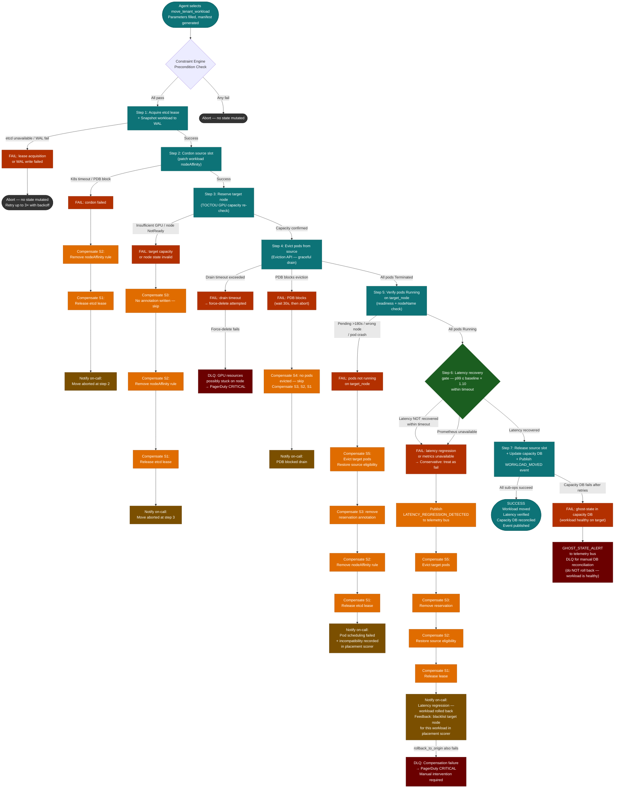

# The Autonomous Capacity Governor
## Presenter's Copy — Interview Guide

**Teserac AI — Design Challenge Response**
Prepared for: Alan Kuo, Deepak Panchapakesan, Teserac AI

> **How to use this document:**
> Each section has a `[~N min]` pacing estimate. Italicized lines are your spoken transition sentences.
> Bullets are your talking points — one idea per bullet, delivered in your own words.
> Artifacts (diagrams, schemas, code) appear under bold labels — point to them or skip past them as needed.
> `↳ Go deep?` flags mark sections where the full walkthrough has additional detail if Alan probes.

**Total estimated time: ~55 min** (adjust pace based on Alan's questions)

---

## Part 0 — Alan Kuo's Original Challenge [~1 min]

*This is Alan's verbatim problem statement — the system we're building is the answer to it.*

> **The Problem: "The Autonomous Capacity Governor"**
>
> **The Scenario:** You have a multi-tenant Kubernetes-style cluster. Resource requirements change every second. You are introducing an Internal AI Agent that acts as a "Virtual SRE." This agent monitors the fleet and issues commands to rebalance workloads.
>
> **The Software Challenge:** How do you build the execution engine that sits between an unpredictable AI and the physical hardware? The AI might say "Move Tenant A to Rack 4," but the software must handle locking, state migration, and safety checks.
>
> Focus on the North-South communication between the AI and the Hardware:
>
> **Capability Discovery:** How does the software tell the AI what actions are currently "legal"? (e.g., "The AI can't reboot Rack 5 because it's under maintenance").
>
> **Transactionality:** If the AI agent issues 5 related commands (a "Plan"), how does your software ensure they are executed atomically?
>
> **The Feedback Loop:** How does the system ingest high-cardinality telemetry (logs, metrics, traces) and "compress" it into a concise summary that an AI can actually reason about?

- This document is the full execution engine between unpredictable AI and physical GPU hardware.
- Three explicit asks addressed: locking / state migration / safety checks at every layer.
- Three architectural questions answered: capability discovery / transactionality / feedback loop compression.

---

## Executive Summary [~5 min]

### Capacity Management Problem Space — Assumptions [~1.5 min]

*Multi-tenant GPU data center, AI/ML workloads, fleet of K8s clusters.*

- Multi-tenant SLA guarantees are contractual — capacity and performance commitments enforced at infrastructure level.
- Hardware stack: CPU / Memory / GPU / HBM / NVLink / NVSwitches — non-linear resource interactions, not just pod scheduling.
- Three AI/ML workload types:
  - Training — long-running, GPU-memory-saturating, checkpoint-tolerant; can be migrated with a checkpoint
  - Fine-tuning — bursty, demand-driven, most common cause of sudden quota overruns
  - Inference — latency-SLA-bound, stateless, fast to migrate; cannot be disrupted mid-request
- Fleet of K8s clusters: one per availability zone / rack group, each with its own control plane and fast-loop rule engine.
- Capacity Governor: logical singleton for the data center — one AI reasoning layer sees the full fleet — but physical distributed system with no single point of failure.

### Known Shortcomings and Roadmap [~1 min]

*Three honest scope boundaries — named upfront, not discovered under pressure.*

- Initial workload submission/placement is out of scope — Global Capacity DB + heuristics at admission; pending queue fulfilled by Governor as capacity becomes available.
- Workloads are single-cluster: training/fine-tuning require intra-cluster NVLink/InfiniBand; WAN latency prohibitive for gradient sync — inference is the explicit exception (stateless, multi-cluster OK).
- Quota enforcement is per-cluster today — fleet-wide tenant ceiling (tenant could spread across clusters) is the next priority enhancement.

### Design Summary — Intuitions and Key Decisions [~2.5 min]

*The agent never sees raw telemetry, never queries live state, never picks from an unbounded action space.*

- Agent triggered on: Loop 1 escalation (any cluster) / scheduled heartbeat (every 15 min) / meaningful digest state change.
- Three pre-built inputs delivered to agent every cycle:
  1. Cluster State Digest — 4-stage compression pipeline, token-budgeted JSON, causal attribution by human-designed rules
  2. Cluster state context — capacity headroom, tenant allocations, SLA thresholds, recent actions; pre-queried, not live-queried by agent
  3. Capability Manifest — only currently legal actions, parameter enums pre-populated from live state, HMAC-signed, 15-min TTL
- Action catalog and preconditions designed by SMEs — agent makes only the dynamic planning decisions.
- Each selected action = Temporal Workflow = Saga; multi-action plans wrapped in `ExecutePlanWorkflow` with dependency ordering and cross-workflow compensation.
- Blast radius limit: 5% of fleet GPU capacity per rolling hour autonomous; beyond that → Loop 3 human approval.

↳ Go deep?

---

## Part 1 — GPU Data Center Capacity Management [~4 min]

*ITIL capacity management applied to a GPU fleet — four sub-processes, each with a GPU-specific instantiation.*

### 1.1 Is This a Realistic Scenario Today? [~1 min]

*Yes — CoreWeave, Lambda Labs, AWS, GCP all run multi-tenant GPU fleets at this scale.*

- Human SRE bandwidth is the constraint — fleets of 10k+ GPUs cannot be managed manually at this rate of change.
- AI/ML demand is bursty and unpredictable — ITIL's gradual-demand-curve assumption fails entirely under GPU workload patterns.
- Autonomous rebalancing is the industry direction: Run:ai, Borg/Omega lineage, Meta Twine are all moving here.

### 1.2 ITIL Capacity Management Applied to a GPU Data Center [~1.5 min]

*ITIL's four sub-processes map directly to GPU fleet operations — with important caveats.*

- Business Capacity: tenant SLA contract terms → GPU quota ceilings, reservation windows, priority tiers (gold/silver).
- Service Capacity: p99 latency SLAs for inference, throughput SLAs for training — monitored by Loop 2 AI Agent.
- Component Capacity: GPU utilization, HBM pressure, NVLink bandwidth, MIG partitioning — monitored by Loop 1 (reactive).
- Demand Management: burst allocation, quota enforcement, workload preemption — ITIL smooth-curve assumption breaks down here.

**[TABLE: ITIL → GPU Mapping]**

```
┌─────────────────────────────────────────────────────────────────────────────┐
│                  ITIL Capacity Management — GPU Data Center Mapping          │
├──────────────────────────────┬──────────────────────────────────────────────┤
│  ITIL Sub-Process            │  GPU Data Center Instantiation                │
├──────────────────────────────┼──────────────────────────────────────────────┤
│  Business Capacity           │  Tenant SLA contract terms, reservation       │
│  Management                  │  windows, priority tiers, billing commitments │
│                              │  → Inputs to strategic planning (Loop 3)      │
├──────────────────────────────┼──────────────────────────────────────────────┤
│  Service Capacity            │  Per-tenant SLA health: throughput, queue     │
│  Management                  │  latency, GPU utilization vs. committed       │
│                              │  allocation → Monitored by Loop 2 (AI Agent)  │
├──────────────────────────────┼──────────────────────────────────────────────┤
│  Component Capacity          │  MIG partition occupancy, HBM bandwidth,      │
│  Management                  │  NVLink saturation, ECC error rates, PCIe     │
│                              │  utilization → Monitored by Loop 1 (reactive) │
├──────────────────────────────┼──────────────────────────────────────────────┤
│  Capacity Planning           │  Demand forecasting from historical traces,   │
│                              │  procurement signals, reservation growth       │
│                              │  trends → Loop 3 + human review               │
└──────────────────────────────┴──────────────────────────────────────────────┘
```

### 1.3 Common Use Cases [~1 min]

*Six operational scenarios the Governor handles.*

- Noisy neighbor: tenant-7 burst job consumes beyond quota, degrading tenant-3 inference SLA via NVLink/HBM saturation.
- Burst allocation: temporary quota raise for time-bound training run before the reservation window cold-start penalty hits.
- Migration before maintenance: evacuate rack with enough lead time for checkpoint I/O to complete before maintenance window.
- Proactive scale-out: capacity horizon < threshold → trigger procurement workflow before the gap becomes a breach.
- SLA tier enforcement: gold-tier inference always preempts silver-tier training under resource pressure.
- Hardware fault isolation: GPU ECC errors → quarantine node, migrate workloads before correctable errors become uncorrectable.

↳ Go deep?

---

## Part 2 — The Autonomous Capacity Governor: Closed-Loop Control Design [~6 min]

*Three control loops at different timescales — each with a distinct role, trigger, and action authority.*

### 2.1 Is the Industry Building This? [~0.5 min]

- Borg/Omega, Meta Twine, Run:ai — all move toward autonomous workload placement at fleet scale.
- None have a publicly described general-purpose AI reasoning layer with a capability manifest and saga execution in the control loop — this is the frontier.

### 2.2 The Three-Loop Architecture [~3 min]

*Loop 1 is per-cluster and deterministic. Loop 2 is fleet-wide and AI-driven. Loop 3 is human.*

- **Loop 1 (< 1 second, per-cluster):** Rule engine only — no LLM. Triggers: Z-score > 3.0 / SLA breach / hardware alert. Actions: cordon, throttle, preempt, suppress. Escalates to Loop 2 when authority exceeded.
- **Loop 2 (5–15 min, fleet-wide):** LLM Agent + Capability Manifest. Triggered by Loop 1 escalation, heartbeat, or digest state change. Cross-cluster decisions. Critical skip condition: if digest unchanged → no LLM invocation.
- **Loop 3 (hours/days, human):** Capacity forecasting, procurement signals, SLA renegotiation. Triggered by Loop 2 escalation or blast radius limit breach.
- Loop 1 is deployed per-cluster — N instances for N clusters, each watching only its own telemetry.
- Loop 1 actions are intra-cluster only — cannot read Global Capacity DB, cannot migrate across clusters.
- The Escalation Bus is the fleet-level pub/sub channel — the boundary crossing from per-cluster to fleet-wide.

**[DIAGRAM: Three-Loop Architecture — Per-Cluster Loop 1, Fleet-Wide Loop 2/3]**

```
┌─────────────────────────────────────────────────────────────────────────────────┐
│                         THREE-LOOP CONTROL ARCHITECTURE                          │
└─────────────────────────────────────────────────────────────────────────────────┘

  ┌─────────────────────────────────────────────────────────────────────────────┐
  │  LOOP 3 — STRATEGIC  (hours / days)                                         │
  │  Trigger: cron schedule                                                      │
  │  Actions: capacity forecast · procurement signal · SLA renegotiation         │
  │  Principle: human-in-the-loop for org/financial boundary decisions            │
  │                                                                               │
  │  ┌─────────────────────────────────────────────────────────────────────┐    │
  │  │  LOOP 2 — AI PLANNING  (5 – 15 minutes)                             │    │
  │  │  Trigger: Loop 1 escalation · heartbeat · digest state change        │    │
  │  │  Inputs:  Cluster State Digest + Capability Manifest                 │    │
  │  │  Actions: formulate Plan · submit to Plan Executor                   │    │
  │  │  Principle: skip invocation if digest unchanged (LLM budget guard)   │    │
  │  │                                                                       │    │
  │  │  ┌─────────────────────────────────────────────────────────────┐    │    │
  │  │  │  LOOP 1 — FAST REACTIVE  (seconds)                          │    │    │
  │  │  │  Trigger: Z-score > 3.0 · SLA breach · hardware alert       │    │    │
  │  │  │  Engine:  Rule engine only — NO LLM in path                  │    │    │
  │  │  │  Actions: throttle noisy neighbor · preempt low-priority     │    │    │
  │  │  │           job · escalate to Loop 2                           │    │    │
  │  │  │  Principle: detection latency < 1s; LLM latency (200ms–2s)  │    │    │
  │  │  │             is unacceptable here                             │    │    │
  │  │  └─────────────────────────────────────────────────────────────┘    │    │
  │  └─────────────────────────────────────────────────────────────────────┘    │
  └─────────────────────────────────────────────────────────────────────────────┘

  Escalation path:   Loop 1 ──▶ Loop 2 ──▶ Loop 3 (where human review required)
  Feedback path:     All loops consume telemetry from the OBSERVE layer
```

↳ Go deep?

### 2.3 The Correct Hybrid Design: Programmatic vs. Agentic [~1 min]

- Detection is always deterministic (Loop 1 rule engine) — LLM is never on the critical detection path.
- Planning is always agentic (Loop 2) — bounded by the Capability Manifest, never an unbounded action space.
- Cases reaching Loop 2 have already been screened: rule engine saw a condition requiring multi-variable or cross-cluster reasoning.
- The decomposition is a correctness requirement, not a performance optimization.

### 2.4 Suppression and Hysteresis [~0.5 min]

- Hysteresis: N=3 consecutive anomalous readings (180 seconds) before promoting a condition to an active incident.
- Silence suppression: M=5 consecutive normal readings (300 seconds) before clearing an incident — asymmetric by design.
- Prevents transient spike storms (checkpoint saves, gradient accumulation steps) from generating spurious agent invocations.

### 2.5 Observe → Reason → Act [~0.5 min]

**[DIAGRAM: Observe → Reason → Act End-to-End]**

```
┌─────────────────────────────────────────────────────────────────────────────────────────┐
│                    CLOSED-LOOP CONTROL — OBSERVE → REASON → ACT                          │
└─────────────────────────────────────────────────────────────────────────────────────────┘

 OBSERVE
 ───────
  OTEL Collector          Aggregation           Compression          Digest Assembly
  ┌─────────────┐        ┌────────────┐        ┌────────────┐       ┌──────────────────┐
  │ metrics     │        │ per-node   │        │ anomaly    │       │ Cluster State    │
  │ traces  ────┼──────▶ │ rollup     │──────▶ │ detection  │─────▶ │ Digest           │
  │ logs        │        │ windowed   │        │ statistical│       │ (structured JSON)│
  └─────────────┘        │ aggregates │        │ summarizer │       └────────┬─────────┘
                         └────────────┘        └────────────┘                │
                                                                              │
 REASON                                                                       │
 ───────                                                                      ▼
  ┌──────────────────────┐   ┌─────────────────────┐       ┌────────────────────────────┐
  │  Capability Manifest  │   │  Cluster State       │       │                            │
  │  (regenerated fresh   │──▶│  Digest              │──────▶│   AI Agent (LLM)           │
  │   each cycle —        │   │                      │       │   Loop 2 — 5–15 min cadence│
  │   never cached)       │   └─────────────────────┘       │                            │
  └──────────────────────┘                                   └────────────┬───────────────┘
                                                                          │
                                                                    Plan output
                                                                          │
 ACT                                                                      ▼
 ────
  ┌─────────────────────┐   ┌──────────────────────────┐   ┌────────────────────────────┐
  │  Plan Executor       │   │  Saga Orchestrator        │   │                            │
  │  · TOCTOU guard      │──▶│  (Temporal Workflow)      │──▶│  Infrastructure            │
  │  · pre-flight checks │   │  · atomic multi-step exec │   │  (GPU nodes, scheduler,    │
  │  · action ordering   │   │  · compensating txns      │   │   network fabric)          │
  └─────────────────────┘   │  · durable state          │   └────────────┬───────────────┘
                             └──────────────────────────┘                │
                                                                          │ telemetry
                                                                          └──────────────▶ OBSERVE (feeds back)


 ┌────────────────────────────┐  ┌──────────────────────────────────┐  ┌──────────────────────────────────┐
 │  [1] MULTI-RATE LOOPS      │  │  [2] CAPABILITY MANIFEST         │  │  [3] TEMPORAL WORKFLOWS          │
 │                            │  │                                  │  │                                  │
 │  Loop 1: seconds           │  │  Regenerated from live cluster   │  │  Every action issued by the      │
 │  (rule engine, no LLM)     │  │  state on every Loop 2 cycle.    │  │  Plan Executor is a Temporal     │
 │                            │  │  Never cached. Stale manifests   │  │  Workflow. Uniform saga contract:│
 │  Loop 2: 5–15 minutes      │  │  would permit illegal actions    │  │  durable, retryable, with        │
 │  (LLM agent + plan exec)   │  │  against hardware currently in   │  │  compensating transactions on    │
 │                            │  │  maintenance or fault state.     │  │  failure. No action is fire-     │
 │  Loop 3: hours / days      │  │                                  │  │  and-forget.                     │
 │  (LLM + human review)      │  │                                  │  │                                  │
 └────────────────────────────┘  └──────────────────────────────────┘  └──────────────────────────────────┘
```

↳ Go deep?

---

## Part 3 — From Raw Telemetry to Agent Context: The Compression Pipeline [~7 min]
*Four stages reduce millions of raw data points per second to a token-budgeted agent digest.*

#### 3.1 The Core Framing [~0.5 min]
- DCGM alone: ~200 metrics per GPU per second — fleet-wide = millions of data points
- LLM context window: 8k–32k tokens — orders of magnitude smaller
- Four stages: Ingest → Score → Correlate → Assemble
- Each stage exists because the next stage cannot consume its input in raw form

#### 3.2 Stage 1 — Ingestion and Pre-Aggregation [~1 min]
*OTel Collector receives all telemetry; 60-second tumbling windows reduce cardinality 60×.*

- OTel Collector: Prometheus receiver (DCGM, kube-state-metrics, cAdvisor), OTLP receiver (app spans), filelog receiver (kubelet, containerd)
- 60-second tumbling windows: compute p50/p95/p99 latency, mean/max utilization, rate-of-change memory pressure
- Tumbling not sliding: reduces cardinality 60× while preserving burst detection at scoring stage
- Attribute reduction: drop pod UID, container hash; keep cluster_id, node_id, tenant_id, workload_id
- Output: normalized metric snapshot per (cluster, node, tenant) every 60 seconds

**[DIAGRAM: OTel Ingestion Pipeline]**
```
DCGM Exporter ──────────────┐
                             │
kube-state-metrics ──────────┤   OTel Collector    ┌─ 60s tumbling window ──► normalized snapshot
                             │  (receiver pipeline) ─┤
cAdvisor ───────────────────┤                      └─ attribute reduction (drop pod UID, hash)
                             │
App OTLP spans ──────────────┤
                             │
filelog (kubelet) ───────────┘
```

#### 3.3 Stage 2 — Anomaly Scoring [~1.5 min]
*Z-score per (node, tenant) pair against 30-minute rolling baseline — adapts to workload-specific norms.*

- Z-score: z = (x − μ) / σ over 30-min rolling baseline per (node, tenant, metric)
- Why Z-score not threshold: training jobs legitimately run at 95% GPU util — hard threshold false-alarms constantly
- |z| > 3.0 = WARNING; |z| > 5.0 = CRITICAL
- Hysteresis: N=3 consecutive anomalous readings before incident is promoted
- Silence suppression: M=5 consecutive normal readings before incident is cleared
- SLA breach: separate rule-based path — compares p99 latency vs. per-tenant contract threshold
- Hardware alerts (ECC errors, NVLink degradation, thermal throttle): injected as synthetic CRITICAL events, bypass Z-score entirely

**[SCHEMA: Anomaly Event]**
```json
{
  "anomaly_id": "ano-20260529-gpu-util-node04-t7",
  "metric_name": "gpu_utilization",
  "node_id": "node-04",
  "tenant_id": "tenant-7",
  "z_score": 4.2,
  "severity": "CRITICAL",
  "first_seen_ts": "2026-05-29T14:22:00Z",
  "consecutive_count": 4,
  "baseline_mean": 72.1,
  "baseline_stddev": 5.3,
  "current_value": 94.3
}
```

↳ Go deep?

#### 3.4 Stage 3 — Correlation and Causal Attribution [~2.5 min]
*Three steps: cluster co-occurring events → assign root cause → suppress resolved incidents.*

**Step 1 — Incident Clustering**
- Co-occurring anomalies grouped by: temporal proximity + shared tenant_id/node_id/rack_id + metric category
- Result: single incident record with affected_nodes[], affected_tenants[], contributing_metrics[]
- Prevents 80 simultaneous GPU util anomalies from burning 80 agent tokens on the same root cause

**Step 2 — Causal Attribution Rule Engine**
- Deterministic priority-ordered rule table — NOT ML
- Why not ML: training data for rare high-severity incidents is scarce; a misclassified HARDWARE_FAULT could trigger catastrophically wrong remediation
- Rules are transparent, auditable by SREs; agent receives a pre-attributed hypothesis — its job is to select the right action, not to do RCA

**[RULES: Causal Attribution — 4 Rules]**
```
RULE 1 (priority 10 — highest):
  IF hardware_alert EXISTS for any node in incident.affected_nodes
  THEN root_cause = "HARDWARE_FAULT"
       recommended_action = "quarantine_node"
       confidence = 1.0

RULE 2 (priority 20):
  IF single tenant_id accounts for > 60% of GPU_UTIL delta
     AND that tenant's quota_used / quota_limit > 0.95
  THEN root_cause = "QUOTA_OVERRUN"
       recommended_action = "adjust_tenant_quota OR freeze_tenant_submissions"
       confidence = 0.9

RULE 3 (priority 30):
  IF GPU_UTIL spike correlates with NET_IO spike (Pearson r > 0.85, same 60s window)
     AND affected tenant is marked as "inference" workload_type
  THEN root_cause = "TRAFFIC_BURST"
       recommended_action = "grant_burst_allocation OR move_tenant_workload"
       confidence = 0.8

RULE 4 (priority 40 — fallback):
  IF no above rule matches
  THEN root_cause = "UNKNOWN"
       recommended_action = null
       confidence = 0.5
```

**[DIAGRAM: Causal Attribution Decision Chain]**
```
Incident Record
      │
      ▼
┌─────────────────────────────────────────┐
│ RULE 1: hardware_alert in affected_nodes?│
└──────────┬──────────────────────────────┘
     YES ──┤                         NO
           ▼                          │
   root_cause = HARDWARE_FAULT        ▼
   confidence = 1.0        ┌──────────────────────────────────────────┐
                            │ RULE 2: single tenant >60% GPU delta     │
                            │         AND quota_used/limit > 0.95?     │
                            └──────────┬───────────────────────────────┘
                                 YES ──┤                           NO
                                       ▼                            │
                              root_cause = QUOTA_OVERRUN            ▼
                              confidence = 0.9        ┌─────────────────────────────────────┐
                                                       │ RULE 3: GPU_UTIL + NET_IO corr>0.85 │
                                                       │         AND workload_type=inference? │
                                                       └──────────┬──────────────────────────┘
                                                            YES ──┤                      NO
                                                                   ▼                      ▼
                                                          root_cause =           root_cause = UNKNOWN
                                                          TRAFFIC_BURST          confidence = 0.5
                                                          confidence = 0.8
```

**Step 3 — Silence Suppression**
- Resolved incidents (M=5 clear readings) excluded from digest entirely
- Prevents agent from re-issuing remediation for already-resolved incidents

↳ Go deep?

#### 3.5 Stage 4 — Digest Assembly [~1.5 min]
*Token-budgeted JSON assembled from incidents, SLA breaches, capacity snapshot, and recent actions.*

- Token budget: 4,096 tokens default; assembler estimates usage at 4 chars ≈ 1 token
- Priority order (what gets truncated last → first):
  1. CRITICAL active incidents
  2. SLA breach events
  3. Capacity horizon warnings (< 20% headroom)
  4. Fleet summary
  5. Recent actions (prevents agent repeating recent successful actions)
- digest_id used as correlation key across agent logs, WAL, and telemetry bus
- delta_from_previous field: tells agent exactly what changed since last cycle

**[SCHEMA: Cluster State Digest — Full Annotated Example]**
```json
{
  // ── HEADER ────────────────────────────────────────────────────────────────
  "digest_id": "dgst-20260529-142300-cluster-a",
  // Unique ID for this digest cycle — used as correlation key in agent logs
  "generated_at": "2026-05-29T14:23:00Z",
  // ISO-8601 UTC timestamp of when this digest was assembled
  "digest_version": "1.4",
  // Schema version — agent validates this before parsing
  "cluster_ids": ["cluster-a", "cluster-b", "cluster-c"],
  // All clusters in scope for this reasoning cycle
  "token_budget_used": 3847,
  "token_budget_limit": 4096,
  // Assembler tracks token usage; agent can inspect headroom

  // ── ACTIVE INCIDENTS ──────────────────────────────────────────────────────
  "active_incidents": [
    {
      "incident_id": "inc-20260529-001",
      "label": "GPU_UTIL_SPIKE",
      "root_cause_hypothesis": "QUOTA_OVERRUN",
      // Assigned by causal attribution rule engine (Rule 2)
      "confidence": 0.9,
      "severity": "CRITICAL",
      "affected_clusters": ["cluster-a"],
      "affected_nodes": ["node-03", "node-04", "node-05", "node-06", "node-07", "node-08", "node-09", "node-10"],
      "affected_tenants": ["tenant-7"],
      "contributing_metrics": ["gpu_utilization", "gpu_memory_used"],
      "first_seen_ts": "2026-05-29T14:18:00Z",
      "duration_seconds": 300,
      // Incident has been active for 5 minutes
      "recommended_action_hint": "adjust_tenant_quota OR freeze_tenant_submissions",
      // Non-binding hint from rule engine — agent may choose differently
      "supporting_anomalies": [
        {
          "anomaly_id": "ano-20260529-gpu-util-node03-t7",
          "metric_name": "gpu_utilization",
          "node_id": "node-03",
          "z_score": 4.1,
          "current_value": 93.8,
          "baseline_mean": 72.1
        }
        // ... (7 more anomaly summaries elided for token budget)
      ]
    }
  ],

  // ── SLA BREACHES ──────────────────────────────────────────────────────────
  "sla_breaches": [
    {
      "tenant_id": "tenant-3",
      "sla_metric": "p99_inference_latency_ms",
      "sla_threshold_ms": 50,
      "current_p99_ms": 87,
      // 74% over SLA threshold
      "breach_duration_seconds": 420,
      "affected_endpoint": "llm-inference-prod",
      "cluster_id": "cluster-a"
    }
  ],

  // ── CAPACITY SNAPSHOT ─────────────────────────────────────────────────────
  "capacity_snapshot": {
    "as_of": "2026-05-29T14:22:00Z",
    "clusters": [
      {
        "cluster_id": "cluster-a",
        "total_gpus": 512,
        "allocated_gpus": 498,
        "available_gpus": 14,
        // 2.7% headroom — below 20% warning threshold
        "gpu_utilization_p95": 91.2,
        "memory_utilization_p95": 88.4,
        "capacity_horizon_hours": 0.4,
        // Projected time until cluster-a is fully exhausted at current growth rate
        "tenant_breakdown": [
          {
            "tenant_id": "tenant-7",
            "allocated_gpus": 128,
            "quota_limit_gpus": 96,
            // Over quota by 33 GPUs — the overrun driving the incident
            "quota_used_pct": 133.3,
            "workload_type": "training"
          },
          {
            "tenant_id": "tenant-3",
            "allocated_gpus": 64,
            "quota_limit_gpus": 64,
            "quota_used_pct": 100.0,
            "workload_type": "inference",
            "sla_tier": "gold"
          }
        ]
      },
      {
        "cluster_id": "cluster-b",
        "total_gpus": 512,
        "allocated_gpus": 341,
        "available_gpus": 171,
        // 33.4% headroom — viable migration target
        "gpu_utilization_p95": 66.6,
        "capacity_horizon_hours": 18.2
      },
      {
        "cluster_id": "cluster-c",
        "total_gpus": 256,
        "allocated_gpus": 201,
        "available_gpus": 55,
        "gpu_utilization_p95": 78.5,
        "capacity_horizon_hours": 6.1
      }
    ],
    "fleet_summary": {
      "total_gpus": 1280,
      "allocated_gpus": 1040,
      "available_gpus": 240,
      "fleet_utilization_pct": 81.3
    }
  },

  // ── RECENT ACTIONS ────────────────────────────────────────────────────────
  "recent_actions": [
    {
      "action_id": "adjust_tenant_quota",
      "plan_id": "plan-20260529-001",
      "tenant_id": "tenant-7",
      "executed_at": "2026-05-29T13:55:00Z",
      "outcome": "COMPLETED",
      "params_summary": "quota raised from 64 to 96 GPUs",
      "saga_run_id": "wrk-adjust-quota-abc123"
      // This action was already taken 28 minutes ago — agent should not repeat it
    }
  ],

  // ── METADATA ──────────────────────────────────────────────────────────────
  "trigger_reason": "LOOP1_ESCALATION",
  // Why the agent was invoked: LOOP1_ESCALATION | DIGEST_STATE_CHANGE | HEARTBEAT
  "previous_digest_id": "dgst-20260529-142200-cluster-a",
  "delta_from_previous": {
    "new_incidents": ["inc-20260529-001"],
    "resolved_incidents": [],
    "capacity_change_pct": -3.2
    // Headroom dropped 3.2% since last cycle
  }
}
```

**[DIAGRAM: Telemetry → Digest Provenance Map]**
```
DCGM / kube-state-metrics ──► OTel Collector ──► 60s window ──► normalized snapshot
                                                                        │
                                                                        ▼
                                                               Z-score scoring
                                                               (per node/tenant)
                                                                        │
                                                                        ▼
                                                             anomaly event list
                                                                        │
                                                                        ▼
                                                    incident clustering + causal attribution
                                                                        │
                         Policy Store (SLA thresholds) ─────────────────┤
                         Capacity DB (quota / allocation) ───────────────┤
                         Action Log (last 30 min) ───────────────────────┤
                                                                        ▼
                                                            Digest Assembler
                                                        (token-budgeted, priority-ordered)
                                                                        │
                                                                        ▼
                                                          Cluster State Digest (JSON)
                                                                        │
                                                                        ▼
                                                             AI Planning Agent
```

↳ Go deep?

---

## Part 4 — Capability Discovery: Action Catalog + Capability Manifest [~7 min]
*The agent receives only the actions that are currently legal — illegal actions are absent, not flagged.*

#### 4.1 The Two Inputs [~0.5 min]
- Input 1: Action Catalog — static registry of ~40 actions, version-controlled, SME-reviewed
- Input 2: Live Cluster State — consistent snapshot from Capacity DB + kube-state-metrics
- Manifest generated fresh every cycle — never cached

#### 4.2 Step 1 — Load the Full Action Catalog [~2 min]
*~40 actions across 7 domains — each entry defines what, when legal, what params, how dangerous.*

- **Workload Placement:** move_tenant_workload, migrate_inference_endpoint, evacuate_rack, consolidate_idle_pods
- **Quota Management:** adjust_tenant_quota, grant_burst_allocation, freeze_tenant_submissions, reserve_capacity_block
- **GPU Hardware Config:** reconfigure_mig_profile, set_gpu_power_limit, enable_mps, sanitize_gpu_memory
- **Node Lifecycle:** cordon_node, drain_node, quarantine_node, trigger_node_health_check
- **Cluster Operations:** scale_cluster_out, isolate_cluster, rollback_cluster_config
- **Observability:** increase_telemetry_resolution, suppress_alert, export_diagnostic_bundle
- **Human Escalation:** request_human_approval, escalate_to_oncall, file_capacity_alert, generate_rca_draft — always available, no precondition can exclude them

**[SCHEMA: Action Catalog Entry — move_tenant_workload]**
```json
{
  "action_id": "move_tenant_workload",
  "domain": "workload_placement",
  "description": "Migrate all pods belonging to a tenant's training workload from a source cluster to a target cluster.",
  "safety_tier": 2,
  "reversible": true,
  "compensating_action_id": "move_tenant_workload",
  "preconditions": [
    "source_cluster.available_gpus < THRESHOLD_LOW",
    "target_cluster.available_gpus >= workload.gpu_request",
    "target_cluster.status == HEALTHY",
    "workload.migration_policy != PINNED"
  ],
  "parameters": {
    "tenant_id": {"type": "string", "required": true},
    "source_cluster_id": {"type": "string", "required": true, "enum": "<populated_at_manifest_time>"},
    "target_cluster_id": {"type": "string", "required": true, "enum": "<populated_at_manifest_time>"},
    "checkpoint_strategy": {"type": "string", "enum": ["none", "filesystem", "object_store"], "default": "filesystem"}
  },
  "temporal_workflow": "MoveTenantWorkloadWorkflow",
  "estimated_duration_seconds": 900
}
```

**[SCHEMA: Action Catalog Entry — quarantine_node (irreversible, safety_tier 3)]**
```json
{
  "action_id": "quarantine_node",
  "domain": "node_lifecycle",
  "description": "Physically isolate a node from the cluster network due to suspected hardware fault. Requires human review to restore.",
  "safety_tier": 3,
  "reversible": false,
  "compensating_action_id": null,
  "preconditions": [
    "node.active_workload_count == 0",
    "node.hardware_fault_flags != EMPTY",
    "node.status == DRAINED"
  ],
  "parameters": {
    "node_id": {"type": "string", "required": true, "enum": "<populated_at_manifest_time>"},
    "fault_evidence_bundle_id": {"type": "string", "required": true},
    "notify_oncall": {"type": "boolean", "default": true}
  },
  "temporal_workflow": "QuarantineNodeWorkflow",
  "estimated_duration_seconds": 120
}
```

↳ Go deep?

#### 4.3 Step 2 — Collect Live Cluster State [~0.5 min]
**[TABLE: Live State Signal Sources]**
```
Signal                        Source                        Used For
─────────────────────────────────────────────────────────────────────────────
node_health[]                 node-problem-detector          RULE 1, quarantine precondition
cluster.available_gpus        Capacity DB                    move/scale preconditions
tenant.quota_used             Capacity DB                    adjust_quota precondition
tenant.migration_policy       Policy Store                   move preconditions
workload.gpu_request          kube-state-metrics             target cluster sizing
cluster.status                control plane health check     all cluster-scoped actions
hardware.mig_capable          DCGM GPU feature flags        reconfigure_mig_profile precondition
oncall_rotation.current       PagerDuty API                  escalate_to_oncall parameter enum
```

#### 4.4 Step 3 — Evaluate Preconditions: Structural Pruning [~1 min]
*Actions whose preconditions fail are REMOVED — the agent never sees them.*

- Structural removal (not flagging) — LLMs may still select "unavailable" flagged actions under pressure
- Each precondition is a DSL expression evaluated against the live state snapshot
- Pruned actions are logged for SRE audit — why was this action unavailable during this incident?

**[CODE: Precondition Evaluation + Pruning]**
```python
def evaluate_preconditions(action: CatalogEntry, state: ClusterState) -> bool:
    """
    Returns True if all preconditions are satisfied.
    Each precondition is a DSL expression evaluated against the live state snapshot.
    """
    for precondition in action.preconditions:
        if not eval_precondition(precondition, state):
            # Log the specific precondition that failed for audit trail
            log_pruned_action(action.action_id, precondition, state)
            return False
    return True

eligible_actions = [
    action for action in catalog.actions
    if evaluate_preconditions(action, live_state)
]
```

#### 4.5 Step 4 — Populate Constrained Enums [~0.5 min]
- `<populated_at_manifest_time>` placeholders replaced with actual legal values from live state
- target_cluster_id → only healthy clusters with headroom ≥ workload.gpu_request
- tenant_id → only tenants with active workloads on constrained clusters

**[SCHEMA: Manifest Entry — Constrained Enums Populated]**
```json
{
  "action_id": "move_tenant_workload",
  "parameters": {
    "tenant_id": {
      "type": "string",
      "required": true,
      "enum": ["tenant-7", "tenant-12"]
      // Only tenants with active workloads on constrained clusters
    },
    "source_cluster_id": {
      "type": "string",
      "required": true,
      "enum": ["cluster-a"]
      // Only clusters below capacity threshold
    },
    "target_cluster_id": {
      "type": "string",
      "required": true,
      "enum": ["cluster-b"]
      // Only clusters that are healthy AND have headroom >= workload.gpu_request
    },
    "checkpoint_strategy": {
      "type": "string",
      "enum": ["none", "filesystem", "object_store"],
      "default": "filesystem"
    }
  }
}
```

#### 4.6 Step 5 — Assemble and Sign the Manifest [~0.5 min]
- Header: manifest_id, generated_at, valid_until (15 min TTL), cluster_ids, action_count
- HMAC-SHA256 over manifest body using service key shared only with Plan Executor
- pruned_actions_log: reference to audit log of why each action was excluded this cycle

**[SCHEMA: Capability Manifest Header]**
```json
{
  "manifest_id": "mfst-20260529-142300-cluster-a",
  "generated_at": "2026-05-29T14:23:00Z",
  "valid_until": "2026-05-29T14:38:00Z",
  // Manifest expires after 15 minutes — regenerated each cycle
  "cluster_ids": ["cluster-a", "cluster-b", "cluster-c"],
  "action_count": 23,
  // 23 of ~40 actions passed precondition evaluation in this cycle
  "eligible_actions": [
    // ... (full pruned, enum-populated action entries)
  ],
  "pruned_action_count": 17,
  "pruned_actions_log": "mfst-20260529-142300-pruned.log",
  // Reference to the audit log of why each action was pruned
  "hmac_sha256": "a3f1c92e847d..."
  // HMAC over (manifest_id + generated_at + eligible_actions) using service key
}
```

#### 4.7 Step 6 — TOCTOU Guard at Execution Time [~1 min]
*Cluster state can change between manifest generation and plan execution — the executor re-checks.*

- Guard 1: manifest.valid_until — reject stale manifests
- Guard 2: HMAC verification — reject tampered manifests
- Guard 3: re-read Capacity DB at execution time, re-evaluate preconditions for each action
- On failure: PRECONDITION_FAILED → retry with fresh manifest or escalate

**[CODE: Plan Executor — Three Guards]**
```python
def execute_plan(plan: AgentPlan, manifest: CapabilityManifest) -> PlanResult:
    # Guard 1: manifest freshness
    if datetime.utcnow() > manifest.valid_until:
        raise ManifestExpiredError(manifest.manifest_id)
    
    # Guard 2: manifest integrity
    if not verify_hmac(manifest):
        raise ManifestTamperedError(manifest.manifest_id)
    
    results = []
    for action in plan.actions:
        # Guard 3: TOCTOU — re-read live state and re-evaluate preconditions
        live_state = capacity_db.read_snapshot()
        catalog_entry = catalog.get(action.action_id)
        
        if not evaluate_preconditions(catalog_entry, live_state):
            results.append(ActionResult(
                action_id=action.action_id,
                status="PRECONDITION_FAILED",
                reason="state changed since manifest generation"
            ))
            continue
        
        # Submit to Temporal — all guard checks passed
        workflow_handle = temporal_client.start_workflow(
            catalog_entry.temporal_workflow,
            action.params,
            id=f"{plan.plan_id}-{action.action_id}",
            task_queue="capacity-governor"
        )
        results.append(ActionResult(action_id=action.action_id, status="SUBMITTED", handle=workflow_handle))
    
    return PlanResult(plan_id=plan.plan_id, action_results=results)
```

↳ Go deep?

#### 4.8 The Complete Flow in One Picture
**[DIAGRAM: Capability Discovery — Full Pipeline]**
```
  ACTION CATALOG (static, version-controlled)
        │
        │  load at manifest generation time
        ▼
┌───────────────────────────────────────────────────────────────────────┐
│                     MANIFEST GENERATOR                                │
│                                                                       │
│  Step 1: Load full catalog (~40 actions, 7 domains)                  │
│                          │                                            │
│  Step 2: Read live state ◄── Capacity DB + kube-state-metrics        │
│                          │                                            │
│  Step 3: Evaluate preconditions  ──► prune failing actions            │
│          (structural removal — not flagging)        │                 │
│                          │                          ▼                 │
│                          │                 audit log (pruned)         │
│  Step 4: Populate constrained enums                                   │
│          (fill target_cluster_id, tenant_id, etc.                    │
│           from live state)                                            │
│                          │                                            │
│  Step 5: Assemble manifest + sign (HMAC-SHA256)                      │
│                          │                                            │
└──────────────────────────┼────────────────────────────────────────────┘
                           │
                           ▼
              CAPABILITY MANIFEST (JSON, signed, TTL=15min)
                           │
                           ▼
                    AI PLANNING AGENT
                    (receives digest + manifest,
                     selects actions from manifest only,
                     returns plan)
                           │
                           ▼
                     PLAN EXECUTOR
                     │
                     ├── Guard 1: manifest not expired?
                     ├── Guard 2: HMAC valid?
                     ├── Guard 3: TOCTOU re-check preconditions
                     │
                     ▼
              TEMPORAL (saga execution)
```

#### 4.9 Concurrent Plan Safety [~0.5 min]
*Two concurrent agent cycles targeting the same workload — three layers prevent collision.*

- Layer 1: Temporal workflow ID = plan_id (deduplication at submission)
- Layer 2: etcd CAS lease per (resource_type, resource_id, operation) — second saga gets LOCK_CONTENTION, aborts cleanly
- Layer 3: TOCTOU backstop — if first saga already set lock in Capacity DB, second plan rejected before Temporal submission

**[DIAGRAM: Concurrent Plan Race — Two Plans, One Workload]**
```
t=0s   Plan A submitted -> TOCTOU pass -> Temporal submit -> MoveTenantWorkloadWorkflow A starts
                                                                  |
                                                          Step 1: acquire etcd lease
                                                          saga-lock/workload/t7-001/move
                                                          ACQUIRED (saga_run_id = A)

t=5s   Plan B submitted -> TOCTOU pass -> Temporal submit -> MoveTenantWorkloadWorkflow B starts
                                                                  |
                                                          Step 1: acquire etcd lease
                                                          saga-lock/workload/t7-001/move
                                                          LOCK_CONTENTION (held by A)
                                                                  |
                                                          Saga B aborts cleanly
                                                          Status: LOCK_CONTENTION
                                                          Plan Executor logs: no retry
```

↳ Go deep?

---

## Part 5 — The AI Planning Agent: Prompts and Triggering [~6 min]
*Static system prompt defines role and hard constraints; dynamic user prompt injects digest + manifest.*

---

### 5.1 Prompt Design Principles [~0.5 min]
*Scoping the agent to manifest-only actions eliminates a whole class of LLM planning failures.*

- System prompt: static, shared across all trigger paths — defines role, constraints, output schema
- Hard constraints encoded in system prompt — not in dynamic context (LLM must know them before seeing any cluster data)
- Dynamic context is token-budgeted and variable — constraints there could be crowded out or dropped
- Chain-of-thought reasoning required — persisted in `plan.reasoning` field in WAL alongside plan
- Digest + manifest both token-budgeted — predictable input size enables meaningful latency guarantees

---

### 5.2 System Prompt — Full Text [~1 min]
*~400 words, 7 hard constraints, JSON output schema — identical on all three trigger paths.*

**[PROMPT: System Prompt — Full Text]**

```
You are the Autonomous Capacity Governor — a Virtual SRE agent responsible for maintaining 
optimal GPU utilization, SLA compliance, and workload stability across a multi-tenant 
Kubernetes-based GPU fleet.

YOUR ROLE:
You receive a Cluster State Digest summarizing active incidents, SLA breaches, capacity 
headroom, and recent actions taken. You also receive a Capability Manifest listing every 
action that is currently legal to execute, along with its parameters and constraints.

YOUR JOB:
Analyze the digest. Identify the highest-priority issue. Select one or more actions from 
the Capability Manifest that address the issue. Return a structured JSON plan.

HARD CONSTRAINTS — you must follow these without exception:

1. You may only select actions that appear in the Capability Manifest. Do not invent, 
   infer, or approximate action names. If an action you want is not in the manifest, 
   escalate via "escalate_to_oncall" or "request_human_approval".

2. Do not re-execute an action listed in recent_actions[] unless that action's outcome 
   was "FAILED". Re-executing a successful action is wasteful and potentially harmful.

3. If the incident root_cause_hypothesis is "HARDWARE_FAULT" and "quarantine_node" is 
   in the manifest, you MUST include it in your plan. Hardware faults are not optional 
   to remediate.

4. If your confidence in any action is below 0.7, do not include that action in the plan.
   Instead, add "escalate_to_oncall" as the final action in the plan.

5. Actions with safety_tier == 3 (e.g., quarantine_node) are irreversible. You must 
   explicitly acknowledge this in your reasoning field before including them.

6. The "reasoning" field in your plan is mandatory. It must explain: (a) which incident 
   or capacity condition each action addresses, (b) why you selected this action over 
   alternatives in the manifest, and (c) what outcome you expect.

7. If the digest contains no active incidents and no SLA breaches and capacity headroom 
   is above 30% fleet-wide, output an empty plan with reasoning = "No action required."

OUTPUT FORMAT:
Return a single JSON object matching this schema exactly:
{
  "plan_id": "<uuid>",
  "digest_id": "<from input>",
  "manifest_id": "<from input>",
  "reasoning": "<your chain-of-thought reasoning — 100-300 words>",
  "actions": [
    {
      "action_id": "<exact action_id from manifest>",
      "params": { /* exact params matching manifest parameter schema */ },
      "depends_on": ["<action_id of prerequisite action, or null>"],
      "confidence": <0.0-1.0>
    }
  ],
  "escalate": <true|false>,
  "escalation_reason": "<if escalate=true, explain why>"
}
```

Key constraints to flag:
- **Constraint 1:** Only select actions in the manifest — escalate if desired action is absent
- **Constraint 3:** `HARDWARE_FAULT` → must include `quarantine_node` if it's in manifest
- **Constraint 4:** confidence < 0.7 → add `escalate_to_oncall`
- **Constraint 5:** `safety_tier 3` → must explicitly acknowledge irreversibility in `reasoning` field
- **Constraint 7:** no incidents + no SLA breaches + headroom > 30% → empty plan

↳ Go deep?

---

### 5.3 Trigger 1 — Loop 1 Escalation [~1.5 min]
*Most common path — something is actively wrong and Loop 1 has exceeded its authority.*

- Fires when: rule engine hits `RULE_LIMIT_EXCEEDED`, `PERSISTENCE_THRESHOLD`, or `SLA_BREACH_DETECTED`
- Agent coordinator generates fresh manifest + digest immediately on receiving escalation event
- Time-sensitive: manifest generation + digest assembly must complete within the 60-second Loop 1 cycle window
- `recent_actions[]` shows what Loop 1 already attempted — agent must not repeat successful Loop 1 actions
- Bypasses digest change-detection gate — invokes agent unconditionally on every escalation event

**[PROMPT: Trigger 1 — Loop 1 Escalation User Prompt]**

```
TRIGGER: LOOP_1_ESCALATION
ESCALATION REASON: {{ escalation_reason }}
INCIDENT ID: {{ incident_id }}

=== CLUSTER STATE DIGEST ===
{{ cluster_state_digest_json }}

=== CAPABILITY MANIFEST ===
{{ capability_manifest_json }}

The above incident has exceeded Loop 1 remediation authority. Analyze the digest, 
identify the root cause, and produce a plan to resolve the incident using only the 
actions in the Capability Manifest.

Remember: recent_actions[] shows what Loop 1 already attempted. Do not repeat 
successful Loop 1 actions unless the incident has worsened.
```

**[TABLE: Trigger 1 — Context Injection Sources]**

```
Field                  Source                        Notes
────────────────────────────────────────────────────────────────────────
escalation_reason      Loop 1 escalation event       "RULE_LIMIT_EXCEEDED" etc.
incident_id            Loop 1 escalation event       Links to active_incidents[] in digest
cluster_state_digest   Digest Assembler              Fresh assembly at escalation time
capability_manifest    Manifest Generator            Fresh generation at escalation time
```

---

### 5.4 Trigger 2 — Digest State Change [~1 min]
*Fires only when digest hash changes meaningfully — prevents redundant LLM calls on stable state.*

- Change detection: normalized hash over `active_incidents[]`, `sla_breaches[]`, `capacity_snapshot` fields
- Significance threshold: any new incident, any new SLA breach, or >5% change in `available_gpus`
- On identical hash: agent is skipped entirely — no invocation, no cost
- Why: LLM inference is expensive; plan churn on stable state creates oscillation

**[PROMPT: Trigger 2 — Digest State Change User Prompt]**

```
TRIGGER: DIGEST_STATE_CHANGE
CHANGE SUMMARY: {{ delta_from_previous }}

=== CLUSTER STATE DIGEST ===
{{ cluster_state_digest_json }}

=== CAPABILITY MANIFEST ===
{{ capability_manifest_json }}

The cluster state has changed meaningfully since the last reasoning cycle. 
Analyze the current digest. If action is warranted, produce a plan. 
If the change is informational only (e.g., an incident resolved, headroom improved), 
output an empty plan with reasoning explaining why no action is needed.
```

---

### 5.5 Trigger 3 — Scheduled Heartbeat [~0.5 min]
*Safety net for slow-moving trends that never spike past the Z-score threshold.*

- Fires every 15 minutes unconditionally — regardless of Loop 1 escalation or digest hash
- Catches gradual capacity degradation (−2% headroom per 15 min = 0 headroom in 3 hours)
- Most heartbeat cycles produce empty plans — cheap and correct

**[PROMPT: Trigger 3 — Heartbeat User Prompt]**

```
TRIGGER: SCHEDULED_HEARTBEAT
HEARTBEAT INTERVAL: 15 minutes

=== CLUSTER STATE DIGEST ===
{{ cluster_state_digest_json }}

=== CAPABILITY MANIFEST ===
{{ capability_manifest_json }}

This is a scheduled heartbeat check. No specific escalation has been raised. 
Review the digest for slow-moving capacity trends, resource imbalances, or 
approaching thresholds that may require proactive action. 

If no action is warranted, output an empty plan with reasoning explaining 
the current cluster health assessment.
```

---

### 5.6 Structural Comparison [~0.5 min]

**[TABLE: Three Trigger Paths — Structural Comparison]**

```
Attribute               Loop 1 Escalation        Digest State Change      Heartbeat
──────────────────────────────────────────────────────────────────────────────────────────────
Trigger source          Loop 1 rule engine        Digest hash delta        Wall clock (15 min)
Expected latency        < 30 seconds              < 60 seconds             < 5 minutes
Incident ID injected    Yes                       No                       No
Typical plan outcome    1–3 remediation actions   1 action or empty        Empty or 1 action
Firing frequency        Event-driven (rare)       Every meaningful change  Every 15 min
Agent invocations/hr    ~2–5 (incident rate)      ~4–8 (state change rate) 4 (fixed)
Primary risk addressed  Active incident           Emerging condition        Slow trend
```

↳ Go deep?

---

## Part 6 — Plan Execution: Saga Orchestration with Temporal [~10 min]
*action == Temporal Workflow == Saga. Every action is durable, retryable, and compensatable.*

---

### 6.0 The Write-Ahead Log [~1 min]
*Per-saga state journal — INTENT before touching external system, COMPLETE after confirmation.*

- Temporal event history answers: "did the activity complete?"
- WAL answers: "what exact value was written, what was the previous state, what is the rollback target?"
- INTENT write captures full param set — allows reconstruction if saga crashes mid-step
- COMPLETE write captures outcome + K8s `resourceVersion` — needed for idempotent re-verification
- WAL is the rollback target for migration: step 2 snapshot captures full workload spec, pod list, node assignments
- Retained 30 days; indexed by `saga_run_id`, `plan_id`, `tenant_id`, `action_id`

**[SCHEMA: WAL Entry — move_tenant_workload (all 7 steps annotated)]**

```json
{
  "wal_record_id": "wal-20260529-142300-move-t7",
  "saga_run_id": "wrk-move-t7-001-abc123",
  "plan_id": "plan-20260529-002",
  "action_id": "move_tenant_workload",
  "tenant_id": "tenant-7",
  "workload_id": "training-job-t7-001",

  "steps": [
    {
      "step": 1,
      "name": "acquire_coordination_lease",
      "intent_written_at": "2026-05-29T14:23:01Z",
      "complete_written_at": "2026-05-29T14:23:01Z",
      "outcome": "ACQUIRED",
      "lease_key": "saga-lock/workload/training-job-t7-001/move",
      "lease_ttl_seconds": 1200
    },
    {
      "step": 2,
      "name": "snapshot_workload_state",
      "note": "This is the rollback target — the exact spec before migration begins",
      "intent_written_at": "2026-05-29T14:23:02Z",
      "complete_written_at": "2026-05-29T14:23:03Z",
      "outcome": "SNAPSHOTTED",
      "snapshot": {
        "source_cluster_id": "cluster-a",
        "source_nodes": ["node-03", "node-04"],
        "pod_list": [
          {"pod_name": "training-job-t7-001-worker-0", "node": "node-03", "gpu_request": 8},
          {"pod_name": "training-job-t7-001-worker-1", "node": "node-04", "gpu_request": 8}
        ],
        "workload_spec_hash": "sha256:a3f1c92e...",
        "workload_spec_uri": "s3://teserac-wal/specs/training-job-t7-001-20260529142302.json",
        "latency_baseline_p99_ms": 45
      }
    },
    {
      "step": 3,
      "name": "checkpoint_workload",
      "intent_written_at": "2026-05-29T14:23:04Z",
      "complete_written_at": "2026-05-29T14:35:12Z",
      "note": "Checkpoint took 11 minutes — large model",
      "outcome": "CHECKPOINTED",
      "checkpoint_uri": "s3://teserac-checkpoints/tenant-7/training-job-t7-001/ckpt-20260529143512/",
      "checkpoint_size_gb": 94.3,
      "checkpoint_strategy": "object_store"
    },
    {
      "step": 4,
      "name": "evict_source_pods",
      "intent_written_at": "2026-05-29T14:35:13Z",
      "complete_written_at": "2026-05-29T14:35:41Z",
      "outcome": "EVICTED",
      "evicted_pods": [
        "training-job-t7-001-worker-0",
        "training-job-t7-001-worker-1"
      ],
      "gpus_released": 16,
      "note": "If saga fails AFTER this step, compensation must re-deploy these pods on cluster-a using workload_spec_uri from step 2",
      "compensation_target": "redeploy_from_wal_step_2_snapshot"
    },
    {
      "step": 5,
      "name": "reschedule_on_target",
      "intent_written_at": "2026-05-29T14:35:42Z",
      "complete_written_at": "2026-05-29T14:36:18Z",
      "outcome": "SCHEDULED",
      "target_cluster_id": "cluster-b",
      "target_nodes": ["node-21", "node-22"],
      "new_pod_names": [
        "training-job-t7-001-worker-0",
        "training-job-t7-001-worker-1"
      ],
      "k8s_resource_version": "1048392",
      "note": "Stored for idempotent re-verification if worker crashes after this write"
    },
    {
      "step": 6,
      "name": "verify_latency_recovery",
      "intent_written_at": "2026-05-29T14:36:19Z",
      "complete_written_at": "2026-05-29T14:38:19Z",
      "outcome": "PASS",
      "observed_p99_ms": 43,
      "sla_threshold_ms": 50,
      "observation_window_seconds": 120
    },
    {
      "step": 7,
      "name": "release_coordination_lease",
      "intent_written_at": "2026-05-29T14:38:20Z",
      "complete_written_at": "2026-05-29T14:38:20Z",
      "outcome": "RELEASED"
    }
  ],

  "final_status": "COMPLETED",
  "total_duration_seconds": 919,
  "compensation_required": false
}
```

↳ Go deep?

---

### 6.1 The Implementation Model [~1 min]
*Three-layer model: Activities (primitives) → Workflows/Sagas (composed) → ExecutePlanWorkflow (parent).*

- **Layer 1** — Temporal Activities: ~20 primitive, idempotent operations — one external system each
- **Layer 2** — Temporal Workflows (Sagas): ~40 workflows, one per `action_id`, 3–10 activities each
- **Layer 3** — ExecutePlanWorkflow: parent saga for multi-action plans
- Identity: `action_id` in manifest → `temporal_workflow` field in catalog → Temporal workflow class name
- Temporal provides: durable execution, exactly-once activity semantics, automatic retry, queryable state

---

### 6.2 Layer 1 — Temporal Activities [~1.5 min]
*~20 primitives organized by subsystem — each touches exactly one external system.*

- **K8s:** `patch_resource_quota`, `cordon_node`, `drain_node`, `evict_pods`, `reschedule_workload`
- **Capacity DB:** `upsert_capacity_db` (CAS, optimistic locking), `acquire_etcd_lease`, `release_etcd_lease`
- **Checkpoint/Migration:** `checkpoint_workload` (returns artifact URI), `verify_checkpoint_artifact`
- **Telemetry:** `publish_telemetry_event` (`SAGA_STARTED` / `COMPLETED` / `COMPENSATING` / `GHOST_STATE_ALERT`)
- **Human Escalation:** `await_human_approval` (Temporal heartbeat keeps alive; timeout → `DENIED` → compensation)
- **Verification:** `verify_latency_recovery` (quality gate — `FAIL` triggers compensation), `verify_quota_effective`

**[CODE: Temporal Activity Signatures (~20 activities)]**

```python
# ── KUBERNETES ACTIVITIES ─────────────────────────────────────────────────────

@activity.defn(name="patch_resource_quota")
async def patch_resource_quota(
    cluster_id: str,
    namespace: str,
    tenant_id: str,
    new_quota_gpus: int,
    idempotency_key: str
) -> PatchResult:
    """
    Apply a Kubernetes ResourceQuota patch for the given tenant namespace.
    Idempotent: re-applying the same quota is a no-op (K8s patch semantics).
    """

@activity.defn(name="cordon_node")
async def cordon_node(
    cluster_id: str,
    node_id: str,
    idempotency_key: str
) -> NodeResult:
    """Mark node unschedulable. Idempotent — cordoning an already-cordoned node is safe."""

@activity.defn(name="drain_node")
async def drain_node(
    cluster_id: str,
    node_id: str,
    grace_period_seconds: int,
    idempotency_key: str
) -> DrainResult:
    """
    Evict all pods from node with grace period. NOT idempotent by default —
    protected by idempotency_key check against action log before execution.
    """

@activity.defn(name="evict_pods")
async def evict_pods(
    cluster_id: str,
    namespace: str,
    label_selector: str,
    idempotency_key: str
) -> EvictionResult:
    """Evict pods matching label selector. Uses K8s Eviction API (respects PodDisruptionBudgets)."""

@activity.defn(name="reschedule_workload")
async def reschedule_workload(
    source_cluster_id: str,
    target_cluster_id: str,
    tenant_id: str,
    workload_manifest: dict,
    idempotency_key: str
) -> RescheduleResult:
    """Apply workload manifest to target cluster. Records target cluster in Capacity DB."""

# ── CAPACITY DB ACTIVITIES ────────────────────────────────────────────────────

@activity.defn(name="upsert_capacity_db")
async def upsert_capacity_db(
    cluster_id: str,
    tenant_id: str,
    delta_gpus: int,
    operation: str,  # "allocate" | "release" | "reserve"
    idempotency_key: str
) -> CapacityResult:
    """
    Atomic upsert to the Global Capacity DB.
    Uses optimistic locking (CAS) to detect concurrent modification.
    GHOST_STATE_ALERT if K8s write succeeded but this write fails.
    """

@activity.defn(name="acquire_etcd_lease")
async def acquire_etcd_lease(
    lease_key: str,
    ttl_seconds: int,
    idempotency_key: str
) -> LeaseResult:
    """
    Acquire a distributed lock in etcd before node-level operations.
    Prevents concurrent sagas from operating on the same node.
    """

@activity.defn(name="release_etcd_lease")
async def release_etcd_lease(
    lease_key: str,
    idempotency_key: str
) -> LeaseResult:
    """Release the etcd lease acquired by acquire_etcd_lease."""

# ── CHECKPOINT / MIGRATION ACTIVITIES ────────────────────────────────────────

@activity.defn(name="checkpoint_workload")
async def checkpoint_workload(
    cluster_id: str,
    tenant_id: str,
    workload_id: str,
    checkpoint_strategy: str,  # "none" | "filesystem" | "object_store"
    checkpoint_destination: str,
    idempotency_key: str
) -> CheckpointResult:
    """
    Trigger CRIU or custom checkpoint for the workload.
    Returns checkpoint artifact URI for use in reschedule_workload.
    """

# ── TELEMETRY ACTIVITIES ──────────────────────────────────────────────────────

@activity.defn(name="publish_telemetry_event")
async def publish_telemetry_event(
    event_type: str,  # "SAGA_STARTED" | "SAGA_COMPLETED" | "SAGA_COMPENSATING" | etc.
    saga_run_id: str,
    action_id: str,
    payload: dict,
    idempotency_key: str
) -> None:
    """Publish a structured event to the OTEL telemetry bus for observability."""

# ── HUMAN ESCALATION ACTIVITIES ───────────────────────────────────────────────

@activity.defn(name="await_human_approval")
async def await_human_approval(
    action_id: str,
    saga_run_id: str,
    approver_group: str,
    timeout_seconds: int,
    reasoning: str,
    idempotency_key: str
) -> ApprovalResult:
    """
    Block workflow execution until a human approves or denies via the approval API.
    Temporal heartbeats keep the activity alive during the wait.
    On timeout: returns DENIED to trigger compensation.
    """

# ── VERIFICATION ACTIVITIES ───────────────────────────────────────────────────

@activity.defn(name="verify_latency_recovery")
async def verify_latency_recovery(
    tenant_id: str,
    cluster_id: str,
    sla_threshold_ms: int,
    observation_window_seconds: int,
    idempotency_key: str
) -> VerificationResult:
    """
    Poll p99 latency for tenant over observation_window_seconds.
    Returns PASS if p99 < sla_threshold_ms at end of window, FAIL otherwise.
    This is a quality gate — FAIL triggers compensation in the parent saga.
    """

@activity.defn(name="verify_quota_effective")
async def verify_quota_effective(
    cluster_id: str,
    tenant_id: str,
    expected_quota_gpus: int,
    idempotency_key: str
) -> VerificationResult:
    """
    Read the actual ResourceQuota from K8s and compare against expected_quota_gpus.
    Detects ghost state: K8s write succeeded but Capacity DB diverged.
    """
```

↳ Go deep?

---

### 6.3 Layer 2 — Temporal Workflows / Sagas [~2 min]
*AdjustTenantQuotaWorkflow is the canonical example — 4 steps, incremental compensation stack.*

- Compensation stack built incrementally — each successful step registers its own rollback
- Steps execute in sequence; first failure triggers compensation in reverse order
- Ghost state: K8s patch succeeds, Capacity DB write fails on every retry, compensation of K8s patch also fails → `GHOST_STATE_ALERT` → human pager
- Ghost state is honest reporting, not a system failure — surfaces divergence loudly

**[CODE: AdjustTenantQuotaWorkflow — Full Saga with Compensation Stack]**

```python
@workflow.defn(name="AdjustTenantQuotaWorkflow")
class AdjustTenantQuotaWorkflow:
    """
    Saga: adjust_tenant_quota
    Steps:
      1. Publish SAGA_STARTED telemetry event
      2. Patch Kubernetes ResourceQuota
      3. Upsert Global Capacity DB
      4. Verify quota is effective (quality gate)
      5. Publish SAGA_COMPLETED telemetry event
    Compensation (reverse order on failure):
      - Revert Capacity DB entry
      - Revert Kubernetes ResourceQuota patch
      - Publish SAGA_COMPENSATED telemetry event
    """

    @workflow.run
    async def run(self, params: AdjustTenantQuotaParams) -> SagaResult:
        saga_run_id = workflow.info().workflow_id
        idempotency_key = compute_idempotency_key(
            params.action_id, params.tenant_id, params.cluster_id, saga_run_id
        )

        # Compensation stack — built incrementally, executed in reverse on failure
        compensation_stack = []

        try:
            # Step 1: Telemetry — SAGA_STARTED
            await workflow.execute_activity(
                publish_telemetry_event,
                args=["SAGA_STARTED", saga_run_id, "adjust_tenant_quota", params.dict(), idempotency_key],
                start_to_close_timeout=timedelta(seconds=10)
            )

            # Step 2: Patch K8s ResourceQuota
            patch_result = await workflow.execute_activity(
                patch_resource_quota,
                args=[params.cluster_id, params.namespace, params.tenant_id,
                      params.new_quota_gpus, idempotency_key],
                start_to_close_timeout=timedelta(seconds=30),
                retry_policy=RetryPolicy(maximum_attempts=3, backoff_coefficient=2.0)
            )
            # Register compensation: revert to old quota
            compensation_stack.append(
                (patch_resource_quota, [params.cluster_id, params.namespace,
                                        params.tenant_id, params.old_quota_gpus,
                                        idempotency_key + "-revert"])
            )

            # Step 3: Upsert Global Capacity DB
            cap_result = await workflow.execute_activity(
                upsert_capacity_db,
                args=[params.cluster_id, params.tenant_id,
                      params.new_quota_gpus - params.old_quota_gpus,
                      "allocate", idempotency_key],
                start_to_close_timeout=timedelta(seconds=15),
                retry_policy=RetryPolicy(maximum_attempts=5, backoff_coefficient=2.0)
            )
            # Register compensation: reverse the delta
            compensation_stack.append(
                (upsert_capacity_db, [params.cluster_id, params.tenant_id,
                                      params.old_quota_gpus - params.new_quota_gpus,
                                      "release", idempotency_key + "-revert"])
            )

            # Step 4: Verify quota is effective (quality gate)
            verify_result = await workflow.execute_activity(
                verify_quota_effective,
                args=[params.cluster_id, params.tenant_id, params.new_quota_gpus, idempotency_key],
                start_to_close_timeout=timedelta(seconds=60)
            )
            if verify_result.status == "FAIL":
                raise SagaQualityGateError(
                    f"Quota not effective after patch: expected {params.new_quota_gpus}, "
                    f"got {verify_result.actual_quota}"
                )

            # Step 5: Telemetry — SAGA_COMPLETED
            await workflow.execute_activity(
                publish_telemetry_event,
                args=["SAGA_COMPLETED", saga_run_id, "adjust_tenant_quota",
                      {"new_quota_gpus": params.new_quota_gpus}, idempotency_key + "-done"],
                start_to_close_timeout=timedelta(seconds=10)
            )

            return SagaResult(status="COMPLETED", saga_run_id=saga_run_id)

        except Exception as e:
            # Execute compensation in reverse order
            await workflow.execute_activity(
                publish_telemetry_event,
                args=["SAGA_COMPENSATING", saga_run_id, "adjust_tenant_quota",
                      {"error": str(e)}, idempotency_key + "-comp"],
                start_to_close_timeout=timedelta(seconds=10)
            )
            for comp_activity, comp_args in reversed(compensation_stack):
                try:
                    await workflow.execute_activity(
                        comp_activity, args=comp_args,
                        start_to_close_timeout=timedelta(seconds=30),
                        retry_policy=RetryPolicy(maximum_attempts=3)
                    )
                except Exception as comp_error:
                    # Compensation failure — this is a GHOST_STATE condition
                    # Log and alert but do not retry indefinitely
                    await workflow.execute_activity(
                        publish_telemetry_event,
                        args=["GHOST_STATE_ALERT", saga_run_id, "adjust_tenant_quota",
                              {"comp_error": str(comp_error)}, idempotency_key + "-ghost"],
                        start_to_close_timeout=timedelta(seconds=10)
                    )
            return SagaResult(status="COMPENSATED", saga_run_id=saga_run_id, error=str(e))
```

↳ Go deep?

---

### 6.4 Layer 3 — Action Catalog JSON [~0.5 min]

**[SCHEMA: ActionCatalogEntry — Full JSON Schema]**

```json
{
  "$schema": "http://json-schema.org/draft-07/schema#",
  "title": "ActionCatalogEntry",
  "type": "object",
  "required": ["action_id", "domain", "description", "safety_tier", "reversible",
               "preconditions", "parameters", "temporal_workflow"],
  "properties": {
    "action_id": {
      "type": "string",
      "description": "Unique identifier — matches the name the AI agent uses in plans"
    },
    "domain": {
      "type": "string",
      "enum": ["workload_placement", "quota_management", "gpu_hardware_config",
               "node_lifecycle", "cluster_operations", "observability", "human_escalation"]
    },
    "description": {
      "type": "string",
      "description": "Human-readable description of what this action does — included in manifest for agent context"
    },
    "safety_tier": {
      "type": "integer",
      "minimum": 1,
      "maximum": 3,
      "description": "1=safe/reversible, 2=impactful/reversible, 3=irreversible/human-required"
    },
    "reversible": {"type": "boolean"},
    "compensating_action_id": {
      "type": ["string", "null"],
      "description": "null for irreversible actions — honest modeling of irreversibility"
    },
    "preconditions": {
      "type": "array",
      "items": {"type": "string"},
      "description": "DSL expressions evaluated against live cluster state at manifest generation time"
    },
    "parameters": {
      "type": "object",
      "description": "JSON Schema for action parameters — enums populated at manifest time"
    },
    "temporal_workflow": {
      "type": "string",
      "description": "Exact Temporal workflow class name to invoke"
    },
    "estimated_duration_seconds": {"type": "integer"}
  }
}
```

- `action_id`: matches exactly what the agent writes in its plan
- `temporal_workflow`: direct mapping to Temporal workflow class name
- `compensating_action_id`: `null` for irreversible actions — honest modeling

---

### 6.5 Detailed Saga Definitions [~2 min]
*Three sagas cover the full complexity spectrum — simple reversible, complex with quality gate, irreversible with human approval.*

---

**adjust_tenant_quota:**
- 4 steps, `safety_tier 2`, fully reversible
- Touches K8s ResourceQuota + Capacity DB + telemetry bus

**[SAGA: adjust_tenant_quota — Full Definition]**

```json
{
  "action_id": "adjust_tenant_quota",
  "domain": "quota-management",
  "safety_tier": 2,
  // tier 2: autonomous with mandatory logging + post-action review.
  // Quota changes are reversible but can starve a tenant's live jobs mid-flight,
  // so every application is written to the audit trail and surfaced in the
  // post-action review dashboard within 5 minutes.

  "reversible": true,
  "compensating_action_id": "restore_tenant_quota",
  // restore_tenant_quota reads the pre-action snapshot captured in step 1's
  // WAL entry and re-applies the previous values to all three state stores.

  "idempotency_key": "SHA-256( action_id || tenant_id || cluster_id || new_gpu_limit || new_cpu_limit || new_memory_limit || saga_run_id )",
  // saga_run_id is a UUID assigned at manifest generation time. Including it
  // means retries of the SAME saga run reuse the same key and are
  // deduplicated, while a logically identical action triggered in a new run
  // gets a fresh key and executes independently.

  "preconditions": [
    "tenant_id exists in capacity DB and is in state ACTIVE",
    "new_gpu_limit >= tenant.min_guaranteed_gpu_quota (SLA floor)",
    "new_gpu_limit <= cluster.total_allocatable_gpus * tenant.max_burst_fraction",
    "cluster.controller_manager is reachable (liveness probe)",
    "no in-progress quota adjustment saga for this tenant_id (etcd lease check)",
    "capacity_db.write_replica_lag < 500ms (stale replica guard)"
    // All preconditions are evaluated by the Constraint Engine at manifest
    // generation AND re-evaluated atomically under an etcd lease immediately
    // before step 1 executes (TOCTOU guard).
  ],

  "parameters": {
    "tenant_id": {
      "type": "string",
      "source": "static",
      "description": "Opaque tenant identifier. Maps to a K8s namespace via the tenant registry."
    },
    "cluster_id": {
      "type": "string",
      "source": "static",
      "description": "Target cluster. Quota objects are cluster-scoped; a single tenant may have quotas on N clusters."
    },
    "new_gpu_limit": {
      "type": "integer",
      "source": "static",
      "description": "Desired GPU unit ceiling. Units match the cluster's device-plugin resource name (e.g. nvidia.com/gpu). MIG slices counted as fractional integers per MIG profile mapping table."
    },
    "new_cpu_limit": {
      "type": "string",
      "source": "static",
      "description": "Desired CPU ceiling in Kubernetes quantity notation (e.g. '64'). Must be consistent with gpu:cpu ratio policy in capacity DB."
    },
    "new_memory_limit": {
      "type": "string",
      "source": "static",
      "description": "Desired memory ceiling in Kubernetes quantity notation (e.g. '512Gi')."
    },
    "previous_gpu_limit": {
      "type": "integer",
      "source": "live:k8s_resource_quota.spec.hard[nvidia.com/gpu]",
      "description": "Populated at manifest generation from the live ResourceQuota object. Used as the rollback target value and stored in WAL step 1 for compensation fidelity."
    },
    "previous_cpu_limit": {
      "type": "string",
      "source": "live:k8s_resource_quota.spec.hard[cpu]",
      "description": "Same as previous_gpu_limit but for CPU."
    },
    "previous_memory_limit": {
      "type": "string",
      "source": "live:k8s_resource_quota.spec.hard[memory]",
      "description": "Same as previous_gpu_limit but for memory."
    }
  },

  "saga_steps": [
    {
      "step": 1,
      "name": "acquire_coordination_lease",
      "description": "Acquire an etcd lease scoped to (tenant_id, cluster_id, 'quota-adjustment'). The lease TTL is set to 90s — longer than the expected end-to-end saga runtime (typically 10–30s) but short enough to self-expire if the executor crashes. Write intent WAL entry containing all previous_* and new_* values, idempotency_key, and saga_run_id.",
      "state_stores_touched": ["etcd"],
      "compensating_step": "Release the etcd lease. If the lease has already expired naturally, this is a no-op — the self-expiry is the compensation.",
      "failure_modes": [
        "etcd unavailable: saga aborts before touching K8s or capacity DB — no partial state. Return to DLQ if etcd remains unavailable after 3 retries with exponential backoff.",
        "lease already held by another saga run: precondition race. Abort; the active saga run will complete or expire the lease. Do not retry immediately — backoff 15s then re-evaluate preconditions.",
        "WAL write fails: abort. No state has been mutated. Safe to retry."
      ],
      "idempotent": true,
      "idempotency_notes": "etcd CAS (Compare-And-Swap) on lease key guarantees exactly-once acquisition. Duplicate calls with the same saga_run_id observe the already-held lease and short-circuit."
    },
    {
      "step": 2,
      "name": "update_k8s_resource_quota",
      "description": "Issue a server-side apply PATCH to the tenant's ResourceQuota object in the mapped K8s namespace. The patch sets spec.hard[nvidia.com/gpu], spec.hard[cpu], and spec.hard[memory] atomically within the K8s API (single etcd write for the object). Write step-2-complete WAL entry with the resourceVersion returned by the API server.",
      "state_stores_touched": ["K8s API (which persists to K8s-internal etcd)"],
      "compensating_step": "PATCH the ResourceQuota back to previous_gpu_limit, previous_cpu_limit, previous_memory_limit using the resourceVersion captured in WAL step 1. If the object has been modified by another actor since (resourceVersion conflict), fetch current state and emit a MANUAL_REVIEW alert — do not blindly overwrite.",
      "failure_modes": [
        "K8s API timeout (default 30s): The PATCH may have applied server-side before the TCP timeout. On retry, fetch the ResourceQuota and compare spec.hard values to new_* targets. If they match, treat as success and advance to step 3. If they do not match, retry the PATCH. Idempotency key on the PATCH annotation prevents duplicate application.",
        "ResourceQuota object version conflict (409 Conflict): Another controller modified the object concurrently. Fetch current state, re-validate preconditions, retry PATCH with updated resourceVersion. If 3 retries fail, abort and release lease.",
        "Namespace not found (404): Tenant mapping is stale. Abort, send alert to tenant registry reconciler.",
        "Admission webhook rejection: A policy controller (e.g. OPA/Gatekeeper) rejected the quota. The rejection reason is deterministic — no retry. Abort, surface the policy violation to the AI agent's reasoning layer."
      ],
      "idempotent": true,
      "idempotency_notes": "Server-side apply with field manager 'capacity-governor' is idempotent: applying the same spec.hard values twice produces the same outcome. The resourceVersion check on retry handles the 'did it apply?' ambiguity."
    },
    {
      "step": 3,
      "name": "update_capacity_db",
      "description": "Write the new GPU allocation record to the global capacity database for (tenant_id, cluster_id). This is the cross-cluster ledger: other clusters and the global scheduler read from it to make burst decisions. Write includes a before/after snapshot and references the saga_run_id for audit linkage. Write step-3-complete WAL entry.",
      "state_stores_touched": ["capacity DB"],
      "compensating_step": "Write the previous GPU allocation record back to capacity DB using the before-snapshot stored in WAL step 1. This is a logical undo — the DB row is updated, not deleted, preserving the audit trail of both the forward and compensating writes.",
      "failure_modes": [
        "Capacity DB write timeout: At this point K8s ResourceQuota is already updated (step 2 succeeded). A timeout here creates ghost-state — K8s thinks the tenant has the new quota but the global ledger disagrees. Retry the capacity DB write up to 5 times (exponential backoff, total budget 60s). If all retries fail: (a) publish a GHOST_STATE_ALERT to the telemetry bus, (b) trigger the compensation sequence to roll back K8s quota, (c) send to DLQ with ghost-state context.",
        "Capacity DB write succeeds but read-your-writes check fails (stale replica): Treat as write failure. Retry against the primary replica endpoint.",
        "Capacity DB primary failover mid-write: Reconnect to new primary (via service discovery) and retry with idempotency key check — the new primary may have replicated the write before the old primary failed."
      ],
      "idempotent": true,
      "idempotency_notes": "Capacity DB write uses an UPSERT keyed on (tenant_id, cluster_id, saga_run_id). A duplicate write for the same saga_run_id is a no-op, distinguishing retries from new logical updates."
    },
    {
      "step": 4,
      "name": "publish_quota_changed_event",
      "description": "Publish a QUOTA_CHANGED event to the telemetry bus. Payload includes tenant_id, cluster_id, previous_*, new_*, effective_timestamp, and saga_run_id. This event is consumed by: (a) the Observe layer for metric dashboards, (b) the tenant notification service, (c) the post-action review pipeline. Write step-4-complete WAL entry.",
      "state_stores_touched": ["telemetry bus"],
      "compensating_step": "Publish a QUOTA_CHANGE_REVERTED event with the same saga_run_id. Consumers that acted on QUOTA_CHANGED (e.g. the notification service) can identify and suppress or retract their downstream actions. The event bus itself is append-only — the original QUOTA_CHANGED event is not deleted.",
      "failure_modes": [
        "Telemetry bus unavailable: This is a non-fatal failure. Steps 1–3 represent the authoritative state mutation; the telemetry event is an observation side-effect. Log the failure, mark the step as BEST_EFFORT_FAILED in the WAL, and advance the saga to COMPLETE. The missing event will be backfilled by the WAL-to-bus reconciler job (runs every 60s, scans for BEST_EFFORT_FAILED WAL entries).",
        "Event published but bus acknowledgment lost: On retry, the idempotency_key embedded in the event payload allows consumers to deduplicate. Safe to re-publish."
      ],
      "idempotent": true,
      "idempotency_notes": "Event payload carries the idempotency_key. All telemetry bus consumers are required to implement idempotent event processing as a platform contract."
    }
  ],

  "compensation_sequence": "Step 4 first: publish QUOTA_CHANGE_REVERTED event. Step 3: write previous GPU allocation record back to capacity DB. Step 2: PATCH K8s ResourceQuota back to previous_* values. Step 1: release etcd lease. Compensation stops at the last successfully completed forward step — no compensating action is issued for steps that did not execute.",

  "dead_letter_condition": "Action goes to DLQ when: (a) etcd lease acquisition fails after 3 retries and the lease cannot be reclaimed — likely indicative of executor split-brain; (b) capacity DB write fails after 5 retries AND ghost-state between K8s and capacity DB is confirmed (K8s quota updated, DB not updated); (c) K8s API returns a deterministic non-retryable error (403 Forbidden, admission webhook rejection). DLQ entries include the full WAL snapshot and ghost-state flag for human triage."
}
```

---

**move_tenant_workload:**
- 7 steps, `safety_tier 2`, latency quality gate at step 6
- Checkpoint decoupled from eviction via Temporal Signal (see §9.4)

**[SAGA: move_tenant_workload — Full Definition]**

```json
{
  "action_id": "move_tenant_workload",
  "domain": "workload-placement",
  "safety_tier": 2,
  // tier 2: autonomous with mandatory logging + post-action review.
  // Workload moves affect live tenant jobs; latency regression is detectable
  // and the compensation path (rollback_to_origin) is fully automated.
  // No human gate is required — but every move is reviewed within 10 minutes.

  "reversible": true,
  "compensating_action_id": "rollback_to_origin",
  // rollback_to_origin is a catalog action in its own right. It reads the
  // origin_node, origin_namespace, and workload snapshot from the WAL and
  // schedules the workload back to its original placement.

  "idempotency_key": "SHA-256( action_id || tenant_id || workload_id || source_node || target_node || saga_run_id )",

  "preconditions": [
    "workload_id exists and is in state RUNNING on source_node",
    "target_node is in state READY and not cordoned",
    "target_node has allocatable GPU capacity >= workload.gpu_request (accounting for pending pods already scheduled to target_node)",
    "target_node GPU type matches workload.gpu_affinity requirement (e.g. A100 80GB, or MIG 3g.40gb profile)",
    "source_node and target_node are in the same cluster (cross-cluster moves use a different action: cross_cluster_migrate)",
    "no in-progress move saga for this workload_id (etcd lease check)",
    "p99 inference latency for workload_id is measurable (Prometheus scrape age < 30s) — required for post-move latency comparison",
    "PodDisruptionBudget for tenant namespace allows at least 1 voluntary disruption"
    // TOCTOU re-evaluation: target_node allocatable capacity is re-fetched
    // under an etcd lease immediately before the scheduling annotation is
    // written in step 3 — GPU capacity is the most volatile precondition.
  ],

  "parameters": {
    "tenant_id": {
      "type": "string",
      "source": "static",
      "description": "Tenant identifier."
    },
    "workload_id": {
      "type": "string",
      "source": "static",
      "description": "Kubernetes Deployment or StatefulSet name within the tenant namespace."
    },
    "source_node": {
      "type": "string",
      "source": "live:pod.spec.nodeName",
      "description": "Node where the workload's current pod(s) are running. Populated at manifest generation from live pod state. Stored in WAL for compensation."
    },
    "target_node": {
      "type": "string",
      "source": "static",
      "description": "Destination node selected by the AI agent's placement scorer."
    },
    "drain_timeout_seconds": {
      "type": "integer",
      "source": "static",
      "description": "Maximum seconds to wait for graceful pod termination during drain. Must be >= pod's terminationGracePeriodSeconds. Default 300s for GPU workloads (CUDA context teardown is slow)."
    },
    "latency_recovery_timeout_seconds": {
      "type": "integer",
      "source": "static",
      "description": "How long to wait post-reschedule for p99 latency to return to within 10% of pre-move baseline before triggering compensation. Default 120s."
    },
    "latency_baseline_p99_ms": {
      "type": "integer",
      "source": "live:prometheus.query(p99_inference_latency_ms{workload_id}[5m])",
      "description": "p99 inference latency in milliseconds averaged over the 5 minutes before manifest generation. Threshold for latency recovery check = this value * 1.10."
    },
    "pod_names": {
      "type": "string",
      "source": "live:k8s_pod_list(namespace=tenant_namespace, label=workload_id)",
      "description": "Comma-separated list of pod names to be evicted. Captured at manifest generation; re-validated in step 2."
    },
    "workload_snapshot": {
      "type": "string",
      "source": "live:k8s_deployment_spec(workload_id)",
      "description": "JSON-serialized Deployment/StatefulSet spec at manifest generation time. Stored in WAL for compensation fidelity — rollback_to_origin uses this to ensure the workload spec has not drifted."
    }
  },

  "saga_steps": [
    {
      "step": 1,
      "name": "acquire_coordination_lease_and_snapshot",
      "description": "Acquire etcd lease scoped to (tenant_id, workload_id, 'move'). TTL = drain_timeout_seconds + latency_recovery_timeout_seconds + 60s buffer. Snapshot the workload spec, current pod list, source_node, and latency_baseline_p99_ms into the WAL. This snapshot is the rollback target for compensation.",
      "state_stores_touched": ["etcd", "WAL"],
      "compensating_step": "Release etcd lease. Self-expiry is also acceptable if the saga has crashed.",
      "failure_modes": [
        "etcd lease acquisition fails: another move is in progress for this workload_id. Abort cleanly — no state mutated.",
        "Snapshot write to WAL fails: abort. Without a reliable rollback target, the move must not proceed."
      ],
      "idempotent": true,
      "idempotency_notes": "etcd CAS on lease key. WAL write uses (saga_run_id, step=1) as the primary key — duplicate writes are rejected by the WAL layer."
    },
    {
      "step": 2,
      "name": "cordon_source_slot",
      "description": "Add a scheduling annotation to the workload (not the node) that prevents the scheduler from placing new replicas on source_node. Specifically: patch the workload's pod template with a nodeAffinity rule that repels source_node. This is a soft cordon scoped to this workload — other tenants' pods on source_node are unaffected. Write step-2-complete to WAL.",
      "state_stores_touched": ["K8s API"],
      "compensating_step": "Remove the nodeAffinity anti-affinity rule from the workload pod template, restoring the original affinity spec from WAL step-1 snapshot.",
      "failure_modes": [
        "K8s API timeout: fetch current pod template and check for the anti-affinity annotation. If present, advance. If absent, retry PATCH.",
        "Workload was deleted between precondition check and this step: abort the saga. The move target is gone. Release lease. No compensation needed — nothing was mutated yet.",
        "PodDisruptionBudget admission blocks the patch: deterministic failure. Abort, do not retry. Surface to agent reasoning layer."
      ],
      "idempotent": true,
      "idempotency_notes": "The nodeAffinity rule is keyed by a label `capacity-governor.io/move-run-id: <saga_run_id>`. Duplicate patches applying the same rule are idempotent via server-side apply field manager."
    },
    {
      "step": 3,
      "name": "annotate_target_node_reservation",
      "description": "Write a resource reservation annotation to target_node claiming the GPU units required by this workload. This is a cooperative reservation protocol: the scheduler respects it via a custom filter plugin (CapacityGovernorFilter). Acquire the TOCTOU lock: re-fetch target_node allocatable GPU under the etcd lease and compare to workload.gpu_request. If insufficient (race with another scheduler), abort before any pod movement. Write step-3-complete to WAL.",
      "state_stores_touched": ["K8s API (node annotation)", "etcd (TOCTOU re-evaluation)"],
      "compensating_step": "Remove the resource reservation annotation from target_node. If the annotation is already absent (expired or removed by another process), treat as success.",
      "failure_modes": [
        "TOCTOU check reveals insufficient GPU capacity: abort. Compensation: remove step-2's nodeAffinity rule (restore source_node eligibility). No pod movement has occurred — clean abort.",
        "K8s API timeout writing node annotation: check for annotation presence before retrying. Safe to retry.",
        "target_node transitions to NotReady between precondition check and this step: abort. target_node is no longer viable. Compensate step 2."
      ],
      "idempotent": true,
      "idempotency_notes": "Annotation keyed by saga_run_id. Server-side apply ensures duplicate annotations do not stack."
    },
    {
      "step": 4,
      "name": "evict_pods_from_source",
      "description": "Issue Kubernetes Eviction API calls (not delete) for each pod in pod_names. The Eviction API respects PodDisruptionBudgets and triggers graceful termination (SIGTERM → terminationGracePeriodSeconds → SIGKILL). Crucially, this is NOT a pod delete — the owning controller (Deployment/StatefulSet) will create replacement pods on target_node guided by the nodeAffinity rule set in step 2. Poll for pod termination completion. Timeout: drain_timeout_seconds. Write step-4-complete to WAL when all pods reach Terminated state.",
      "state_stores_touched": ["K8s API"],
      "compensating_step": "The evicted pods are already being recreated on target_node (by step 5 or in-flight). Compensation for this step is achieved by: (a) removing the nodeAffinity anti-affinity rule (step 2 compensation) so the next scheduler cycle places replacement pods back on source_node, (b) optionally issuing a Deletion of the newly-created pods on target_node to accelerate rescheduling to source_node. The workload controller handles reconstruction.",
      "failure_modes": [
        "Eviction rejected by PodDisruptionBudget: The PDB does not allow voluntary disruption at this moment (e.g. too many pods already unavailable). Wait up to 30s for the disruption window to open, then retry eviction. If 30s elapses without a disruption window, abort and compensate steps 2 and 3.",
        "Pod does not reach Terminated within drain_timeout_seconds: This indicates the workload's CUDA context teardown is hung or the process is ignoring SIGTERM. After timeout, force-delete the pod (bypasses graceful period). Log the force-delete event to the audit trail. If force-delete also fails, enter DLQ.",
        "Node running the pod becomes NotReady mid-drain (kubelet crash, power failure): The pod enters Unknown state. Wait for the node to recover (up to 5 minutes, K8s default node eviction timeout). If the node does not recover, treat pod as lost — GPU may be physically stuck. Trigger quarantine_node as a follow-on action."
      ],
      "idempotent": false,
      "idempotency_notes": "Pod eviction is not idempotent in the general case: if a pod has already been evicted and a new pod created, re-issuing the eviction would evict the already-moved pod. The WAL step-4-complete flag is the guard: if set, skip this step on retry."
    },
    {
      "step": 5,
      "name": "verify_pod_scheduled_on_target",
      "description": "Poll K8s API until the replacement pods are in Running state on target_node. Verify pod.spec.nodeName == target_node AND pod phase == Running AND all containers pass readinessProbes. Timeout: 180s (accounts for GPU driver initialization and CUDA context setup time, which can take 60–90s on large A100 partitions). Write step-5-complete to WAL.",
      "state_stores_touched": ["K8s API"],
      "compensating_step": "If pods are Running on target_node, issue Eviction calls to them to trigger re-scheduling back to source_node (after step-2 compensation restores source_node eligibility). If pods are in Pending state (scheduler couldn't place them), the nodeAffinity removal in step-2 compensation resolves this automatically.",
      "failure_modes": [
        "Pod stuck in Pending: scheduler cannot place it on target_node despite the reservation annotation. Most likely cause: the GPU device plugin has not yet reported the freed capacity (device plugin cache lag, typically 10–15s). Retry after 20s. If still Pending after 180s, the reservation annotation was incorrect — abort and compensate.",
        "Pod scheduled on wrong node: the CapacityGovernorFilter plugin may not be running on this cluster version. This is a configuration bug — raise a CRITICAL alert, abort, compensate.",
        "Pod crashes immediately after scheduling (OOMKilled or GPU init error): indicates the workload is incompatible with target_node's GPU configuration (driver version mismatch, MIG profile mismatch). Compensate immediately — do not retry on this target_node. Record incompatibility in the placement scorer's feedback loop."
      ],
      "idempotent": true,
      "idempotency_notes": "Polling is a read operation. Writing WAL step-5-complete is idempotent via (saga_run_id, step=5) primary key."
    },
    {
      "step": 6,
      "name": "verify_latency_recovery",
      "description": "Query Prometheus/Mimir for p99 inference latency for workload_id. Wait for p99 to return to within 10% of latency_baseline_p99_ms (i.e. <= latency_baseline_p99_ms * 1.10). Poll every 10 seconds. Total wait budget: latency_recovery_timeout_seconds. This is the quality gate — the move is not considered successful until the workload's performance profile matches pre-move baseline. Write step-6-complete to WAL.",
      "state_stores_touched": ["Prometheus/Mimir (read-only)", "WAL"],
      "compensating_step": "Latency has not recovered. This step's compensation triggers the full compensation sequence: evict pods from target_node and reschedule to source_node. Publish LATENCY_REGRESSION_DETECTED event to telemetry bus for the Observe layer.",
      "failure_modes": [
        "Latency does not recover within latency_recovery_timeout_seconds: Trigger compensation. The workload is not performing acceptably on target_node. Record (source_node, target_node, workload_id, failure_reason=LATENCY_REGRESSION) in the placement scorer's negative feedback store to prevent future moves to this target_node for this workload.",
        "Prometheus scrape unavailable: Cannot evaluate the quality gate. Default to CONSERVATIVE: treat as latency failure, trigger compensation. A move without observable latency confirmation is considered incomplete.",
        "Latency spike is transient (recovers after 80s, within the 120s window): saga proceeds to step 7. The transient spike is recorded in the WAL but does not trigger compensation."
      ],
      "idempotent": true,
      "idempotency_notes": "Read-only Prometheus query. WAL write idempotent by (saga_run_id, step=6)."
    },
    {
      "step": 7,
      "name": "release_source_slot_and_update_capacity_db",
      "description": "Remove the nodeAffinity anti-affinity rule from the workload (making source_node eligible again for OTHER workloads' scheduling — not this one, which is now running on target_node). Update the global capacity DB: decrement source_node GPU allocation by workload.gpu_request, increment target_node GPU allocation. Remove the target_node reservation annotation written in step 3. Publish WORKLOAD_MOVED event to telemetry bus. Write step-7-complete to WAL.",
      "state_stores_touched": ["K8s API", "capacity DB", "telemetry bus"],
      "compensating_step": "This step is the terminal success step. If it fails mid-execution, the workload is Running on target_node but bookkeeping is partial. Handle each sub-operation independently: (a) if nodeAffinity removal fails, retry — it is idempotent; (b) if capacity DB update fails, retry with idempotency key up to 5 times, then raise GHOST_STATE_ALERT; (c) telemetry bus failure is best-effort (same pattern as adjust_tenant_quota step 4).",
      "failure_modes": [
        "Capacity DB update fails after all retries: ghost-state between K8s (workload on target_node) and capacity DB (shows workload still on source_node). The workload is healthy — don't trigger compensation at this point. Instead: raise GHOST_STATE_ALERT, send to DLQ for manual capacity DB reconciliation.",
        "K8s API timeout removing nodeAffinity rule: retry. The rule's presence does not affect the now-running workload (it's on target_node already). This is a bookkeeping operation."
      ],
      "idempotent": true,
      "idempotency_notes": "Each sub-operation uses its own idempotency guard. Capacity DB write uses (saga_run_id, step=7) UPSERT."
    }
  ],

  "compensation_sequence": "Compensation executes in reverse step order, starting from the last successfully completed forward step. Step 7 compensation: re-apply source_node anti-affinity, revert capacity DB, publish WORKLOAD_MOVE_REVERTED event. Step 6 compensation: publish LATENCY_REGRESSION_DETECTED event. Step 5 compensation: evict pods from target_node (workload controller re-places to source_node once step-2 compensation is applied). Step 4 compensation: ensure all source-node pods are truly terminated before re-placement. Step 3 compensation: remove target_node reservation annotation. Step 2 compensation: remove workload nodeAffinity anti-affinity rule (restoring source_node eligibility). Step 1 compensation: release etcd lease. Human notification is sent after step-6 or step-7 compensation with full context: reason, pre/post latency, affected workload, saga_run_id.",

  "dead_letter_condition": "Action goes to DLQ when: (a) pod drain timeout exceeded AND force-delete also fails — GPU resources may be physically stuck on source_node; (b) pod refuses to schedule on target_node after 180s despite reservation; (c) latency does NOT recover AND compensation also fails (rollback_to_origin saga itself fails); (d) ghost-state in capacity DB after step-7 failure and all retries exhausted. All DLQ entries trigger an immediate PagerDuty alert to the on-call capacity engineer."
}
```

**[DIAGRAM: move_tenant_workload — Workflow Flowchart]**



---

**quarantine_node:**
- 5 steps, `safety_tier 3`, irreversible (`compensating_action_id: null`)
- Human approval is step 3 — saga blocks until approved or times out

**[SAGA: quarantine_node — Full Definition (irreversible)]**

```json
{
  "action_id": "quarantine_node",
  "domain": "node-operations",
  "safety_tier": 3,
  // tier 3: requires explicit human approval before the irreversible drain step.
  // The saga encodes the human approval as step 3 — without a GRANTED signal,
  // the saga blocks indefinitely (up to approval_timeout_seconds) and then
  // aborts cleanly. In-flight GPU jobs on the node WILL be lost once the drain
  // executes; this loss is the irreversibility that mandates the human gate.

  "reversible": false,
  // The quarantine itself (cordoning + tainting the node) is technically
  // reversible by uncordoning. However, the in-flight jobs lost during the
  // drain step CANNOT be recovered — their GPU state is gone. The saga is
  // therefore classified irreversible at the system level even though the
  // node's scheduling availability can be restored by an operator.
  // A separate 'unquarantine_node' catalog action exists for when the
  // underlying hardware issue is resolved.

  "compensating_action_id": null,
  // There is no automated compensation for a completed quarantine.
  // The 'unquarantine_node' action is a deliberate operator-initiated action,
  // not an automated compensating transaction.

  "idempotency_key": "SHA-256( action_id || node_name || cluster_id || quarantine_reason_code || saga_run_id )",

  "preconditions": [
    "node_name exists in cluster_id and is in a schedulable state (Ready or NotReady — quarantine applies in both cases)",
    "quarantine_reason_code is a recognized code in the quarantine reason registry (e.g. GPU_ECC_DOUBLE_BIT_ERROR, NVLINK_DEGRADED, THERMAL_RUNAWAY_RISK, DRIVER_CRASH_LOOP)",
    "no in-progress quarantine saga for this node_name (etcd lease check)",
    "cluster has at least 1 other Ready node with available GPU capacity (prevents total cluster GPU exhaustion)",
    "affected_tenant_count <= 10 OR explicit override flag is set (large-blast-radius guard — more than 10 tenants affected requires additional justification in the approval request)"
    // TOCTOU re-evaluation: node state and tenant count are re-fetched under
    // etcd lease before the cordon step. A node may have healed between
    // precondition check and execution (transient GPU error cleared by driver).
  ],

  "parameters": {
    "node_name": {
      "type": "string",
      "source": "static",
      "description": "Kubernetes node name to quarantine."
    },
    "cluster_id": {
      "type": "string",
      "source": "static",
      "description": "Cluster containing the node."
    },
    "quarantine_reason_code": {
      "type": "enum",
      "source": "static",
      "description": "Structured reason from registry: GPU_ECC_DOUBLE_BIT_ERROR | NVLINK_DEGRADED | THERMAL_RUNAWAY_RISK | DRIVER_CRASH_LOOP | MIG_PARTITION_INCONSISTENCY | OPERATOR_INITIATED. Determines approval SLA and notification routing."
    },
    "quarantine_reason_detail": {
      "type": "string",
      "source": "static",
      "description": "Human-readable detail string. Included verbatim in the approval request to the human reviewer. Max 500 chars."
    },
    "affected_tenants": {
      "type": "string",
      "source": "live:k8s_pod_list(node=node_name).group_by(tenant_id)",
      "description": "Comma-separated list of tenant_ids with pods currently running on node_name. Populated at manifest generation. Included in the approval request and in pre-drain tenant notifications."
    },
    "running_pod_count": {
      "type": "integer",
      "source": "live:k8s_pod_list(node=node_name, phase=Running).count()",
      "description": "Number of Running pods on the node at manifest generation time. Included in the approval request as blast-radius context."
    },
    "approval_timeout_seconds": {
      "type": "integer",
      "source": "static",
      "description": "How long the saga waits for human approval before aborting. Default: 600s (10 minutes) for THERMAL_RUNAWAY_RISK. 3600s (1 hour) for less urgent codes. The urgency is caller-set; the catalog does not auto-select timeout by reason code."
    },
    "drain_timeout_seconds": {
      "type": "integer",
      "source": "static",
      "description": "Maximum seconds to wait for graceful pod termination post-approval. PodDisruptionBudgets are NOT respected during quarantine drain — this is an emergency operation. Default 120s, after which pods are force-deleted."
    },
    "node_gpu_inventory": {
      "type": "string",
      "source": "live:k8s_node_capacity(node=node_name)[nvidia.com/gpu]",
      "description": "Total GPU count on the node. Recorded in WAL for capacity DB reconciliation after drain."
    }
  },

  "saga_steps": [
    {
      "step": 1,
      "name": "acquire_coordination_lease_and_snapshot",
      "description": "Acquire etcd lease scoped to (node_name, cluster_id, 'quarantine'). TTL = approval_timeout_seconds + drain_timeout_seconds + 120s buffer. Snapshot: current node conditions, pod list with tenant mapping, GPU inventory, and all parameter values. Write intent WAL entry. This snapshot is the source of truth for the approval request content and for post-drain capacity DB reconciliation.",
      "state_stores_touched": ["etcd", "WAL"],
      "compensating_step": "Release etcd lease.",
      "failure_modes": [
        "etcd unavailable: abort before any state mutation. If the node has a thermal runaway risk and etcd is also unavailable, this represents a broader cluster emergency — escalate to on-call immediately via out-of-band alerting (PagerDuty direct).",
        "Lease already held: another quarantine saga is in progress for this node. Abort — do not duplicate."
      ],
      "idempotent": true,
      "idempotency_notes": "etcd CAS on lease key. WAL write idempotent by (saga_run_id, step=1)."
    },
    {
      "step": 2,
      "name": "cordon_node_and_notify_tenants",
      "description": "Cordon the node via K8s API (kubectl cordon equivalent: set node.spec.unschedulable=true). This immediately prevents new pod scheduling to the node but does NOT evict existing pods — in-flight jobs continue running. Apply a quarantine taint: capacity-governor.io/quarantine=<quarantine_reason_code>:NoSchedule. Publish QUARANTINE_PENDING event to telemetry bus with affected_tenants list and estimated time to drain. Send pre-drain notifications to all affected tenants via the notification service (giving them the approval_timeout_seconds window to checkpoint if they support it). Write step-2-complete to WAL.",
      "state_stores_touched": ["K8s API", "telemetry bus"],
      "compensating_step": "Uncordon the node (set spec.unschedulable=false). Remove the quarantine taint. Publish QUARANTINE_ABORTED event. This is the compensation used if the human approval is denied or times out — in-flight jobs are preserved because the drain has not yet executed.",
      "failure_modes": [
        "K8s API timeout on cordon: fetch node spec and check unschedulable flag and taint presence. If present, advance. If absent, retry.",
        "Telemetry bus publish fails: best-effort. Log the failure. Proceed — the cordon is the safety-critical operation; the event is observability.",
        "Tenant notification service unavailable: best-effort. Log the failure. Proceed — tenant notification is a courtesy, not a gate."
      ],
      "idempotent": true,
      "idempotency_notes": "Setting spec.unschedulable=true is idempotent. Taint application with the same key/value/effect is idempotent. Telemetry event carries idempotency_key for consumer deduplication."
    },
    {
      "step": 3,
      "name": "await_human_approval",
      "description": "Submit an approval request to the human review queue. The request includes: node_name, quarantine_reason_code, quarantine_reason_detail, affected_tenants, running_pod_count, node_gpu_inventory, estimated impact (GPU-hours lost based on running workload metadata), and a direct approval/deny link. Block the saga executor on this step, polling the approval queue every 10 seconds. The saga does NOT time out the step internally — timeout is enforced by the etcd lease TTL. If the lease expires before approval, the saga is considered abandoned and the executor cleans up. Write step-3-started to WAL on submission. Write step-3-complete (APPROVED or DENIED) to WAL on resolution.",
      "state_stores_touched": ["approval queue (persistent store)", "WAL"],
      "compensating_step": "If the saga is compensating after this step was completed with APPROVED status (which would mean a later step failed — only step 4 can fail after this point), the compensation for this step is: publish QUARANTINE_ABORTED event. Note: as of the current catalog, if step 3 completes APPROVED and step 4 then fails, compensation removes the cordon and taint (step 2 compensation) and releases the lease (step 1 compensation). The approval itself cannot be 'un-approved' — it is a human decision recorded in the audit trail.",
      "failure_modes": [
        "Approval not granted within approval_timeout_seconds: the etcd lease expires. The saga executor detects the expired lease on its next poll and initiates cleanup: remove cordon, remove taint, publish QUARANTINE_TIMED_OUT event. In-flight jobs are preserved. PagerDuty alert is sent: 'Quarantine aborted — human approval timed out, node remains live with known hardware issue.'",
        "Human reviewer clicks DENY: saga receives DENIED signal. Execute compensation: uncordon node, remove taint, publish QUARANTINE_DENIED event. Record denial reason (captured in the review UI) in WAL.",
        "Approval queue service unavailable: The saga cannot submit or poll the approval request. This is a blocking failure. Do not drain without approval. Retry submission up to 3 times. If the approval service remains unavailable, abort and compensate steps 2 and 1. Raise a CRITICAL alert: the node has a known hardware issue but cannot be quarantined due to approval system failure."
      ],
      "idempotent": true,
      "idempotency_notes": "Approval request submission is idempotent via saga_run_id as the request key. Duplicate submissions return the existing request state."
    },
    {
      "step": 4,
      "name": "drain_node",
      "description": "THIS IS THE IRREVERSIBLE STEP. Once this step begins, in-flight GPU jobs on the node will be terminated. Drain the node: issue force eviction (bypassing PodDisruptionBudgets — this is an emergency quarantine, not a graceful rolling operation) for all non-DaemonSet pods on the node. DaemonSet pods are left running (node exporters, device plugins) unless the quarantine_reason_code indicates they must also be removed (e.g. DRIVER_CRASH_LOOP). Wait up to drain_timeout_seconds for pods to terminate. After timeout, force-delete any remaining pods. Write step-4-complete to WAL with final pod termination count.",
      "state_stores_touched": ["K8s API"],
      "compensating_step": "NONE. The drain is irreversible — terminated pods cannot be restored. The compensation for the system is: the workload controllers that owned those pods will create replacement pods elsewhere in the cluster (on non-quarantined nodes). The quarantine action does not attempt to orchestrate this — it is handled naturally by K8s control plane reconciliation. The node remains cordoned and tainted after a failed drain attempt — this is intentional. A node with a confirmed hardware issue must not receive new workloads even if the drain was incomplete.",
      "failure_modes": [
        "Pod eviction API errors (node kubelet unresponsive): the node may already be in a bad state. Attempt direct pod deletion via the API server (bypasses kubelet). If API server also cannot reach the node (node is partitioned), the pods will be evicted by the node lifecycle controller after node-eviction-timeout (default 5 minutes). The saga waits for this natural eviction. If pods remain in Unknown state after 10 minutes, they are de-facto lost — the GPU devices are unavailable.",
        "drain_timeout_seconds exceeded with pods still Running: force-delete all remaining pods. If force-delete also fails (API server partition), record the unresolvable state in WAL and send DLQ entry. The node is already cordoned — new workloads cannot be scheduled to it, which is the primary safety goal.",
        "SIGTERM ignored by GPU workload (CUDA process group does not propagate signals): this is a workload hygiene issue. After terminationGracePeriodSeconds, SIGKILL is issued. SIGKILL cannot be ignored. Force-delete as fallback."
      ],
      "idempotent": false,
      "idempotency_notes": "Pod eviction and deletion are not idempotent. The WAL step-4-complete flag guards against re-execution on retry. If step-4-complete is already set in WAL for this saga_run_id, skip this step."
    },
    {
      "step": 5,
      "name": "update_capacity_db_and_publish_quarantine_event",
      "description": "Update the global capacity DB: mark node_name as QUARANTINED with reason code and saga_run_id. Set allocatable GPU units to 0 for this node. This prevents the global scheduler and the AI agent from targeting this node for new workloads during recovery. Publish QUARANTINE_COMPLETE event to telemetry bus (consumed by: Observe layer dashboards, capacity planning service, tenant impact reports). Write step-5-complete to WAL.",
      "state_stores_touched": ["capacity DB", "telemetry bus", "WAL"],
      "compensating_step": "This is the terminal step. If the drain (step 4) succeeded but this step fails: the node is drained and cordoned but the capacity DB still shows it as available. This is ghost-state in the dangerous direction (DB says GPU available, GPU is not). Retry the capacity DB write aggressively (up to 10 retries over 5 minutes). If all retries fail, send DLQ entry with GHOST_STATE_CRITICAL flag. The on-call engineer must manually reconcile the capacity DB. Do not uncordon the node.",
      "failure_modes": [
        "Capacity DB write fails after all retries: GHOST_STATE_CRITICAL alert. The node is physically quarantined (cordoned, pods drained) but the global ledger does not know. The AI agent may attempt to schedule workloads to this node based on stale capacity DB data. This is the most dangerous failure mode of this action.",
        "Telemetry bus publish fails: best-effort. The quarantine is complete from a safety standpoint. Record in WAL as BEST_EFFORT_FAILED."
      ],
      "idempotent": true,
      "idempotency_notes": "Capacity DB write uses UPSERT on (node_name, cluster_id) with quarantine status. Idempotent for the same saga_run_id."
    }
  ],

  "compensation_sequence": "Compensation only applies to steps BEFORE the irreversible drain (step 4). If the saga aborts before step 4: Step 2 compensation: uncordon node, remove quarantine taint, publish QUARANTINE_ABORTED event. Step 1 compensation: release etcd lease. If the saga aborts at step 3 (approval denied or timed out): same as above — node is uncordoned, taint removed, in-flight jobs preserved. Once step 4 (drain) has begun, there is NO automated compensation. A human operator must manually assess the node state and initiate 'unquarantine_node' when the hardware issue is resolved.",

  "dead_letter_condition": "Action goes to DLQ when: (a) drain (step 4) executes but pods cannot be evicted after force-delete and the API server confirms the node is unreachable — GPU resources are de-facto lost; (b) capacity DB cannot be written to QUARANTINED state after 10 retries following a successful drain — GHOST_STATE_CRITICAL; (c) the approval system is unavailable and the node has a THERMAL_RUNAWAY_RISK reason code — the human gate cannot be opened but the node cannot safely remain live; in this case DLQ fires with EMERGENCY_HUMAN_INTERVENTION_REQUIRED flag and a PagerDuty call (voice, not just alert) is placed to the on-call engineer."
}
```

**[TABLE: Three Sagas — Side-by-Side Comparison]**

| Column | `adjust_tenant_quota` | `move_tenant_workload` | `quarantine_node` |
|---|---|---|---|
| **safety_tier** | 2 — autonomous with mandatory logging + post-action review | 2 — autonomous with mandatory logging + post-action review | 3 — requires human approval before irreversible step |
| **reversible** | Yes | Yes | No (in-flight jobs lost after drain; node can be uncordoned by operator but jobs are unrecoverable) |
| **steps** | 4 | 7 | 5 |
| **compensation_steps** | 4 (all steps compensatable; step 4 telemetry is best-effort append) | 7 (steps 1–6 fully compensatable; step 7 terminal cleanup retried aggressively) | 2 (steps 1–2 only; step 4 drain has no compensation) |
| **touches_state_stores** | K8s API, capacity DB, telemetry bus | K8s API, etcd (TOCTOU), capacity DB, Prometheus/Mimir (read), telemetry bus | etcd, K8s API, telemetry bus, approval queue, capacity DB |
| **idempotency_key_pattern** | `SHA-256(action_id \|\| tenant_id \|\| cluster_id \|\| new_gpu_limit \|\| new_cpu_limit \|\| new_memory_limit \|\| saga_run_id)` | `SHA-256(action_id \|\| tenant_id \|\| workload_id \|\| source_node \|\| target_node \|\| saga_run_id)` | `SHA-256(action_id \|\| node_name \|\| cluster_id \|\| quarantine_reason_code \|\| saga_run_id)` |
| **DLQ_condition** | Ghost-state between K8s and capacity DB after capacity DB write exhausts retries; deterministic K8s API rejections; etcd split-brain | Drain timeout + force-delete failure (GPU stuck); pod scheduling failure after 180s; latency regression AND rollback also fails; capacity DB ghost-state at terminal step | Drain + force-delete failure with node unreachable; capacity DB GHOST_STATE_CRITICAL after successful drain; approval system unavailable with THERMAL_RUNAWAY_RISK reason code |
| **Key design argument illustrated** | Even a "simple" quota change spans 3 independent state stores with no native transaction boundary — partial failure between K8s and capacity DB creates ghost-state invisible to both systems individually | Clearest saga shape: explicit happy path, well-defined compensation at each step, quality gate (latency recovery) before releasing source slot, feedback loop into placement scorer | Irreversible steps require human gating INSIDE the saga, not as a pre-check. The approval wait IS a step — it can fail (timeout, denial, system unavailability) with clean compensation that preserves in-flight jobs. Once the drain executes, saga theory offers no automated compensation — the saga honestly models this with `compensating_action_id: null`. |

↳ Go deep?

---

### 6.6 Multi-Action Plans: ExecutePlanWorkflow [~1 min]
*Parent saga for multi-action plans — dependency DAG, parallel batches, cross-workflow compensation.*

- Temporal does not compensate across workflows automatically — `ExecutePlanWorkflow` owns this
- Dependency graph: `depends_on` field in plan → topological sort → parallel batches
- Independent actions in same batch run in parallel; dependent actions await prerequisites
- Workflow ID = `plan_id` → deduplication if Plan Executor crashes and retries
- `ParentClosePolicy.ABANDON`: child workflows survive parent failure — they have their own compensation

**[CODE: ExecutePlanWorkflow — Parent Saga]**

```python
@workflow.defn(name="ExecutePlanWorkflow")
class ExecutePlanWorkflow:
    """
    Parent saga for multi-action plans.
    Executes child workflows in dependency order.
    Coordinates cross-workflow compensation on failure.
    Workflow ID = plan_id (deduplication key).
    """

    @workflow.run
    async def run(self, plan: AgentPlan) -> PlanExecutionResult:
        saga_run_id = workflow.info().workflow_id  # == plan.plan_id
        completed_actions: list[tuple[str, SagaResult]] = []

        # Resolve dependency order (topological sort)
        execution_order = topological_sort(plan.actions)

        for action_batch in execution_order:
            # Actions in the same batch have no dependencies on each other — run in parallel
            batch_handles = []
            for action in action_batch:
                child_wf_id = f"{plan.plan_id}-{action.action_id}"
                handle = await workflow.start_child_workflow(
                    action.temporal_workflow,
                    args=[action.params],
                    id=child_wf_id,
                    task_queue="capacity-governor",
                    parent_close_policy=ParentClosePolicy.ABANDON
                    # ABANDON: child workflows survive parent failure — they have their own compensation
                )
                batch_handles.append((action, handle))

            # Await all workflows in this batch
            for action, handle in batch_handles:
                try:
                    result = await handle.result()
                    completed_actions.append((action.action_id, result))
                except Exception as child_error:
                    # Child failed — trigger compensation for completed actions in reverse
                    await self._compensate(plan, completed_actions, str(child_error))
                    return PlanExecutionResult(
                        plan_id=plan.plan_id,
                        status="COMPENSATED",
                        failed_action=action.action_id,
                        error=str(child_error)
                    )

        return PlanExecutionResult(
            plan_id=plan.plan_id,
            status="COMPLETED",
            completed_actions=[a for a, _ in completed_actions]
        )

    async def _compensate(
        self,
        plan: AgentPlan,
        completed_actions: list[tuple[str, SagaResult]],
        failure_reason: str
    ):
        """
        Execute compensation for all completed actions in reverse order.
        Only compensates actions that are in the same depends_on chain as the failed action.
        """
        for action_id, result in reversed(completed_actions):
            catalog_entry = catalog.get(action_id)
            if catalog_entry.compensating_action_id is None:
                # Irreversible — emit GHOST_STATE_ALERT and skip
                await workflow.execute_activity(
                    publish_telemetry_event,
                    args=["IRREVERSIBLE_ACTION_IN_FAILED_PLAN", plan.plan_id, action_id,
                          {"failure_reason": failure_reason}, f"{plan.plan_id}-irrev-alert"],
                    start_to_close_timeout=timedelta(seconds=10)
                )
                continue
            # Submit the compensating workflow
            await workflow.start_child_workflow(
                catalog.get(catalog_entry.compensating_action_id).temporal_workflow,
                args=[result.compensation_params],
                id=f"{plan.plan_id}-comp-{action_id}",
                task_queue="capacity-governor"
            )
```

↳ Go deep?

---

### 6.7 Layer 4 — The Plan Executor [~0.5 min]
*Single endpoint: POST /plans/execute. Three guards → Temporal submit.*

**[CODE: Plan Executor — FastAPI Service]**

```python
from fastapi import FastAPI, HTTPException
from temporalio.client import Client as TemporalClient

app = FastAPI()
temporal_client: TemporalClient = None  # initialized on startup

@app.post("/plans/execute")
async def execute_plan(plan: AgentPlan) -> PlanExecutionResponse:
    """
    Single entry point for all agent plans.
    Guards: manifest expiry → HMAC validation → TOCTOU precondition re-check → Temporal submit
    """
    manifest = await manifest_store.get(plan.manifest_id)

    # Guard 1: Manifest freshness
    if datetime.utcnow() > manifest.valid_until:
        raise HTTPException(status_code=409, detail=f"Manifest {plan.manifest_id} expired")

    # Guard 2: HMAC integrity
    if not verify_hmac(manifest, service_key):
        raise HTTPException(status_code=403, detail="Manifest signature invalid")

    # Guard 3: TOCTOU re-check for each action
    live_state = await capacity_db.read_snapshot()
    for action in plan.actions:
        catalog_entry = catalog.get(action.action_id)
        if not evaluate_preconditions(catalog_entry, live_state):
            raise HTTPException(
                status_code=409,
                detail=f"PRECONDITION_FAILED for {action.action_id}: state changed since manifest"
            )

    # Submit to Temporal — workflow ID = plan_id for deduplication
    handle = await temporal_client.start_workflow(
        "ExecutePlanWorkflow" if len(plan.actions) > 1 else plan.actions[0].temporal_workflow,
        args=[plan],
        id=plan.plan_id,
        task_queue="capacity-governor"
    )

    return PlanExecutionResponse(
        plan_id=plan.plan_id,
        workflow_id=handle.id,
        status="SUBMITTED"
    )

@app.get("/plans/{plan_id}/status")
async def get_plan_status(plan_id: str) -> PlanStatusResponse:
    """Query Temporal for the current status of a plan execution."""
    handle = temporal_client.get_workflow_handle(plan_id)
    description = await handle.describe()
    return PlanStatusResponse(
        plan_id=plan_id,
        workflow_status=description.status.name,
        start_time=description.start_time,
        close_time=description.close_time
    )
```

---

### 6.8 The Complete Picture — Who Owns What

**[DIAGRAM: Full Execution Stack — Agent to Temporal to Infrastructure]**

```
AI PLANNING AGENT
  │  returns plan JSON
  ▼
PLAN EXECUTOR (POST /plans/execute)
  │
  ├── Guard 1: manifest.valid_until check
  ├── Guard 2: HMAC verification
  ├── Guard 3: TOCTOU precondition re-check (reads live Capacity DB)
  │
  ▼
TEMPORAL CLUSTER
  │
  ├── Single action plan ──► [ActionWorkflow] directly
  │                            │
  └── Multi-action plan  ──► ExecutePlanWorkflow (parent)
                               ├── Child Workflow A (e.g., AdjustTenantQuotaWorkflow)
                               │     ├── Activity: patch_resource_quota  ──► Kubernetes API
                               │     ├── Activity: upsert_capacity_db   ──► Global Capacity DB
                               │     └── Activity: publish_telemetry_event ──► OTEL Bus
                               │
                               └── Child Workflow B (e.g., MoveTenantWorkloadWorkflow)
                                     ├── Activity: acquire_etcd_lease   ──► etcd
                                     ├── Activity: checkpoint_workload  ──► Checkpoint Store
                                     ├── Activity: evict_pods           ──► Kubernetes API
                                     ├── Activity: reschedule_workload  ──► Kubernetes API
                                     ├── Activity: upsert_capacity_db   ──► Global Capacity DB
                                     ├── Activity: verify_latency_recovery ◄── Metrics Store
                                     └── Activity: release_etcd_lease   ──► etcd
```

---

## Part 7 — Fleet-Wide Operations: Cross-Cluster Capacity Transfer [~6 min]
*Cross-cluster migration is the only action that requires coordination across two cluster control planes simultaneously.*

---

### 7.1 How Cross-Cluster State Is Maintained [~1.5 min]
*Global Capacity DB is the single source of truth for GPU allocation across all clusters.*

- Schema key: `capacity/{cluster_id}/{tenant_id}` — one record per (cluster, tenant) pair
- Written exclusively by `upsert_capacity_db` Activity via CAS (compare-and-swap) — no direct writes
- Read by: Manifest Generator, Digest Assembler, TOCTOU guard
- etcd: linearizable reads + watch notifications — reactive feedback loop to Digest Assembler
- CockroachDB alternative: SQL joins for aggregate queries (e.g., fleet-wide tenant total)
- Watch path: Capacity DB change → Digest Assembler re-hashes → change detection gate → agent invocation
- `version` field is the optimistic concurrency token — CAS predicate prevents stale overwrites

**[SCHEMA: Global Capacity DB Record]**
```json
{
  "key": "capacity/{cluster_id}/{tenant_id}",
  "value": {
    "cluster_id": "cluster-a",
    "tenant_id": "tenant-7",
    "allocated_gpus": 128,
    "quota_limit_gpus": 96,
    "workload_ids": ["training-job-t7-001", "training-job-t7-002"],
    "workload_type": "training",
    "sla_tier": "silver",
    "last_updated_ts": "2026-05-29T14:23:15Z",
    "last_saga_run_id": "wrk-adjust-quota-abc123",
    "version": 47
  }
}
```

↳ Go deep?

---

### 7.2 Cross-Cluster Job Transfer — Concrete Path [~2.5 min]
*Two distinct sagas: stateless inference (~2 min) vs. stateful training (~15–20 min with checkpoint).*

**Stateless: `migrate_inference_endpoint`**
- Model weights loaded from shared object storage — no state to migrate
- Steps: acquire target lock → apply manifest to target → readiness probe → DNS/Ingress cutover → delete source → update Capacity DB → release lock
- Total: ~2 minutes

**Stateful: `cross_cluster_migrate` (training jobs) — 3 checkpoint strategies:**
- Option A — No checkpoint (restart): fast, wastes all accumulated gradient state; only for jobs < 30 min
- Option B — Filesystem checkpoint (CRIU): snapshot GPU+CPU memory to shared NFS/GPFS; 5–10 min for 128 GB model; requires shared filesystem
- Option C — Object store checkpoint (recommended): training framework writes checkpoint at natural boundary; no shared filesystem dependency; checkpoint frequency tunable

**[SCHEMA: cross_cluster_migrate — Action Parameters]**
```json
{
  "action_id": "cross_cluster_migrate",
  "params": {
    "tenant_id": "tenant-7",
    "workload_id": "training-job-t7-001",
    "source_cluster_id": "cluster-a",
    "target_cluster_id": "cluster-b",
    "checkpoint_strategy": "object_store",
    "checkpoint_destination": "s3://teserac-checkpoints/tenant-7/training-job-t7-001/",
    "max_checkpoint_wait_seconds": 1800
    // Wait up to 30 min for the next natural checkpoint boundary before forcing preemption
  }
}
```

↳ Go deep?

---

### 7.3 The Full Cross-Cluster Saga Steps [~1.5 min]
*10 steps: 2 locks → checkpoint → evict source → reschedule target → verify → update DB → release locks → telemetry.*

1. Acquire source cluster etcd lease — prevents concurrent saga on same workload
2. Acquire target cluster capacity lock — prevents competing migrations from consuming same headroom
3. Checkpoint workload (`object_store`: wait for natural checkpoint boundary, up to `max_checkpoint_wait_seconds`)
4. Evict source cluster pods (K8s Eviction API, respects PodDisruptionBudgets)
5. Release source workload capacity in Capacity DB (delta = −workload.gpu_request)
6. Apply workload manifest to target cluster (checkpoint artifact URI injected as env var)
7. Await target workload readiness (K8s readiness probe)
8. Update Capacity DB for target cluster (delta = +workload.gpu_request)
9. Release both etcd leases
10. Publish `SAGA_COMPLETED` telemetry event with full migration metadata

↳ Go deep?

---

### 7.4 How the Agent Reasons Across Clusters [~0.5 min]
*Agent sees all clusters in the digest; manifest enum pre-filters targets to only eligible clusters.*

- `digest.capacity_snapshot[]` covers all clusters — agent sees `available_gpus`, `capacity_horizon_hours` for each
- Manifest `target_cluster_id` enum: only clusters passing migration preconditions (healthy + headroom ≥ workload.gpu_request)
- Agent cannot accidentally select a full cluster as target — constrained enum prevents it

**[EXAMPLE: Multi-Cluster Digest → Agent Reasoning → Plan]**
```
DIGEST STATE:
  cluster-a: 14 GPUs available (2.7% headroom), 1 active incident (tenant-7 quota overrun)
  cluster-b: 171 GPUs available (33.4% headroom), healthy
  cluster-c: 55 GPUs available (21.5% headroom), healthy
  tenant-7: allocated 128 GPUs, quota_limit 96 GPUs, workload_type=training
  recent_actions: adjust_tenant_quota(tenant-7) completed 28 min ago — quota raised to 96, but
                  tenant-7 continued to exceed it (burst job submitted after quota raise)

AGENT REASONING (from plan.reasoning field):
  "The previous adjust_tenant_quota for tenant-7 completed successfully 28 minutes ago but
   tenant-7 has now submitted an additional burst job and is again over quota. Re-raising
   the quota is not appropriate — cluster-a has only 14 GPUs remaining and doing so would
   deplete headroom entirely. The correct action is to migrate tenant-7's lower-priority
   training job to cluster-b, which has 171 GPUs available. The manifest confirms
   cluster-b passes migration preconditions. I am selecting cross_cluster_migrate with
   object_store checkpointing to preserve training progress."

AGENT PLAN:
  {
    "plan_id": "plan-20260529-002",
    "actions": [
      {
        "action_id": "cross_cluster_migrate",
        "params": {
          "tenant_id": "tenant-7",
          "workload_id": "training-job-t7-002",
          "source_cluster_id": "cluster-a",
          "target_cluster_id": "cluster-b",
          "checkpoint_strategy": "object_store",
          "checkpoint_destination": "s3://teserac-checkpoints/tenant-7/training-job-t7-002/"
        },
        "depends_on": null,
        "confidence": 0.92
      }
    ],
    "escalate": false
  }
```

---

## Part 8 — Six Design Principles [~4 min]
*Not a feature summary — the engineering philosophy that makes each component decision defensible.*

- Each principle has a direct corresponding design decision — these are what distinguish the design from a naive "attach an LLM to a cluster" approach.

---

### 8.1 Principle 1: Separate Detection from Reasoning [~0.5 min]
*Rule engine detects; LLM reasons — never conflate them.*

- Loop 1 (rule engine) answers: "is something wrong?" — sub-second, deterministic
- Loop 2 (LLM agent) answers: "what should we do?" — 5–15 min, probabilistic
- SLA for autonomous response to hardware alert is bounded by Loop 1 latency, not LLM inference latency
- LLM on the detection path would introduce latency, variability, and hallucination risk

---

### 8.2 Principle 2: Compress Before Reasoning [~0.5 min]
*Pipeline forces principled reduction before the agent sees any signal.*

- Every pipeline stage exists because the next cannot consume raw input
- Token budget is a quality gate imposed on the pipeline — not a constraint on the agent
- Deterministic systems do reduction; probabilistic systems do planning — correct division of labor

---

### 8.3 Principle 3: Constrain the Action Space [~0.5 min]
*Removal is structural; annotation is advisory — removal wins.*

- Structural pruning + constrained enums eliminate hallucinated actions and stale parameters
- HMAC prevents manifest tampering; TOCTOU guard prevents stale manifest execution
- Manifest's 15-min TTL is backstop — most cycles complete in < 60 seconds

---

### 8.4 Principle 4: Every Action is a Saga [~0.5 min]
*Temporal provides durability, retry, compensation, audit trail at framework level — free per action.*

- Durable execution, automatic retry, compensation, audit trail — provided by Temporal at framework level
- Ghost state is honest reporting: `compensating_action_id: null` for irreversible actions → `GHOST_STATE_ALERT` → human pager
- Ghost state is not a failure — it is the system correctly surfacing a situation beyond autonomous authority

---

### 8.5 Principle 5: Defense in Depth [~0.5 min]
*Five independent layers — each assumes the previous may have failed.*

Five independent layers:
1. Structural manifest pruning (before agent sees actions)
2. HMAC signature verification (at plan submission)
3. TOCTOU precondition re-check (at execution time)
4. Activity-level retries + saga compensation (during execution)
5. Quality gates — latency/quota verification (after K8s write, before saga completes)

- Loud failure: `GHOST_STATE_ALERT`, `PRECONDITION_FAILED`, `SAGA_COMPENSATING` all published to OTEL bus → visible in next digest cycle → agent reasons about it

---

### 8.6 Principle 6: Escalation is First-Class [~0.5 min]
*Escalation is not a fallback — it is an architectural primitive with its own catalog entries.*

- Human escalation actions (`escalate_to_oncall`, `await_human_approval`) are always in the manifest — no precondition can exclude them
- `quarantine_node` blocks at step 3 until human confirms — irreversible actions never execute without human sign-off
- A system that escalates appropriately can be trusted with progressively wider autonomous authority over time

↳ Go deep?

---

## Challenge Response Map [~3 min]
*Wrap-up — every concern in Alan's challenge is explicitly addressed. Use anchor links to dive in if asked.*

*Frame this as: "Let me close the loop on your original challenge."*

---

### The Three Execution-Layer Responsibilities

**"Locking"**
- etcd CAS lease per `(resource_type, resource_id, operation)` — unconditional first step of every saga
- Capacity DB writes via optimistic CAS — concurrent writes produce one winner, others abort
- → §6.2 (Activities), §6.5 (Saga step 1), §4.9 (Concurrent Plan Safety)

**"State Migration"**
- `checkpoint_workload` Activity captures full workload spec + pod list to object storage before source is touched
- WAL records INTENT + COMPLETE per step — crash leaves deterministic rollback target
- → §7.2 (3 checkpoint strategies), §6.0 (WAL), §6.5 (`move_tenant_workload` steps 2–6)

**"Safety Checks"**
- Five independent layers: manifest pruning → HMAC → TOCTOU → activity retries → quality gates
- → §4.4 (pruning), §4.6 (HMAC), §4.7 (TOCTOU), §8.5 (Defense in Depth)

---

### The Three Architectural Questions

**"Capability Discovery"**
- Manifest generated fresh every cycle — structural pruning + constrained enum population
- Agent cannot hallucinate an action; cannot supply illegal parameter value
- → §4 (full part)

**"Transactionality"**
- action == Temporal Workflow == Saga — durable, compensatable, exactly-once activity semantics
- Multi-action plans → `ExecutePlanWorkflow` — dependency DAG, cross-workflow compensation
- → §6.1 (model), §6.6 (ExecutePlanWorkflow), §6.5 (all three saga definitions)

**"The Feedback Loop"**
- 4-stage pipeline: OTel ingest → Z-score scoring → causal attribution → token-budgeted digest
- Agent reasons over a digest, not raw telemetry — inference latency bounded regardless of fleet size
- → §3 (full part)

---

### Two Decisions Beyond the Challenge
- Three-Loop Architecture: LLM never on critical detection path → §2
- Six Design Principles: explicit engineering philosophy → §8

---

## Part 9 — Production Hardening: Five Design Refinements [~5 min]
*Adversarial analysis exposed five failure modes visible only under production stress.*

- Each refinement addresses an attack on the design — named directly, then fixed precisely.

---

### 9.1 Scheduler Fencing [~1 min]
*K8s controller manager can intervene mid-saga — annotation + finalizer prevent split-brain.*

- Problem: autoscaler or HPA can mutate same resources a saga is operating on, invalidating saga assumptions
- Fix Layer 1: `teserac.ai/saga-lock: {saga_run_id}` annotation on target resource — autoscaler/HPA configured to skip annotated resources
- Fix Layer 2: finalizer `teserac.ai/saga-in-progress` on namespace-scoped resources — prevents GC during saga window
- Node cordon handles kube-scheduler (cordoned nodes not valid scheduling targets)
- Residual risk: standard K8s controllers (node controller) cannot be fully fenced — saga activity assertions detect unexpected state and surface as PRECONDITION_VIOLATED, not silent failure
- New activities: `apply_saga_fence` (step 2 of every saga), `remove_saga_fence` (step N-1)

**[CODE: Saga Fence Activities]**
```python
@activity.defn(name="apply_saga_fence")
async def apply_saga_fence(
    resource_type: str,   # "node" | "namespace" | "deployment"
    resource_name: str,
    cluster_id: str,
    saga_run_id: str,
    idempotency_key: str,
) -> FenceResult:
    """
    Apply saga-lock annotation and (for namespace-scoped resources) finalizer.
    Called immediately after acquire_coordination_lease in every saga.
    """
    k8s_client = get_cluster_client(cluster_id)

    if resource_type == "node":
        # Annotate + cordon atomically via strategic merge patch
        patch = {
            "metadata": {
                "annotations": {"teserac.ai/saga-lock": saga_run_id}
            },
            "spec": {"unschedulable": True}
        }
        await k8s_client.patch_node(resource_name, patch)

    elif resource_type in ("deployment", "statefulset"):
        patch = {
            "metadata": {
                "annotations": {"teserac.ai/saga-lock": saga_run_id},
                "finalizers": ["teserac.ai/saga-in-progress"]
            }
        }
        await k8s_client.patch_namespaced_resource(
            resource_type, resource_name, patch
        )

    return FenceResult(status="FENCED", resource=resource_name, saga_run_id=saga_run_id)


@activity.defn(name="remove_saga_fence")
async def remove_saga_fence(
    resource_type: str,
    resource_name: str,
    cluster_id: str,
    saga_run_id: str,
    idempotency_key: str,
) -> FenceResult:
    """
    Remove saga-lock annotation and finalizer. Called as the penultimate step
    of every saga (before release_coordination_lease).
    """
    k8s_client = get_cluster_client(cluster_id)
    # Patch removes annotation and finalizer via JSON Merge Patch
    patch = {
        "metadata": {
            "annotations": {"teserac.ai/saga-lock": None},  # null removes the key
            "finalizers": []
        },
        "spec": {"unschedulable": False}  # un-cordon, if applicable
    }
    await k8s_client.patch_resource(resource_type, resource_name, patch)
    return FenceResult(status="UNFENCED", resource=resource_name)
```

**[DIAGRAM: Revised Saga Step Order with Fencing]**
```
REVISED SAGA STEP ORDER (all node/workload-touching sagas):

  Step 1:  acquire_coordination_lease     <- etcd CAS lock
  Step 2:  apply_saga_fence               <- K8s annotation + cordon/finalizer  [NEW]
  Step 3:  snapshot_workload_state (WAL)  <- rollback target
  ...      [domain-specific steps]
  Step N-2: verify_quality_gate
  Step N-1: remove_saga_fence             <- un-annotate, un-cordon, remove finalizer  [NEW]
  Step N:   release_coordination_lease    <- etcd lease release
```

↳ Go deep?

---

### 9.2 Escalation Coalescing [~1 min]
*80 simultaneous Loop 1 escalations from one infrastructure event must produce exactly one agent invocation.*

- Problem: spine switch failure → 80 NVLink anomalies → 80 escalation events → 80 concurrent LLM calls → 160,000 tokens wasted, 79 conflicting plans
- Fix: Escalation Gate with 10-second coalescing window — union-merges `affected_nodes[]` from concurrent events into one escalation
- Token bucket rate limiter as backstop: 1 agent invocation token per 60-second window
- Agent coordinator idempotency: in-flight invocations tracked by `incident_id` — duplicate escalation for same `incident_id` discarded

**[CODE: EscalationGate — Coalescing + Rate Limiter]**
```python
class EscalationGate:
    """
    Stateful gate between Loop 1 escalation bus and agent coordinator.
    Implements coalescing window + token bucket rate limiter.
    """
    COALESCING_WINDOW_SECONDS = 10
    RATE_LIMIT_WINDOW_SECONDS = 60

    def __init__(self):
        self.pending: dict[str, CoalescedEscalation] = {}  # keyed by incident_cluster_key
        self.rate_limiter = TokenBucket(tokens=1, refill_interval=self.RATE_LIMIT_WINDOW_SECONDS)
        self.in_flight: set[str] = set()  # incident_ids currently being processed by agent

    async def receive_escalation(self, event: EscalationEvent):
        incident_key = f"{event.root_cause_hypothesis}:{event.metric_category}"

        # Merge into existing coalescing window or start new one
        if incident_key in self.pending:
            self.pending[incident_key].merge(event)
            return  # timer already running -- do not forward yet

        coalesced = CoalescedEscalation.from_event(event)
        self.pending[incident_key] = coalesced

        # Start coalescing timer
        await asyncio.sleep(self.COALESCING_WINDOW_SECONDS)
        coalesced_event = self.pending.pop(incident_key)

        # Idempotency: skip if already in-flight for this incident
        if coalesced_event.incident_id in self.in_flight:
            log.info(f"Dropping duplicate escalation for in-flight incident {coalesced_event.incident_id}")
            return

        # Rate limit: if no token available, queue for next window
        if not self.rate_limiter.consume():
            await self.rate_limiter.wait_for_token()

        # Forward exactly one coalesced event to agent coordinator
        self.in_flight.add(coalesced_event.incident_id)
        try:
            await agent_coordinator.invoke(coalesced_event)
        finally:
            self.in_flight.discard(coalesced_event.incident_id)
```

**[DIAGRAM: 80 Escalations → 1 Agent Invocation]**
```
BEFORE (no gate):

Loop 1 fires 80 escalation events in 2 seconds:
  ESCALATION{node-01} --> agent invoke #1
  ESCALATION{node-02} --> agent invoke #2
  ...
  ESCALATION{node-80} --> agent invoke #80
                           |
                    80 concurrent LLM calls
                    80 plans submitted to Temporal
                    79 LOCK_CONTENTION events

AFTER (with Escalation Gate):

Loop 1 fires 80 escalation events in 2 seconds:
  ESCALATION{node-01} --> Gate: start 10s coalescing window
  ESCALATION{node-02} --> Gate: merge (affected_nodes += node-02)
  ...
  ESCALATION{node-80} --> Gate: merge (affected_nodes += node-80)
                               | (10s window closes)
               1 coalesced event: {affected_nodes: [node-01..node-80]}
                               |
                        1 LLM call, 1 plan, 1 saga
```

---

### 9.3 Blast Radius Limiter [~0.5 min]
*A plan can be structurally valid yet collectively catastrophic — concurrency budget caps autonomous churn.*

- Problem: LLM selects 50 legal evictions simultaneously → K8s API saturated, network fabric overwhelmed
- Individual legality ≠ collective safety — TOCTOU and manifest guards do not model aggregate impact
- Limits: 5% of fleet GPU capacity churned per rolling 60-minute window; max 10 concurrent in-flight sagas
- Over-budget portion → Loop 3 human approval with full budget calculation attached

**[CODE: ConcurrencyBudget — Plan Executor Enforcement]**
```python
CHURN_BUDGET_PCT = 0.05       # 5% of fleet capacity per window
CONCURRENT_SAGA_LIMIT = 10    # max concurrent in-flight sagas
WINDOW_SECONDS = 3600         # rolling 60-minute window

class ConcurrencyBudget:
    def __init__(self, total_fleet_gpus: int):
        self.gpu_limit = int(total_fleet_gpus * CHURN_BUDGET_PCT)
        self.window = RollingWindow(WINDOW_SECONDS)
        self.in_flight_sagas: set[str] = set()  # saga_run_ids

    def check_plan(self, plan: AgentPlan) -> BudgetCheckResult:
        projected_churn_gpus = sum(
            action.params.get("gpu_request", 0)
            for action in plan.actions
            if action.action_id in CHURN_ACTIONS  # evictions, migrations, quota reductions
        )
        current_window_churn = self.window.sum()
        concurrent_count = len(self.in_flight_sagas)

        if current_window_churn + projected_churn_gpus > self.gpu_limit:
            approved_gpus = self.gpu_limit - current_window_churn
            approved_actions, deferred_actions = self._split_by_budget(
                plan.actions, approved_gpus
            )
            return BudgetCheckResult(
                status="SPLIT",
                approved_actions=approved_actions,
                deferred_actions=deferred_actions,
                reason=f"churn budget: {current_window_churn + projected_churn_gpus} GPU"
                       f" > limit {self.gpu_limit} GPU (5% of fleet)"
            )

        if concurrent_count + len(plan.actions) > CONCURRENT_SAGA_LIMIT:
            return BudgetCheckResult(
                status="DEFERRED",
                approved_actions=[],
                deferred_actions=plan.actions,
                reason=f"concurrent saga limit: {concurrent_count} in-flight + "
                       f"{len(plan.actions)} new > {CONCURRENT_SAGA_LIMIT}"
            )

        return BudgetCheckResult(status="APPROVED", approved_actions=plan.actions)
```

---

### 9.4 Decoupling the Checkpoint Wait [~1 min]
*Holding an etcd lease for 25 minutes during an S3 write is an anti-pattern — Temporal Signal fixes it.*

- Problem: checkpoint to S3 can take 20+ min; etcd lease held entire time → all other sagas on same workload blocked
- Increasing TTL makes it worse — lease expiry during checkpoint creates concurrent access without mutual exclusion
- Fix: release lock after initiating checkpoint; saga suspends via Temporal Signal listener; training framework calls `POST /sagas/{saga_run_id}/signal?type=CHECKPOINT_COMPLETE`; saga re-acquires lock for eviction window only
- Lock held time: 25+ min → 7 min (eviction + reschedule + verify)
- Timeout: if signal not received within `max_checkpoint_wait_seconds` → `ABORTED_CHECKPOINT_TIMEOUT` → next digest cycle

**[CODE: MoveTenantWorkloadWorkflow — Decoupled Checkpoint Wait]**
```python
@workflow.defn(name="MoveTenantWorkloadWorkflow")
class MoveTenantWorkloadWorkflow:

    def __init__(self):
        self._checkpoint_signal: asyncio.Event = asyncio.Event()
        self._checkpoint_uri: str | None = None

    @workflow.signal(name="CHECKPOINT_COMPLETE")
    async def on_checkpoint_complete(self, checkpoint_uri: str):
        """Received from training framework via Plan Executor webhook."""
        self._checkpoint_uri = checkpoint_uri
        self._checkpoint_signal.set()

    @workflow.run
    async def run(self, params: MoveTenantWorkloadParams) -> SagaResult:
        saga_run_id = workflow.info().workflow_id

        # Step 1: Acquire lock + apply fence
        await workflow.execute_activity(acquire_coordination_lease, ...)
        await workflow.execute_activity(apply_saga_fence, ...)

        # Step 2: Snapshot workload state (WAL -- rollback target)
        await workflow.execute_activity(snapshot_workload_state, ...)

        # Step 3: Initiate checkpoint ASYNCHRONOUSLY -- returns immediately
        await workflow.execute_activity(
            initiate_checkpoint_async,
            args=[params.tenant_id, params.workload_id, params.checkpoint_strategy,
                  params.checkpoint_destination, saga_run_id],
            start_to_close_timeout=timedelta(seconds=30)
            # Returns after triggering checkpoint, NOT after checkpoint completes
        )

        # Step 4: RELEASE lock while checkpoint writes to S3  [KEY CHANGE]
        await workflow.execute_activity(release_coordination_lease, ...)
        await workflow.execute_activity(remove_saga_fence, ...)
        # Other capacity operations can now proceed on this workload's namespace

        # Step 5: WAIT for training framework signal (non-blocking sleep in Temporal)
        try:
            await workflow.wait_condition(
                lambda: self._checkpoint_signal.is_set(),
                timeout=timedelta(seconds=params.max_checkpoint_wait_seconds)
            )
        except TimeoutError:
            await workflow.execute_activity(publish_telemetry_event,
                args=["CHECKPOINT_TIMEOUT", saga_run_id, ...])
            return SagaResult(status="ABORTED_CHECKPOINT_TIMEOUT", saga_run_id=saga_run_id)

        # Step 6: RE-ACQUIRE lock for eviction window  [KEY CHANGE]
        await workflow.execute_activity(acquire_coordination_lease, ...)
        await workflow.execute_activity(apply_saga_fence, ...)

        # Step 7: Verify checkpoint artifact exists in object storage
        await workflow.execute_activity(verify_checkpoint_artifact,
            args=[self._checkpoint_uri, ...])

        # Step 8: Evict source pods (now holding lock)
        await workflow.execute_activity(evict_pods, ...)

        # Steps 9-12: Reschedule, verify latency, update Capacity DB,
        #             remove fence, release lock, publish COMPLETED
        ...
```

**[DIAGRAM: Lock Timeline — Before vs. After Decoupling]**
```
BEFORE (lock held entire duration):

t=0     acquire_lock ----------------------------------------------- release_lock
        [checkpoint: 25 min]  [evict: 2 min]  [reschedule + verify: 5 min]
        |<---------------- 32 min lock held ---------------------------------------->|
        BLOCKED: all other sagas on this workload for 32 minutes


AFTER (lock released during checkpoint wait):

t=0     acquire_lock --> fence --> snapshot --> initiate_checkpoint --> RELEASE LOCK
                                                                              |
                                          [Other sagas can run here]  [S3 write: 25 min]
                                                                              |
                                                          CHECKPOINT_COMPLETE signal received
                                                                              |
                                                          RE-ACQUIRE LOCK --> evict --> reschedule --> verify --> RELEASE
        |<- 30 sec ->|                                                    |<-- 7 min lock held ----------------------->|
```

↳ Go deep?

---

### 9.5 Incident-Scoped Manifest Generation [~0.5 min]
*Full-fleet enum population doesn't scale — scope it to the resources in the current digest.*

- Problem: 10,000 nodes × 500 tenants × 40 actions = potentially millions of predicate evaluations per cycle
- Fix: enum population constrained to resources in `active_incidents[]`, `sla_breaches[]`, and constrained clusters only
- Structural pruning (is action legal at all?) still runs full-catalog — O(40 actions), fast
- Result: manifest generation time is O(incident scope), not O(fleet size)
- `manifest.incident_scope` field declares which resources were considered — auditable by SREs

**[CODE: Incident-Scoped Enum Population]**
```python
def build_incident_scope(digest: ClusterStateDigest) -> IncidentScope:
    """
    Extract the set of resources relevant to this digest cycle.
    Enum population is constrained to these resources only.
    """
    affected_tenant_ids = set()
    affected_node_ids = set()
    constrained_cluster_ids = set()

    for incident in digest.active_incidents:
        affected_tenant_ids.update(incident.affected_tenants)
        affected_node_ids.update(incident.affected_nodes)

    for breach in digest.sla_breaches:
        affected_tenant_ids.add(breach.tenant_id)

    for cluster in digest.capacity_snapshot.clusters:
        # Only include clusters that are below warning threshold OR are viable targets
        if cluster.available_gpus / cluster.total_gpus < CAPACITY_WARNING_THRESHOLD:
            constrained_cluster_ids.add(cluster.cluster_id)  # source: may need relief
        elif cluster.capacity_horizon_hours > MIN_VIABLE_TARGET_HOURS:
            constrained_cluster_ids.add(cluster.cluster_id)  # target: viable destination

    return IncidentScope(
        tenant_ids=affected_tenant_ids,    # e.g., {tenant-7, tenant-3}   (not all 500)
        node_ids=affected_node_ids,        # e.g., {node-03..node-10}     (not all 10,000)
        cluster_ids=constrained_cluster_ids # e.g., {cluster-a, cluster-b} (not all clusters)
    )


def populate_enums_scoped(action: CatalogEntry, scope: IncidentScope,
                          state: ClusterState) -> CatalogEntry:
    """
    Replace <populated_at_manifest_time> placeholders using scope-filtered live state.
    """
    populated = action.deep_copy()
    for param_name, param_schema in populated.parameters.items():
        if param_schema.get("enum") == "<populated_at_manifest_time>":
            if param_name == "tenant_id":
                param_schema["enum"] = list(scope.tenant_ids)
            elif param_name in ("source_cluster_id", "target_cluster_id"):
                param_schema["enum"] = list(scope.cluster_ids)
            elif param_name == "node_id":
                param_schema["enum"] = list(scope.node_ids)
    return populated
```

**[TABLE: Full-Fleet vs. Incident-Scoped — Evaluation Count by Fleet Size]**
```
Fleet Scale        Full-Fleet Enum Pop.   Incident-Scoped Enum Pop.   Incident Size
----------------------------------------------------------------------------------------------
100 nodes          ~2,000 evaluations     ~50 evaluations             2 incidents
1,000 nodes        ~20,000 evaluations    ~100 evaluations            3 incidents
10,000 nodes       ~200,000 evaluations   ~200 evaluations            5 incidents
100,000 nodes      ~2,000,000 evaluations ~400 evaluations            8 incidents

Incident-scoped manifest generation time is O(incident scope), not O(fleet size).
```

---
*End of Presenter's Copy. Full detail in: Teserac_Design_Walkthrough.md*
