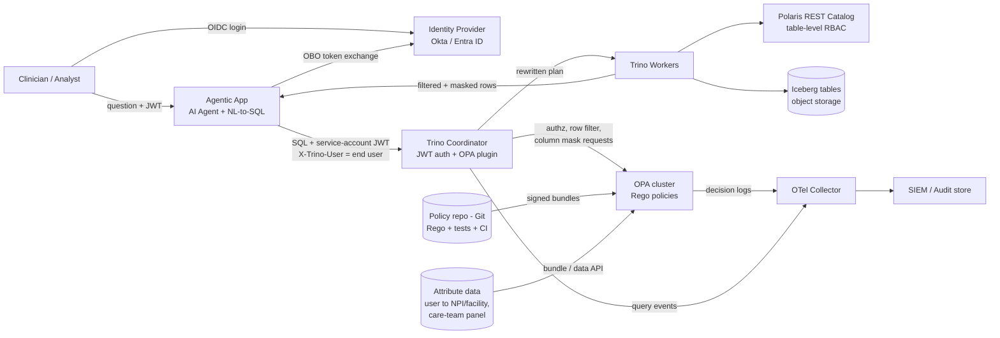

# Role-Aware PHI Access for AI Agents on Trino + Iceberg

**Design proposal: fine-grained access control using the Trino OPA plugin**
Author: Sameer Vaidya

## 1. Problem and approach

Clinicians, analysts, and administrators use AI agents to query clinical data through Trino (Iceberg tables, Apache Polaris REST catalog). Polaris governs catalog and table privileges, but not rows or columns. PHI must be filtered and masked **per user**, so that a physician sees full data for their own patients, masked PHI for other patients in their facility, and nothing outside it.

**Approach:** enforce policy **inside Trino** with the open-source [Trino OPA access-control plugin](https://trino.io/docs/current/security/opa-access-control.html). Policies are written as code (Rego) in Open Policy Agent (OPA). For every query, Trino asks OPA three questions: *may this user touch this table/column?*, *which row filters apply?*, *which column masks apply?* Trino injects the answers into the query plan, so every client (AI agent, BI tool, notebook) gets the same enforcement and none can bypass it. End users need **no Trino accounts**. The agent tier connects with a single **service account** and passes the end user's identity **on behalf of (OBO)** that user. Trino checks the delegation with OPA, then applies every filter and mask to the **end user**, not to the service account.



## 2. Use case 1: Administrator defines policy

**Sample tables** (catalog `clinical`, schema `ehr`):

| `patients` | | | | | |
|---|---|---|---|---|---|
| **patient_id** | **name** | **dob** | **ssn** | **facility_id** | **attending_npi** |
| P001 | Jane Doe | 1981-04-12 | 123-45-6789 | FAC_SJ | 1111111111 |
| P002 | Raj Patel | 1975-09-30 | 987-65-4321 | FAC_SJ | 2222222222 |
| P003 | Ana Lopez | 1990-01-05 | 555-12-3456 | FAC_PA | 3333333333 |

| `encounters` | | | | |
|---|---|---|---|---|
| **encounter_id** | **patient_id** | **facility_id** | **diagnosis_code** | **notes** |
| E10 | P001 | FAC_SJ | E11.9 | Follow-up diabetes... |
| E11 | P002 | FAC_SJ | I10 | BP review... |
| E12 | P003 | FAC_PA | J45.909 | Asthma... |

**Roles and access levels** (roles are resolved from the directory for the end user, never taken from headers the agent supplies):

| Role (group) | Access level | Rows | PHI columns (`name`, `dob`, `ssn`, `notes`) |
|---|---|---|---|
| `population_analyst` | **No access** | Denied on `patients`, `encounters` (de-identified marts only) | n/a |
| `physician` | **Restricted** | Own facility only | Clear for own patients (`attending_npi` = user's NPI); masked for others |
| `privacy_officer` | **Full** | All rows | Clear (every read audited) |

**Masking rules:** `name` becomes `'***'`, `ssn` keeps only the last 4 digits, `dob` is generalized to the year, and `notes` becomes `NULL`.

**Policy as code.** The administrator commits the Rego and attribute data to Git. CI runs `opa test` and publishes a signed bundle to OPA. Trino only passes `user` and `groups` to OPA, so per-user attributes (NPI, facility) come from an attribute bundle kept in sync with HR and the EHR.

```json
// data.json - attribute bundle
{ "users": { "dr.smith@org": { "npi": "1111111111", "facility": "FAC_SJ" } } }
```

```rego
package trino
import rego.v1

phi_tables := {"patients", "encounters"}
user  := input.context.identity.user
roles := {g | some g in input.context.identity.groups}
attrs := data.users[user]
tbl   := input.action.resource.table

# ---- Delegation: only the agent service account may act OBO ----
default allow := false
allow if {
    input.action.operation == "ImpersonateUser"
    user == "svc-agentic-app"            # authenticated principal
    data.users[input.action.resource.user.user]  # target must be a known user
}

# ---- Table / column access ----
allow if { input.action.operation in {"ExecuteQuery", "AccessCatalog", "FilterCatalogs"} }
allow if { not tbl.tableName in phi_tables }
allow if { tbl.tableName in phi_tables; roles & {"physician", "privacy_officer"} != set() }

# ---- Row filters (become extra WHERE clauses) ----
rowFilters contains {"expression": sprintf("facility_id = '%s'", [attrs.facility])} if {
    "physician" in roles
    not "privacy_officer" in roles
    tbl.tableName in phi_tables
}

# ---- Column masks ----
own(expr) := sprintf("CASE WHEN attending_npi = '%s' THEN %s ELSE %s END", [attrs.npi, expr[0], expr[1]])
masks := {
  "name": ["name", "'***'"],
  "ssn":  ["ssn",  "'***-**-' || substr(ssn, 8)"],
  "dob":  ["dob",  "date_trunc('year', dob)"],
}

columnMask := {"expression": own(masks[c])} if {
    c := input.action.resource.column.columnName
    input.action.resource.column.tableName == "patients"
    "physician" in roles; not "privacy_officer" in roles
}
# encounters.notes: masked unless the patient is on the physician's panel
columnMask := {"expression": sprintf(
  "CASE WHEN patient_id IN (SELECT patient_id FROM clinical.ehr.patients WHERE attending_npi = '%s') THEN notes ELSE NULL END",
  [attrs.npi])} if {
    input.action.resource.column.tableName == "encounters"
    input.action.resource.column.columnName == "notes"
    "physician" in roles; not "privacy_officer" in roles
}
```

**Trino wiring** (`etc/access-control.properties`):

```properties
access-control.name=opa
opa.policy.uri=https://opa.internal/v1/data/trino/allow
opa.policy.batched-uri=https://opa.internal/v1/data/trino/batch
opa.policy.row-filters-uri=https://opa.internal/v1/data/trino/rowFilters
opa.policy.batch-column-masking-uri=https://opa.internal/v1/data/trino/batchColumnMasks
```

The plugin expects row filters as a list of `{"expression": ...}` objects, each applied like an extra `WHERE` clause, and column masks as one expression per column. A batch endpoint can return all column masks in a single call ([Trino docs](https://trino.io/docs/current/security/opa-access-control.html)).

## 3. Use case 2: Runtime enforcement

```mermaid
sequenceDiagram
    actor Dr as Dr. Smith (physician)
    participant App as Agentic App / AI Agent
    participant T as Trino (OPA plugin)
    participant O as OPA
    participant L as OTel -> SIEM
    Dr->>App: OIDC login, then asks "List my diabetic patients' recent visits"
    App->>App: Validate user JWT, OBO exchange (act: svc-agentic-app)
    App->>T: SELECT ... (service-account JWT, X-Trino-User = dr.smith@org)
    T->>O: ImpersonateUser? svc-agentic-app -> dr.smith@org
    O-->>T: true
    T->>T: Session user = dr.smith@org, groups = [physician] via group provider
    T->>O: allow? (SelectFromColumns on patients, encounters)
    O-->>T: true
    T->>O: rowFilters / batchColumnMasks
    O-->>T: facility_id = 'FAC_SJ'; CASE-WHEN masks
    T->>T: Rewrite plan, execute on Iceberg
    T-->>App: Filtered + masked result set
    App-->>Dr: Grounded answer (PHI only for own patients)
    O--)L: Decision logs
    T--)L: Query-completed event
```

1. **Login.** The user signs in to the agentic app through the IdP. The app receives a short-lived JWT with `sub` and `groups`.
2. **Ask.** The agent turns the question into SQL, using only the schema and metadata the user is allowed to see.
3. **Connect as the service account, on behalf of the user.** The agent validates the user's JWT and performs an OAuth on-behalf-of token exchange, which yields a token whose subject is the user and whose `act` claim is `svc-agentic-app`. It authenticates to Trino with the service-account credential (JWT or mTLS) and sets the session user to the end user with `X-Trino-User`. End users need no database accounts.
4. **Check the delegation.** Trino asks OPA whether `svc-agentic-app` may act for `dr.smith@org` (`ImpersonateUser`). Only the agent service account is allowed. Trino's group provider resolves the end user's groups from the directory, so a compromised agent can't grant itself roles.
5. **Decide.** For each table and column, the OPA plugin sends Trino's `context.identity` (user, groups) and `action` (operation, table, column) to OPA. OPA returns allow/deny, row filters, and column masks in milliseconds; decisions are cached per query.
6. **Enforce.** Trino injects the filters and masks into the plan, so they are pushed down before any data leaves Trino. Result for Dr. Smith:

| patient_id | name | dob | ssn | diagnosis_code | notes |
|---|---|---|---|---|---|
| P001 | Jane Doe | 1981-04-12 | 123-45-6789 | E11.9 | Follow-up diabetes... |
| P002 | *** | 1975-01-01 | \*\*\*-\*\*-4321 | I10 | NULL |

P003 is not returned because it belongs to another facility. A `population_analyst` running the same query gets `Access Denied` on `clinical.ehr.patients`; a `privacy_officer` gets all three rows unmasked.

7. **Respond.** The agent summarizes only what Trino returned, so masked values can't leak into the LLM prompt. Output guardrails block the agent from repeating identifiers it didn't receive.
8. **Audit.** OPA decision logs and Trino query events go to an OpenTelemetry collector and then to the SIEM, joined on `queryId`.

**Example audit record** (OPA decision log, enriched by the collector):

```json
{
  "timestamp": "2026-09-25T17:02:11.482Z",
  "decision_id": "7f3c2a9e-1b4d-4e8a-9c21-0d5e6f7a8b90",
  "trace_id": "4bf92f3577b34da6a3ce929d0e0e4736",
  "trino_query_id": "20260925_170211_00042_abcde",
  "path": "trino/batchColumnMasks",
  "policy_bundle_revision": "git:9c1e4f2",
  "principal": { "user": "dr.smith@org", "groups": ["physician"], "npi": "1111111111", "facility": "FAC_SJ" },
  "authenticated_as": "svc-agentic-app",
  "delegation": { "type": "on-behalf-of", "obo_token_jti": "c9a1e7d2" },
  "client": { "source": "agentic-app", "agent_session": "sess-88213", "prompt_hash": "sha256:ab12..." },
  "resource": { "catalog": "clinical", "schema": "ehr", "table": "patients", "columns": ["name", "ssn", "dob"] },
  "result": {
    "allowed": true,
    "row_filter": "facility_id = 'FAC_SJ'",
    "masks_applied": { "name": "own-patient-else-redact", "ssn": "own-patient-else-last4", "dob": "own-patient-else-year" }
  },
  "rows_returned": 2,
  "phi_classification": "restricted"
}
```

## 4. Operational guardrails

- **Fail closed:** if OPA is unreachable, Trino denies the query. OPA runs as an HA sidecar or cluster next to the Trino coordinator.
- **Policy lifecycle:** Rego lives in Git with pull-request review, `opa test` unit tests for each role, signed bundles, and versioned rollout. Every decision records the bundle revision it used.
- **Performance:** use the batched and batch-column-masking endpoints; attributes load in memory from bundles; filters are simple predicates that Iceberg can prune on (for example, partitions by `facility_id`).
- **Defense in depth:** Polaris keeps table-level grants for Trino's catalog credentials; OPA adds row and column control per user. The agent layer adds prompt and output guardrails but never makes access decisions.
- **Delegation scope:** only the agent service account can act on behalf of users. Its credential is short-lived and rotated, and it has no data access of its own, since OPA grants data access only to end users.
- **Alternative:** the agent can pass the user's token straight through to Trino, which suits interactive-only apps. We use OBO because it also supports background agent jobs.
- **Break-glass:** an emergency role grants time-limited full access, requires a reason, and triggers a high-priority SIEM alert.
